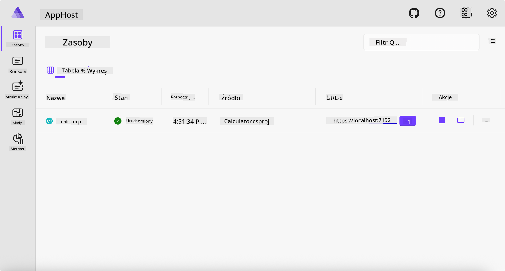
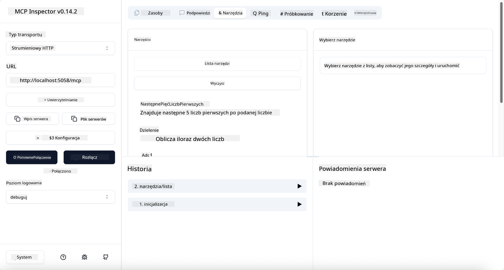

<!--
CO_OP_TRANSLATOR_METADATA:
{
  "original_hash": "0bc7bd48f55f1565f1d95ccb2c16f728",
  "translation_date": "2025-07-13T23:06:38+00:00",
  "source_file": "04-PracticalImplementation/samples/csharp/README.md",
  "language_code": "pl"
}
-->
# Przykład

Poprzedni przykład pokazuje, jak używać lokalnego projektu .NET z typem `stdio` oraz jak uruchomić serwer lokalnie w kontenerze. To dobre rozwiązanie w wielu sytuacjach. Jednak czasami przydatne jest, aby serwer działał zdalnie, na przykład w środowisku chmurowym. Właśnie tutaj przydaje się typ `http`.

Patrząc na rozwiązanie w folderze `04-PracticalImplementation`, może wydawać się ono znacznie bardziej skomplikowane niż poprzednie. W rzeczywistości tak nie jest. Jeśli przyjrzymy się projektowi `src/Calculator`, zobaczymy, że to w większości ten sam kod co wcześniej. Jedyną różnicą jest użycie innej biblioteki `ModelContextProtocol.AspNetCore` do obsługi żądań HTTP. Zmieniamy też metodę `IsPrime` na prywatną, aby pokazać, że w kodzie można mieć metody prywatne. Reszta kodu pozostaje bez zmian.

Pozostałe projekty pochodzą z [.NET Aspire](https://learn.microsoft.com/dotnet/aspire/get-started/aspire-overview). Obecność .NET Aspire w rozwiązaniu poprawia komfort pracy programisty podczas tworzenia i testowania oraz pomaga w obserwowalności. Nie jest to wymagane do uruchomienia serwera, ale warto mieć to w swoim projekcie.

## Uruchom serwer lokalnie

1. W VS Code (z rozszerzeniem C# DevKit) przejdź do katalogu `04-PracticalImplementation/samples/csharp`.
1. Wykonaj następujące polecenie, aby uruchomić serwer:

   ```bash
    dotnet watch run --project ./src/AppHost
   ```

1. Gdy w przeglądarce otworzy się pulpit nawigacyjny .NET Aspire, zanotuj adres URL `http`. Powinien wyglądać mniej więcej tak: `http://localhost:5058/`.

   

## Testowanie Streamable HTTP za pomocą MCP Inspector

Jeśli masz Node.js w wersji 22.7.5 lub wyższej, możesz użyć MCP Inspector do testowania serwera.

Uruchom serwer i w terminalu wpisz następujące polecenie:

```bash
npx @modelcontextprotocol/inspector http://localhost:5058
```



- Wybierz `Streamable HTTP` jako typ transportu.
- W polu Url wpisz wcześniej zanotowany adres serwera i dopisz `/mcp`. Powinno to być `http` (nie `https`), na przykład `http://localhost:5058/mcp`.
- Kliknij przycisk Connect.

Zaletą Inspector jest dobra widoczność tego, co się dzieje.

- Spróbuj wyświetlić listę dostępnych narzędzi
- Przetestuj kilka z nich, powinny działać tak jak wcześniej.

## Testowanie serwera MCP z GitHub Copilot Chat w VS Code

Aby użyć transportu Streamable HTTP z GitHub Copilot Chat, zmień konfigurację serwera `calc-mcp` utworzonego wcześniej, aby wyglądała tak:

```jsonc
// .vscode/mcp.json
{
  "servers": {
    "calc-mcp": {
      "type": "http",
      "url": "http://localhost:5058/mcp"
    }
  }
}
```

Przeprowadź kilka testów:

- Poproś o „3 liczby pierwsze po 6780”. Zauważ, że Copilot użyje nowych narzędzi `NextFivePrimeNumbers` i zwróci tylko pierwsze 3 liczby pierwsze.
- Poproś o „7 liczb pierwszych po 111”, aby zobaczyć, co się stanie.
- Zapytaj „John ma 24 lizaki i chce rozdać je równo swoim 3 dzieciom. Ile lizaków dostanie każde dziecko?”, aby zobaczyć wynik.

## Wdróż serwer do Azure

Wdróżmy serwer do Azure, aby więcej osób mogło z niego korzystać.

W terminalu przejdź do folderu `04-PracticalImplementation/samples/csharp` i uruchom następujące polecenie:

```bash
azd up
```

Po zakończeniu wdrożenia powinieneś zobaczyć komunikat podobny do tego:


Skopiuj adres URL i użyj go w MCP Inspector oraz w GitHub Copilot Chat.

```jsonc
// .vscode/mcp.json
{
  "servers": {
    "calc-mcp": {
      "type": "http",
      "url": "https://calc-mcp.gentleriver-3977fbcf.australiaeast.azurecontainerapps.io/mcp"
    }
  }
}
```

## Co dalej?

Przetestowaliśmy różne typy transportu i narzędzia testowe. Wdrożyliśmy też serwer MCP do Azure. A co jeśli nasz serwer musi mieć dostęp do zasobów prywatnych? Na przykład bazy danych lub prywatnego API? W kolejnym rozdziale zobaczymy, jak możemy poprawić bezpieczeństwo naszego serwera.

**Zastrzeżenie**:  
Niniejszy dokument został przetłumaczony przy użyciu usługi tłumaczenia AI [Co-op Translator](https://github.com/Azure/co-op-translator). Mimo że dążymy do dokładności, prosimy mieć na uwadze, że automatyczne tłumaczenia mogą zawierać błędy lub nieścisłości. Oryginalny dokument w języku źródłowym powinien być uznawany za źródło autorytatywne. W przypadku informacji o kluczowym znaczeniu zalecane jest skorzystanie z profesjonalnego tłumaczenia wykonanego przez człowieka. Nie ponosimy odpowiedzialności za jakiekolwiek nieporozumienia lub błędne interpretacje wynikające z korzystania z tego tłumaczenia.