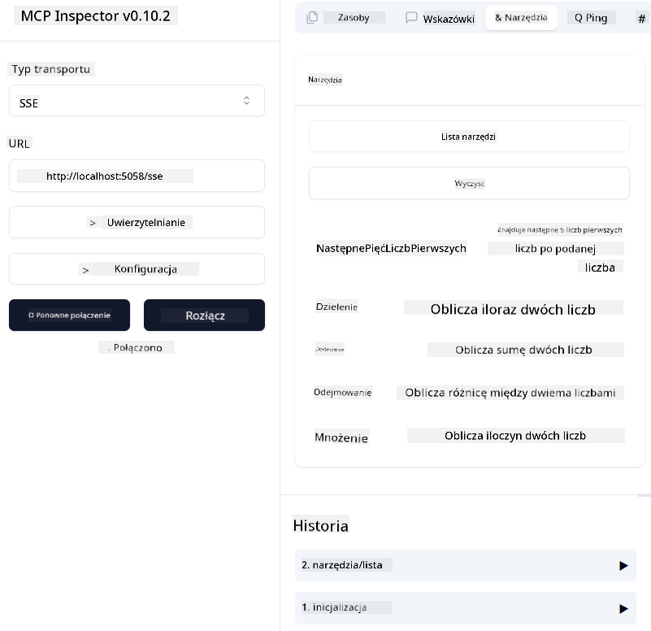
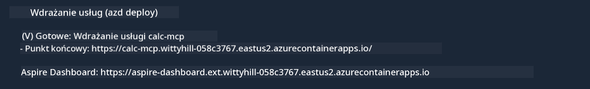

<!--
CO_OP_TRANSLATOR_METADATA:
{
  "original_hash": "5020a3e1a1c7f30c00f9e37f1fa208e3",
  "translation_date": "2025-05-16T15:41:32+00:00",
  "source_file": "04-PracticalImplementation/samples/csharp/README.md",
  "language_code": "pl"
}
-->
# Sample

Poprzedni przykład pokazuje, jak używać lokalnego projektu .NET z typem `sdio`. I jak uruchomić serwer lokalnie w kontenerze. To dobre rozwiązanie w wielu sytuacjach. Jednak przydatne może być uruchomienie serwera zdalnie, na przykład w środowisku chmurowym. Tutaj właśnie przydaje się typ `http`.

Patrząc na rozwiązanie w folderze `04-PracticalImplementation`, może wydawać się ono znacznie bardziej skomplikowane niż poprzednie. Ale w rzeczywistości tak nie jest. Jeśli przyjrzymy się dokładnie projektowi `src/mcpserver/mcpserver.csproj`, zobaczymy, że to w dużej mierze ten sam kod co w poprzednim przykładzie. Jedyną różnicą jest to, że używamy innej biblioteki `ModelContextProtocol.AspNetCore` do obsługi żądań HTTP. Zmieniamy też metodę `IsPrime` na prywatną, aby pokazać, że w kodzie mogą być metody prywatne. Reszta kodu pozostaje bez zmian.

Pozostałe projekty pochodzą z [.NET Aspire](https://learn.microsoft.com/dotnet/aspire/get-started/aspire-overview). Obecność .NET Aspire w rozwiązaniu poprawia doświadczenie programisty podczas tworzenia i testowania oraz pomaga w obserwowalności. Nie jest to wymagane do uruchomienia serwera, ale warto mieć to w swoim rozwiązaniu.

## Uruchom serwer lokalnie

1. W VS Code (z rozszerzeniem C# DevKit) otwórz rozwiązanie `04-PracticalImplementation\samples\csharp\src\Calculator-chap4.sln`.
2. Naciśnij `F5`, aby uruchomić serwer. Powinno to otworzyć przeglądarkę z panelem .NET Aspire.

lub

1. W terminalu przejdź do folderu `04-PracticalImplementation\samples\csharp\src`.
2. Wykonaj następujące polecenie, aby uruchomić serwer:
   ```bash
    dotnet run --project .\AppHost
   ```

3. W panelu zwróć uwagę na URL `http`. Powinien wyglądać mniej więcej tak: `http://localhost:5058/`.

## Test `SSE` z Modelem Protokółu Inspektora

Jeśli masz Node.js w wersji 22.7.5 lub wyższej, możesz użyć ModelContext Protocol Inspector do testowania serwera.

Uruchom serwer i wykonaj następujące polecenie w terminalu:

```bash
npx @modelcontextprotocol/inspector@latest
```



- Wybierz `SSE` as the Transport type. SSE stand for Server-Sent Events. 
- In the Url field, enter the URL of the server noted earlier,and append `/sse`. Powinno to być `http` (nie `https`) something like `http://localhost:5058/sse`.
- select the Connect button.

A nice thing about the Inspector is that it provide a nice visibility on what is happening.

- Try listing the availables tools
- Try some of them, it should works just like before.


## Test `SSE` with Github Copilot Chat in VS Code

To use the `SSE` transport with Github Copilot Chat, change the configuration of the `mcp-calc` serwer utworzony wcześniej powinien wyglądać tak:

```json
"mcp-calc": {
    "type": "sse",
    "url": "http://localhost:5058/sse"
}
```

Przeprowadź kilka testów:
- Poproś o 3 liczby pierwsze po 6780. Zwróć uwagę, że Copilot użyje nowych narzędzi `NextFivePrimeNumbers` i zwróci tylko pierwsze 3 liczby pierwsze.
- Poproś o 7 liczb pierwszych po 111, aby zobaczyć, co się stanie.

# Wdróż serwer do Azure

Wdróżmy serwer do Azure, aby więcej osób mogło z niego korzystać.

W terminalu przejdź do folderu `04-PracticalImplementation\samples\csharp\src` i uruchom następujące polecenie:

```bash
azd init
```

To utworzy kilka plików lokalnie, które zapiszą konfigurację zasobów Azure oraz twoją Infrastrukturę jako kod (IaC).

Następnie uruchom następujące polecenie, aby wdrożyć serwer do Azure:

```bash
azd up
```

Po zakończeniu wdrożenia powinieneś zobaczyć komunikat podobny do tego:



Przejdź do panelu Aspire i zanotuj URL `HTTP`, który będzie używany w MCP Inspector oraz w Github Copilot Chat.

## Co dalej?

Testowaliśmy różne typy transportu i narzędzia testowe oraz wdrożyliśmy nasz serwer MCP do Azure. A co jeśli nasz serwer musi mieć dostęp do prywatnych zasobów? Na przykład bazy danych lub prywatnego API? W następnym rozdziale zobaczymy, jak możemy poprawić bezpieczeństwo naszego serwera.

**Zastrzeżenie**:  
Niniejszy dokument został przetłumaczony za pomocą usługi tłumaczenia AI [Co-op Translator](https://github.com/Azure/co-op-translator). Mimo że dążymy do dokładności, prosimy mieć na uwadze, że automatyczne tłumaczenia mogą zawierać błędy lub nieścisłości. Oryginalny dokument w języku źródłowym powinien być traktowany jako wiarygodne źródło. W przypadku informacji krytycznych zalecane jest skorzystanie z profesjonalnego tłumaczenia wykonanego przez człowieka. Nie ponosimy odpowiedzialności za jakiekolwiek nieporozumienia lub błędne interpretacje wynikające z użycia tego tłumaczenia.