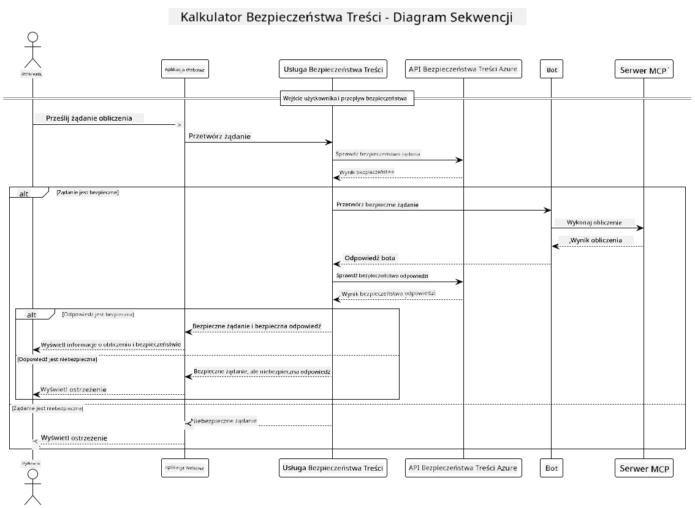

<!--
CO_OP_TRANSLATOR_METADATA:
{
  "original_hash": "e5ea5e7582f70008ea9bec3b3820f20a",
  "translation_date": "2025-07-13T23:15:53+00:00",
  "source_file": "04-PracticalImplementation/samples/java/containerapp/README.md",
  "language_code": "pl"
}
-->
## Architektura Systemu

Ten projekt demonstruje aplikację webową, która wykorzystuje sprawdzanie bezpieczeństwa treści przed przekazaniem zapytań użytkownika do usługi kalkulatora za pomocą Model Context Protocol (MCP).



### Jak to działa

1. **Wprowadzenie danych przez użytkownika**: Użytkownik wpisuje zapytanie obliczeniowe w interfejsie webowym  
2. **Sprawdzanie bezpieczeństwa treści (wejście)**: Zapytanie jest analizowane przez Azure Content Safety API  
3. **Decyzja dotycząca bezpieczeństwa (wejście)**:  
   - Jeśli treść jest bezpieczna (poziom zagrożenia < 2 we wszystkich kategoriach), jest przekazywana do kalkulatora  
   - Jeśli treść zostanie oznaczona jako potencjalnie szkodliwa, proces zostaje zatrzymany i zwracane jest ostrzeżenie  
4. **Integracja z kalkulatorem**: Bezpieczna treść jest przetwarzana przez LangChain4j, który komunikuje się z serwerem kalkulatora MCP  
5. **Sprawdzanie bezpieczeństwa treści (wyjście)**: Odpowiedź bota jest analizowana przez Azure Content Safety API  
6. **Decyzja dotycząca bezpieczeństwa (wyjście)**:  
   - Jeśli odpowiedź bota jest bezpieczna, jest wyświetlana użytkownikowi  
   - Jeśli odpowiedź bota zostanie oznaczona jako potencjalnie szkodliwa, zostaje zastąpiona ostrzeżeniem  
7. **Odpowiedź**: Wyniki (jeśli bezpieczne) są wyświetlane użytkownikowi wraz z oboma analizami bezpieczeństwa  

## Korzystanie z Model Context Protocol (MCP) z usługami kalkulatora

Ten projekt pokazuje, jak używać Model Context Protocol (MCP) do wywoływania usług kalkulatora MCP z LangChain4j. Implementacja korzysta z lokalnego serwera MCP działającego na porcie 8080, który udostępnia operacje kalkulatora.

### Konfiguracja usługi Azure Content Safety

Przed użyciem funkcji bezpieczeństwa treści należy utworzyć zasób usługi Azure Content Safety:

1. Zaloguj się do [Azure Portal](https://portal.azure.com)  
2. Kliknij „Create a resource” i wyszukaj „Content Safety”  
3. Wybierz „Content Safety” i kliknij „Create”  
4. Wprowadź unikalną nazwę zasobu  
5. Wybierz subskrypcję i grupę zasobów (lub utwórz nową)  
6. Wybierz obsługiwany region (sprawdź [Region availability](https://azure.microsoft.com/en-us/global-infrastructure/services/?products=cognitive-services) dla szczegółów)  
7. Wybierz odpowiedni plan cenowy  
8. Kliknij „Create”, aby wdrożyć zasób  
9. Po zakończeniu wdrożenia kliknij „Go to resource”  
10. W lewym panelu, w sekcji „Resource Management”, wybierz „Keys and Endpoint”  
11. Skopiuj jeden z kluczy oraz adres URL punktu końcowego do dalszej konfiguracji  

### Konfiguracja zmiennych środowiskowych

Ustaw zmienną środowiskową `GITHUB_TOKEN` do uwierzytelniania modeli GitHub:  
```sh
export GITHUB_TOKEN=<your_github_token>
```

Dla funkcji bezpieczeństwa treści ustaw:  
```sh
export CONTENT_SAFETY_ENDPOINT=<your_content_safety_endpoint>
export CONTENT_SAFETY_KEY=<your_content_safety_key>
```

Te zmienne środowiskowe są wykorzystywane przez aplikację do uwierzytelniania w usłudze Azure Content Safety. Jeśli zmienne nie zostaną ustawione, aplikacja użyje wartości zastępczych do celów demonstracyjnych, ale funkcje bezpieczeństwa treści nie będą działać poprawnie.

### Uruchamianie serwera kalkulatora MCP

Przed uruchomieniem klienta należy wystartować serwer kalkulatora MCP w trybie SSE na localhost:8080.

## Opis projektu

Projekt demonstruje integrację Model Context Protocol (MCP) z LangChain4j do wywoływania usług kalkulatora. Kluczowe cechy to:

- Wykorzystanie MCP do połączenia z usługą kalkulatora realizującą podstawowe operacje matematyczne  
- Podwójne sprawdzanie bezpieczeństwa treści zarówno na zapytaniach użytkownika, jak i odpowiedziach bota  
- Integracja z modelem gpt-4.1-nano GitHub za pomocą LangChain4j  
- Wykorzystanie Server-Sent Events (SSE) jako transportu MCP  

## Integracja bezpieczeństwa treści

Projekt zawiera kompleksowe funkcje bezpieczeństwa treści, które zapewniają, że zarówno dane wejściowe użytkownika, jak i odpowiedzi systemu są wolne od szkodliwych treści:

1. **Sprawdzanie wejścia**: Wszystkie zapytania użytkownika są analizowane pod kątem kategorii szkodliwych treści, takich jak mowa nienawiści, przemoc, samookaleczenia i treści seksualne, przed dalszym przetwarzaniem.  

2. **Sprawdzanie wyjścia**: Nawet przy użyciu potencjalnie nieocenzurowanych modeli, system sprawdza wszystkie generowane odpowiedzi tymi samymi filtrami bezpieczeństwa treści przed ich wyświetleniem użytkownikowi.  

To podejście z podwójną warstwą zabezpieczeń gwarantuje, że system pozostaje bezpieczny niezależnie od używanego modelu AI, chroniąc użytkowników zarówno przed szkodliwymi danymi wejściowymi, jak i potencjalnie problematycznymi odpowiedziami generowanymi przez AI.

## Klient webowy

Aplikacja zawiera przyjazny dla użytkownika interfejs webowy, który umożliwia interakcję z systemem Content Safety Calculator:

### Funkcje interfejsu webowego

- Prosty, intuicyjny formularz do wpisywania zapytań obliczeniowych  
- Podwójna walidacja bezpieczeństwa treści (wejście i wyjście)  
- Informacje zwrotne w czasie rzeczywistym o bezpieczeństwie zapytania i odpowiedzi  
- Kolorowe wskaźniki bezpieczeństwa dla łatwej interpretacji  
- Czysty, responsywny design działający na różnych urządzeniach  
- Przykładowe bezpieczne zapytania pomagające użytkownikom  

### Korzystanie z klienta webowego

1. Uruchom aplikację:  
   ```sh
   mvn spring-boot:run
   ```

2. Otwórz przeglądarkę i przejdź pod adres `http://localhost:8087`  

3. Wprowadź zapytanie obliczeniowe w udostępnionym polu tekstowym (np. „Oblicz sumę 24.5 i 17.3”)  

4. Kliknij „Submit”, aby przetworzyć zapytanie  

5. Zobacz wyniki, które będą zawierać:  
   - Analizę bezpieczeństwa Twojego zapytania  
   - Obliczony wynik (jeśli zapytanie było bezpieczne)  
   - Analizę bezpieczeństwa odpowiedzi bota  
   - Ewentualne ostrzeżenia dotyczące bezpieczeństwa, jeśli wejście lub wyjście zostały oznaczone  

Klient webowy automatycznie obsługuje oba procesy weryfikacji bezpieczeństwa treści, zapewniając, że wszystkie interakcje są bezpieczne i odpowiednie, niezależnie od używanego modelu AI.

**Zastrzeżenie**:  
Niniejszy dokument został przetłumaczony przy użyciu automatycznej usługi tłumaczeniowej AI [Co-op Translator](https://github.com/Azure/co-op-translator). Mimo że dokładamy starań, aby tłumaczenie było jak najbardziej precyzyjne, prosimy mieć na uwadze, że automatyczne tłumaczenia mogą zawierać błędy lub nieścisłości. Oryginalny dokument w języku źródłowym należy traktować jako źródło wiążące. W przypadku informacji o kluczowym znaczeniu zalecane jest skorzystanie z profesjonalnego tłumaczenia wykonanego przez człowieka. Nie ponosimy odpowiedzialności za jakiekolwiek nieporozumienia lub błędne interpretacje wynikające z korzystania z tego tłumaczenia.