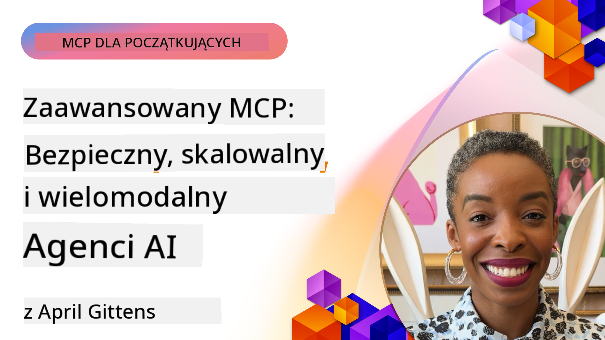

<!--
CO_OP_TRANSLATOR_METADATA:
{
  "original_hash": "d204bc94ea6027d06a703b21b711ca57",
  "translation_date": "2025-07-29T01:25:45+00:00",
  "source_file": "05-AdvancedTopics/README.md",
  "language_code": "pl"
}
-->
# Zaawansowane tematy w MCP

_(Kliknij obrazek powyżej, aby obejrzeć wideo z tej lekcji)_

Ten rozdział obejmuje serię zaawansowanych tematów dotyczących implementacji Model Context Protocol (MCP), w tym integrację wielomodalną, skalowalność, najlepsze praktyki w zakresie bezpieczeństwa oraz integrację z systemami korporacyjnymi. Te zagadnienia są kluczowe dla budowy solidnych i gotowych do produkcji aplikacji MCP, które spełniają wymagania współczesnych systemów AI.

## Przegląd

W tej lekcji omówiono zaawansowane koncepcje implementacji Model Context Protocol, koncentrując się na integracji wielomodalnej, skalowalności, najlepszych praktykach bezpieczeństwa oraz integracji z systemami korporacyjnymi. Te tematy są niezbędne do budowy aplikacji MCP na poziomie produkcyjnym, które mogą sprostać złożonym wymaganiom w środowiskach korporacyjnych.

## Cele nauki

Po ukończeniu tej lekcji będziesz w stanie:

- Wdrażać funkcje wielomodalne w ramach MCP
- Projektować skalowalne architektury MCP dla scenariuszy o wysokim zapotrzebowaniu
- Stosować najlepsze praktyki bezpieczeństwa zgodne z zasadami MCP
- Integracja MCP z systemami i frameworkami AI w przedsiębiorstwach
- Optymalizować wydajność i niezawodność w środowiskach produkcyjnych

## Lekcje i przykładowe projekty

| Link | Tytuł | Opis |
|------|-------|-------------|
| [5.1 Integracja z Azure](./mcp-integration/README.md) | Integracja z Azure | Dowiedz się, jak zintegrować swój serwer MCP na platformie Azure |
| [5.2 Przykład wielomodalny](./mcp-multi-modality/README.md) | Przykłady wielomodalne MCP | Przykłady odpowiedzi audio, obrazów i wielomodalnych |
| [5.3 Przykład MCP OAuth2](../../../05-AdvancedTopics/mcp-oauth2-demo) | Demo MCP OAuth2 | Minimalna aplikacja Spring Boot pokazująca OAuth2 z MCP, zarówno jako serwer autoryzacji, jak i serwer zasobów. Demonstruje wydawanie bezpiecznych tokenów, chronione punkty końcowe, wdrażanie w Azure Container Apps oraz integrację z API Management. |
| [5.4 Konteksty główne](./mcp-root-contexts/README.md) | Konteksty główne | Dowiedz się więcej o kontekstach głównych i jak je wdrażać |
| [5.5 Routing](./mcp-routing/README.md) | Routing | Poznaj różne rodzaje routingu |
| [5.6 Próbkowanie](./mcp-sampling/README.md) | Próbkowanie | Naucz się pracować z próbkowaniem |
| [5.7 Skalowanie](./mcp-scaling/README.md) | Skalowanie | Dowiedz się więcej o skalowaniu |
| [5.8 Bezpieczeństwo](./mcp-security/README.md) | Bezpieczeństwo | Zabezpiecz swój serwer MCP |
| [5.9 Przykład wyszukiwania w sieci](./web-search-mcp/README.md) | Wyszukiwanie w sieci MCP | Serwer i klient MCP w Pythonie integrujący się z SerpAPI do wyszukiwania w czasie rzeczywistym w sieci, wiadomościach, produktach oraz Q&A. Demonstruje orkiestrację wielu narzędzi, integrację zewnętrznych API i solidne zarządzanie błędami. |
| [5.10 Strumieniowanie w czasie rzeczywistym](./mcp-realtimestreaming/README.md) | Strumieniowanie | Strumieniowanie danych w czasie rzeczywistym stało się niezbędne w dzisiejszym świecie opartym na danych, gdzie firmy i aplikacje potrzebują natychmiastowego dostępu do informacji, aby podejmować szybkie decyzje. |
| [5.11 Wyszukiwanie w sieci w czasie rzeczywistym](./mcp-realtimesearch/README.md) | Wyszukiwanie w sieci | Jak MCP przekształca wyszukiwanie w sieci w czasie rzeczywistym, zapewniając ustandaryzowane podejście do zarządzania kontekstem w modelach AI, wyszukiwarkach i aplikacjach. |
| [5.12 Uwierzytelnianie Entra ID dla serwerów MCP](./mcp-security-entra/README.md) | Uwierzytelnianie Entra ID | Microsoft Entra ID zapewnia solidne rozwiązanie do zarządzania tożsamością i dostępem w chmurze, pomagając upewnić się, że tylko autoryzowani użytkownicy i aplikacje mogą wchodzić w interakcję z Twoim serwerem MCP. |
| [5.13 Integracja z agentem Azure AI Foundry](./mcp-foundry-agent-integration/README.md) | Integracja z Azure AI Foundry | Dowiedz się, jak zintegrować serwery Model Context Protocol z agentami Azure AI Foundry, umożliwiając potężną orkiestrację narzędzi i możliwości AI w przedsiębiorstwach dzięki ustandaryzowanym połączeniom zewnętrznych źródeł danych. |
| [5.14 Inżynieria kontekstu](./mcp-contextengineering/README.md) | Inżynieria kontekstu | Przyszłe możliwości technik inżynierii kontekstu dla serwerów MCP, w tym optymalizacja kontekstu, dynamiczne zarządzanie kontekstem i strategie efektywnego inżynierii promptów w ramach MCP. |

## Dodatkowe odniesienia

Aby uzyskać najbardziej aktualne informacje na temat zaawansowanych tematów MCP, zapoznaj się z:
- [Dokumentacją MCP](https://modelcontextprotocol.io/)
- [Specyfikacją MCP](https://spec.modelcontextprotocol.io/)
- [Repozytorium GitHub](https://github.com/modelcontextprotocol)

## Kluczowe wnioski

- Wielomodalne implementacje MCP rozszerzają możliwości AI poza przetwarzanie tekstu
- Skalowalność jest kluczowa dla wdrożeń korporacyjnych i można ją osiągnąć poprzez skalowanie poziome i pionowe
- Kompleksowe środki bezpieczeństwa chronią dane i zapewniają właściwą kontrolę dostępu
- Integracja z platformami, takimi jak Azure OpenAI i Microsoft AI Foundry, zwiększa możliwości MCP
- Zaawansowane implementacje MCP korzystają z zoptymalizowanych architektur i starannego zarządzania zasobami

## Ćwiczenie

Zaprojektuj implementację MCP na poziomie korporacyjnym dla konkretnego przypadku użycia:

1. Zidentyfikuj wymagania wielomodalne dla swojego przypadku użycia
2. Określ środki bezpieczeństwa potrzebne do ochrony wrażliwych danych
3. Zaprojektuj skalowalną architekturę, która poradzi sobie z różnym obciążeniem
4. Zaplanuj punkty integracji z systemami AI w przedsiębiorstwie
5. Udokumentuj potencjalne wąskie gardła wydajności i strategie ich łagodzenia

## Dodatkowe zasoby

- [Dokumentacja Azure OpenAI](https://learn.microsoft.com/en-us/azure/ai-services/openai/)
- [Dokumentacja Microsoft AI Foundry](https://learn.microsoft.com/en-us/ai-services/)

---

## Co dalej

- [5.1 Integracja MCP](./mcp-integration/README.md)

**Zastrzeżenie**:  
Ten dokument został przetłumaczony za pomocą usługi tłumaczeniowej AI [Co-op Translator](https://github.com/Azure/co-op-translator). Chociaż dokładamy wszelkich starań, aby tłumaczenie było precyzyjne, prosimy pamiętać, że automatyczne tłumaczenia mogą zawierać błędy lub nieścisłości. Oryginalny dokument w jego rodzimym języku powinien być uznawany za wiarygodne źródło. W przypadku informacji o kluczowym znaczeniu zaleca się skorzystanie z profesjonalnego tłumaczenia przez człowieka. Nie ponosimy odpowiedzialności za jakiekolwiek nieporozumienia lub błędne interpretacje wynikające z użycia tego tłumaczenia.