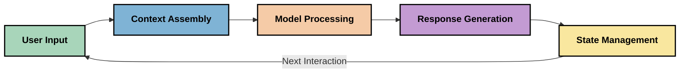
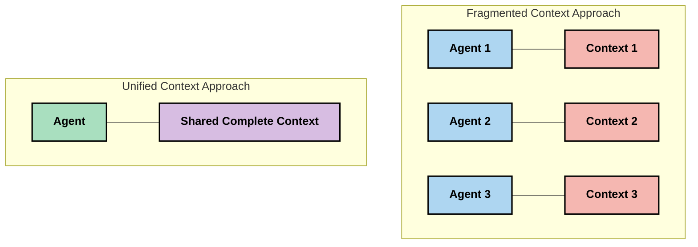
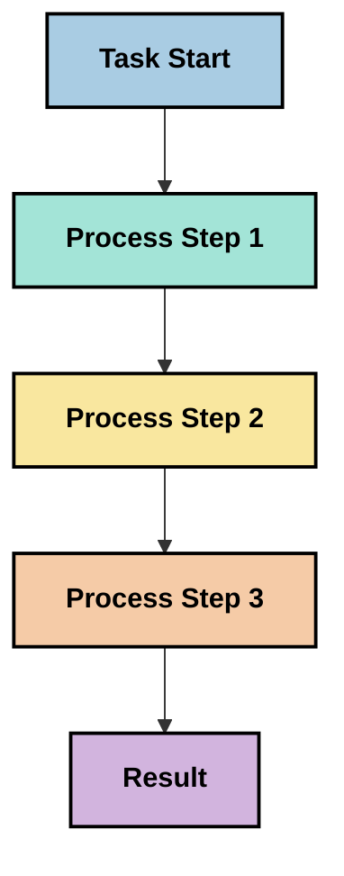
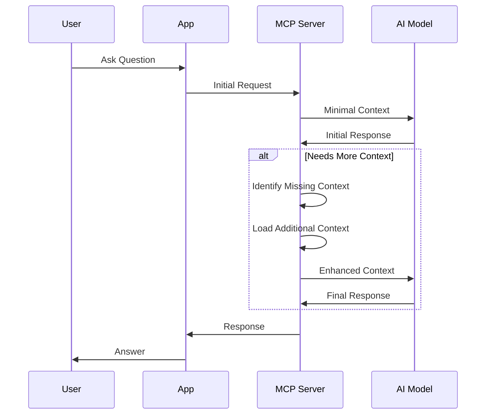
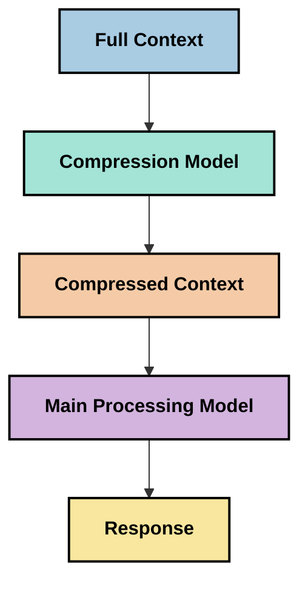

<!--
CO_OP_TRANSLATOR_METADATA:
{
  "original_hash": "5762e8e74dd99d8b7dbb31e69a82561e",
  "translation_date": "2025-07-16T23:03:09+00:00",
  "source_file": "05-AdvancedTopics/mcp-contextengineering/README.md",
  "language_code": "pl"
}
-->
# Inżynieria kontekstu: Nowe podejście w ekosystemie MCP

## Przegląd

Inżynieria kontekstu to nowatorska koncepcja w obszarze sztucznej inteligencji, która bada, jak informacje są strukturyzowane, przekazywane i utrzymywane podczas interakcji między klientami a usługami AI. W miarę rozwoju ekosystemu Model Context Protocol (MCP) rośnie znaczenie efektywnego zarządzania kontekstem. Ten moduł wprowadza pojęcie inżynierii kontekstu i omawia jej potencjalne zastosowania w implementacjach MCP.

## Cele nauki

Po ukończeniu tego modułu będziesz potrafił:

- Zrozumieć nową koncepcję inżynierii kontekstu i jej potencjalną rolę w aplikacjach MCP
- Zidentyfikować kluczowe wyzwania w zarządzaniu kontekstem, które adresuje protokół MCP
- Poznać techniki poprawy wydajności modeli poprzez lepsze zarządzanie kontekstem
- Rozważyć metody mierzenia i oceny skuteczności kontekstu
- Zastosować te nowe koncepcje, aby ulepszyć doświadczenia AI w ramach MCP

## Wprowadzenie do inżynierii kontekstu

Inżynieria kontekstu to rozwijająca się dziedzina skupiająca się na świadomym projektowaniu i zarządzaniu przepływem informacji między użytkownikami, aplikacjami a modelami AI. W przeciwieństwie do ugruntowanych dziedzin, takich jak prompt engineering, inżynieria kontekstu jest wciąż definiowana przez praktyków, którzy starają się rozwiązać unikalne wyzwania związane z dostarczaniem modelom AI właściwych informacji we właściwym czasie.

Wraz z rozwojem dużych modeli językowych (LLM) rośnie znaczenie kontekstu. Jakość, trafność i struktura dostarczanego kontekstu mają bezpośredni wpływ na wyniki modelu. Inżynieria kontekstu bada tę zależność i dąży do opracowania zasad efektywnego zarządzania kontekstem.

> „W 2025 roku modele są niezwykle inteligentne. Ale nawet najbystrzejszy człowiek nie poradzi sobie skutecznie bez kontekstu tego, o co jest proszony... 'Inżynieria kontekstu' to kolejny poziom prompt engineering. Chodzi o automatyzację tego w dynamicznym systemie.” — Walden Yan, Cognition AI

Inżynieria kontekstu może obejmować:

1. **Wybór kontekstu**: Określanie, które informacje są istotne dla danego zadania
2. **Strukturyzacja kontekstu**: Organizowanie informacji, aby maksymalizować zrozumienie przez model
3. **Dostarczanie kontekstu**: Optymalizacja sposobu i momentu przekazywania informacji do modeli
4. **Utrzymanie kontekstu**: Zarządzanie stanem i ewolucją kontekstu w czasie
5. **Ocena kontekstu**: Pomiar i poprawa skuteczności kontekstu

Te obszary są szczególnie istotne dla ekosystemu MCP, który oferuje ustandaryzowany sposób dostarczania kontekstu do LLM.

## Perspektywa podróży kontekstu

Jednym ze sposobów wizualizacji inżynierii kontekstu jest śledzenie drogi, jaką pokonują informacje w systemie MCP:



### Kluczowe etapy podróży kontekstu:

1. **Wejście użytkownika**: Surowe dane od użytkownika (tekst, obrazy, dokumenty)
2. **Złożenie kontekstu**: Łączenie danych użytkownika z kontekstem systemowym, historią rozmowy i innymi pobranymi informacjami
3. **Przetwarzanie modelu**: Model AI przetwarza złożony kontekst
4. **Generowanie odpowiedzi**: Model tworzy odpowiedzi na podstawie dostarczonego kontekstu
5. **Zarządzanie stanem**: System aktualizuje swój wewnętrzny stan na podstawie interakcji

Ta perspektywa podkreśla dynamiczny charakter kontekstu w systemach AI i stawia ważne pytania o najlepsze sposoby zarządzania informacją na każdym etapie.

## Wschodzące zasady inżynierii kontekstu

W miarę kształtowania się dziedziny inżynierii kontekstu, praktycy zaczynają formułować wstępne zasady, które mogą pomóc w podejmowaniu decyzji dotyczących implementacji MCP:

### Zasada 1: Udostępniaj kontekst w całości

Kontekst powinien być udostępniany w pełni między wszystkimi komponentami systemu, a nie rozproszony między różnymi agentami czy procesami. Gdy kontekst jest podzielony, decyzje podejmowane w jednej części systemu mogą być sprzeczne z tymi w innych.



W aplikacjach MCP sugeruje to projektowanie systemów, w których kontekst płynie płynnie przez cały pipeline, zamiast być podzielony na segmenty.

### Zasada 2: Uznaj, że działania niosą ukryte decyzje

Każde działanie modelu zawiera ukryte decyzje dotyczące interpretacji kontekstu. Gdy różne komponenty operują na różnych kontekstach, te ukryte decyzje mogą się ze sobą kłócić, prowadząc do niespójnych wyników.

Ta zasada ma istotne konsekwencje dla aplikacji MCP:
- Preferuj liniowe przetwarzanie złożonych zadań zamiast równoległego wykonywania z fragmentarycznym kontekstem
- Zapewnij, aby wszystkie punkty decyzyjne miały dostęp do tych samych informacji kontekstowych
- Projektuj systemy tak, aby kolejne kroki widziały pełny kontekst wcześniejszych decyzji

### Zasada 3: Równoważ głębokość kontekstu z ograniczeniami okna

W miarę jak rozmowy i procesy się wydłużają, okna kontekstowe w końcu się przepełniają. Efektywna inżynieria kontekstu bada sposoby radzenia sobie z napięciem między pełnym kontekstem a ograniczeniami technicznymi.

Potencjalne podejścia obejmują:
- Kompresję kontekstu, która zachowuje istotne informacje przy zmniejszeniu liczby tokenów
- Stopniowe ładowanie kontekstu w zależności od aktualnych potrzeb
- Streszczanie wcześniejszych interakcji przy zachowaniu kluczowych decyzji i faktów

## Wyzwania kontekstu i projekt protokołu MCP

Model Context Protocol (MCP) został zaprojektowany z uwzględnieniem unikalnych wyzwań zarządzania kontekstem. Zrozumienie tych wyzwań pomaga wyjaśnić kluczowe aspekty projektu protokołu MCP:

### Wyzwanie 1: Ograniczenia okna kontekstowego

Większość modeli AI ma stały rozmiar okna kontekstowego, co ogranicza ilość informacji, które mogą przetworzyć jednocześnie.

**Odpowiedź MCP:**  
- Protokół wspiera strukturalny, oparty na zasobach kontekst, który można efektywnie odwoływać  
- Zasoby mogą być paginowane i ładowane stopniowo

### Wyzwanie 2: Określenie trafności

Trudno jest ustalić, które informacje są najbardziej istotne do uwzględnienia w kontekście.

**Odpowiedź MCP:**  
- Elastyczne narzędzia umożliwiają dynamiczne pobieranie informacji w zależności od potrzeb  
- Strukturalne prompt’y zapewniają spójną organizację kontekstu

### Wyzwanie 3: Utrzymanie kontekstu

Zarządzanie stanem w trakcie interakcji wymaga dokładnego śledzenia kontekstu.

**Odpowiedź MCP:**  
- Ustandaryzowane zarządzanie sesjami  
- Jasno określone wzorce interakcji dla ewolucji kontekstu

### Wyzwanie 4: Kontekst multimodalny

Różne typy danych (tekst, obrazy, dane strukturalne) wymagają odmiennego podejścia.

**Odpowiedź MCP:**  
- Projekt protokołu uwzględnia różne typy treści  
- Ustandaryzowana reprezentacja informacji multimodalnych

### Wyzwanie 5: Bezpieczeństwo i prywatność

Kontekst często zawiera wrażliwe dane, które muszą być chronione.

**Odpowiedź MCP:**  
- Jasne granice odpowiedzialności między klientem a serwerem  
- Opcje lokalnego przetwarzania minimalizujące ekspozycję danych

Zrozumienie tych wyzwań i sposobów ich rozwiązania przez MCP stanowi podstawę do eksploracji bardziej zaawansowanych technik inżynierii kontekstu.

## Nowe podejścia w inżynierii kontekstu

W miarę rozwoju dziedziny pojawia się kilka obiecujących podejść. Reprezentują one aktualne przemyślenia, a nie ustalone praktyki, i prawdopodobnie będą ewoluować wraz z doświadczeniem w implementacjach MCP.

### 1. Jednowątkowe, liniowe przetwarzanie

W przeciwieństwie do architektur wieloagentowych, które rozdzielają kontekst, niektórzy praktycy zauważają, że jednowątkowe, liniowe przetwarzanie daje bardziej spójne wyniki. Zgodne jest to z zasadą utrzymania jednolitego kontekstu.



Choć podejście to może wydawać się mniej efektywne niż przetwarzanie równoległe, często daje bardziej spójne i wiarygodne rezultaty, ponieważ każdy krok opiera się na pełnym zrozumieniu wcześniejszych decyzji.

### 2. Dzielenie i priorytetyzacja kontekstu

Dzielimy duże konteksty na mniejsze części i wybieramy najważniejsze.

```python
# Conceptual Example: Context Chunking and Prioritization
def process_with_chunked_context(documents, query):
    # 1. Break documents into smaller chunks
    chunks = chunk_documents(documents)
    
    # 2. Calculate relevance scores for each chunk
    scored_chunks = [(chunk, calculate_relevance(chunk, query)) for chunk in chunks]
    
    # 3. Sort chunks by relevance score
    sorted_chunks = sorted(scored_chunks, key=lambda x: x[1], reverse=True)
    
    # 4. Use the most relevant chunks as context
    context = create_context_from_chunks([chunk for chunk, score in sorted_chunks[:5]])
    
    # 5. Process with the prioritized context
    return generate_response(context, query)
```

Powyższa koncepcja pokazuje, jak można podzielić duże dokumenty na mniejsze fragmenty i wybrać tylko najbardziej istotne części do kontekstu. To podejście pomaga działać w ramach ograniczeń okna kontekstowego, jednocześnie korzystając z dużych baz wiedzy.

### 3. Stopniowe ładowanie kontekstu

Ładowanie kontekstu w miarę potrzeb, a nie wszystko naraz.



Stopniowe ładowanie kontekstu zaczyna się od minimalnej ilości informacji i rozszerza je tylko wtedy, gdy jest to konieczne. Może to znacznie zmniejszyć zużycie tokenów przy prostych zapytaniach, zachowując jednocześnie zdolność do obsługi złożonych pytań.

### 4. Kompresja i streszczanie kontekstu

Zmniejszanie rozmiaru kontekstu przy zachowaniu kluczowych informacji.



Kompresja kontekstu skupia się na:  
- Usuwaniu informacji zbędnych lub powtarzających się  
- Streszczaniu długich treści  
- Wyodrębnianiu kluczowych faktów i szczegółów  
- Zachowaniu krytycznych elementów kontekstu  
- Optymalizacji pod kątem efektywności tokenów

To podejście jest szczególnie przydatne do utrzymania długich rozmów w ramach okien kontekstowych lub efektywnego przetwarzania dużych dokumentów. Niektórzy praktycy używają specjalistycznych modeli dedykowanych kompresji i streszczaniu historii rozmów.

## Rozważania eksploracyjne w inżynierii kontekstu

Podczas eksploracji inżynierii kontekstu warto mieć na uwadze kilka kwestii przy pracy z implementacjami MCP. Nie są to sztywne wytyczne, lecz obszary do eksperymentów, które mogą przynieść korzyści w konkretnych zastosowaniach.

### Określ cele kontekstu

Przed wdrożeniem złożonych rozwiązań zarządzania kontekstem jasno określ, co chcesz osiągnąć:  
- Jakie konkretne informacje model musi mieć, aby odnieść sukces?  
- Które informacje są niezbędne, a które dodatkowe?  
- Jakie masz ograniczenia wydajnościowe (opóźnienia, limity tokenów, koszty)?

### Eksploruj podejścia warstwowe

Niektórzy praktycy odnoszą sukces, organizując kontekst w warstwy koncepcyjne:  
- **Warstwa rdzeniowa**: Informacje niezbędne zawsze dla modelu  
- **Warstwa sytuacyjna**: Kontekst specyficzny dla bieżącej interakcji  
- **Warstwa wspierająca**: Dodatkowe informacje, które mogą być pomocne  
- **Warstwa awaryjna**: Informacje dostępne tylko w razie potrzeby

### Badaj strategie pobierania

Skuteczność kontekstu często zależy od sposobu pozyskiwania informacji:  
- Wyszukiwanie semantyczne i embeddingi do znajdowania konceptualnie istotnych danych  
- Wyszukiwanie oparte na słowach kluczowych dla konkretnych faktów  
- Podejścia hybrydowe łączące różne metody pobierania  
- Filtrowanie metadanych w celu zawężenia zakresu według kategorii, dat czy źródeł

### Eksperymentuj ze spójnością kontekstu

Struktura i przepływ kontekstu mogą wpływać na zrozumienie modelu:  
- Grupowanie powiązanych informacji  
- Stosowanie spójnego formatowania i organizacji  
- Utrzymywanie logicznego lub chronologicznego porządku tam, gdzie to stosowne  
- Unikanie sprzecznych informacji

### Rozważ kompromisy architektur wieloagentowych

Chociaż architektury wieloagentowe są popularne w wielu frameworkach AI, niosą ze sobą poważne wyzwania w zarządzaniu kontekstem:  
- Fragmentacja kontekstu może prowadzić do niespójnych decyzji między agentami  
- Przetwarzanie równoległe może wprowadzać konflikty trudne do pogodzenia  
- Koszty komunikacji między agentami mogą niwelować zyski wydajnościowe  
- Zarządzanie stanem jest bardziej skomplikowane, aby utrzymać spójność

W wielu przypadkach podejście z jednym agentem i kompleksowym zarządzaniem kontekstem może dawać bardziej wiarygodne wyniki niż wiele wyspecjalizowanych agentów z fragmentarycznym kontekstem.

### Opracuj metody oceny

Aby poprawiać inżynierię kontekstu w czasie, rozważ, jak będziesz mierzyć sukces:  
- Testy A/B różnych struktur kontekstu  
- Monitorowanie zużycia tokenów i czasu odpowiedzi  
- Śledzenie satysfakcji użytkowników i wskaźników realizacji zadań  
- Analiza przypadków, gdy strategie kontekstowe zawodzą

Te rozważania to aktywne obszary eksploracji w dziedzinie inżynierii kontekstu. W miarę dojrzewania dziedziny prawdopodobnie pojawią się bardziej jednoznaczne wzorce i praktyki.

## Mierzenie skuteczności kontekstu: rozwijające się ramy

Wraz z pojawieniem się inżynierii kontekstu praktycy zaczynają badać, jak mierzyć jej skuteczność. Nie istnieje jeszcze ustalony framework, ale rozważane są różne metryki, które mogą pomóc w przyszłych pracach.

### Potencjalne wymiary pomiaru

#### 1. Efektywność wejścia

- **Stosunek kontekstu do odpowiedzi**: Ile kontekstu jest potrzebne w stosunku do rozmiaru odpowiedzi?  
- **Wykorzystanie tokenów**: Jaki procent tokenów kontekstowych wpływa na odpowiedź?  
- **Redukcja kontekstu**: Jak skutecznie można skompresować surowe informacje?

#### 2. Wydajność

- **Wpływ na opóźnienia**: Jak zarządzanie kontekstem wpływa na czas odpowiedzi?  
- **Ekonomia tokenów**: Czy optymalizujemy zużycie tokenów?  
- **Precyzja pobierania**: Jak trafne są pobierane informacje?  
- **Wykorzystanie zasobów**: Jakie zasoby obliczeniowe są potrzebne?

#### 3. Jakość

- **Trafność odpowiedzi**: Jak dobrze odpowiedź odpowiada na zapytanie?  
- **Dokładność faktograficzna**: Czy zarządzanie kontekstem poprawia poprawność faktów?  
- **Spójność**: Czy odpowiedzi są spójne dla podobnych zapytań?  
- **Wskaźnik halucynacji**: Czy lepszy kontekst zmniejsza błędy modelu?

#### 4. Doświadczenie użytkownika

- **Wskaźnik pytań uzupełniających**: Jak często użytkownicy potrzebują wyjaśnień?  
- **Realizacja zadań**: Czy użytkownicy skutecznie osiągają cele?  
- **Wskaźniki satysfakcji**: Jak użytkownicy oceniają swoje doświadczenia?

### Eksploracyjne podejścia do pomiaru

Podczas
- [Model Context Protocol Website](https://modelcontextprotocol.io/)
- [Model Context Protocol Specification](https://github.com/modelcontextprotocol/modelcontextprotocol)
- [MCP Documentation](https://modelcontextprotocol.io/docs)
- [MCP C# SDK](https://github.com/modelcontextprotocol/csharp-sdk)
- [MCP Python SDK](https://github.com/modelcontextprotocol/python-sdk)
- [MCP TypeScript SDK](https://github.com/modelcontextprotocol/typescript-sdk)
- [MCP Inspector](https://github.com/modelcontextprotocol/inspector) - Narzędzie do wizualnego testowania serwerów MCP

### Artykuły o Inżynierii Kontekstu
- [Don't Build Multi-Agents: Principles of Context Engineering](https://cognition.ai/blog/dont-build-multi-agents) - Wnioski Waldena Yana na temat zasad inżynierii kontekstu
- [A Practical Guide to Building Agents](https://cdn.openai.com/business-guides-and-resources/a-practical-guide-to-building-agents.pdf) - Przewodnik OpenAI po skutecznym projektowaniu agentów
- [Building Effective Agents](https://www.anthropic.com/engineering/building-effective-agents) - Podejście Anthropic do tworzenia agentów

### Powiązane Badania
- [Dynamic Retrieval Augmentation for Large Language Models](https://arxiv.org/abs/2310.01487) - Badania nad dynamicznymi metodami wyszukiwania
- [Lost in the Middle: How Language Models Use Long Contexts](https://arxiv.org/abs/2307.03172) - Ważne badania nad wzorcami przetwarzania kontekstu
- [Hierarchical Text-Conditioned Image Generation with CLIP Latents](https://arxiv.org/abs/2204.06125) - Artykuł o DALL-E 2 z wnioskami na temat strukturyzacji kontekstu
- [Exploring the Role of Context in Large Language Model Architectures](https://aclanthology.org/2023.findings-emnlp.124/) - Najnowsze badania nad obsługą kontekstu
- [Multi-Agent Collaboration: A Survey](https://arxiv.org/abs/2304.03442) - Badania nad systemami wieloagentowymi i ich wyzwaniami

### Dodatkowe Zasoby
- [Context Window Optimization Techniques](https://learn.microsoft.com/en-us/azure/ai-services/openai/concepts/context-window)
- [Advanced RAG Techniques](https://www.microsoft.com/en-us/research/blog/retrieval-augmented-generation-rag-and-frontier-models/)
- [Semantic Kernel Documentation](https://github.com/microsoft/semantic-kernel)
- [AI Toolkit for Context Management](https://github.com/microsoft/aitoolkit)

## Co dalej
- [6. Community Contributions](../../06-CommunityContributions/README.md)

**Zastrzeżenie**:  
Niniejszy dokument został przetłumaczony za pomocą usługi tłumaczenia AI [Co-op Translator](https://github.com/Azure/co-op-translator). Mimo że dążymy do dokładności, prosimy mieć na uwadze, że automatyczne tłumaczenia mogą zawierać błędy lub nieścisłości. Oryginalny dokument w języku źródłowym powinien być uznawany za źródło autorytatywne. W przypadku informacji o kluczowym znaczeniu zalecane jest skorzystanie z profesjonalnego tłumaczenia wykonanego przez człowieka. Nie ponosimy odpowiedzialności za jakiekolwiek nieporozumienia lub błędne interpretacje wynikające z korzystania z tego tłumaczenia.