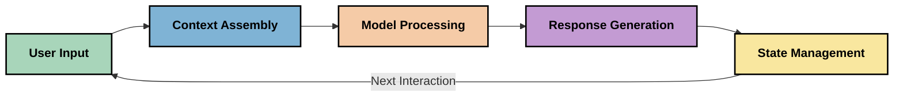
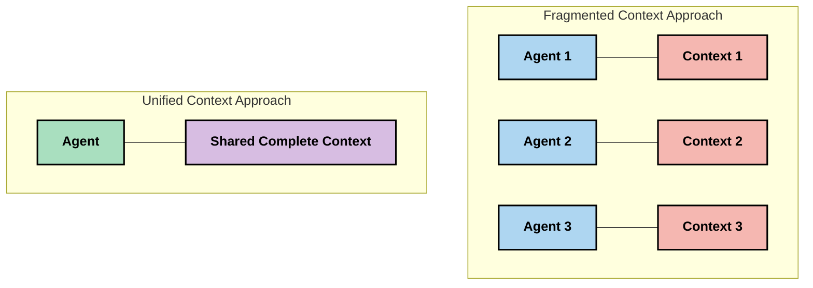
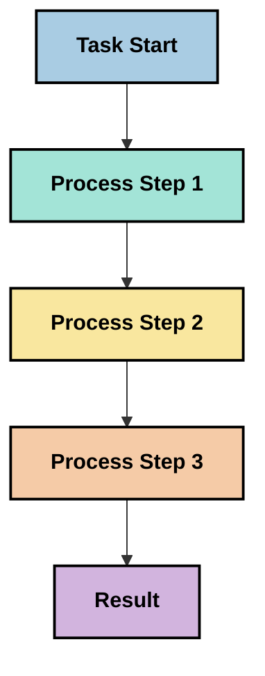
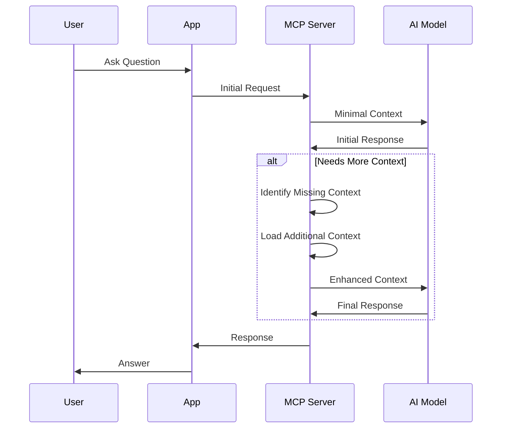
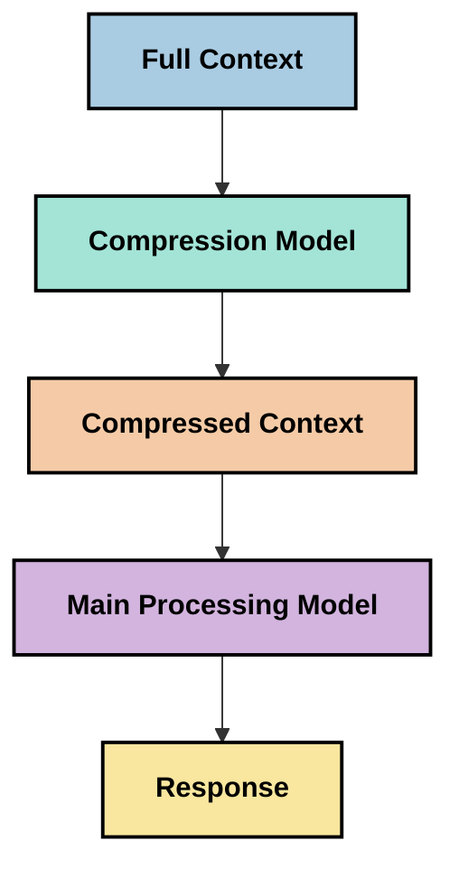

<!--
CO_OP_TRANSLATOR_METADATA:
{
  "original_hash": "fd169ca3071b81b5ee282e194bc823df",
  "translation_date": "2025-09-15T20:23:25+00:00",
  "source_file": "05-AdvancedTopics/mcp-contextengineering/README.md",
  "language_code": "pl"
}
-->
# Inżynieria kontekstu: Nowa koncepcja w ekosystemie MCP

## Przegląd

Inżynieria kontekstu to nowa koncepcja w przestrzeni AI, która bada, jak informacje są strukturyzowane, dostarczane i utrzymywane podczas interakcji między klientami a usługami AI. W miarę rozwoju ekosystemu Model Context Protocol (MCP), zrozumienie, jak skutecznie zarządzać kontekstem, staje się coraz ważniejsze. Ten moduł wprowadza koncepcję inżynierii kontekstu i bada jej potencjalne zastosowania w implementacjach MCP.

## Cele nauki

Po ukończeniu tego modułu będziesz w stanie:

- Zrozumieć nową koncepcję inżynierii kontekstu i jej potencjalną rolę w aplikacjach MCP
- Zidentyfikować kluczowe wyzwania w zarządzaniu kontekstem, które projekt MCP stara się rozwiązać
- Poznać techniki poprawy wydajności modeli poprzez lepsze zarządzanie kontekstem
- Rozważyć podejścia do mierzenia i oceny skuteczności kontekstu
- Zastosować te nowe koncepcje, aby poprawić doświadczenia AI w ramach MCP

## Wprowadzenie do inżynierii kontekstu

Inżynieria kontekstu to nowa dziedzina skupiona na celowym projektowaniu i zarządzaniu przepływem informacji między użytkownikami, aplikacjami i modelami AI. W przeciwieństwie do bardziej ugruntowanych dziedzin, takich jak inżynieria promptów, inżynieria kontekstu wciąż jest definiowana przez praktyków, którzy starają się rozwiązać unikalne wyzwania związane z dostarczaniem modelom AI odpowiednich informacji w odpowiednim czasie.

W miarę rozwoju dużych modeli językowych (LLM), znaczenie kontekstu staje się coraz bardziej widoczne. Jakość, trafność i struktura dostarczanego kontekstu bezpośrednio wpływają na wyniki modeli. Inżynieria kontekstu bada tę zależność i dąży do opracowania zasad skutecznego zarządzania kontekstem.

> "W 2025 roku dostępne modele są niezwykle inteligentne. Ale nawet najbystrzejszy człowiek nie będzie w stanie skutecznie wykonywać swojej pracy bez kontekstu tego, o co go prosimy... 'Inżynieria kontekstu' to kolejny poziom inżynierii promptów. Chodzi o automatyzację tego procesu w dynamicznym systemie." — Walden Yan, Cognition AI

Inżynieria kontekstu może obejmować:

1. **Wybór kontekstu**: Określenie, które informacje są istotne dla danego zadania
2. **Strukturyzowanie kontekstu**: Organizowanie informacji w sposób maksymalizujący zrozumienie przez model
3. **Dostarczanie kontekstu**: Optymalizacja sposobu i momentu przesyłania informacji do modeli
4. **Utrzymanie kontekstu**: Zarządzanie stanem i ewolucją kontekstu w czasie
5. **Ocena kontekstu**: Mierzenie i poprawa skuteczności kontekstu

Te obszary są szczególnie istotne dla ekosystemu MCP, który zapewnia ustandaryzowany sposób dostarczania kontekstu do LLM.

## Perspektywa podróży kontekstu

Jednym ze sposobów wizualizacji inżynierii kontekstu jest prześledzenie podróży informacji przez system MCP:



### Kluczowe etapy podróży kontekstu:

1. **Dane wejściowe użytkownika**: Surowe informacje od użytkownika (tekst, obrazy, dokumenty)
2. **Składanie kontekstu**: Łączenie danych wejściowych użytkownika z kontekstem systemowym, historią rozmowy i innymi pozyskanymi informacjami
3. **Przetwarzanie przez model**: Model AI przetwarza złożony kontekst
4. **Generowanie odpowiedzi**: Model generuje wyniki na podstawie dostarczonego kontekstu
5. **Zarządzanie stanem**: System aktualizuje swój wewnętrzny stan na podstawie interakcji

Ta perspektywa podkreśla dynamiczny charakter kontekstu w systemach AI i stawia ważne pytania o to, jak najlepiej zarządzać informacjami na każdym etapie.

## Nowe zasady w inżynierii kontekstu

W miarę kształtowania się dziedziny inżynierii kontekstu, praktycy zaczynają wypracowywać wstępne zasady, które mogą pomóc w podejmowaniu decyzji dotyczących implementacji MCP:

### Zasada 1: Udostępniaj kontekst w pełni

Kontekst powinien być w pełni udostępniany między wszystkimi komponentami systemu, a nie fragmentowany między różnymi agentami lub procesami. Gdy kontekst jest rozproszony, decyzje podejmowane w jednej części systemu mogą być sprzeczne z decyzjami podejmowanymi gdzie indziej.



W aplikacjach MCP oznacza to projektowanie systemów, w których kontekst płynie płynnie przez cały pipeline, zamiast być podzielonym na części.

### Zasada 2: Uznaj, że działania niosą za sobą decyzje

Każde działanie modelu zawiera w sobie decyzje dotyczące interpretacji kontekstu. Gdy różne komponenty działają na różnych kontekstach, te decyzje mogą być sprzeczne, prowadząc do niespójnych wyników.

Ta zasada ma ważne implikacje dla aplikacji MCP:
- Preferuj liniowe przetwarzanie złożonych zadań zamiast równoległego wykonywania z fragmentowanym kontekstem
- Upewnij się, że wszystkie punkty decyzyjne mają dostęp do tych samych informacji kontekstowych
- Projektuj systemy, w których późniejsze etapy mogą zobaczyć pełny kontekst wcześniejszych decyzji

### Zasada 3: Równoważ głębokość kontekstu z ograniczeniami okna

W miarę wydłużania się rozmów i procesów, okna kontekstowe ostatecznie się przepełniają. Skuteczna inżynieria kontekstu bada podejścia do zarządzania napięciem między pełnym kontekstem a ograniczeniami technicznymi.

Potencjalne podejścia obejmują:
- Kompresję kontekstu, która zachowuje istotne informacje przy jednoczesnym zmniejszeniu liczby tokenów
- Progresywne ładowanie kontekstu w zależności od jego znaczenia dla bieżących potrzeb
- Podsumowanie wcześniejszych interakcji przy jednoczesnym zachowaniu kluczowych decyzji i faktów

## Wyzwania związane z kontekstem a projekt MCP

Model Context Protocol (MCP) został zaprojektowany z uwzględnieniem unikalnych wyzwań związanych z zarządzaniem kontekstem. Zrozumienie tych wyzwań pomaga wyjaśnić kluczowe aspekty projektu MCP:

### Wyzwanie 1: Ograniczenia okna kontekstowego
Większość modeli AI ma stałe rozmiary okien kontekstowych, ograniczając ilość informacji, które mogą przetworzyć jednocześnie.

**Odpowiedź projektu MCP:** 
- Protokół wspiera strukturalny, zasobowy kontekst, który może być efektywnie odwoływany
- Zasoby mogą być stronicowane i ładowane progresywnie

### Wyzwanie 2: Określenie trafności
Określenie, które informacje są najbardziej istotne do uwzględnienia w kontekście, jest trudne.

**Odpowiedź projektu MCP:**
- Elastyczne narzędzia umożliwiają dynamiczne pozyskiwanie informacji w zależności od potrzeb
- Strukturalne prompty umożliwiają spójne organizowanie kontekstu

### Wyzwanie 3: Trwałość kontekstu
Zarządzanie stanem w różnych interakcjach wymaga starannego śledzenia kontekstu.

**Odpowiedź projektu MCP:**
- Ustandaryzowane zarządzanie sesjami
- Jasno zdefiniowane wzorce interakcji dla ewolucji kontekstu

### Wyzwanie 4: Kontekst wielomodalny
Różne typy danych (tekst, obrazy, dane strukturalne) wymagają różnego traktowania.

**Odpowiedź projektu MCP:**
- Projekt protokołu uwzględnia różne typy treści
- Ustandaryzowana reprezentacja informacji wielomodalnych

### Wyzwanie 5: Bezpieczeństwo i prywatność
Kontekst często zawiera wrażliwe informacje, które muszą być chronione.

**Odpowiedź projektu MCP:**
- Jasne granice między odpowiedzialnością klienta a serwera
- Opcje lokalnego przetwarzania w celu minimalizacji ekspozycji danych

Zrozumienie tych wyzwań i sposobu, w jaki MCP je rozwiązuje, stanowi podstawę do eksploracji bardziej zaawansowanych technik inżynierii kontekstu.

## Nowe podejścia w inżynierii kontekstu

W miarę rozwoju dziedziny inżynierii kontekstu pojawiają się obiecujące podejścia. Reprezentują one aktualne myślenie, a nie ustalone najlepsze praktyki, i prawdopodobnie będą ewoluować wraz z doświadczeniami z implementacjami MCP.

### 1. Liniowe przetwarzanie jednokierunkowe

W przeciwieństwie do architektur wieloagentowych, które rozdzielają kontekst, niektórzy praktycy odkrywają, że liniowe przetwarzanie jednokierunkowe daje bardziej spójne wyniki. To podejście jest zgodne z zasadą utrzymania jednolitego kontekstu.



Choć podejście to może wydawać się mniej efektywne niż przetwarzanie równoległe, często daje bardziej spójne i wiarygodne wyniki, ponieważ każdy krok opiera się na pełnym zrozumieniu wcześniejszych decyzji.

### 2. Fragmentacja i priorytetyzacja kontekstu

Dzielenie dużych kontekstów na mniejsze części i priorytetyzowanie tego, co najważniejsze.

```python
# Conceptual Example: Context Chunking and Prioritization
def process_with_chunked_context(documents, query):
    # 1. Break documents into smaller chunks
    chunks = chunk_documents(documents)
    
    # 2. Calculate relevance scores for each chunk
    scored_chunks = [(chunk, calculate_relevance(chunk, query)) for chunk in chunks]
    
    # 3. Sort chunks by relevance score
    sorted_chunks = sorted(scored_chunks, key=lambda x: x[1], reverse=True)
    
    # 4. Use the most relevant chunks as context
    context = create_context_from_chunks([chunk for chunk, score in sorted_chunks[:5]])
    
    # 5. Process with the prioritized context
    return generate_response(context, query)
```

Powyższa koncepcja ilustruje, jak można podzielić duże dokumenty na mniejsze części i wybrać tylko najbardziej istotne fragmenty do kontekstu. Podejście to może pomóc w pracy w ramach ograniczeń okna kontekstowego, jednocześnie wykorzystując duże bazy wiedzy.

### 3. Progresywne ładowanie kontekstu

Ładowanie kontekstu progresywnie, w miarę potrzeb, zamiast od razu.



Progresywne ładowanie kontekstu zaczyna się od minimalnego kontekstu i rozszerza go tylko wtedy, gdy jest to konieczne. Może to znacznie zmniejszyć zużycie tokenów dla prostych zapytań, jednocześnie zachowując zdolność do obsługi złożonych pytań.

### 4. Kompresja i podsumowanie kontekstu

Zmniejszanie rozmiaru kontekstu przy jednoczesnym zachowaniu istotnych informacji.



Kompresja kontekstu koncentruje się na:
- Usuwaniu redundantnych informacji
- Podsumowywaniu długich treści
- Wyodrębnianiu kluczowych faktów i szczegółów
- Zachowaniu istotnych elementów kontekstu
- Optymalizacji pod kątem efektywności tokenów

Podejście to może być szczególnie wartościowe w utrzymywaniu długich rozmów w ramach okien kontekstowych lub w efektywnym przetwarzaniu dużych dokumentów. Niektórzy praktycy używają specjalistycznych modeli specjalnie do kompresji kontekstu i podsumowywania historii rozmów.

## Eksploracyjne rozważania dotyczące inżynierii kontekstu

Podczas eksploracji nowej dziedziny inżynierii kontekstu warto wziąć pod uwagę kilka kwestii przy pracy z implementacjami MCP. Nie są to ustalone najlepsze praktyki, lecz obszary eksploracji, które mogą przynieść poprawę w konkretnym przypadku użycia.

### Rozważ swoje cele dotyczące kontekstu

Przed wdrożeniem złożonych rozwiązań zarządzania kontekstem jasno określ, co chcesz osiągnąć:
- Jakie konkretne informacje są potrzebne modelowi, aby odnieść sukces?
- Które informacje są niezbędne, a które dodatkowe?
- Jakie są Twoje ograniczenia wydajnościowe (opóźnienia, limity tokenów, koszty)?

### Eksploruj podejścia warstwowe do kontekstu

Niektórzy praktycy odnoszą sukcesy z kontekstem zorganizowanym w warstwy koncepcyjne:
- **Warstwa podstawowa**: Niezbędne informacje, które model zawsze potrzebuje
- **Warstwa sytuacyjna**: Kontekst specyficzny dla bieżącej interakcji
- **Warstwa wspierająca**: Dodatkowe informacje, które mogą być pomocne
- **Warstwa zapasowa**: Informacje dostępne tylko w razie potrzeby

### Zbadaj strategie pozyskiwania informacji

Skuteczność Twojego kontekstu często zależy od sposobu pozyskiwania informacji:
- Wyszukiwanie semantyczne i osadzenia do znajdowania koncepcyjnie istotnych informacji
- Wyszukiwanie oparte na słowach kluczowych dla konkretnych szczegółów faktograficznych
- Podejścia hybrydowe łączące różne metody pozyskiwania
- Filtrowanie metadanych w celu zawężenia zakresu na podstawie kategorii, dat lub źródeł

### Eksperymentuj z koherencją kontekstu

Struktura i przepływ Twojego kontekstu mogą wpływać na zrozumienie przez model:
- Grupowanie powiązanych informacji razem
- Używanie spójnego formatowania i organizacji
- Utrzymywanie logicznego lub chronologicznego porządku tam, gdzie to właściwe
- Unikanie sprzecznych informacji

### Rozważ kompromisy architektur wieloagentowych

Choć architektury wieloagentowe są popularne w wielu frameworkach AI, wiążą się z istotnymi wyzwaniami dla zarządzania kontekstem:
- Fragmentacja kontekstu może prowadzić do niespójnych decyzji między agentami
- Przetwarzanie równoległe może wprowadzać konflikty trudne do rozwiązania
- Koszty komunikacji między agentami mogą niwelować korzyści wydajnościowe
- Złożone zarządzanie stanem jest wymagane do utrzymania spójności

W wielu przypadkach podejście jednokierunkowe z kompleksowym zarządzaniem kontekstem może dawać bardziej wiarygodne wyniki niż wiele wyspecjalizowanych agentów z fragmentowanym kontekstem.

### Opracuj metody oceny

Aby poprawić inżynierię kontekstu w czasie, rozważ, jak będziesz mierzyć sukces:
- Testy A/B różnych struktur kontekstu
- Monitorowanie zużycia tokenów i czasów odpowiedzi
- Śledzenie satysfakcji użytkowników i wskaźników realizacji zadań
- Analiza przypadków, w których strategie kontekstu zawodzą

Te rozważania reprezentują aktywne obszary eksploracji w przestrzeni inżynierii kontekstu. W miarę dojrzewania dziedziny prawdopodobnie pojawią się bardziej definitywne wzorce i praktyki.

## Mierzenie skuteczności kontekstu: Ewoluujące ramy

W miarę rozwoju koncepcji inżynierii kontekstu praktycy zaczynają badać, jak można mierzyć jej skuteczność. Nie istnieją jeszcze ustalone ramy, ale rozważane są różne metryki, które mogą pomóc w kierowaniu przyszłymi pracami.

### Potencjalne wymiary pomiaru

#### 1. Rozważania dotyczące efektywności wejścia

- **Stosunek kontekstu do odpowiedzi**: Ile kontekstu jest potrzebne w stosunku do rozmiaru odpowiedzi?
- **Wykorzystanie tokenów**: Jaki procent dostarczonych tokenów kontekstu wpływa na odpowiedź?
- **Redukcja kontekstu**: Jak skutecznie można skompresować surowe informacje?

#### 2. Rozważania dotyczące wydajności

- **Wpływ na opóźnienia**: Jak zarządzanie kontekstem wpływa na czas odpowiedzi?
- **Ekonomia tokenów**: Czy optymalizujemy efektywne wykorzystanie tokenów?
- **Precyzja pozyskiwania**: Jak trafne są pozyskane informacje?
- **Wykorzystanie zasobów**: Jakie zasoby obliczeniowe są wymagane?

#### 3. Rozważania dotyczące jakości

- **Trafność odpowiedzi**: Jak dobrze odpowiedź odpowiada na zapytanie?
- **Dokładność faktograficzna**: Czy zarządzanie kontekstem poprawia poprawność faktograficzną?
- **Spójność**: Czy odpowiedzi są spójne w podobnych zapytaniach?
- **Częstotliwość hal
- [Model Context Protocol Website](https://modelcontextprotocol.io/)
- [Model Context Protocol Specification](https://github.com/modelcontextprotocol/modelcontextprotocol)
- [MCP Documentation](https://modelcontextprotocol.io/docs)
- [MCP C# SDK](https://github.com/modelcontextprotocol/csharp-sdk)
- [MCP Python SDK](https://github.com/modelcontextprotocol/python-sdk)
- [MCP TypeScript SDK](https://github.com/modelcontextprotocol/typescript-sdk)
- [MCP Inspector](https://github.com/modelcontextprotocol/inspector) - Narzędzie do wizualnego testowania serwerów MCP

### Artykuły o inżynierii kontekstowej
- [Nie twórz multi-agentów: Zasady inżynierii kontekstowej](https://cognition.ai/blog/dont-build-multi-agents) - Spostrzeżenia Waldena Yana na temat zasad inżynierii kontekstowej
- [Praktyczny przewodnik po budowaniu agentów](https://cdn.openai.com/business-guides-and-resources/a-practical-guide-to-building-agents.pdf) - Przewodnik OpenAI dotyczący efektywnego projektowania agentów
- [Budowanie efektywnych agentów](https://www.anthropic.com/engineering/building-effective-agents) - Podejście Anthropic do rozwoju agentów

### Powiązane badania
- [Dynamic Retrieval Augmentation for Large Language Models](https://arxiv.org/abs/2310.01487) - Badania nad dynamicznymi podejściami do wyszukiwania
- [Lost in the Middle: How Language Models Use Long Contexts](https://arxiv.org/abs/2307.03172) - Ważne badania dotyczące wzorców przetwarzania kontekstu
- [Hierarchical Text-Conditioned Image Generation with CLIP Latents](https://arxiv.org/abs/2204.06125) - Artykuł o DALL-E 2 z wnioskami na temat strukturyzacji kontekstu
- [Exploring the Role of Context in Large Language Model Architectures](https://aclanthology.org/2023.findings-emnlp.124/) - Najnowsze badania dotyczące obsługi kontekstu
- [Multi-Agent Collaboration: A Survey](https://arxiv.org/abs/2304.03442) - Badania nad systemami multi-agentowymi i ich wyzwaniami

### Dodatkowe zasoby
- [Techniki optymalizacji okna kontekstowego](https://learn.microsoft.com/en-us/azure/ai-services/openai/concepts/context-window)
- [Zaawansowane techniki RAG](https://www.microsoft.com/en-us/research/blog/retrieval-augmented-generation-rag-and-frontier-models/)
- [Dokumentacja Semantic Kernel](https://github.com/microsoft/semantic-kernel)
- [AI Toolkit for Context Management](https://github.com/microsoft/aitoolkit)

## Co dalej

- [5.15 MCP Custom Transport](../mcp-transport/README.md)

---

**Zastrzeżenie**:  
Ten dokument został przetłumaczony za pomocą usługi tłumaczenia AI [Co-op Translator](https://github.com/Azure/co-op-translator). Chociaż dokładamy wszelkich starań, aby zapewnić poprawność tłumaczenia, prosimy pamiętać, że automatyczne tłumaczenia mogą zawierać błędy lub nieścisłości. Oryginalny dokument w jego rodzimym języku powinien być uznawany za wiarygodne źródło. W przypadku informacji o kluczowym znaczeniu zaleca się skorzystanie z profesjonalnego tłumaczenia przez człowieka. Nie ponosimy odpowiedzialności za jakiekolwiek nieporozumienia lub błędne interpretacje wynikające z użycia tego tłumaczenia.