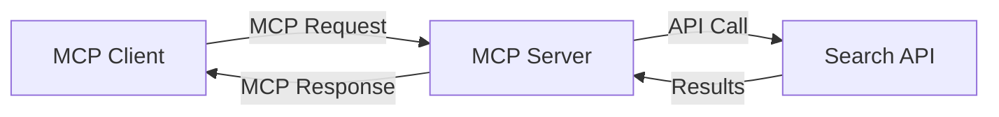
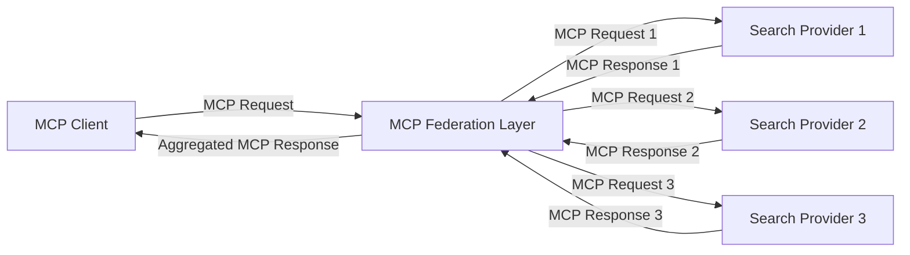
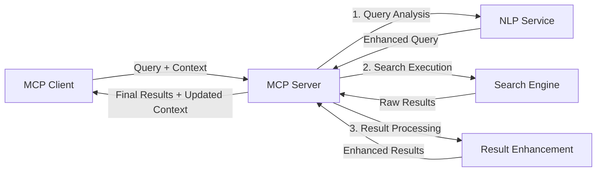

<!--
CO_OP_TRANSLATOR_METADATA:
{
  "original_hash": "eb12652eb7bd17f2193b835a344425c6",
  "translation_date": "2025-06-26T13:59:24+00:00",
  "source_file": "05-AdvancedTopics/mcp-realtimesearch/README.md",
  "language_code": "pl"
}
-->
## Zastrzeżenie dotyczące przykładów kodu

> **Ważna uwaga**: Poniższe przykłady kodu demonstrują integrację Model Context Protocol (MCP) z funkcjonalnością wyszukiwania w sieci. Chociaż opierają się na wzorcach i strukturach oficjalnych SDK MCP, zostały uproszczone w celach edukacyjnych.
> 
> Przykłady te prezentują:
> 
> 1. **Implementację w Pythonie**: Serwer FastMCP, który udostępnia narzędzie do wyszukiwania w sieci i łączy się z zewnętrznym API wyszukiwania. Przykład pokazuje właściwe zarządzanie cyklem życia, obsługę kontekstu oraz implementację narzędzia zgodnie z wzorcami [oficjalnego MCP Python SDK](https://github.com/modelcontextprotocol/python-sdk). Serwer wykorzystuje zalecany transport Streamable HTTP, który zastąpił starszy transport SSE w środowiskach produkcyjnych.
> 
> 2. **Implementację w JavaScript**: Implementacja w TypeScript/JavaScript wykorzystująca wzorzec FastMCP z [oficjalnego MCP TypeScript SDK](https://github.com/modelcontextprotocol/typescript-sdk) do stworzenia serwera wyszukiwania z prawidłowymi definicjami narzędzi i połączeniami klientów. Postępuje zgodnie z najnowszymi zalecanymi wzorcami zarządzania sesjami i zachowywania kontekstu.
> 
> Te przykłady wymagają dodatkowej obsługi błędów, uwierzytelniania oraz specyficznej integracji API do zastosowań produkcyjnych. Pokazane punkty końcowe API wyszukiwania (`https://api.search-service.example/search`) są symboliczne i należy je zastąpić rzeczywistymi punktami końcowymi usług wyszukiwania.
> 
> Aby uzyskać pełne szczegóły implementacji oraz najnowsze podejścia, prosimy o zapoznanie się z [oficjalną specyfikacją MCP](https://spec.modelcontextprotocol.io/) oraz dokumentacją SDK.

## Podstawowe koncepcje

### Ramy Model Context Protocol (MCP)

Model Context Protocol to ustandaryzowany sposób wymiany kontekstu pomiędzy modelami AI, aplikacjami i usługami. W wyszukiwaniu w czasie rzeczywistym jest to fundament do tworzenia spójnych, wieloetapowych doświadczeń wyszukiwania. Kluczowe elementy to:

1. **Architektura klient-serwer**: MCP ustanawia jasny podział między klientami wyszukiwania (żądającymi) a serwerami wyszukiwania (dostawcami), co umożliwia elastyczne modele wdrożeń.

2. **Komunikacja JSON-RPC**: Protokół korzysta z JSON-RPC do wymiany wiadomości, co czyni go kompatybilnym z technologiami webowymi i łatwym do implementacji na różnych platformach.

3. **Zarządzanie kontekstem**: MCP definiuje ustrukturyzowane metody utrzymywania, aktualizacji i wykorzystywania kontekstu wyszukiwania przez wiele interakcji.

4. **Definicje narzędzi**: Możliwości wyszukiwania są udostępniane jako ustandaryzowane narzędzia z jasno określonymi parametrami i wartościami zwracanymi.

5. **Wsparcie dla strumieniowania**: Protokół obsługuje strumieniowe przesyłanie wyników, co jest niezbędne w wyszukiwaniu w czasie rzeczywistym, gdzie wyniki mogą pojawiać się stopniowo.

### Wzorce integracji wyszukiwania w sieci

Podczas integracji MCP z wyszukiwaniem w sieci pojawia się kilka wzorców:

#### 1. Bezpośrednia integracja z dostawcą wyszukiwania

W tym wzorcu serwer MCP bezpośrednio komunikuje się z jednym lub wieloma API wyszukiwania, tłumacząc żądania MCP na specyficzne wywołania API i formatując wyniki jako odpowiedzi MCP.

#### 2. Federacyjne wyszukiwanie z zachowaniem kontekstu

Ten wzorzec rozprowadza zapytania wyszukiwania do wielu kompatybilnych z MCP dostawców, z których każdy może specjalizować się w różnych typach treści lub funkcjonalnościach wyszukiwania, przy jednoczesnym utrzymaniu spójnego kontekstu.

#### 3. Łańcuch wyszukiwania wzbogacony kontekstem

W tym wzorcu proces wyszukiwania jest podzielony na wiele etapów, a kontekst jest wzbogacany na każdym kroku, co skutkuje coraz bardziej trafnymi wynikami.

### Składniki kontekstu wyszukiwania

W wyszukiwaniu internetowym opartym na MCP kontekst zwykle obejmuje:

- **Historia zapytań**: Poprzednie zapytania w sesji
- **Preferencje użytkownika**: Język, region, ustawienia bezpiecznego wyszukiwania
- **Historia interakcji**: Kliknięte wyniki, czas spędzony na wynikach
- **Parametry wyszukiwania**: Filtry, kolejność sortowania i inne modyfikatory wyszukiwania
- **Wiedza domenowa**: Kontekst tematyczny istotny dla wyszukiwania
- **Kontekst czasowy**: Czynniki związane z aktualnością
- **Preferencje źródeł**: Zaufane lub preferowane źródła informacji

## Przypadki użycia i zastosowania

### Badania i gromadzenie informacji

MCP wzbogaca procesy badawcze przez:

- Zachowanie kontekstu badań między sesjami wyszukiwania
- Umożliwienie bardziej zaawansowanych i kontekstowo trafnych zapytań
- Wsparcie federacyjnego wyszukiwania wieloźródłowego
- Ułatwianie ekstrakcji wiedzy z wyników wyszukiwania

### Monitorowanie wiadomości i trendów w czasie rzeczywistym

Wyszukiwanie zasilane MCP oferuje korzyści dla monitorowania wiadomości:

- Wykrywanie pojawiających się wiadomości niemal w czasie rzeczywistym
- Kontekstowe filtrowanie istotnych informacji
- Śledzenie tematów i podmiotów w wielu źródłach
- Spersonalizowane alerty informacyjne oparte na kontekście użytkownika

### Przeglądanie i badania wspomagane przez AI

MCP otwiera nowe możliwości dla przeglądania wspomaganego AI:

- Kontekstowe sugestie wyszukiwania na podstawie bieżącej aktywności przeglądarki
- Płynna integracja wyszukiwania internetowego z asystentami opartymi na dużych modelach językowych (LLM)
- Wieloetapowe doprecyzowywanie wyszukiwania przy utrzymywaniu kontekstu
- Ulepszone sprawdzanie faktów i weryfikacja informacji

## Przyszłe trendy i innowacje

### Ewolucja MCP w wyszukiwaniu internetowym

W przyszłości spodziewamy się, że MCP będzie się rozwijać, aby sprostać:

- **Wyszukiwaniu multimodalnemu**: Integracja wyszukiwania tekstu, obrazu, dźwięku i wideo przy zachowanym kontekście
- **Wyszukiwaniu zdecentralizowanemu**: Wsparcie dla rozproszonych i federacyjnych ekosystemów wyszukiwania
- **Prywatności wyszukiwania**: Mechanizmy ochrony prywatności uwzględniające kontekst
- **Zrozumieniu zapytań**: Głębokie semantyczne parsowanie naturalnych zapytań wyszukiwania

### Potencjalne postępy technologiczne

Nowe technologie, które ukształtują przyszłość wyszukiwania MCP:

1. **Architektury wyszukiwania neuronowego**: Systemy wyszukiwania oparte na osadzeniach zoptymalizowane pod MCP
2. **Personalizowany kontekst wyszukiwania**: Nauka indywidualnych wzorców wyszukiwania użytkownika w czasie
3. **Integracja grafów wiedzy**: Wyszukiwanie kontekstowe wzbogacone o domenowe grafy wiedzy
4. **Kontekst międzymodalny**: Utrzymywanie kontekstu w różnych modalnościach wyszukiwania

## Ćwiczenia praktyczne

### Ćwiczenie 1: Konfiguracja podstawowego potoku wyszukiwania MCP

W tym ćwiczeniu nauczysz się:

- Konfigurować podstawowe środowisko wyszukiwania MCP
- Implementować obsługę kontekstu dla wyszukiwania internetowego
- Testować i weryfikować zachowanie kontekstu między iteracjami wyszukiwania

### Ćwiczenie 2: Budowa asystenta badawczego z wyszukiwaniem MCP

Stwórz kompletną aplikację, która:

- Przetwarza pytania badawcze w języku naturalnym
- Wykonuje wyszukiwanie internetowe z uwzględnieniem kontekstu
- Syntetyzuje informacje z wielu źródeł
- Prezentuje zorganizowane wyniki badań

### Ćwiczenie 3: Implementacja federacji wyszukiwania wieloźródłowego z MCP

Zaawansowane ćwiczenie obejmujące:

- Kontekstowe rozsyłanie zapytań do wielu silników wyszukiwania
- Ranking i agregację wyników
- Kontekstowe usuwanie duplikatów wyników
- Obsługę metadanych specyficznych dla źródeł

## Dodatkowe zasoby

- [Specyfikacja Model Context Protocol](https://spec.modelcontextprotocol.io/) - Oficjalna specyfikacja MCP i szczegółowa dokumentacja protokołu
- [Dokumentacja Model Context Protocol](https://modelcontextprotocol.io/) - Szczegółowe samouczki i przewodniki implementacyjne
- [MCP Python SDK](https://github.com/modelcontextprotocol/python-sdk) - Oficjalna implementacja MCP w Pythonie
- [MCP TypeScript SDK](https://github.com/modelcontextprotocol/typescript-sdk) - Oficjalna implementacja MCP w TypeScript
- [Serwery referencyjne MCP](https://github.com/modelcontextprotocol/servers) - Referencyjne implementacje serwerów MCP
- [Dokumentacja Bing Web Search API](https://learn.microsoft.com/en-us/bing/search-apis/bing-web-search/overview) - API wyszukiwania Microsoft
- [Google Custom Search JSON API](https://developers.google.com/custom-search/v1/overview) - Programowalne wyszukiwanie Google
- [Dokumentacja SerpAPI](https://serpapi.com/search-api) - API stron wyników wyszukiwania
- [Dokumentacja Meilisearch](https://www.meilisearch.com/docs) - Open-source'owy silnik wyszukiwania
- [Dokumentacja Elasticsearch](https://www.elastic.co/guide/index.html) - Rozproszony silnik wyszukiwania i analityki
- [Dokumentacja LangChain](https://python.langchain.com/docs/get_started/introduction) - Budowanie aplikacji z LLM

## Rezultaty nauki

Po ukończeniu tego modułu będziesz potrafił:

- Zrozumieć podstawy wyszukiwania internetowego w czasie rzeczywistym i jego wyzwania
- Wyjaśnić, jak Model Context Protocol (MCP) wzmacnia możliwości wyszukiwania w czasie rzeczywistym
- Implementować rozwiązania wyszukiwania oparte na MCP z użyciem popularnych frameworków i API
- Projektować i wdrażać skalowalne, wysokowydajne architektury wyszukiwania z MCP
- Zastosować koncepcje MCP w różnych przypadkach użycia, w tym wyszukiwanie semantyczne, asystę badawczą i przeglądanie wspomagane AI
- Ocenić pojawiające się trendy i przyszłe innowacje w technologiach wyszukiwania opartych na MCP

### Zagadnienia zaufania i bezpieczeństwa

Implementując rozwiązania wyszukiwania w sieci oparte na MCP, pamiętaj o następujących ważnych zasadach z specyfikacji MCP:

1. **Zgoda i kontrola użytkownika**: Użytkownicy muszą wyraźnie wyrazić zgodę i rozumieć wszystkie operacje oraz dostęp do danych. Jest to szczególnie istotne w implementacjach wyszukiwania, które mogą korzystać z zewnętrznych źródeł danych.

2. **Prywatność danych**: Zapewnij odpowiednie traktowanie zapytań i wyników wyszukiwania, zwłaszcza jeśli mogą zawierać wrażliwe informacje. Wdroż odpowiednie mechanizmy kontroli dostępu, aby chronić dane użytkowników.

3. **Bezpieczeństwo narzędzi**: Zaimplementuj właściwą autoryzację i walidację narzędzi wyszukiwania, ponieważ mogą one stanowić potencjalne ryzyko bezpieczeństwa przez wykonywanie dowolnego kodu. Opisy zachowania narzędzi powinny być traktowane jako niezweryfikowane, chyba że pochodzą z zaufanego serwera.

4. **Jasna dokumentacja**: Zapewnij przejrzystą dokumentację dotyczącą możliwości, ograniczeń i aspektów bezpieczeństwa Twojej implementacji wyszukiwania opartej na MCP, zgodnie z wytycznymi specyfikacji MCP.

5. **Solidne procesy zgody**: Buduj solidne mechanizmy zgody i autoryzacji, które jasno wyjaśniają, co robi każde narzędzie przed zezwoleniem na jego użycie, zwłaszcza w przypadku narzędzi korzystających z zewnętrznych zasobów sieciowych.

Pełne informacje na temat bezpieczeństwa i zaufania MCP znajdziesz w [oficjalnej dokumentacji](https://modelcontextprotocol.io/specification/2025-03-26#security-and-trust-%26-safety).

## Co dalej

- [5.11 Uwierzytelnianie Entra ID dla serwerów Model Context Protocol](../mcp-security-entra/README.md)

**Zastrzeżenie**:  
Niniejszy dokument został przetłumaczony za pomocą usługi tłumaczenia AI [Co-op Translator](https://github.com/Azure/co-op-translator). Mimo że dążymy do jak największej dokładności, prosimy pamiętać, że tłumaczenia automatyczne mogą zawierać błędy lub nieścisłości. Oryginalny dokument w języku źródłowym należy uważać za źródło wiążące. W przypadku informacji o krytycznym znaczeniu zaleca się skorzystanie z profesjonalnego tłumaczenia wykonanego przez człowieka. Nie ponosimy odpowiedzialności za jakiekolwiek nieporozumienia lub błędne interpretacje wynikające z korzystania z tego tłumaczenia.