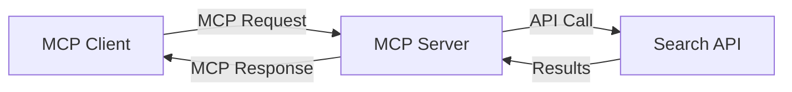
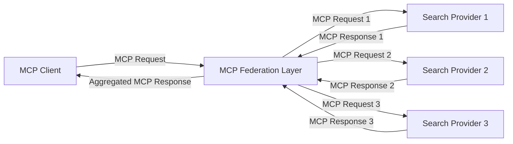
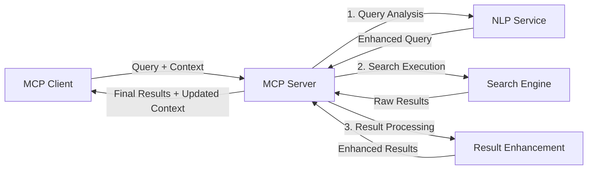

<!--
CO_OP_TRANSLATOR_METADATA:
{
  "original_hash": "333a03e51f90bdf3e6f1ba1694c73f36",
  "translation_date": "2025-07-16T22:38:36+00:00",
  "source_file": "05-AdvancedTopics/mcp-realtimesearch/README.md",
  "language_code": "pl"
}
-->
## Zastrzeżenie dotyczące przykładów kodu

> **Ważna uwaga**: Poniższe przykłady kodu demonstrują integrację Model Context Protocol (MCP) z funkcjonalnością wyszukiwania w sieci. Choć opierają się na wzorcach i strukturach oficjalnych SDK MCP, zostały uproszczone w celach edukacyjnych.
> 
> Przykłady te pokazują:
> 
> 1. **Implementację w Pythonie**: Serwer FastMCP, który udostępnia narzędzie do wyszukiwania w sieci i łączy się z zewnętrznym API wyszukiwania. Przykład demonstruje prawidłowe zarządzanie czasem życia, obsługę kontekstu oraz implementację narzędzia zgodnie ze wzorcami [oficjalnego MCP Python SDK](https://github.com/modelcontextprotocol/python-sdk). Serwer korzysta z rekomendowanego transportu Streamable HTTP, który zastąpił starszy transport SSE w zastosowaniach produkcyjnych.
> 
> 2. **Implementację w JavaScript**: Implementację w TypeScript/JavaScript wykorzystującą wzorzec FastMCP z [oficjalnego MCP TypeScript SDK](https://github.com/modelcontextprotocol/typescript-sdk) do stworzenia serwera wyszukiwania z poprawną definicją narzędzi i połączeniami klienta. Postępuje zgodnie z najnowszymi zalecanymi wzorcami zarządzania sesją i zachowania kontekstu.
> 
> Przykłady te wymagają dodatkowej obsługi błędów, uwierzytelniania oraz specyficznej integracji z API do zastosowań produkcyjnych. Pokazane punkty końcowe API wyszukiwania (`https://api.search-service.example/search`) są symboliczne i należy je zastąpić rzeczywistymi adresami usług wyszukiwania.
> 
> Aby uzyskać pełne szczegóły implementacji i najnowsze podejścia, prosimy o zapoznanie się z [oficjalną specyfikacją MCP](https://spec.modelcontextprotocol.io/) oraz dokumentacją SDK.

## Podstawowe koncepcje

### Framework Model Context Protocol (MCP)

Model Context Protocol to ustandaryzowany sposób wymiany kontekstu między modelami AI, aplikacjami i usługami. W wyszukiwaniu w czasie rzeczywistym ten framework jest kluczowy do tworzenia spójnych, wieloetapowych doświadczeń wyszukiwania. Główne elementy to:

1. **Architektura klient-serwer**: MCP wyraźnie rozdziela klientów wyszukiwania (żądających) od serwerów wyszukiwania (dostawców), co pozwala na elastyczne modele wdrożeń.

2. **Komunikacja JSON-RPC**: Protokół wykorzystuje JSON-RPC do wymiany wiadomości, co zapewnia kompatybilność z technologiami webowymi i ułatwia implementację na różnych platformach.

3. **Zarządzanie kontekstem**: MCP definiuje ustrukturyzowane metody utrzymywania, aktualizacji i wykorzystywania kontekstu wyszukiwania w wielu interakcjach.

4. **Definicje narzędzi**: Możliwości wyszukiwania są udostępniane jako ustandaryzowane narzędzia z jasno określonymi parametrami i wartościami zwrotnymi.

5. **Wsparcie dla streamingu**: Protokół obsługuje przesyłanie wyników strumieniowo, co jest niezbędne w wyszukiwaniu w czasie rzeczywistym, gdzie wyniki mogą pojawiać się stopniowo.

### Wzorce integracji wyszukiwania w sieci

Podczas integracji MCP z wyszukiwaniem w sieci pojawia się kilka wzorców:

#### 1. Bezpośrednia integracja z dostawcą wyszukiwania

W tym wzorcu serwer MCP bezpośrednio komunikuje się z jednym lub kilkoma API wyszukiwania, tłumacząc żądania MCP na wywołania specyficzne dla API i formatując wyniki jako odpowiedzi MCP.

#### 2. Federacyjne wyszukiwanie z zachowaniem kontekstu

Ten wzorzec rozdziela zapytania wyszukiwania pomiędzy wielu kompatybilnych z MCP dostawców, z których każdy może specjalizować się w różnych typach treści lub funkcjach wyszukiwania, zachowując przy tym spójny kontekst.

#### 3. Łańcuch wyszukiwania z rozszerzonym kontekstem

W tym wzorcu proces wyszukiwania dzieli się na wiele etapów, a kontekst jest wzbogacany na każdym kroku, co skutkuje coraz bardziej trafnymi wynikami.

### Składniki kontekstu wyszukiwania

W wyszukiwaniu w sieci opartym na MCP kontekst zwykle obejmuje:

- **Historia zapytań**: Poprzednie zapytania w sesji
- **Preferencje użytkownika**: Język, region, ustawienia bezpiecznego wyszukiwania
- **Historia interakcji**: Kliknięte wyniki, czas spędzony na wynikach
- **Parametry wyszukiwania**: Filtry, kolejność sortowania i inne modyfikatory
- **Wiedza dziedzinowa**: Kontekst tematyczny istotny dla wyszukiwania
- **Kontekst czasowy**: Czynniki związane z aktualnością
- **Preferencje źródeł**: Zaufane lub preferowane źródła informacji

## Przypadki użycia i zastosowania

### Badania i gromadzenie informacji

MCP usprawnia procesy badawcze poprzez:

- Zachowanie kontekstu badań w trakcie sesji wyszukiwania
- Umożliwienie bardziej zaawansowanych i kontekstowo trafnych zapytań
- Wsparcie federacyjnego wyszukiwania z wielu źródeł
- Ułatwianie ekstrakcji wiedzy z wyników wyszukiwania

### Monitorowanie wiadomości i trendów w czasie rzeczywistym

Wyszukiwanie oparte na MCP oferuje korzyści w monitoringu wiadomości:

- Odkrywanie nowych informacji niemal w czasie rzeczywistym
- Kontekstowe filtrowanie istotnych informacji
- Śledzenie tematów i podmiotów w wielu źródłach
- Spersonalizowane alerty informacyjne oparte na kontekście użytkownika

### Przeglądanie i badania wspomagane przez AI

MCP otwiera nowe możliwości w przeglądaniu wspomaganym przez AI:

- Kontekstowe sugestie wyszukiwania na podstawie bieżącej aktywności w przeglądarce
- Bezproblemowa integracja wyszukiwania w sieci z asystentami opartymi na LLM
- Wieloetapowe udoskonalanie wyszukiwania z zachowaniem kontekstu
- Ulepszone sprawdzanie faktów i weryfikacja informacji

## Przyszłe trendy i innowacje

### Ewolucja MCP w wyszukiwaniu w sieci

Patrząc w przyszłość, spodziewamy się, że MCP będzie się rozwijać, aby sprostać:

- **Wyszukiwaniu multimodalnemu**: Integracja wyszukiwania tekstu, obrazów, dźwięku i wideo z zachowaniem kontekstu
- **Wyszukiwaniu zdecentralizowanemu**: Wsparcie dla rozproszonych i federacyjnych ekosystemów wyszukiwania
- **Prywatność wyszukiwania**: Mechanizmy wyszukiwania z zachowaniem prywatności i świadomością kontekstu  
- **Zrozumienie zapytań**: Głębokie semantyczne analizowanie zapytań w naturalnym języku  

### Potencjalne postępy technologiczne

Nowe technologie, które ukształtują przyszłość wyszukiwania MCP:

1. **Neuronalne architektury wyszukiwania**: Systemy wyszukiwania oparte na embeddingach, zoptymalizowane pod MCP  
2. **Spersonalizowany kontekst wyszukiwania**: Nauka indywidualnych wzorców wyszukiwania użytkowników w czasie  
3. **Integracja grafów wiedzy**: Wyszukiwanie kontekstowe wzbogacone o domenowe grafy wiedzy  
4. **Kontekst międzymodalny**: Utrzymywanie kontekstu pomiędzy różnymi modalnościami wyszukiwania  

## Ćwiczenia praktyczne

### Ćwiczenie 1: Konfiguracja podstawowego pipeline’u wyszukiwania MCP

W tym ćwiczeniu nauczysz się:  
- Konfigurować podstawowe środowisko wyszukiwania MCP  
- Implementować obsługę kontekstu dla wyszukiwania w sieci  
- Testować i weryfikować zachowanie kontekstu podczas kolejnych iteracji wyszukiwania  

### Ćwiczenie 2: Budowa asystenta badawczego z MCP Search

Stwórz kompletną aplikację, która:  
- Przetwarza pytania badawcze w naturalnym języku  
- Wykonuje wyszukiwania w sieci z uwzględnieniem kontekstu  
- Syntezuje informacje z wielu źródeł  
- Prezentuje uporządkowane wyniki badań  

### Ćwiczenie 3: Implementacja federacji wyszukiwania wieloźródłowego z MCP

Zaawansowane ćwiczenie obejmujące:  
- Kontekstowe rozsyłanie zapytań do wielu silników wyszukiwania  
- Ranking i agregację wyników  
- Kontekstowe usuwanie duplikatów wyników wyszukiwania  
- Obsługę metadanych specyficznych dla źródeł  

## Dodatkowe zasoby

- [Model Context Protocol Specification](https://spec.modelcontextprotocol.io/) - Oficjalna specyfikacja MCP i szczegółowa dokumentacja protokołu  
- [Model Context Protocol Documentation](https://modelcontextprotocol.io/) - Szczegółowe samouczki i przewodniki implementacyjne  
- [MCP Python SDK](https://github.com/modelcontextprotocol/python-sdk) - Oficjalna implementacja MCP w Pythonie  
- [MCP TypeScript SDK](https://github.com/modelcontextprotocol/typescript-sdk) - Oficjalna implementacja MCP w TypeScript  
- [MCP Reference Servers](https://github.com/modelcontextprotocol/servers) - Referencyjne implementacje serwerów MCP  
- [Bing Web Search API Documentation](https://learn.microsoft.com/en-us/bing/search-apis/bing-web-search/overview) - API wyszukiwania sieciowego Microsoftu  
- [Google Custom Search JSON API](https://developers.google.com/custom-search/v1/overview) - Programowalna wyszukiwarka Google  
- [SerpAPI Documentation](https://serpapi.com/search-api) - API wyników wyszukiwania  
- [Meilisearch Documentation](https://www.meilisearch.com/docs) - Open-source’owy silnik wyszukiwania  
- [Elasticsearch Documentation](https://www.elastic.co/guide/index.html) - Rozproszony silnik wyszukiwania i analityki  
- [LangChain Documentation](https://python.langchain.com/docs/get_started/introduction) - Tworzenie aplikacji z wykorzystaniem LLM  

## Efekty nauki

Po ukończeniu tego modułu będziesz potrafił:  

- Zrozumieć podstawy wyszukiwania sieciowego w czasie rzeczywistym oraz jego wyzwania  
- Wyjaśnić, jak Model Context Protocol (MCP) wzmacnia możliwości wyszukiwania w czasie rzeczywistym  
- Implementować rozwiązania wyszukiwania oparte na MCP, korzystając z popularnych frameworków i API  
- Projektować i wdrażać skalowalne, wydajne architektury wyszukiwania z MCP  
- Stosować koncepcje MCP w różnych zastosowaniach, w tym wyszukiwaniu semantycznym, asystentach badawczych i przeglądaniu wspomaganym przez AI  
- Ocenić nowe trendy i przyszłe innowacje w technologiach wyszukiwania opartych na MCP  

### Zagadnienia związane z zaufaniem i bezpieczeństwem

Implementując rozwiązania wyszukiwania sieciowego oparte na MCP, pamiętaj o następujących ważnych zasadach z specyfikacji MCP:  

1. **Zgoda i kontrola użytkownika**: Użytkownicy muszą wyraźnie wyrazić zgodę i rozumieć wszystkie operacje oraz dostęp do danych. Jest to szczególnie istotne w implementacjach wyszukiwania sieciowego, które mogą korzystać z zewnętrznych źródeł danych.  

2. **Prywatność danych**: Zapewnij odpowiednie zarządzanie zapytaniami i wynikami wyszukiwania, zwłaszcza gdy mogą zawierać wrażliwe informacje. Wdroż odpowiednie mechanizmy kontroli dostępu, aby chronić dane użytkowników.  

3. **Bezpieczeństwo narzędzi**: Wprowadź właściwą autoryzację i walidację narzędzi wyszukiwania, ponieważ mogą one stanowić potencjalne zagrożenie bezpieczeństwa przez wykonywanie dowolnego kodu. Opisy zachowania narzędzi powinny być traktowane jako niezweryfikowane, chyba że pochodzą z zaufanego serwera.  

4. **Jasna dokumentacja**: Zapewnij przejrzystą dokumentację dotyczącą możliwości, ograniczeń i aspektów bezpieczeństwa Twojej implementacji MCP, zgodnie z wytycznymi specyfikacji MCP.  

5. **Solidne procesy zgody**: Zbuduj solidne mechanizmy uzyskiwania zgody i autoryzacji, które jasno wyjaśniają działanie każdego narzędzia przed jego użyciem, zwłaszcza jeśli narzędzia te mają dostęp do zewnętrznych zasobów sieciowych.  

Pełne informacje na temat bezpieczeństwa i zaufania w MCP znajdziesz w [oficjalnej dokumentacji](https://modelcontextprotocol.io/specification/2025-03-26#security-and-trust-%26-safety).  

## Co dalej  

- [5.12 Entra ID Authentication for Model Context Protocol Servers](../mcp-security-entra/README.md)

**Zastrzeżenie**:  
Niniejszy dokument został przetłumaczony za pomocą usługi tłumaczenia AI [Co-op Translator](https://github.com/Azure/co-op-translator). Mimo że dążymy do dokładności, prosimy mieć na uwadze, że automatyczne tłumaczenia mogą zawierać błędy lub nieścisłości. Oryginalny dokument w języku źródłowym powinien być uznawany za źródło autorytatywne. W przypadku informacji o kluczowym znaczeniu zalecane jest skorzystanie z profesjonalnego tłumaczenia wykonanego przez człowieka. Nie ponosimy odpowiedzialności za jakiekolwiek nieporozumienia lub błędne interpretacje wynikające z korzystania z tego tłumaczenia.