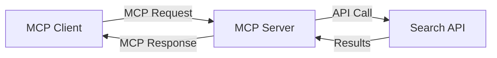
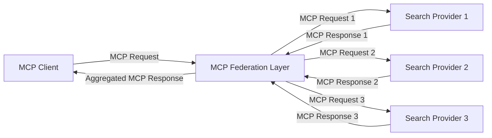
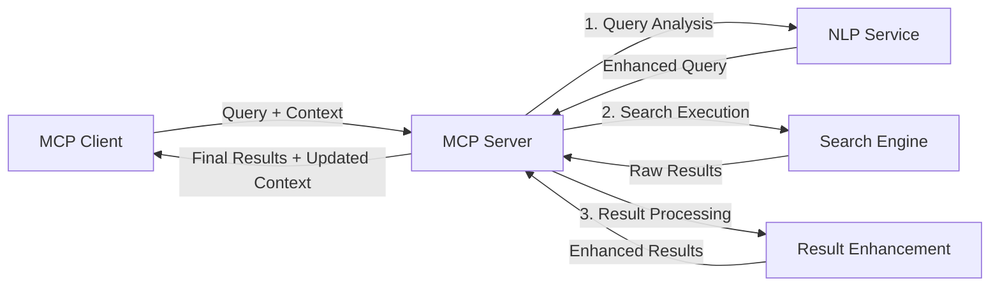

<!--
CO_OP_TRANSLATOR_METADATA:
{
  "original_hash": "16bef2c93c6a86d4ca6a8ce9e120e384",
  "translation_date": "2025-06-12T22:40:55+00:00",
  "source_file": "05-AdvancedTopics/mcp-realtimesearch/README.md",
  "language_code": "pl"
}
-->
## Zastrzeżenie dotyczące przykładów kodu

> **Ważna uwaga**: poniższe przykłady kodu pokazują integrację Model Context Protocol (MCP) z funkcjonalnością wyszukiwania w sieci. Choć bazują na wzorcach i strukturach oficjalnych SDK MCP, zostały uproszczone na potrzeby edukacyjne.
> 
> Przykłady te prezentują:
> 
> 1. **Implementację w Pythonie**: serwer FastMCP oferujący narzędzie do wyszukiwania w sieci oraz łączący się z zewnętrznym API wyszukiwania. Przykład pokazuje prawidłowe zarządzanie czasem życia, obsługę kontekstu oraz implementację narzędzia zgodnie z wzorcami [oficjalnego MCP Python SDK](https://github.com/modelcontextprotocol/python-sdk). Serwer korzysta z rekomendowanego transportu HTTP Streamable, który zastąpił starszy transport SSE w zastosowaniach produkcyjnych.
> 
> 2. **Implementację w JavaScript**: implementację w TypeScript/JavaScript wykorzystującą wzorzec FastMCP z [oficjalnego MCP TypeScript SDK](https://github.com/modelcontextprotocol/typescript-sdk) do stworzenia serwera wyszukiwania z poprawnymi definicjami narzędzi i połączeniami klienta. Postępuje zgodnie z najnowszymi zaleceniami dotyczącymi zarządzania sesją i zachowania kontekstu.
> 
> Przykłady te wymagają dodatkowej obsługi błędów, uwierzytelniania oraz specyficznego kodu integracji z API do zastosowań produkcyjnych. Pokazane punkty końcowe API wyszukiwania (`https://api.search-service.example/search`) są symboliczne i należy je zastąpić rzeczywistymi punktami końcowymi usług wyszukiwania.
> 
> Dla pełnych szczegółów implementacji i najnowszych podejść, prosimy o zapoznanie się z [oficjalną specyfikacją MCP](https://spec.modelcontextprotocol.io/) oraz dokumentacją SDK.

## Podstawowe pojęcia

### Framework Model Context Protocol (MCP)

Na swoim fundamencie Model Context Protocol zapewnia ustandaryzowany sposób wymiany kontekstu pomiędzy modelami AI, aplikacjami i usługami. W wyszukiwaniu w czasie rzeczywistym ten framework jest kluczowy do tworzenia spójnych, wieloetapowych doświadczeń wyszukiwania. Główne komponenty obejmują:

1. **Architektura klient-serwer**: MCP ustanawia wyraźny podział między klientami wyszukiwania (żądającymi) a serwerami wyszukiwania (dostarczającymi), co umożliwia elastyczne modele wdrożeń.

2. **Komunikacja JSON-RPC**: protokół wykorzystuje JSON-RPC do wymiany wiadomości, co zapewnia kompatybilność z technologiami webowymi i ułatwia implementację na różnych platformach.

3. **Zarządzanie kontekstem**: MCP definiuje ustrukturyzowane metody utrzymywania, aktualizacji i wykorzystywania kontekstu wyszukiwania na przestrzeni wielu interakcji.

4. **Definicje narzędzi**: możliwości wyszukiwania są udostępniane jako ustandaryzowane narzędzia z dobrze określonymi parametrami i wartościami zwracanymi.

5. **Wsparcie dla strumieniowania**: protokół obsługuje przesyłanie wyników strumieniowo, co jest niezbędne w wyszukiwaniu w czasie rzeczywistym, gdzie wyniki mogą pojawiać się stopniowo.

### Wzorce integracji wyszukiwania w sieci

Podczas integracji MCP z wyszukiwaniem w sieci pojawia się kilka wzorców:

#### 1. Bezpośrednia integracja z dostawcą wyszukiwania

W tym wzorcu serwer MCP bezpośrednio komunikuje się z jednym lub wieloma API wyszukiwania, tłumacząc żądania MCP na specyficzne wywołania API i formatując wyniki jako odpowiedzi MCP.

#### 2. Federacyjne wyszukiwanie z zachowaniem kontekstu

Ten wzorzec rozdziela zapytania wyszukiwania pomiędzy wielu kompatybilnych z MCP dostawców, z których każdy może specjalizować się w różnych typach treści lub funkcjach wyszukiwania, zachowując jednak spójny kontekst.

#### 3. Łańcuch wyszukiwania z rozszerzonym kontekstem

W tym wzorcu proces wyszukiwania dzieli się na kilka etapów, gdzie kontekst jest wzbogacany na każdym kroku, co skutkuje stopniowo coraz bardziej trafnymi wynikami.

### Komponenty kontekstu wyszukiwania

W wyszukiwaniu w sieci opartym na MCP kontekst zwykle obejmuje:

- **Historia zapytań**: poprzednie zapytania w sesji
- **Preferencje użytkownika**: język, region, ustawienia bezpiecznego wyszukiwania
- **Historia interakcji**: które wyniki zostały kliknięte, czas spędzony na wynikach
- **Parametry wyszukiwania**: filtry, kolejność sortowania i inne modyfikatory wyszukiwania
- **Wiedza domenowa**: kontekst specyficzny dla tematu wyszukiwania
- **Kontekst czasowy**: czynniki związane z aktualnością informacji
- **Preferencje źródeł**: zaufane lub preferowane źródła informacji

## Przypadki użycia i zastosowania

### Badania i gromadzenie informacji

MCP usprawnia procesy badawcze poprzez:

- Zachowanie kontekstu badań w trakcie sesji wyszukiwania
- Umożliwienie bardziej zaawansowanych i kontekstowo trafnych zapytań
- Wsparcie federacyjnego wyszukiwania z wielu źródeł
- Ułatwienie ekstrakcji wiedzy z wyników wyszukiwania

### Monitorowanie wiadomości i trendów w czasie rzeczywistym

Wyszukiwanie oparte na MCP oferuje korzyści w monitoringu wiadomości:

- Odkrywanie na bieżąco pojawiających się informacji
- Filtrowanie kontekstowe istotnych wiadomości
- Śledzenie tematów i podmiotów w wielu źródłach
- Spersonalizowane alerty newsowe bazujące na kontekście użytkownika

### Przeglądanie i badania wspomagane przez AI

MCP otwiera nowe możliwości dla AI wspomagającego przeglądanie:

- Kontekstowe sugestie wyszukiwania bazujące na bieżącej aktywności w przeglądarce
- Bezproblemowa integracja wyszukiwania sieciowego z asystentami opartymi na LLM
- Wieloetapowe udoskonalanie wyszukiwania z zachowaniem kontekstu
- Ulepszone sprawdzanie faktów i weryfikacja informacji

## Przyszłe trendy i innowacje

### Ewolucja MCP w wyszukiwaniu w sieci

Patrząc w przyszłość, spodziewamy się rozwoju MCP w kierunku:

- **Wielomodalnego wyszukiwania**: integracji wyszukiwania tekstu, obrazów, audio i wideo z zachowaniem kontekstu
- **Wyszukiwania zdecentralizowanego**: wsparcia rozproszonych i federacyjnych ekosystemów wyszukiwania
- **Prywatności wyszukiwania**: mechanizmów zachowujących prywatność w kontekstowym wyszukiwaniu
- **Zrozumienia zapytań**: głębokiego semantycznego parsowania naturalnych zapytań wyszukiwania

### Potencjalne postępy technologiczne

Nowe technologie kształtujące przyszłość wyszukiwania MCP:

1. **Neuralne architektury wyszukiwania**: systemy wyszukiwania oparte na osadzeniach zoptymalizowane pod MCP
2. **Spersonalizowany kontekst wyszukiwania**: uczenie się indywidualnych wzorców wyszukiwania użytkownika w czasie
3. **Integracja grafów wiedzy**: kontekstowe wyszukiwanie wzbogacone o domenowe grafy wiedzy
4. **Kontekst międzymodalny**: utrzymywanie kontekstu w różnych modalnościach wyszukiwania

## Ćwiczenia praktyczne

### Ćwiczenie 1: Konfiguracja podstawowego pipeline wyszukiwania MCP

W tym ćwiczeniu nauczysz się:
- Konfigurować podstawowe środowisko wyszukiwania MCP
- Implementować obsługę kontekstu dla wyszukiwania w sieci
- Testować i weryfikować zachowanie kontekstu na przestrzeni iteracji wyszukiwania

### Ćwiczenie 2: Budowa asystenta badawczego z wyszukiwaniem MCP

Stwórz kompletną aplikację, która:
- Przetwarza pytania badawcze w języku naturalnym
- Wykonuje kontekstowe wyszukiwania sieciowe
- Syntetyzuje informacje z wielu źródeł
- Prezentuje zorganizowane wyniki badań

### Ćwiczenie 3: Implementacja federacyjnego wyszukiwania wieloźródłowego z MCP

Zaawansowane ćwiczenie obejmujące:
- Kontekstowe rozsyłanie zapytań do wielu silników wyszukiwania
- Ranking i agregację wyników
- Kontekstowe usuwanie duplikatów wyników
- Obsługę metadanych specyficznych dla źródeł

## Dodatkowe zasoby

- [Specyfikacja Model Context Protocol](https://spec.modelcontextprotocol.io/) – oficjalna specyfikacja MCP i szczegółowa dokumentacja protokołu
- [Dokumentacja Model Context Protocol](https://modelcontextprotocol.io/) – szczegółowe samouczki i przewodniki implementacyjne
- [MCP Python SDK](https://github.com/modelcontextprotocol/python-sdk) – oficjalna implementacja MCP w Pythonie
- [MCP TypeScript SDK](https://github.com/modelcontextprotocol/typescript-sdk) – oficjalna implementacja MCP w TypeScript
- [Serwery referencyjne MCP](https://github.com/modelcontextprotocol/servers) – przykładowe implementacje serwerów MCP
- [Dokumentacja Bing Web Search API](https://learn.microsoft.com/en-us/bing/search-apis/bing-web-search/overview) – API wyszukiwania Microsoftu
- [Google Custom Search JSON API](https://developers.google.com/custom-search/v1/overview) – programowalne wyszukiwanie Google
- [Dokumentacja SerpAPI](https://serpapi.com/search-api) – API wyników wyszukiwania
- [Dokumentacja Meilisearch](https://www.meilisearch.com/docs) – open-source silnik wyszukiwania
- [Dokumentacja Elasticsearch](https://www.elastic.co/guide/index.html) – rozproszony silnik wyszukiwania i analityki
- [Dokumentacja LangChain](https://python.langchain.com/docs/get_started/introduction) – budowanie aplikacji z wykorzystaniem LLM

## Efekty nauki

Po ukończeniu tego modułu będziesz potrafił:

- Zrozumieć podstawy wyszukiwania w czasie rzeczywistym i jego wyzwania
- Wyjaśnić, jak Model Context Protocol (MCP) wzmacnia możliwości wyszukiwania w czasie rzeczywistym
- Implementować rozwiązania wyszukiwania oparte na MCP z użyciem popularnych frameworków i API
- Projektować i wdrażać skalowalne, wysokowydajne architektury wyszukiwania z MCP
- Stosować koncepcje MCP w różnych przypadkach użycia, w tym wyszukiwaniu semantycznym, asystentach badawczych i przeglądaniu wspomaganym przez AI
- Ocenić pojawiające się trendy i przyszłe innowacje w technologiach wyszukiwania opartych na MCP

### Zagadnienia zaufania i bezpieczeństwa

Implementując rozwiązania wyszukiwania w sieci oparte na MCP, pamiętaj o ważnych zasadach z specyfikacji MCP:

1. **Zgoda i kontrola użytkownika**: użytkownicy muszą wyraźnie wyrazić zgodę i rozumieć wszystkie operacje oraz dostęp do danych. Szczególnie istotne w implementacjach wyszukiwania, które mogą mieć dostęp do zewnętrznych źródeł danych.

2. **Prywatność danych**: zapewnij odpowiednie traktowanie zapytań i wyników wyszukiwania, zwłaszcza gdy mogą zawierać wrażliwe informacje. Wdróż odpowiednie mechanizmy kontroli dostępu chroniące dane użytkowników.

3. **Bezpieczeństwo narzędzi**: wdrażaj właściwą autoryzację i walidację narzędzi wyszukiwania, ponieważ mogą one stanowić ryzyko bezpieczeństwa przez wykonywanie dowolnego kodu. Opisy zachowań narzędzi powinny być traktowane jako niezweryfikowane, chyba że pochodzą z zaufanego serwera.

4. **Jasna dokumentacja**: dostarczaj przejrzystą dokumentację dotyczącą możliwości, ograniczeń i aspektów bezpieczeństwa twojej implementacji wyszukiwania opartej na MCP, zgodnie z wytycznymi specyfikacji MCP.

5. **Solidne procesy zgody**: buduj solidne mechanizmy zgody i autoryzacji, które jasno wyjaśniają działanie każdego narzędzia przed jego uruchomieniem, szczególnie dla narzędzi interagujących z zewnętrznymi zasobami sieciowymi.

Dla pełnych informacji na temat bezpieczeństwa i zaufania w MCP, zapoznaj się z [oficjalną dokumentacją](https://modelcontextprotocol.io/specification/2025-03-26#security-and-trust-%26-safety).

## Co dalej

- [6. Wkłady społeczności](../../06-CommunityContributions/README.md)

**Zastrzeżenie**:  
Niniejszy dokument został przetłumaczony za pomocą usługi tłumaczenia AI [Co-op Translator](https://github.com/Azure/co-op-translator). Mimo że dokładamy starań, aby tłumaczenie było precyzyjne, prosimy pamiętać, że automatyczne tłumaczenia mogą zawierać błędy lub nieścisłości. Oryginalny dokument w języku źródłowym powinien być traktowany jako autorytatywne źródło. W przypadku informacji o krytycznym znaczeniu zalecane jest skorzystanie z profesjonalnego tłumaczenia wykonanego przez człowieka. Nie ponosimy odpowiedzialności za jakiekolwiek nieporozumienia lub błędne interpretacje wynikające z korzystania z tego tłumaczenia.