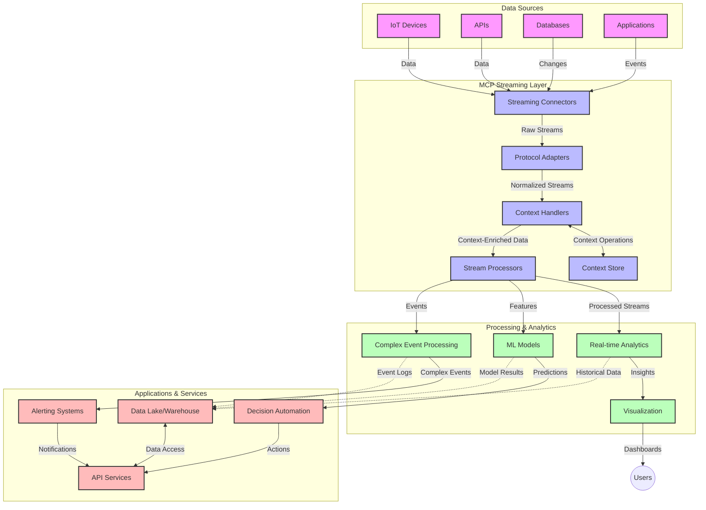

<!--
CO_OP_TRANSLATOR_METADATA:
{
  "original_hash": "68c518dbff8a3b127ed2aa934054c56c",
  "translation_date": "2025-06-11T17:12:48+00:00",
  "source_file": "05-AdvancedTopics/mcp-realtimestreaming/README.md",
  "language_code": "pl"
}
-->
# Model Context Protocol dla strumieniowania danych w czasie rzeczywistym

## Przegląd

Strumieniowanie danych w czasie rzeczywistym stało się niezbędne w dzisiejszym świecie opartym na danych, gdzie firmy i aplikacje wymagają natychmiastowego dostępu do informacji, aby podejmować szybkie decyzje. Model Context Protocol (MCP) stanowi znaczący krok naprzód w optymalizacji tych procesów strumieniowania, zwiększając efektywność przetwarzania danych, zachowując integralność kontekstu oraz poprawiając ogólną wydajność systemu.

Ten moduł pokazuje, jak MCP zmienia strumieniowanie danych w czasie rzeczywistym, oferując ustandaryzowane podejście do zarządzania kontekstem pomiędzy modelami AI, platformami strumieniowymi i aplikacjami.

## Wprowadzenie do strumieniowania danych w czasie rzeczywistym

Strumieniowanie danych w czasie rzeczywistym to paradygmat technologiczny umożliwiający ciągły transfer, przetwarzanie i analizę danych w momencie ich generowania, co pozwala systemom natychmiast reagować na nowe informacje. W przeciwieństwie do tradycyjnego przetwarzania wsadowego, które działa na statycznych zbiorach danych, strumieniowanie przetwarza dane w ruchu, dostarczając wglądy i działania z minimalnym opóźnieniem.

### Kluczowe koncepcje strumieniowania danych w czasie rzeczywistym:

- **Ciągły przepływ danych**: Dane są przetwarzane jako nieprzerwany, nieskończony strumień zdarzeń lub rekordów.
- **Przetwarzanie o niskim opóźnieniu**: Systemy są zaprojektowane tak, aby zminimalizować czas między wygenerowaniem a przetworzeniem danych.
- **Skalowalność**: Architektury strumieniowe muszą radzić sobie ze zmienną ilością i szybkością danych.
- **Odporność na błędy**: Systemy muszą być odporne na awarie, aby zapewnić nieprzerwany przepływ danych.
- **Przetwarzanie stanowe**: Utrzymanie kontekstu pomiędzy zdarzeniami jest kluczowe dla sensownej analizy.

### Model Context Protocol a strumieniowanie w czasie rzeczywistym

Model Context Protocol (MCP) rozwiązuje kilka kluczowych wyzwań w środowiskach strumieniowania w czasie rzeczywistym:

1. **Ciągłość kontekstu**: MCP standaryzuje sposób utrzymywania kontekstu pomiędzy rozproszonymi komponentami strumieniowymi, zapewniając, że modele AI i węzły przetwarzające mają dostęp do istotnego kontekstu historycznego i środowiskowego.

2. **Efektywne zarządzanie stanem**: Dzięki dostarczaniu ustrukturyzowanych mechanizmów przesyłania kontekstu, MCP zmniejsza narzut związany z zarządzaniem stanem w potokach strumieniowych.

3. **Interoperacyjność**: MCP tworzy wspólny język do wymiany kontekstu między różnymi technologiami strumieniowymi i modelami AI, umożliwiając bardziej elastyczne i rozszerzalne architektury.

4. **Kontekst zoptymalizowany pod strumieniowanie**: Implementacje MCP mogą priorytetowo traktować te elementy kontekstu, które są najważniejsze dla podejmowania decyzji w czasie rzeczywistym, optymalizując zarówno wydajność, jak i dokładność.

5. **Adaptacyjne przetwarzanie**: Dzięki właściwemu zarządzaniu kontekstem za pomocą MCP, systemy strumieniowe mogą dynamicznie dostosowywać przetwarzanie na podstawie zmieniających się warunków i wzorców w danych.

We współczesnych aplikacjach, od sieci czujników IoT po platformy handlu finansowego, integracja MCP z technologiami strumieniowymi umożliwia inteligentniejsze, świadome kontekstu przetwarzanie, które potrafi odpowiednio reagować na złożone, zmieniające się sytuacje w czasie rzeczywistym.

## Cele nauki

Po zakończeniu tej lekcji będziesz potrafił:

- Zrozumieć podstawy strumieniowania danych w czasie rzeczywistym oraz jego wyzwania
- Wyjaśnić, jak Model Context Protocol (MCP) usprawnia strumieniowanie danych w czasie rzeczywistym
- Implementować rozwiązania strumieniowe oparte na MCP przy użyciu popularnych frameworków, takich jak Kafka i Pulsar
- Projektować i wdrażać odporne na błędy, wysokowydajne architektury strumieniowe z MCP
- Zastosować koncepcje MCP w zastosowaniach IoT, handlu finansowego i analizie napędzanej AI
- Ocenić pojawiające się trendy i przyszłe innowacje w technologiach strumieniowych opartych na MCP

### Definicja i znaczenie

Strumieniowanie danych w czasie rzeczywistym polega na ciągłym generowaniu, przetwarzaniu i dostarczaniu danych z minimalnym opóźnieniem. W przeciwieństwie do przetwarzania wsadowego, gdzie dane są zbierane i przetwarzane w partiach, dane strumieniowe są przetwarzane inkrementalnie w momencie ich nadejścia, co umożliwia natychmiastowe wglądy i działania.

Kluczowe cechy strumieniowania danych w czasie rzeczywistym to:

- **Niskie opóźnienie**: Przetwarzanie i analiza danych w ciągu milisekund do sekund
- **Ciągły przepływ**: Nieprzerwane strumienie danych z różnych źródeł
- **Natychmiastowe przetwarzanie**: Analiza danych w momencie ich nadejścia, a nie w partiach
- **Architektura zdarzeniowa**: Reagowanie na zdarzenia w chwili ich wystąpienia

### Wyzwania w tradycyjnym strumieniowaniu danych

Tradycyjne podejścia do strumieniowania danych napotykają na kilka ograniczeń:

1. **Utrata kontekstu**: Trudności w utrzymaniu kontekstu w rozproszonych systemach
2. **Problemy ze skalowalnością**: Wyzwania związane ze skalowaniem do obsługi dużych i szybkich strumieni danych
3. **Złożoność integracji**: Problemy z interoperacyjnością między różnymi systemami
4. **Zarządzanie opóźnieniami**: Równoważenie przepustowości z czasem przetwarzania
5. **Spójność danych**: Zapewnienie dokładności i kompletności danych w całym strumieniu

## Zrozumienie Model Context Protocol (MCP)

### Czym jest MCP?

Model Context Protocol (MCP) to ustandaryzowany protokół komunikacyjny zaprojektowany, aby ułatwić efektywną interakcję między modelami AI a aplikacjami. W kontekście strumieniowania danych w czasie rzeczywistym MCP dostarcza ramy do:

- Zachowania kontekstu na całej ścieżce przetwarzania danych
- Standaryzacji formatów wymiany danych
- Optymalizacji przesyłania dużych zbiorów danych
- Ulepszania komunikacji model-model oraz model-aplikacja

### Kluczowe komponenty i architektura

Architektura MCP dla strumieniowania w czasie rzeczywistym składa się z kilku podstawowych elementów:

1. **Context Handlers**: Zarządzają i utrzymują informacje kontekstowe w całym potoku strumieniowym
2. **Stream Processors**: Przetwarzają nadchodzące strumienie danych za pomocą technik świadomych kontekstu
3. **Protocol Adapters**: Konwertują między różnymi protokołami strumieniowymi, zachowując kontekst
4. **Context Store**: Efektywnie przechowuje i pobiera informacje kontekstowe
5. **Streaming Connectors**: Łączą z różnymi platformami strumieniowymi (Kafka, Pulsar, Kinesis itd.)



### Jak MCP poprawia obsługę danych w czasie rzeczywistym

MCP odpowiada na tradycyjne wyzwania strumieniowania poprzez:

- **Integralność kontekstu**: Utrzymywanie powiązań między punktami danych na całej ścieżce przetwarzania
- **Optymalizację transmisji**: Redukcję nadmiarowości w wymianie danych dzięki inteligentnemu zarządzaniu kontekstem
- **Ustandaryzowane interfejsy**: Dostarczanie spójnych API dla komponentów strumieniowych
- **Zmniejszenie opóźnień**: Minimalizowanie narzutu przetwarzania przez efektywne zarządzanie kontekstem
- **Zwiększoną skalowalność**: Wsparcie skalowania poziomego przy jednoczesnym zachowaniu kontekstu

## Integracja i wdrożenie

Systemy strumieniowania danych w czasie rzeczywistym wymagają starannego projektowania architektury i implementacji, aby zachować zarówno wydajność, jak i integralność kontekstu. Model Context Protocol oferuje ustandaryzowane podejście do integracji modeli AI i technologii strumieniowych, umożliwiając bardziej zaawansowane, świadome kontekstu potoki przetwarzania.

### Przegląd integracji MCP w architekturach strumieniowych

Implementacja MCP w środowiskach strumieniowania czasu rzeczywistego wymaga uwzględnienia kilku kluczowych aspektów:

1. **Serializacja i transport kontekstu**: MCP dostarcza efektywne mechanizmy kodowania informacji kontekstowych w pakietach danych strumieniowych, zapewniając, że istotny kontekst podąża za danymi przez cały potok przetwarzania. Obejmuje to ustandaryzowane formaty serializacji zoptymalizowane pod transport strumieniowy.

2. **Stanowe przetwarzanie strumieniowe**: MCP umożliwia inteligentniejsze przetwarzanie stanowe poprzez utrzymanie spójnej reprezentacji kontekstu pomiędzy węzłami przetwarzającymi. Jest to szczególnie cenne w rozproszonych architekturach strumieniowych, gdzie zarządzanie stanem bywa wyzwaniem.

3. **Czas zdarzenia vs. czas przetwarzania**: Implementacje MCP muszą rozwiązywać powszechny problem rozróżnienia, kiedy zdarzenia miały miejsce, a kiedy są przetwarzane. Protokół może uwzględniać kontekst temporalny zachowujący semantykę czasu zdarzenia.

4. **Zarządzanie backpressure**: Standaryzując obsługę kontekstu, MCP pomaga zarządzać backpressure w systemach strumieniowych, umożliwiając komponentom komunikowanie swoich możliwości przetwarzania i dostosowanie przepływu danych.

5. **Okienkowanie i agregacja kontekstu**: MCP ułatwia bardziej zaawansowane operacje okienkowania, dostarczając ustrukturyzowane reprezentacje kontekstów czasowych i relacyjnych, co pozwala na bardziej sensowne agregacje w strumieniach zdarzeń.

6. **Przetwarzanie dokładnie raz**: W systemach strumieniowych wymagających semantyki dokładnie raz, MCP może zawierać metadane przetwarzania pomagające śledzić i weryfikować status przetwarzania w rozproszonych komponentach.

Implementacja MCP w różnych technologiach strumieniowych tworzy zunifikowane podejście do zarządzania kontekstem, redukując potrzebę pisania niestandardowego kodu integracyjnego, jednocześnie zwiększając zdolność systemu do zachowania sensownego kontekstu podczas przepływu danych przez potok.

### MCP w różnych frameworkach do strumieniowania danych

MCP może być integrowany z popularnymi frameworkami strumieniowymi, w tym:

#### Integracja z Apache Kafka

```python
from mcp_streaming import MCPKafkaConnector

# Initialize MCP Kafka connector
connector = MCPKafkaConnector(
    bootstrap_servers='localhost:9092',
    context_preservation=True
)

# Create a context-aware consumer
consumer = connector.create_consumer('input-topic')

# Process streaming data with context
for message in consumer:
    context = message.get_context()
    data = message.get_value()
    
    # Process with context awareness
    result = process_with_context(data, context)
    
    # Produce output with preserved context
    connector.produce('output-topic', result, context=context)
```

#### Implementacja w Apache Pulsar

```python
from mcp_streaming import MCPPulsarClient

# Initialize MCP Pulsar client
client = MCPPulsarClient('pulsar://localhost:6650')

# Subscribe with context awareness
consumer = client.subscribe('input-topic', 'subscription-name', 
                           context_enabled=True)

# Process messages with context preservation
while True:
    message = consumer.receive()
    context = message.get_context()
    
    # Process with context
    result = process_with_context(message.data(), context)
    
    # Acknowledge the message
    consumer.acknowledge(message)
    
    # Send result with preserved context
    producer = client.create_producer('output-topic')
    producer.send(result, context=context)
```

### Najlepsze praktyki wdrożeniowe

Przy implementacji MCP dla strumieniowania w czasie rzeczywistym:

1. **Projektuj pod kątem odporności na błędy**:
   - Wdrażaj odpowiednią obsługę błędów
   - Korzystaj z kolejek dead-letter dla nieudanych wiadomości
   - Projektuj procesory idempotentne

2. **Optymalizuj wydajność**:
   - Konfiguruj odpowiednie rozmiary buforów
   - Stosuj grupowanie danych tam, gdzie to możliwe
   - Wdrażaj mechanizmy backpressure

3. **Monitoruj i obserwuj**:
   - Śledź metryki przetwarzania strumienia
   - Monitoruj propagację kontekstu
   - Ustawiaj alerty na anomalie

4. **Zabezpiecz swoje strumienie**:
   - Wdrażaj szyfrowanie danych wrażliwych
   - Używaj uwierzytelniania i autoryzacji
   - Stosuj odpowiednie kontrole dostępu

### MCP w IoT i Edge Computing

MCP wzmacnia strumieniowanie IoT poprzez:

- Zachowanie kontekstu urządzeń na całej ścieżce przetwarzania
- Umożliwienie efektywnego strumieniowania danych z edge do chmury
- Wsparcie analityki w czasie rzeczywistym na danych IoT
- Ułatwianie komunikacji urządzenie-urządzenie z zachowaniem kontekstu

Przykład: Sieci czujników w inteligentnym mieście  
```
Sensors → Edge Gateways → MCP Stream Processors → Real-time Analytics → Automated Responses
```

### Rola w transakcjach finansowych i handlu wysokich częstotliwości

MCP zapewnia istotne korzyści dla strumieniowania danych finansowych:

- Przetwarzanie o ultra-niskim opóźnieniu dla decyzji handlowych
- Utrzymanie kontekstu transakcji przez cały proces
- Wsparcie złożonego przetwarzania zdarzeń z uwzględnieniem kontekstu
- Zapewnienie spójności danych w rozproszonych systemach handlowych

### Wzmacnianie analityki napędzanej AI

MCP otwiera nowe możliwości dla analityki strumieniowej:

- Szkolenie i inferencja modeli w czasie rzeczywistym
- Ciągłe uczenie się na podstawie danych strumieniowych
- Ekstrakcja cech świadoma kontekstu
- Potoki inferencji wielomodelowej z zachowaniem kontekstu

## Przyszłe trendy i innowacje

### Ewolucja MCP w środowiskach czasu rzeczywistego

Patrząc w przyszłość, oczekujemy, że MCP będzie się rozwijać, aby sprostać:

- **Integracji z komputerami kwantowymi**: Przygotowanie do systemów strumieniowania opartych na technologii kwantowej
- **Przetwarzaniu natywnemu na edge**: Przenoszenie coraz większej części świadomego kontekstu przetwarzania na urządzenia edge
- **Autonomicznemu zarządzaniu strumieniami**: Samooptymalizujące się potoki strumieniowe
- **Federacyjnemu strumieniowaniu**: Rozproszone przetwarzanie przy zachowaniu prywatności

### Potencjalne postępy technologiczne

Nowe technologie kształtujące przyszłość strumieniowania MCP:

1. **Protokóły strumieniowe zoptymalizowane pod AI**: Specjalne protokoły zaprojektowane dla obciążeń AI
2. **Integracja z obliczeniami neuromorficznymi**: Obliczenia inspirowane mózgiem do przetwarzania strumieniowego
3. **Strumieniowanie serverless**: Skalowalne, zdarzeniowe strumieniowanie bez zarządzania infrastrukturą
4. **Rozproszone magazyny kontekstu**: Globalnie rozproszone, a jednocześnie wysoce spójne zarządzanie kontekstem

## Ćwiczenia praktyczne

### Ćwiczenie 1: Konfiguracja podstawowego potoku strumieniowego MCP

W tym ćwiczeniu nauczysz się, jak:

- Skonfigurować podstawowe środowisko strumieniowe MCP
- Implementować context handlers do przetwarzania strumieni
- Testować i weryfikować zachowanie kontekstu

### Ćwiczenie 2: Budowa pulpitu analitycznego w czasie rzeczywistym

Stwórz kompletną aplikację, która:

- Pobiera dane strumieniowe za pomocą MCP
- Przetwarza strumień, utrzymując kontekst
- Wizualizuje wyniki w czasie rzeczywistym

### Ćwiczenie 3: Implementacja złożonego przetwarzania zdarzeń z MCP

Zaawansowane ćwiczenie obejmujące:

- Wykrywanie wzorców w strumieniach
- Korelację kontekstową pomiędzy wieloma strumieniami
- Generowanie złożonych zdarzeń z zachowanym kontekstem

## Dodatkowe zasoby

- [Model Context Protocol Specification](https://github.com/microsoft/model-context-protocol) - Oficjalna specyfikacja i dokumentacja MCP
- [Apache Kafka Documentation](https://kafka.apache.org/documentation/) - Materiały o Kafka do przetwarzania strumieniowego
-

**Zastrzeżenie**:  
Niniejszy dokument został przetłumaczony za pomocą usługi tłumaczenia AI [Co-op Translator](https://github.com/Azure/co-op-translator). Mimo że dążymy do dokładności, prosimy mieć na uwadze, że tłumaczenia automatyczne mogą zawierać błędy lub nieścisłości. Oryginalny dokument w języku źródłowym należy traktować jako wiarygodne źródło. W przypadku informacji o kluczowym znaczeniu zalecane jest skorzystanie z profesjonalnego tłumaczenia wykonanego przez człowieka. Nie ponosimy odpowiedzialności za jakiekolwiek nieporozumienia lub błędne interpretacje wynikające z korzystania z tego tłumaczenia.