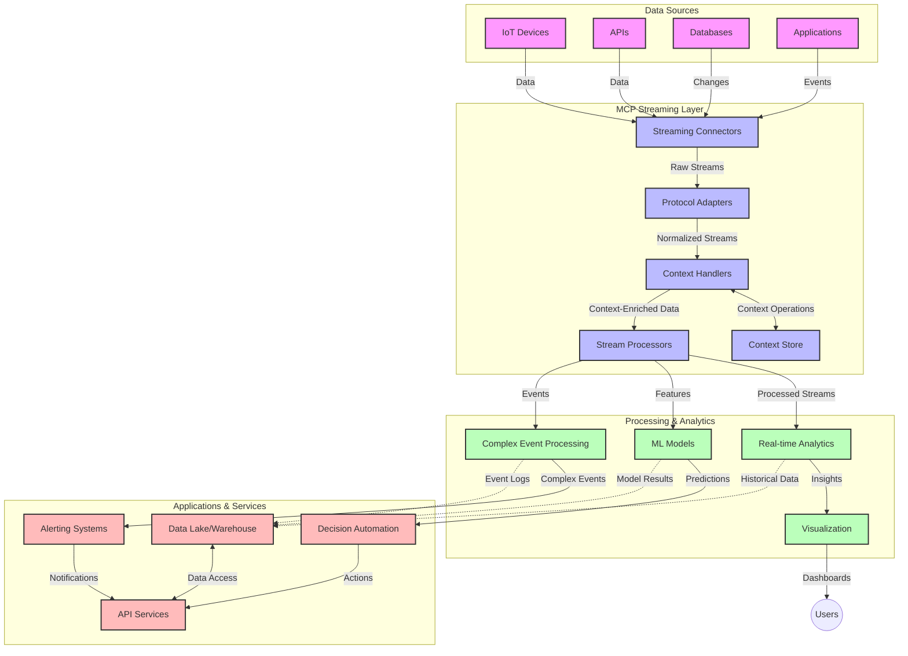

<!--
CO_OP_TRANSLATOR_METADATA:
{
  "original_hash": "195f7287638b77a549acadd96c8f981c",
  "translation_date": "2025-07-14T01:39:31+00:00",
  "source_file": "05-AdvancedTopics/mcp-realtimestreaming/README.md",
  "language_code": "pl"
}
-->
# Model Context Protocol dla strumieniowania danych w czasie rzeczywistym

## Przegląd

Strumieniowanie danych w czasie rzeczywistym stało się niezbędne w dzisiejszym świecie opartym na danych, gdzie firmy i aplikacje wymagają natychmiastowego dostępu do informacji, aby podejmować szybkie decyzje. Model Context Protocol (MCP) stanowi istotny krok naprzód w optymalizacji tych procesów strumieniowania, zwiększając efektywność przetwarzania danych, zachowując integralność kontekstu oraz poprawiając ogólną wydajność systemu.

Ten moduł pokazuje, jak MCP zmienia strumieniowanie danych w czasie rzeczywistym, oferując ustandaryzowane podejście do zarządzania kontekstem pomiędzy modelami AI, platformami strumieniowymi i aplikacjami.

## Wprowadzenie do strumieniowania danych w czasie rzeczywistym

Strumieniowanie danych w czasie rzeczywistym to paradygmat technologiczny umożliwiający ciągły transfer, przetwarzanie i analizę danych w momencie ich generowania, co pozwala systemom na natychmiastową reakcję na nowe informacje. W przeciwieństwie do tradycyjnego przetwarzania wsadowego, które działa na statycznych zbiorach danych, strumieniowanie przetwarza dane w ruchu, dostarczając wglądy i działania z minimalnym opóźnieniem.

### Podstawowe pojęcia strumieniowania danych w czasie rzeczywistym:

- **Ciągły przepływ danych**: Dane są przetwarzane jako nieprzerwany, niekończący się strumień zdarzeń lub rekordów.
- **Przetwarzanie o niskim opóźnieniu**: Systemy są zaprojektowane tak, aby minimalizować czas między generowaniem danych a ich przetwarzaniem.
- **Skalowalność**: Architektury strumieniowe muszą radzić sobie z różnymi wolumenami i prędkościami danych.
- **Odporność na błędy**: Systemy muszą być odporne na awarie, aby zapewnić nieprzerwany przepływ danych.
- **Przetwarzanie stanowe**: Utrzymanie kontekstu pomiędzy zdarzeniami jest kluczowe dla sensownej analizy.

### Model Context Protocol a strumieniowanie w czasie rzeczywistym

Model Context Protocol (MCP) rozwiązuje kilka kluczowych wyzwań w środowiskach strumieniowania w czasie rzeczywistym:

1. **Ciągłość kontekstu**: MCP standaryzuje sposób utrzymywania kontekstu w rozproszonych komponentach strumieniowych, zapewniając, że modele AI i węzły przetwarzające mają dostęp do odpowiedniego kontekstu historycznego i środowiskowego.

2. **Efektywne zarządzanie stanem**: Dzięki dostarczaniu ustrukturyzowanych mechanizmów transmisji kontekstu, MCP zmniejsza narzut związany z zarządzaniem stanem w potokach strumieniowych.

3. **Interoperacyjność**: MCP tworzy wspólny język do dzielenia się kontekstem pomiędzy różnymi technologiami strumieniowymi i modelami AI, umożliwiając bardziej elastyczne i rozszerzalne architektury.

4. **Kontekst zoptymalizowany pod kątem strumieniowania**: Implementacje MCP mogą priorytetyzować, które elementy kontekstu są najistotniejsze dla podejmowania decyzji w czasie rzeczywistym, optymalizując zarówno wydajność, jak i dokładność.

5. **Adaptacyjne przetwarzanie**: Dzięki właściwemu zarządzaniu kontekstem za pomocą MCP, systemy strumieniowe mogą dynamicznie dostosowywać przetwarzanie w oparciu o zmieniające się warunki i wzorce w danych.

We współczesnych zastosowaniach, od sieci czujników IoT po platformy handlu finansowego, integracja MCP z technologiami strumieniowymi umożliwia inteligentniejsze, świadome kontekstu przetwarzanie, które potrafi odpowiednio reagować na złożone, zmieniające się sytuacje w czasie rzeczywistym.

## Cele nauki

Po zakończeniu tej lekcji będziesz potrafił:

- Zrozumieć podstawy strumieniowania danych w czasie rzeczywistym oraz jego wyzwania
- Wyjaśnić, jak Model Context Protocol (MCP) usprawnia strumieniowanie danych w czasie rzeczywistym
- Implementować rozwiązania strumieniowe oparte na MCP, korzystając z popularnych frameworków takich jak Kafka i Pulsar
- Projektować i wdrażać odporne na błędy, wysokowydajne architektury strumieniowe z MCP
- Stosować koncepcje MCP w zastosowaniach IoT, handlu finansowego i analizie danych napędzanej AI
- Ocenić nowe trendy i przyszłe innowacje w technologiach strumieniowych opartych na MCP

### Definicja i znaczenie

Strumieniowanie danych w czasie rzeczywistym polega na ciągłym generowaniu, przetwarzaniu i dostarczaniu danych z minimalnym opóźnieniem. W przeciwieństwie do przetwarzania wsadowego, gdzie dane są zbierane i przetwarzane partiami, dane strumieniowe są przetwarzane stopniowo, w miarę ich napływu, co umożliwia natychmiastowe wglądy i działania.

Kluczowe cechy strumieniowania danych w czasie rzeczywistym to:

- **Niskie opóźnienie**: Przetwarzanie i analiza danych w ciągu milisekund do sekund
- **Ciągły przepływ**: Nieprzerwane strumienie danych z różnych źródeł
- **Natychmiastowe przetwarzanie**: Analiza danych w momencie ich pojawienia się, a nie w partiach
- **Architektura zdarzeniowa**: Reagowanie na zdarzenia w chwili ich wystąpienia

### Wyzwania w tradycyjnym strumieniowaniu danych

Tradycyjne podejścia do strumieniowania danych napotykają na kilka ograniczeń:

1. **Utrata kontekstu**: Trudności w utrzymaniu kontekstu w rozproszonych systemach
2. **Problemy ze skalowalnością**: Wyzwania związane z obsługą dużych wolumenów i szybkości danych
3. **Złożoność integracji**: Problemy z interoperacyjnością między różnymi systemami
4. **Zarządzanie opóźnieniami**: Równoważenie przepustowości z czasem przetwarzania
5. **Spójność danych**: Zapewnienie dokładności i kompletności danych w strumieniu

## Zrozumienie Model Context Protocol (MCP)

### Czym jest MCP?

Model Context Protocol (MCP) to ustandaryzowany protokół komunikacyjny zaprojektowany, aby ułatwić efektywną interakcję między modelami AI a aplikacjami. W kontekście strumieniowania danych w czasie rzeczywistym MCP dostarcza ramy do:

- Zachowania kontekstu w całym potoku danych
- Standaryzacji formatów wymiany danych
- Optymalizacji transmisji dużych zbiorów danych
- Ulepszania komunikacji model-model i model-aplikacja

### Główne komponenty i architektura

Architektura MCP dla strumieniowania w czasie rzeczywistym składa się z kilku kluczowych elementów:

1. **Context Handlers**: Zarządzają i utrzymują informacje kontekstowe w całym potoku strumieniowym
2. **Stream Processors**: Przetwarzają napływające strumienie danych, wykorzystując techniki świadome kontekstu
3. **Protocol Adapters**: Konwertują między różnymi protokołami strumieniowymi, zachowując kontekst
4. **Context Store**: Efektywnie przechowuje i pobiera informacje kontekstowe
5. **Streaming Connectors**: Łączą się z różnymi platformami strumieniowymi (Kafka, Pulsar, Kinesis itp.)



### Jak MCP poprawia obsługę danych w czasie rzeczywistym

MCP rozwiązuje tradycyjne wyzwania strumieniowania poprzez:

- **Integralność kontekstu**: Utrzymywanie powiązań między punktami danych w całym potoku
- **Optymalizację transmisji**: Redukcję nadmiarowości w wymianie danych dzięki inteligentnemu zarządzaniu kontekstem
- **Ustandaryzowane interfejsy**: Zapewnienie spójnych API dla komponentów strumieniowych
- **Zmniejszenie opóźnień**: Minimalizację narzutu przetwarzania dzięki efektywnemu zarządzaniu kontekstem
- **Zwiększoną skalowalność**: Wsparcie skalowania poziomego przy zachowaniu kontekstu

## Integracja i wdrożenie

Systemy strumieniowania danych w czasie rzeczywistym wymagają starannego projektowania architektury i implementacji, aby utrzymać zarówno wydajność, jak i integralność kontekstu. Model Context Protocol oferuje ustandaryzowane podejście do integracji modeli AI i technologii strumieniowych, umożliwiając bardziej zaawansowane, świadome kontekstu potoki przetwarzania.

### Przegląd integracji MCP w architekturach strumieniowych

Implementacja MCP w środowiskach strumieniowania w czasie rzeczywistym wymaga uwzględnienia kilku kluczowych aspektów:

1. **Serializacja i transport kontekstu**: MCP dostarcza efektywne mechanizmy kodowania informacji kontekstowych w pakietach danych strumieniowych, zapewniając, że niezbędny kontekst podąża za danymi przez cały potok przetwarzania. Obejmuje to ustandaryzowane formaty serializacji zoptymalizowane pod kątem transportu strumieniowego.

2. **Stanowe przetwarzanie strumieni**: MCP umożliwia inteligentniejsze przetwarzanie stanowe, utrzymując spójną reprezentację kontekstu w węzłach przetwarzających. Jest to szczególnie cenne w rozproszonych architekturach strumieniowych, gdzie zarządzanie stanem jest tradycyjnie trudne.

3. **Czas zdarzenia vs. czas przetwarzania**: Implementacje MCP w systemach strumieniowych muszą rozwiązywać powszechny problem rozróżniania momentu wystąpienia zdarzenia od momentu jego przetworzenia. Protokół może zawierać kontekst temporalny, który zachowuje semantykę czasu zdarzenia.

4. **Zarządzanie backpressure**: Standaryzując obsługę kontekstu, MCP pomaga zarządzać backpressure w systemach strumieniowych, pozwalając komponentom komunikować swoje możliwości przetwarzania i odpowiednio dostosowywać przepływ.

5. **Okna czasowe i agregacja kontekstu**: MCP ułatwia bardziej zaawansowane operacje okienkowe, dostarczając ustrukturyzowane reprezentacje kontekstów temporalnych i relacyjnych, co umożliwia bardziej sensowne agregacje w strumieniach zdarzeń.

6. **Przetwarzanie dokładnie raz**: W systemach strumieniowych wymagających semantyki dokładnie raz, MCP może zawierać metadane przetwarzania, które pomagają śledzić i weryfikować status przetwarzania w rozproszonych komponentach.

Implementacja MCP w różnych technologiach strumieniowych tworzy zunifikowane podejście do zarządzania kontekstem, zmniejszając potrzebę pisania niestandardowego kodu integracyjnego, a jednocześnie zwiększając zdolność systemu do utrzymania znaczącego kontekstu podczas przepływu danych przez potok.

### MCP w różnych frameworkach do strumieniowania danych

Poniższe przykłady opierają się na aktualnej specyfikacji MCP, która skupia się na protokole JSON-RPC z różnymi mechanizmami transportu. Kod pokazuje, jak można zaimplementować niestandardowe transporty integrujące platformy strumieniowe takie jak Kafka i Pulsar, zachowując pełną kompatybilność z protokołem MCP.

Przykłady mają na celu pokazanie, jak platformy strumieniowe mogą być zintegrowane z MCP, aby zapewnić przetwarzanie danych w czasie rzeczywistym przy jednoczesnym zachowaniu świadomości kontekstu, która jest kluczowa dla MCP. Takie podejście gwarantuje, że przykłady kodu dokładnie odzwierciedlają aktualny stan specyfikacji MCP na czerwiec 2025.

MCP można integrować z popularnymi frameworkami strumieniowymi, w tym:

#### Integracja Apache Kafka

```python
import asyncio
import json
from typing import Dict, Any, Optional
from confluent_kafka import Consumer, Producer, KafkaError
from mcp.client import Client, ClientCapabilities
from mcp.core.message import JsonRpcMessage
from mcp.core.transports import Transport

# Custom transport class to bridge MCP with Kafka
class KafkaMCPTransport(Transport):
    def __init__(self, bootstrap_servers: str, input_topic: str, output_topic: str):
        self.bootstrap_servers = bootstrap_servers
        self.input_topic = input_topic
        self.output_topic = output_topic
        self.producer = Producer({'bootstrap.servers': bootstrap_servers})
        self.consumer = Consumer({
            'bootstrap.servers': bootstrap_servers,
            'group.id': 'mcp-client-group',
            'auto.offset.reset': 'earliest'
        })
        self.message_queue = asyncio.Queue()
        self.running = False
        self.consumer_task = None
        
    async def connect(self):
        """Connect to Kafka and start consuming messages"""
        self.consumer.subscribe([self.input_topic])
        self.running = True
        self.consumer_task = asyncio.create_task(self._consume_messages())
        return self
        
    async def _consume_messages(self):
        """Background task to consume messages from Kafka and queue them for processing"""
        while self.running:
            try:
                msg = self.consumer.poll(1.0)
                if msg is None:
                    await asyncio.sleep(0.1)
                    continue
                
                if msg.error():
                    if msg.error().code() == KafkaError._PARTITION_EOF:
                        continue
                    print(f"Consumer error: {msg.error()}")
                    continue
                
                # Parse the message value as JSON-RPC
                try:
                    message_str = msg.value().decode('utf-8')
                    message_data = json.loads(message_str)
                    mcp_message = JsonRpcMessage.from_dict(message_data)
                    await self.message_queue.put(mcp_message)
                except Exception as e:
                    print(f"Error parsing message: {e}")
            except Exception as e:
                print(f"Error in consumer loop: {e}")
                await asyncio.sleep(1)
    
    async def read(self) -> Optional[JsonRpcMessage]:
        """Read the next message from the queue"""
        try:
            message = await self.message_queue.get()
            return message
        except Exception as e:
            print(f"Error reading message: {e}")
            return None
    
    async def write(self, message: JsonRpcMessage) -> None:
        """Write a message to the Kafka output topic"""
        try:
            message_json = json.dumps(message.to_dict())
            self.producer.produce(
                self.output_topic,
                message_json.encode('utf-8'),
                callback=self._delivery_report
            )
            self.producer.poll(0)  # Trigger callbacks
        except Exception as e:
            print(f"Error writing message: {e}")
    
    def _delivery_report(self, err, msg):
        """Kafka producer delivery callback"""
        if err is not None:
            print(f'Message delivery failed: {err}')
        else:
            print(f'Message delivered to {msg.topic()} [{msg.partition()}]')
    
    async def close(self) -> None:
        """Close the transport"""
        self.running = False
        if self.consumer_task:
            self.consumer_task.cancel()
            try:
                await self.consumer_task
            except asyncio.CancelledError:
                pass
        self.consumer.close()
        self.producer.flush()

# Example usage of the Kafka MCP transport
async def kafka_mcp_example():
    # Create MCP client with Kafka transport
    client = Client(
        {"name": "kafka-mcp-client", "version": "1.0.0"},
        ClientCapabilities({})
    )
    
    # Create and connect the Kafka transport
    transport = KafkaMCPTransport(
        bootstrap_servers="localhost:9092",
        input_topic="mcp-responses",
        output_topic="mcp-requests"
    )
    
    await client.connect(transport)
    
    try:
        # Initialize the MCP session
        await client.initialize()
        
        # Example of executing a tool via MCP
        response = await client.execute_tool(
            "process_data",
            {
                "data": "sample data",
                "metadata": {
                    "source": "sensor-1",
                    "timestamp": "2025-06-12T10:30:00Z"
                }
            }
        )
        
        print(f"Tool execution response: {response}")
        
        # Clean shutdown
        await client.shutdown()
    finally:
        await transport.close()

# Run the example
if __name__ == "__main__":
    asyncio.run(kafka_mcp_example())
```

#### Implementacja Apache Pulsar

```python
import asyncio
import json
import pulsar
from typing import Dict, Any, Optional
from mcp.core.message import JsonRpcMessage
from mcp.core.transports import Transport
from mcp.server import Server, ServerOptions
from mcp.server.tools import Tool, ToolExecutionContext, ToolMetadata

# Create a custom MCP transport that uses Pulsar
class PulsarMCPTransport(Transport):
    def __init__(self, service_url: str, request_topic: str, response_topic: str):
        self.service_url = service_url
        self.request_topic = request_topic
        self.response_topic = response_topic
        self.client = pulsar.Client(service_url)
        self.producer = self.client.create_producer(response_topic)
        self.consumer = self.client.subscribe(
            request_topic,
            "mcp-server-subscription",
            consumer_type=pulsar.ConsumerType.Shared
        )
        self.message_queue = asyncio.Queue()
        self.running = False
        self.consumer_task = None
    
    async def connect(self):
        """Connect to Pulsar and start consuming messages"""
        self.running = True
        self.consumer_task = asyncio.create_task(self._consume_messages())
        return self
    
    async def _consume_messages(self):
        """Background task to consume messages from Pulsar and queue them for processing"""
        while self.running:
            try:
                # Non-blocking receive with timeout
                msg = self.consumer.receive(timeout_millis=500)
                
                # Process the message
                try:
                    message_str = msg.data().decode('utf-8')
                    message_data = json.loads(message_str)
                    mcp_message = JsonRpcMessage.from_dict(message_data)
                    await self.message_queue.put(mcp_message)
                    
                    # Acknowledge the message
                    self.consumer.acknowledge(msg)
                except Exception as e:
                    print(f"Error processing message: {e}")
                    # Negative acknowledge if there was an error
                    self.consumer.negative_acknowledge(msg)
            except Exception as e:
                # Handle timeout or other exceptions
                await asyncio.sleep(0.1)
    
    async def read(self) -> Optional[JsonRpcMessage]:
        """Read the next message from the queue"""
        try:
            message = await self.message_queue.get()
            return message
        except Exception as e:
            print(f"Error reading message: {e}")
            return None
    
    async def write(self, message: JsonRpcMessage) -> None:
        """Write a message to the Pulsar output topic"""
        try:
            message_json = json.dumps(message.to_dict())
            self.producer.send(message_json.encode('utf-8'))
        except Exception as e:
            print(f"Error writing message: {e}")
    
    async def close(self) -> None:
        """Close the transport"""
        self.running = False
        if self.consumer_task:
            self.consumer_task.cancel()
            try:
                await self.consumer_task
            except asyncio.CancelledError:
                pass
        self.consumer.close()
        self.producer.close()
        self.client.close()

# Define a sample MCP tool that processes streaming data
@Tool(
    name="process_streaming_data",
    description="Process streaming data with context preservation",
    metadata=ToolMetadata(
        required_capabilities=["streaming"]
    )
)
async def process_streaming_data(
    ctx: ToolExecutionContext,
    data: str,
    source: str,
    priority: str = "medium"
) -> Dict[str, Any]:
    """
    Process streaming data while preserving context
    
    Args:
        ctx: Tool execution context
        data: The data to process
        source: The source of the data
        priority: Priority level (low, medium, high)
        
    Returns:
        Dict containing processed results and context information
    """
    # Example processing that leverages MCP context
    print(f"Processing data from {source} with priority {priority}")
    
    # Access conversation context from MCP
    conversation_id = ctx.conversation_id if hasattr(ctx, 'conversation_id') else "unknown"
    
    # Return results with enhanced context
    return {
        "processed_data": f"Processed: {data}",
        "context": {
            "conversation_id": conversation_id,
            "source": source,
            "priority": priority,
            "processing_timestamp": ctx.get_current_time_iso()
        }
    }

# Example MCP server implementation using Pulsar transport
async def run_mcp_server_with_pulsar():
    # Create MCP server
    server = Server(
        {"name": "pulsar-mcp-server", "version": "1.0.0"},
        ServerOptions(
            capabilities={"streaming": True}
        )
    )
    
    # Register our tool
    server.register_tool(process_streaming_data)
    
    # Create and connect Pulsar transport
    transport = PulsarMCPTransport(
        service_url="pulsar://localhost:6650",
        request_topic="mcp-requests",
        response_topic="mcp-responses"
    )
    
    try:
        # Start the server with the Pulsar transport
        await server.run(transport)
    finally:
        await transport.close()

# Run the server
if __name__ == "__main__":
    asyncio.run(run_mcp_server_with_pulsar())
```

### Najlepsze praktyki wdrożeniowe

Podczas implementacji MCP dla strumieniowania w czasie rzeczywistym:

1. **Projektuj pod kątem odporności na błędy**:
   - Wdrażaj odpowiednie obsługi błędów
   - Korzystaj z kolejek dead-letter dla nieudanych wiadomości
   - Projektuj procesory idempotentne

2. **Optymalizuj wydajność**:
   - Konfiguruj odpowiednie rozmiary buforów
   - Stosuj grupowanie (batching) tam, gdzie to możliwe
   - Wdrażaj mechanizmy backpressure

3. **Monitoruj i obserwuj**:
   - Śledź metryki przetwarzania strumienia
   - Monitoruj propagację kontekstu
   - Ustawiaj alerty na anomalie

4. **Zabezpiecz swoje strumienie**:
   - Wdrażaj szyfrowanie dla danych wrażliwych
   - Stosuj uwierzytelnianie i autoryzację
   - Wprowadzaj odpowiednie kontrole dostępu

### MCP w IoT i Edge Computing

MCP wzmacnia strumieniowanie IoT poprzez:

- Zachowanie kontekstu urządzeń w całym potoku przetwarzania
- Umożliwienie efektywnego strumieniowania danych z edge do chmury
- Wsparcie analityki w czasie rzeczywistym na strumieniach danych IoT
- Ułatwienie komunikacji urządzenie-urządzenie z zachowaniem kontekstu

Przykład: Sieci czujników w inteligentnych miastach  
```
Sensors → Edge Gateways → MCP Stream Processors → Real-time Analytics → Automated Responses
```

### Rola w transakcjach finansowych i handlu wysokich częstotliwości

MCP oferuje znaczące korzyści dla strumieniowania danych finansowych:

- Ultra-niskie opóźnienia w przetwarzaniu decyzji handlowych
- Utrzymanie kontekstu transakcji przez cały proces
- Wsparcie złożonego przetwarzania zdarzeń z uwzględnieniem kontekstu
- Zapewnienie spójności danych w rozproszonych systemach handlowych

### Wzmacnianie analityki danych napędzanej AI

MCP otwiera nowe możliwości dla analityki strumieniowej:

- Trening i inferencja modeli w czasie rzeczywistym
- Ciągłe uczenie się na podstawie danych strumieniowych
- Ekstrakcja cech świadoma kontekstu
- Potoki inferencji wielomodelowej z zachowanym kontekstem

## Przyszłe trendy i innowacje

### Ewolucja MCP w środowiskach czasu rzeczywistego

Patrząc w przyszłość, spodziewamy się, że MCP będzie się rozwijać, aby sprostać:

- **Integracji z komputerami kwantowymi**: Przygotowanie do systemów strumieniowania opartych na technologii kwantowej
- **Przetwarzaniu natywnemu na edge**: Przenoszenie coraz większej części przetwarzania świadomego kontekstu na urządzenia brzegowe
- **Autonomicznemu zarządzaniu strumieniami**: Samooptymalizujące się potoki strumieniowe
- **Federacyjnemu strumieniowaniu**: Rozproszone przetwarzanie przy zachowaniu prywatności

### Potencjalne postępy technologiczne

Nowe technologie, które ukształtują przyszłość strumieniowania MCP:

1. **Protokóły strumieniowe zoptymalizowane pod AI**: Specjalne protokoły zaprojektowane dla obciążeń AI
2. **Integracja z neuromorficznym przetwarzaniem**: Przetwarzanie inspirowane działaniem mózgu dla strumieni danych
3. **Strumieniowanie serverless**: Skalowalne, zdarzeniowe strumieniowanie bez zarządzania infrastrukturą
4. **Rozproszone magazyny kontekstu**: Globalnie rozproszone, a jednocześnie wysoce spójne zarządzanie kontekstem

## Ćwiczenia praktyczne

### Ćwiczenie 1: Konfiguracja podstawowego potoku strumieniowego MCP

W tym ćwiczeniu nauczysz się:
- Konfigurować podstawowe środowisko strumieniowe MCP
- Implementować context handlers do przetwarzania strumienia
- Testować i weryfikować zachowanie kontekstu

### Ćwiczenie 2: Budowa dashboardu analityki w czasie rzeczywistym

Stwórz kompletną aplikację, która:
- Pobiera dane strumieniowe za

**Zastrzeżenie**:  
Niniejszy dokument został przetłumaczony za pomocą usługi tłumaczenia AI [Co-op Translator](https://github.com/Azure/co-op-translator). Mimo że dążymy do jak największej dokładności, prosimy mieć na uwadze, że tłumaczenia automatyczne mogą zawierać błędy lub nieścisłości. Oryginalny dokument w języku źródłowym powinien być uznawany za źródło autorytatywne. W przypadku informacji o kluczowym znaczeniu zalecane jest skorzystanie z profesjonalnego tłumaczenia wykonanego przez człowieka. Nie ponosimy odpowiedzialności za jakiekolwiek nieporozumienia lub błędne interpretacje wynikające z korzystania z tego tłumaczenia.