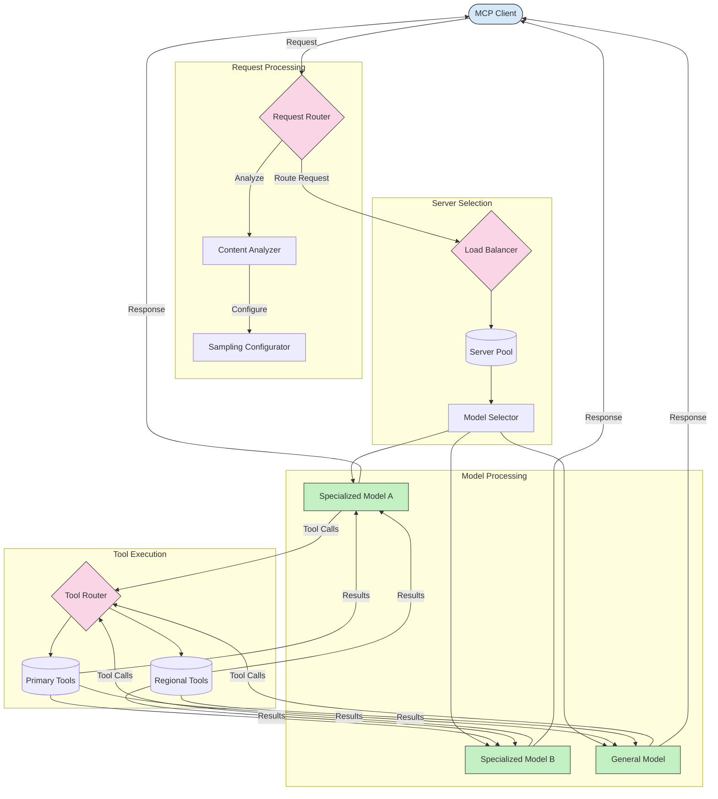

<!--
CO_OP_TRANSLATOR_METADATA:
{
  "original_hash": "2f1b473818b5a6cc9a9bbf777fffa6d4",
  "translation_date": "2025-07-14T21:47:23+00:00",
  "source_file": "05-AdvancedTopics/mcp-routing/README.md",
  "language_code": "pl"
}
-->
## Architektura próbkowania i routingu w MCP

Próbkowanie jest kluczowym elementem Model Context Protocol (MCP), który umożliwia efektywne przetwarzanie i kierowanie żądań. Polega na analizie nadchodzących żądań w celu określenia najbardziej odpowiedniego modelu lub usługi do ich obsługi, na podstawie różnych kryteriów, takich jak typ treści, kontekst użytkownika czy obciążenie systemu.

Próbkowanie i routing można połączyć, tworząc solidną architekturę, która optymalizuje wykorzystanie zasobów i zapewnia wysoką dostępność. Proces próbkowania może służyć do klasyfikacji żądań, podczas gdy routing kieruje je do odpowiednich modeli lub usług.

Poniższy diagram ilustruje, jak próbkowanie i routing współdziałają w kompleksowej architekturze MCP:

## Co dalej

- [5.6 Próbkowanie](../mcp-sampling/README.md)

**Zastrzeżenie**:  
Niniejszy dokument został przetłumaczony za pomocą usługi tłumaczenia AI [Co-op Translator](https://github.com/Azure/co-op-translator). Mimo że dążymy do jak największej dokładności, prosimy mieć na uwadze, że automatyczne tłumaczenia mogą zawierać błędy lub nieścisłości. Oryginalny dokument w języku źródłowym powinien być uznawany za źródło autorytatywne. W przypadku informacji o kluczowym znaczeniu zalecane jest skorzystanie z profesjonalnego tłumaczenia wykonanego przez człowieka. Nie ponosimy odpowiedzialności za jakiekolwiek nieporozumienia lub błędne interpretacje wynikające z korzystania z tego tłumaczenia.