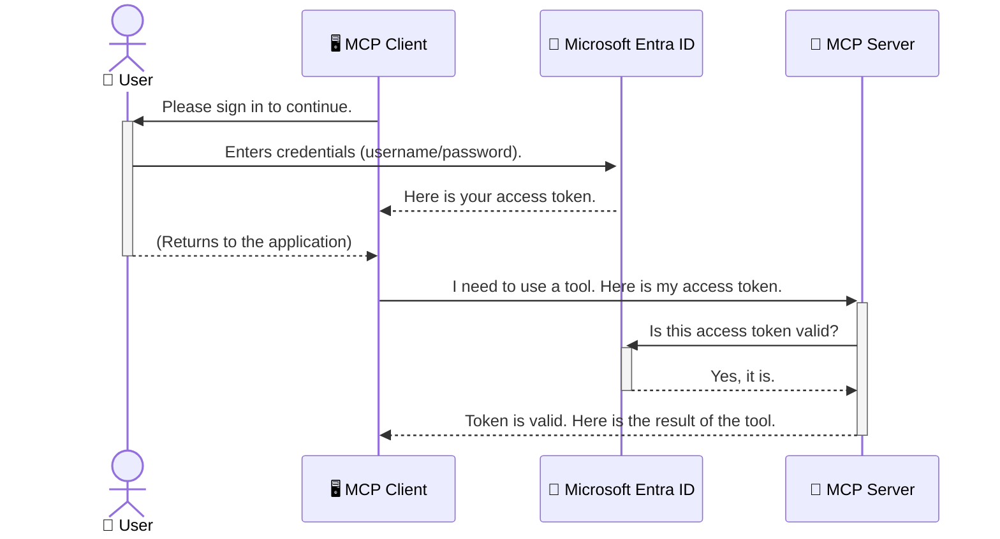

<!--
CO_OP_TRANSLATOR_METADATA:
{
  "original_hash": "0abf26a6c4dbe905d5d49ccdc0ccfe92",
  "translation_date": "2025-06-26T16:28:19+00:00",
  "source_file": "05-AdvancedTopics/mcp-security-entra/README.md",
  "language_code": "pl"
}
-->
# Zabezpieczanie przepływów pracy AI: Uwierzytelnianie Entra ID dla serwerów Model Context Protocol

## Wprowadzenie  
Zabezpieczenie serwera Model Context Protocol (MCP) jest tak samo ważne, jak zamknięcie drzwi wejściowych do domu. Pozostawienie serwera MCP otwartego naraża Twoje narzędzia i dane na nieautoryzowany dostęp, co może prowadzić do naruszeń bezpieczeństwa. Microsoft Entra ID oferuje solidne, oparte na chmurze rozwiązanie do zarządzania tożsamością i dostępem, które pomaga zapewnić, że tylko upoważnieni użytkownicy i aplikacje mogą komunikować się z Twoim serwerem MCP. W tej sekcji dowiesz się, jak chronić swoje przepływy pracy AI za pomocą uwierzytelniania Entra ID.

## Cele nauki  
Po zakończeniu tej sekcji będziesz potrafił:

- Zrozumieć, jak ważne jest zabezpieczenie serwerów MCP.  
- Wyjaśnić podstawy Microsoft Entra ID i uwierzytelniania OAuth 2.0.  
- Rozpoznać różnicę między klientami publicznymi a poufnymi.  
- Wdrożyć uwierzytelnianie Entra ID w scenariuszach lokalnych (klient publiczny) i zdalnych (klient poufny) serwerów MCP.  
- Stosować najlepsze praktyki bezpieczeństwa podczas tworzenia przepływów pracy AI.  

## Bezpieczeństwo a MCP  

Tak jak nie zostawiasz otwartych drzwi do domu, nie powinieneś też pozostawiać serwera MCP otwartego dla każdego. Zabezpieczenie przepływów pracy AI jest niezbędne do tworzenia solidnych, godnych zaufania i bezpiecznych aplikacji. Ten rozdział wprowadzi Cię w korzystanie z Microsoft Entra ID do zabezpieczenia serwerów MCP, zapewniając, że tylko upoważnieni użytkownicy i aplikacje będą mogły korzystać z Twoich narzędzi i danych.

## Dlaczego bezpieczeństwo jest ważne dla serwerów MCP  

Wyobraź sobie, że Twój serwer MCP ma narzędzie, które może wysyłać e-maile lub uzyskiwać dostęp do bazy danych klientów. Niezabezpieczony serwer oznacza, że każdy mógłby potencjalnie korzystać z tego narzędzia, co prowadziłoby do nieautoryzowanego dostępu do danych, spamu lub innych złośliwych działań.

Wdrażając uwierzytelnianie, zapewniasz, że każde żądanie do serwera jest weryfikowane, potwierdzając tożsamość użytkownika lub aplikacji wysyłającej żądanie. To pierwszy i najważniejszy krok w zabezpieczaniu przepływów pracy AI.

## Wprowadzenie do Microsoft Entra ID  

[**Microsoft Entra ID**](https://adoption.microsoft.com/microsoft-security/entra/) to usługa zarządzania tożsamością i dostępem działająca w chmurze. Można ją porównać do uniwersalnego strażnika bezpieczeństwa dla Twoich aplikacji. Zajmuje się skomplikowanym procesem weryfikacji tożsamości użytkowników (uwierzytelnianie) oraz określania, co im wolno robić (autoryzacja).

Korzystając z Entra ID, możesz:

- Umożliwić bezpieczne logowanie użytkowników.  
- Chronić API i usługi.  
- Zarządzać politykami dostępu z jednego centralnego miejsca.  

Dla serwerów MCP Entra ID zapewnia solidne i powszechnie zaufane rozwiązanie do zarządzania tym, kto może korzystać z funkcji Twojego serwera.

---

## Zrozumienie mechanizmu: Jak działa uwierzytelnianie Entra ID  

Entra ID wykorzystuje otwarte standardy, takie jak **OAuth 2.0**, do obsługi uwierzytelniania. Choć szczegóły mogą być skomplikowane, podstawowa idea jest prosta i można ją wyjaśnić za pomocą analogii.

### Łagodne wprowadzenie do OAuth 2.0: Klucz dozorcy  

Pomyśl o OAuth 2.0 jak o usłudze dozorcy dla Twojego samochodu. Gdy przyjeżdżasz do restauracji, nie dajesz dozorcy swojego głównego klucza. Zamiast tego przekazujesz **klucz dozorcy**, który ma ograniczone uprawnienia — może odpalić samochód i zamknąć drzwi, ale nie może otworzyć bagażnika ani schowka.

W tej analogii:

- **Ty** jesteś **Użytkownikiem**.  
- **Twój samochód** to **serwer MCP** z jego cennymi narzędziami i danymi.  
- **Dozorca** to **Microsoft Entra ID**.  
- **Parkingowy** to **klient MCP** (aplikacja próbująca uzyskać dostęp do serwera).  
- **Klucz dozorcy** to **token dostępu**.  

Token dostępu to bezpieczny ciąg znaków, który klient MCP otrzymuje od Entra ID po zalogowaniu się użytkownika. Klient następnie przesyła ten token do serwera MCP przy każdym żądaniu. Serwer może zweryfikować token, aby upewnić się, że żądanie jest autentyczne i że klient ma odpowiednie uprawnienia, wszystko to bez konieczności obsługi Twoich prawdziwych danych uwierzytelniających (np. hasła).

### Przebieg uwierzytelniania  

Oto jak ten proces działa w praktyce:



### Przedstawiamy Microsoft Authentication Library (MSAL)  

Zanim przejdziemy do kodu, warto poznać kluczowy komponent, który zobaczysz w przykładach: **Microsoft Authentication Library (MSAL)**.

MSAL to biblioteka stworzona przez Microsoft, która znacznie ułatwia programistom obsługę uwierzytelniania. Zamiast pisać skomplikowany kod do obsługi tokenów bezpieczeństwa, zarządzania logowaniami i odnawiania sesji, MSAL wykonuje tę pracę za Ciebie.

Korzystanie z biblioteki takiej jak MSAL jest bardzo polecane, ponieważ:

- **Jest bezpieczna:** Implementuje standardy branżowe i najlepsze praktyki bezpieczeństwa, zmniejszając ryzyko luk w Twoim kodzie.  
- **Ułatwia rozwój:** Ukrywa złożoność protokołów OAuth 2.0 i OpenID Connect, pozwalając na dodanie solidnego uwierzytelniania do aplikacji za pomocą kilku linijek kodu.  
- **Jest utrzymywana:** Microsoft aktywnie aktualizuje MSAL, aby reagować na nowe zagrożenia i zmiany platform.  

MSAL obsługuje wiele języków i frameworków, w tym .NET, JavaScript/TypeScript, Python, Java, Go oraz platformy mobilne, takie jak iOS i Android. Dzięki temu możesz stosować spójne wzorce uwierzytelniania w całym swoim stosie technologicznym.

Aby dowiedzieć się więcej o MSAL, możesz odwiedzić oficjalną [dokumentację przeglądową MSAL](https://learn.microsoft.com/entra/identity-platform/msal-overview).

---

## Zabezpieczanie serwera MCP za pomocą Entra ID: przewodnik krok po kroku  

Przejdźmy teraz przez proces zabezpieczenia lokalnego serwera MCP (komunikującego się przez `stdio`) using Entra ID. This example uses a **public client**, which is suitable for applications running on a user's machine, like a desktop app or a local development server.

### Scenario 1: Securing a Local MCP Server (with a Public Client)

In this scenario, we'll look at an MCP server that runs locally, communicates over `stdio`, and uses Entra ID to authenticate the user before allowing access to its tools. The server will have a single tool that fetches the user's profile information from the Microsoft Graph API.

#### 1. Setting Up the Application in Entra ID

Before writing any code, you need to register your application in Microsoft Entra ID. This tells Entra ID about your application and grants it permission to use the authentication service.

1. Navigate to the **[Microsoft Entra portal](https://entra.microsoft.com/)**.
2. Go to **App registrations** and click **New registration**.
3. Give your application a name (e.g., "My Local MCP Server").
4. For **Supported account types**, select **Accounts in this organizational directory only**.
5. You can leave the **Redirect URI** blank for this example.
6. Click **Register**.

Once registered, take note of the **Application (client) ID** and **Directory (tenant) ID**. You'll need these in your code.

#### 2. The Code: A Breakdown

Let's look at the key parts of the code that handle authentication. The full code for this example is available in the [Entra ID - Local - WAM](https://github.com/Azure-Samples/mcp-auth-servers/tree/main/src/entra-id-local-wam) folder of the [mcp-auth-servers GitHub repository](https://github.com/Azure-Samples/mcp-auth-servers).

**`AuthenticationService.cs`**

This class is responsible for handling the interaction with Entra ID.

- **`CreateAsync`**: This method initializes the `PublicClientApplication` from the MSAL (Microsoft Authentication Library). It's configured with your application's `clientId` and `tenantId`.
- **`WithBroker`**: This enables the use of a broker (like the Windows Web Account Manager), which provides a more secure and seamless single sign-on experience.
- **`AcquireTokenAsync`**: To podstawowa metoda. Najpierw próbuje uzyskać token w trybie cichym (co oznacza, że użytkownik nie musi się ponownie logować, jeśli ma ważną sesję). Jeśli nie uda się zdobyć tokenu w trybie cichym, użytkownik zostanie poproszony o interaktywne zalogowanie.  

```csharp
// Simplified for clarity
public static async Task<AuthenticationService> CreateAsync(ILogger<AuthenticationService> logger)
{
    var msalClient = PublicClientApplicationBuilder
        .Create(_clientId) // Your Application (client) ID
        .WithAuthority(AadAuthorityAudience.AzureAdMyOrg)
        .WithTenantId(_tenantId) // Your Directory (tenant) ID
        .WithBroker(new BrokerOptions(BrokerOptions.OperatingSystems.Windows))
        .Build();

    // ... cache registration ...

    return new AuthenticationService(logger, msalClient);
}

public async Task<string> AcquireTokenAsync()
{
    try
    {
        // Try silent authentication first
        var accounts = await _msalClient.GetAccountsAsync();
        var account = accounts.FirstOrDefault();

        AuthenticationResult? result = null;

        if (account != null)
        {
            result = await _msalClient.AcquireTokenSilent(_scopes, account).ExecuteAsync();
        }
        else
        {
            // If no account, or silent fails, go interactive
            result = await _msalClient.AcquireTokenInteractive(_scopes).ExecuteAsync();
        }

        return result.AccessToken;
    }
    catch (Exception ex)
    {
        _logger.LogError(ex, "An error occurred while acquiring the token.");
        throw; // Optionally rethrow the exception for higher-level handling
    }
}
```

**`Program.cs`**

This is where the MCP server is set up and the authentication service is integrated.

- **`AddSingleton<AuthenticationService>`**: This registers the `AuthenticationService` with the dependency injection container, so it can be used by other parts of the application (like our tool).
- **`GetUserDetailsFromGraph` tool**: This tool requires an instance of `AuthenticationService`. Before it does anything, it calls `authService.AcquireTokenAsync()` pobiera ważny token dostępu. Jeśli uwierzytelnianie powiedzie się, token jest używany do wywołania Microsoft Graph API i pobrania szczegółów użytkownika.

```csharp
// Simplified for clarity
[McpServerTool(Name = "GetUserDetailsFromGraph")]
public static async Task<string> GetUserDetailsFromGraph(
    AuthenticationService authService)
{
    try
    {
        // This will trigger the authentication flow
        var accessToken = await authService.AcquireTokenAsync();

        // Use the token to create a GraphServiceClient
        var graphClient = new GraphServiceClient(
            new BaseBearerTokenAuthenticationProvider(new TokenProvider(authService)));

        var user = await graphClient.Me.GetAsync();

        return System.Text.Json.JsonSerializer.Serialize(user);
    }
    catch (Exception ex)
    {
        return $"Error: {ex.Message}";
    }
}
```

#### 3. Jak to wszystko działa razem  

1. Gdy klient MCP próbuje użyć `GetUserDetailsFromGraph` tool, the tool first calls `AcquireTokenAsync`.
2. `AcquireTokenAsync` triggers the MSAL library to check for a valid token.
3. If no token is found, MSAL, through the broker, will prompt the user to sign in with their Entra ID account.
4. Once the user signs in, Entra ID issues an access token.
5. The tool receives the token and uses it to make a secure call to the Microsoft Graph API.
6. The user's details are returned to the MCP client.

This process ensures that only authenticated users can use the tool, effectively securing your local MCP server.

### Scenario 2: Securing a Remote MCP Server (with a Confidential Client)

When your MCP server is running on a remote machine (like a cloud server) and communicates over a protocol like HTTP Streaming, the security requirements are different. In this case, you should use a **confidential client** and the **Authorization Code Flow**. This is a more secure method because the application's secrets are never exposed to the browser.

This example uses a TypeScript-based MCP server that uses Express.js to handle HTTP requests.

#### 1. Setting Up the Application in Entra ID

The setup in Entra ID is similar to the public client, but with one key difference: you need to create a **client secret**.

1. Navigate to the **[Microsoft Entra portal](https://entra.microsoft.com/)**.
2. In your app registration, go to the **Certificates & secrets** tab.
3. Click **New client secret**, give it a description, and click **Add**.
4. **Important:** Copy the secret value immediately. You will not be able to see it again.
5. You also need to configure a **Redirect URI**. Go to the **Authentication** tab, click **Add a platform**, select **Web**, and enter the redirect URI for your application (e.g., `http://localhost:3001/auth/callback`).

> **⚠️ Important Security Note:** For production applications, Microsoft strongly recommends using **secretless authentication** methods such as **Managed Identity** or **Workload Identity Federation** instead of client secrets. Client secrets pose security risks as they can be exposed or compromised. Managed identities provide a more secure approach by eliminating the need to store credentials in your code or configuration.
>
> For more information about managed identities and how to implement them, see the [Managed identities for Azure resources overview](https://learn.microsoft.com/entra/identity/managed-identities-azure-resources/overview).

#### 2. The Code: A Breakdown

This example uses a session-based approach. When the user authenticates, the server stores the access token and refresh token in a session and gives the user a session token. This session token is then used for subsequent requests. The full code for this example is available in the [Entra ID - Confidential client](https://github.com/Azure-Samples/mcp-auth-servers/tree/main/src/entra-id-cca-session) folder of the [mcp-auth-servers GitHub repository](https://github.com/Azure-Samples/mcp-auth-servers).

**`Server.ts`**

This file sets up the Express server and the MCP transport layer.

- **`requireBearerAuth`**: This is middleware that protects the `/sse` and `/message` endpoints. It checks for a valid bearer token in the `Authorization` header of the request.
- **`EntraIdServerAuthProvider`**: This is a custom class that implements the `McpServerAuthorizationProvider` interface. It's responsible for handling the OAuth 2.0 flow.
- **`/auth/callback`**: Ten endpoint obsługuje przekierowanie z Entra ID po uwierzytelnieniu użytkownika. Wymienia kod autoryzacyjny na token dostępu i token odświeżania.

```typescript
// Simplified for clarity
const app = express();
const { server } = createServer();
const provider = new EntraIdServerAuthProvider();

// Protect the SSE endpoint
app.get("/sse", requireBearerAuth({
  provider,
  requiredScopes: ["User.Read"]
}), async (req, res) => {
  // ... connect to the transport ...
});

// Protect the message endpoint
app.post("/message", requireBearerAuth({
  provider,
  requiredScopes: ["User.Read"]
}), async (req, res) => {
  // ... handle the message ...
});

// Handle the OAuth 2.0 callback
app.get("/auth/callback", (req, res) => {
  provider.handleCallback(req.query.code, req.query.state)
    .then(result => {
      // ... handle success or failure ...
    });
});
```

**`Tools.ts`**

This file defines the tools that the MCP server provides. The `getUserDetails` narzędzie jest podobne do poprzedniego przykładu, ale pobiera token dostępu z sesji.

```typescript
// Simplified for clarity
server.setRequestHandler(CallToolRequestSchema, async (request) => {
  const { name } = request.params;
  const context = request.params?.context as { token?: string } | undefined;
  const sessionToken = context?.token;

  if (name === ToolName.GET_USER_DETAILS) {
    if (!sessionToken) {
      throw new AuthenticationError("Authentication token is missing or invalid. Ensure the token is provided in the request context.");
    }

    // Get the Entra ID token from the session store
    const tokenData = tokenStore.getToken(sessionToken);
    const entraIdToken = tokenData.accessToken;

    const graphClient = Client.init({
      authProvider: (done) => {
        done(null, entraIdToken);
      }
    });

    const user = await graphClient.api('/me').get();

    // ... return user details ...
  }
});
```

**`auth/EntraIdServerAuthProvider.ts`**

This class handles the logic for:

- Redirecting the user to the Entra ID sign-in page.
- Exchanging the authorization code for an access token.
- Storing the tokens in the `tokenStore`.
- Refreshing the access token when it expires.

#### 3. How It All Works Together

1. When a user first tries to connect to the MCP server, the `requireBearerAuth` middleware will see that they don't have a valid session and will redirect them to the Entra ID sign-in page.
2. The user signs in with their Entra ID account.
3. Entra ID redirects the user back to the `/auth/callback` endpoint with an authorization code.
4. The server exchanges the code for an access token and a refresh token, stores them, and creates a session token which is sent to the client.
5. The client can now use this session token in the `Authorization` header for all future requests to the MCP server.
6. When the `getUserDetails` narzędzie, gdy jest wywoływane, używa tokenu sesji do znalezienia tokenu dostępu Entra ID, a następnie używa go do wywołania Microsoft Graph API.

Ten przepływ jest bardziej złożony niż w przypadku klienta publicznego, ale jest wymagany dla punktów końcowych dostępnych z internetu. Ponieważ zdalne serwery MCP są dostępne publicznie, potrzebują silniejszych zabezpieczeń, aby chronić się przed nieautoryzowanym dostępem i potencjalnymi atakami.

## Najlepsze praktyki bezpieczeństwa  

- **Zawsze używaj HTTPS**: Szyfruj komunikację między klientem a serwerem, aby chronić tokeny przed przechwyceniem.  
- **Wdrażaj kontrolę dostępu opartą na rolach (RBAC)**: Nie wystarczy sprawdzić, *czy* użytkownik jest uwierzytelniony; sprawdź, *co* ma prawo robić. Możesz definiować role w Entra ID i sprawdzać je na serwerze MCP.  
- **Monitoruj i audytuj**: Rejestruj wszystkie zdarzenia uwierzytelniania, aby wykrywać i reagować na podejrzane działania.  
- **Obsługuj ograniczenia i limitowanie zapytań**: Microsoft Graph i inne API stosują limitowanie, aby zapobiegać nadużyciom. Wprowadź mechanizmy wykładniczego opóźnienia i ponawiania prób w serwerze MCP, aby łagodnie obsługiwać odpowiedzi HTTP 429 (Too Many Requests). Rozważ buforowanie często używanych danych, aby zmniejszyć liczbę wywołań API.  
- **Bezpieczne przechowywanie tokenów**: Przechowuj tokeny dostępu i odświeżania w bezpieczny sposób. W aplikacjach lokalnych korzystaj z mechanizmów bezpiecznego przechowywania systemu. W aplikacjach serwerowych rozważ użycie szyfrowanego magazynu lub usług zarządzania kluczami, takich jak Azure Key Vault.  
- **Obsługa wygaśnięcia tokenów**: Tokeny dostępu mają ograniczony czas ważności. Wdrażaj automatyczne odnawianie tokenów za pomocą tokenów odświeżania, aby zapewnić płynne doświadczenie użytkownika bez konieczności ponownego logowania.  
- **Rozważ użycie Azure API Management**: Chociaż wdrażanie zabezpieczeń bezpośrednio na serwerze MCP daje precyzyjną kontrolę, bramki API takie jak Azure API Management mogą automatycznie obsługiwać wiele aspektów bezpieczeństwa, w tym uwierzytelnianie, autoryzację, limitowanie i monitorowanie. Zapewniają one scentralizowaną warstwę bezpieczeństwa między klientami a serwerami MCP. Więcej informacji o korzystaniu z bramek API z MCP znajdziesz w naszym artykule [Azure API Management Your Auth Gateway For MCP Servers](https://techcommunity.microsoft.com/blog/integrationsonazureblog/azure-api-management-your-auth-gateway-for-mcp-servers/4402690).

## Kluczowe wnioski  

- Zabezpieczenie serwera MCP jest kluczowe dla ochrony Twoich danych i narzędzi.  
- Microsoft Entra ID oferuje solidne i skalowalne rozwiązanie do uwierzytelniania i autoryzacji.  
- Używaj **klienta publicznego** dla aplikacji lokalnych i **klienta poufnego** dla serwerów zdalnych.  
- **Authorization Code Flow** to najbezpieczniejsza opcja dla aplikacji webowych.  

## Ćwiczenie  

1. Zastanów się nad serwerem MCP, który mógłbyś stworzyć. Czy byłby to serwer lokalny, czy zdalny?  
2. Na podstawie swojej odpowiedzi, czy użyłbyś klienta publicznego czy poufnego?  
3. Jakie uprawnienia Twojego serwera MCP byłyby potrzebne do działania z Microsoft Graph?  

## Ćwiczenia praktyczne  

### Ćwiczenie 1: Zarejestruj aplikację w Entra ID  
Przejdź do portalu Microsoft Entra.  
Zarejestruj nową aplikację dla swojego serwera MCP.  
Zapisz identyfikator aplikacji (client ID) i identyfikator katalogu (tenant ID).  

### Ćwiczenie 2: Zabezpiecz lokalny serwer MCP (klient publiczny)  
- Postępuj zgodnie z przykładem kodu, aby zintegrować MSAL (Microsoft Authentication Library) do uwierzytelniania użytkowników.  
- Przetestuj przepływ uwierzytelniania, wywołując narzędzie MCP pobierające dane użytkownika z Microsoft Graph.  

### Ćwiczenie 3: Zabezpiecz zdalny serwer MCP (klient poufny)  
- Zarejestruj klienta poufnego w Entra ID i utwórz sekret klienta.  
- Skonfiguruj swój serwer Express.js MCP do używania Authorization Code Flow.  
- Przetestuj chronione endpointy i potwierdź dostęp na podstawie tokenów.  

### Ćwiczenie 4: Zastosuj najlepsze praktyki bezpieczeństwa  
- Włącz HTTPS dla lokalnego lub zdalnego serwera.  
- Wdróż kontrolę dostępu opartą na rolach (RBAC) w logice serwera.  
- Dodaj obsługę wygaśnięcia tokenów i bezpieczne przechowywanie tokenów.  

## Zasoby  

1. **Dokumentacja przeglądowa MSAL**  
   Dowiedz się, jak Microsoft Authentication Library (MSAL) umożliwia bezpieczne pozyskiwanie tokenów na różnych platformach:  
   [MSAL Overview on Microsoft Learn](https://learn.microsoft.com/en-gb/entra/msal/overview)  

2. **Repozytorium GitHub Azure-Samples/mcp-auth-servers**  
   Przykładowe implementacje serwerów MCP demonstrujące przepływy uwierzytelniania:  
   [Azure-Samples/mcp-auth-servers na GitHub](https://github.com/Azure-Samples/mcp-auth-servers)  

3. **Przegląd Managed Identities dla zasobów Azure**  
   Dowiedz się, jak wyeliminować sekrety, korzystając z zarządzanych tożsamości przypisanych do systemu lub użytkownika:  
   [Managed Identities Overview on Microsoft Learn](https://learn.microsoft.com/en-us/entra/identity/managed-identities-azure-resources/)  

4. **Azure API Management: Twoja brama uwierzytelniania dla serwerów MCP**  
   Szczegółowy opis użycia APIM jako bezpiecznej bramy OAuth2 dla serwerów MCP:  
   [Azure API Management Your Auth Gateway For MCP Servers](https://techcommunity.microsoft.com/blog/integrationsonazureblog/azure-api-management-your-auth-gateway-for-mcp-servers/4402690)  

5. **Referencja uprawnień Microsoft Graph**  
   Kompleksowa lista uprawnień delegowanych i aplikacyjnych dla Microsoft Graph:  
   [Microsoft Graph Permissions Reference](https://learn.microsoft.com/zh-tw/graph/permissions-reference)  

## Efekty nauki  
Po ukończeniu tej sekcji będziesz potrafił:

- Wyjaśnić, dlaczego uwierzytelnianie jest kluczowe dla serwerów MCP i przepływów pracy AI.  
- Skonfigurować i wdrożyć uwierzytelnianie Entra ID zarówno dla lokalnych, jak i zdalnych serwerów MCP.  
- Wybrać odpowiedni typ klienta (publiczny lub poufny) w zależności od środowiska serwera.  
- Stosować bezpieczne prakty

**Zastrzeżenie**:  
Niniejszy dokument został przetłumaczony za pomocą usługi tłumaczenia AI [Co-op Translator](https://github.com/Azure/co-op-translator). Mimo że dążymy do jak największej dokładności, prosimy mieć na uwadze, że automatyczne tłumaczenia mogą zawierać błędy lub nieścisłości. Oryginalny dokument w języku źródłowym należy uważać za źródło wiarygodne. W przypadku informacji o kluczowym znaczeniu zaleca się skorzystanie z profesjonalnego tłumaczenia wykonanego przez człowieka. Nie ponosimy odpowiedzialności za jakiekolwiek nieporozumienia lub błędne interpretacje wynikające z korzystania z tego tłumaczenia.