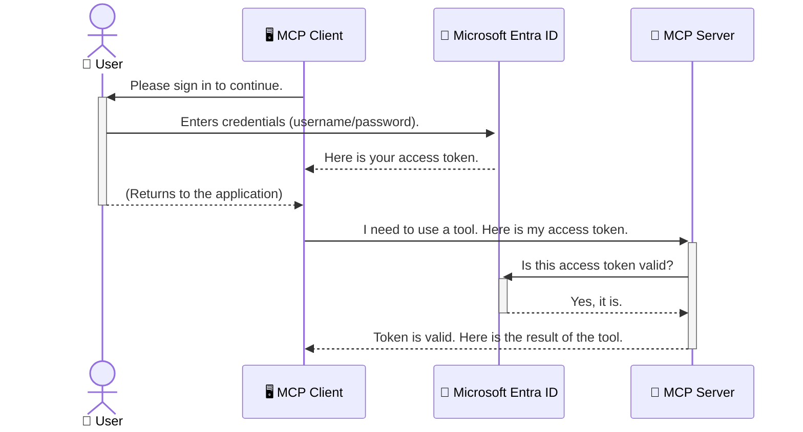

<!--
CO_OP_TRANSLATOR_METADATA:
{
  "original_hash": "6e562d7e5a77c8982da4aa8f762ad1d8",
  "translation_date": "2025-07-14T03:01:53+00:00",
  "source_file": "05-AdvancedTopics/mcp-security-entra/README.md",
  "language_code": "pl"
}
-->
# Zabezpieczanie przepływów pracy AI: Uwierzytelnianie Entra ID dla serwerów Model Context Protocol

## Wprowadzenie
Zabezpieczenie serwera Model Context Protocol (MCP) jest równie ważne, jak zamknięcie drzwi wejściowych do domu. Pozostawienie serwera MCP otwartego naraża Twoje narzędzia i dane na nieautoryzowany dostęp, co może prowadzić do naruszeń bezpieczeństwa. Microsoft Entra ID oferuje solidne, oparte na chmurze rozwiązanie do zarządzania tożsamością i dostępem, które pomaga zapewnić, że tylko uprawnieni użytkownicy i aplikacje mogą komunikować się z Twoim serwerem MCP. W tej sekcji dowiesz się, jak chronić swoje przepływy pracy AI za pomocą uwierzytelniania Entra ID.

## Cele nauki
Po zakończeniu tej sekcji będziesz potrafił:

- Zrozumieć znaczenie zabezpieczania serwerów MCP.
- Wyjaśnić podstawy Microsoft Entra ID i uwierzytelniania OAuth 2.0.
- Rozróżnić klientów publicznych i poufnych.
- Wdrożyć uwierzytelnianie Entra ID zarówno w lokalnych (klient publiczny), jak i zdalnych (klient poufny) scenariuszach serwera MCP.
- Stosować najlepsze praktyki bezpieczeństwa podczas tworzenia przepływów pracy AI.

## Bezpieczeństwo i MCP

Tak jak nie zostawiłbyś otwartych drzwi do swojego domu, tak nie powinieneś pozostawiać serwera MCP otwartego dla każdego. Zabezpieczenie przepływów pracy AI jest kluczowe dla tworzenia solidnych, godnych zaufania i bezpiecznych aplikacji. Ten rozdział wprowadzi Cię w korzystanie z Microsoft Entra ID do zabezpieczania serwerów MCP, zapewniając, że tylko uprawnieni użytkownicy i aplikacje będą miały dostęp do Twoich narzędzi i danych.

## Dlaczego bezpieczeństwo jest ważne dla serwerów MCP

Wyobraź sobie, że Twój serwer MCP ma narzędzie, które może wysyłać e-maile lub uzyskiwać dostęp do bazy danych klientów. Niezabezpieczony serwer oznacza, że każdy mógłby potencjalnie korzystać z tego narzędzia, co prowadzi do nieautoryzowanego dostępu do danych, spamu lub innych złośliwych działań.

Dzięki wdrożeniu uwierzytelniania zapewniasz, że każde żądanie do serwera jest weryfikowane, potwierdzając tożsamość użytkownika lub aplikacji wysyłającej żądanie. To pierwszy i najważniejszy krok w zabezpieczaniu przepływów pracy AI.

## Wprowadzenie do Microsoft Entra ID

[**Microsoft Entra ID**](https://adoption.microsoft.com/microsoft-security/entra/) to usługa zarządzania tożsamością i dostępem oparta na chmurze. Można ją porównać do uniwersalnego strażnika bezpieczeństwa dla Twoich aplikacji. Obsługuje skomplikowany proces weryfikacji tożsamości użytkowników (uwierzytelnianie) oraz określania, co mogą robić (autoryzacja).

Korzystając z Entra ID, możesz:

- Umożliwić bezpieczne logowanie użytkowników.
- Chronić API i usługi.
- Zarządzać politykami dostępu z jednego miejsca.

Dla serwerów MCP Entra ID oferuje solidne i powszechnie zaufane rozwiązanie do zarządzania tym, kto może korzystać z funkcji Twojego serwera.

---

## Zrozumienie mechanizmu: Jak działa uwierzytelnianie Entra ID

Entra ID korzysta z otwartych standardów, takich jak **OAuth 2.0**, do obsługi uwierzytelniania. Choć szczegóły mogą być skomplikowane, podstawowa idea jest prosta i można ją zrozumieć na podstawie analogii.

### Łagodne wprowadzenie do OAuth 2.0: Klucz do samochodu dla parkingowego

Pomyśl o OAuth 2.0 jak o usłudze parkingowego do Twojego samochodu. Kiedy przyjeżdżasz do restauracji, nie dajesz parkingowemu swojego głównego klucza. Zamiast tego przekazujesz **klucz parkingowego**, który ma ograniczone uprawnienia — może uruchomić samochód i zamknąć drzwi, ale nie może otworzyć bagażnika ani schowka.

W tej analogii:

- **Ty** jesteś **Użytkownikiem**.
- **Twój samochód** to **serwer MCP** z jego cennymi narzędziami i danymi.
- **Parkingowy** to **Microsoft Entra ID**.
- **Osoba przyjmująca samochód** to **klient MCP** (aplikacja próbująca uzyskać dostęp do serwera).
- **Klucz parkingowego** to **token dostępu**.

Token dostępu to bezpieczny ciąg znaków, który klient MCP otrzymuje od Entra ID po zalogowaniu się użytkownika. Klient następnie przekazuje ten token serwerowi MCP przy każdym żądaniu. Serwer może zweryfikować token, aby upewnić się, że żądanie jest autentyczne i że klient ma odpowiednie uprawnienia, wszystko to bez konieczności obsługi Twoich rzeczywistych danych uwierzytelniających (np. hasła).

### Przebieg uwierzytelniania

Oto jak ten proces działa w praktyce:



### Wprowadzenie do Microsoft Authentication Library (MSAL)

Zanim przejdziemy do kodu, warto przedstawić kluczowy element, który zobaczysz w przykładach: **Microsoft Authentication Library (MSAL)**.

MSAL to biblioteka stworzona przez Microsoft, która znacznie ułatwia programistom obsługę uwierzytelniania. Zamiast pisać skomplikowany kod do obsługi tokenów bezpieczeństwa, zarządzania logowaniami i odświeżania sesji, MSAL wykonuje tę ciężką pracę za Ciebie.

Korzystanie z biblioteki takiej jak MSAL jest bardzo zalecane, ponieważ:

- **Jest bezpieczna:** Implementuje standardy branżowe i najlepsze praktyki bezpieczeństwa, zmniejszając ryzyko luk w Twoim kodzie.
- **Ułatwia rozwój:** Ukrywa złożoność protokołów OAuth 2.0 i OpenID Connect, pozwalając dodać solidne uwierzytelnianie do aplikacji za pomocą kilku linijek kodu.
- **Jest utrzymywana:** Microsoft aktywnie aktualizuje MSAL, aby reagować na nowe zagrożenia bezpieczeństwa i zmiany platform.

MSAL obsługuje wiele języków i frameworków aplikacji, w tym .NET, JavaScript/TypeScript, Python, Java, Go oraz platformy mobilne jak iOS i Android. Oznacza to, że możesz stosować spójne wzorce uwierzytelniania w całym swoim stosie technologicznym.

Aby dowiedzieć się więcej o MSAL, możesz zajrzeć do oficjalnej [dokumentacji przeglądowej MSAL](https://learn.microsoft.com/entra/identity-platform/msal-overview).

---

## Zabezpieczanie serwera MCP za pomocą Entra ID: przewodnik krok po kroku

Przejdźmy teraz przez proces zabezpieczania lokalnego serwera MCP (komunikującego się przez `stdio`) za pomocą Entra ID. Ten przykład wykorzystuje **klienta publicznego**, który jest odpowiedni dla aplikacji działających na komputerze użytkownika, takich jak aplikacja desktopowa lub lokalny serwer deweloperski.

### Scenariusz 1: Zabezpieczanie lokalnego serwera MCP (z klientem publicznym)

W tym scenariuszu przyjrzymy się serwerowi MCP działającemu lokalnie, komunikującemu się przez `stdio`, który używa Entra ID do uwierzytelniania użytkownika przed udostępnieniem narzędzi. Serwer będzie miał jedno narzędzie, które pobiera informacje o profilu użytkownika z Microsoft Graph API.

#### 1. Konfiguracja aplikacji w Entra ID

Zanim zaczniesz pisać kod, musisz zarejestrować swoją aplikację w Microsoft Entra ID. Dzięki temu Entra ID będzie wiedziało o Twojej aplikacji i przyzna jej uprawnienia do korzystania z usługi uwierzytelniania.

1. Przejdź do **[portalu Microsoft Entra](https://entra.microsoft.com/)**.
2. Wejdź w **App registrations** i kliknij **New registration**.
3. Nadaj aplikacji nazwę (np. "My Local MCP Server").
4. W sekcji **Supported account types** wybierz **Accounts in this organizational directory only**.
5. Możesz pozostawić pole **Redirect URI** puste dla tego przykładu.
6. Kliknij **Register**.

Po rejestracji zanotuj **Application (client) ID** oraz **Directory (tenant) ID**. Będziesz ich potrzebować w kodzie.

#### 2. Kod: omówienie

Przyjrzyjmy się kluczowym fragmentom kodu odpowiedzialnym za uwierzytelnianie. Pełny kod tego przykładu jest dostępny w folderze [Entra ID - Local - WAM](https://github.com/Azure-Samples/mcp-auth-servers/tree/main/src/entra-id-local-wam) w repozytorium [mcp-auth-servers na GitHub](https://github.com/Azure-Samples/mcp-auth-servers).

**`AuthenticationService.cs`**

Ta klasa odpowiada za interakcję z Entra ID.

- **`CreateAsync`**: Metoda inicjalizuje `PublicClientApplication` z MSAL. Jest skonfigurowana z `clientId` i `tenantId` Twojej aplikacji.
- **`WithBroker`**: Umożliwia korzystanie z brokera (np. Windows Web Account Manager), co zapewnia bezpieczniejsze i płynniejsze logowanie jednokrotne.
- **`AcquireTokenAsync`**: To kluczowa metoda. Najpierw próbuje pobrać token w trybie cichym (użytkownik nie musi się ponownie logować, jeśli ma ważną sesję). Jeśli to się nie uda, wywołuje interaktywne logowanie użytkownika.

```csharp
// Simplified for clarity
public static async Task<AuthenticationService> CreateAsync(ILogger<AuthenticationService> logger)
{
    var msalClient = PublicClientApplicationBuilder
        .Create(_clientId) // Your Application (client) ID
        .WithAuthority(AadAuthorityAudience.AzureAdMyOrg)
        .WithTenantId(_tenantId) // Your Directory (tenant) ID
        .WithBroker(new BrokerOptions(BrokerOptions.OperatingSystems.Windows))
        .Build();

    // ... cache registration ...

    return new AuthenticationService(logger, msalClient);
}

public async Task<string> AcquireTokenAsync()
{
    try
    {
        // Try silent authentication first
        var accounts = await _msalClient.GetAccountsAsync();
        var account = accounts.FirstOrDefault();

        AuthenticationResult? result = null;

        if (account != null)
        {
            result = await _msalClient.AcquireTokenSilent(_scopes, account).ExecuteAsync();
        }
        else
        {
            // If no account, or silent fails, go interactive
            result = await _msalClient.AcquireTokenInteractive(_scopes).ExecuteAsync();
        }

        return result.AccessToken;
    }
    catch (Exception ex)
    {
        _logger.LogError(ex, "An error occurred while acquiring the token.");
        throw; // Optionally rethrow the exception for higher-level handling
    }
}
```

**`Program.cs`**

Tutaj konfigurowany jest serwer MCP i integrowana jest usługa uwierzytelniania.

- **`AddSingleton<AuthenticationService>`**: Rejestruje `AuthenticationService` w kontenerze dependency injection, aby mogły z niej korzystać inne części aplikacji (np. nasze narzędzie).
- Narzędzie **`GetUserDetailsFromGraph`** wymaga instancji `AuthenticationService`. Przed wykonaniem czegokolwiek wywołuje `authService.AcquireTokenAsync()`, aby uzyskać ważny token dostępu. Jeśli uwierzytelnianie się powiedzie, używa tokenu do wywołania Microsoft Graph API i pobrania danych użytkownika.

```csharp
// Simplified for clarity
[McpServerTool(Name = "GetUserDetailsFromGraph")]
public static async Task<string> GetUserDetailsFromGraph(
    AuthenticationService authService)
{
    try
    {
        // This will trigger the authentication flow
        var accessToken = await authService.AcquireTokenAsync();

        // Use the token to create a GraphServiceClient
        var graphClient = new GraphServiceClient(
            new BaseBearerTokenAuthenticationProvider(new TokenProvider(authService)));

        var user = await graphClient.Me.GetAsync();

        return System.Text.Json.JsonSerializer.Serialize(user);
    }
    catch (Exception ex)
    {
        return $"Error: {ex.Message}";
    }
}
```

#### 3. Jak to wszystko działa razem

1. Gdy klient MCP próbuje użyć narzędzia `GetUserDetailsFromGraph`, narzędzie najpierw wywołuje `AcquireTokenAsync`.
2. `AcquireTokenAsync` uruchamia bibliotekę MSAL, która sprawdza, czy jest ważny token.
3. Jeśli tokenu nie ma, MSAL za pośrednictwem brokera wyświetla użytkownikowi monit o zalogowanie się na konto Entra ID.
4. Po zalogowaniu Entra ID wydaje token dostępu.
5. Narzędzie otrzymuje token i używa go do bezpiecznego wywołania Microsoft Graph API.
6. Dane użytkownika są zwracane do klienta MCP.

Ten proces zapewnia, że tylko uwierzytelnieni użytkownicy mogą korzystać z narzędzia, skutecznie zabezpieczając lokalny serwer MCP.

### Scenariusz 2: Zabezpieczanie zdalnego serwera MCP (z klientem poufnym)

Gdy Twój serwer MCP działa na zdalnej maszynie (np. w chmurze) i komunikuje się przez protokół taki jak HTTP Streaming, wymagania bezpieczeństwa są inne. W takim przypadku powinieneś użyć **klienta poufnego** oraz **Authorization Code Flow**. To bezpieczniejsza metoda, ponieważ tajemnice aplikacji nigdy nie są ujawniane w przeglądarce.

Ten przykład wykorzystuje serwer MCP oparty na TypeScript, który używa Express.js do obsługi żądań HTTP.

#### 1. Konfiguracja aplikacji w Entra ID

Konfiguracja w Entra ID jest podobna do klienta publicznego, ale z jedną kluczową różnicą: musisz utworzyć **sekret klienta**.

1. Przejdź do **[portalu Microsoft Entra](https://entra.microsoft.com/)**.
2. W rejestracji aplikacji przejdź do zakładki **Certificates & secrets**.
3. Kliknij **New client secret**, nadaj mu opis i kliknij **Add**.
4. **Ważne:** Natychmiast skopiuj wartość sekretu. Nie będziesz mógł jej zobaczyć ponownie.
5. Musisz także skonfigurować **Redirect URI**. Przejdź do zakładki **Authentication**, kliknij **Add a platform**, wybierz **Web** i wpisz URI przekierowania dla swojej aplikacji (np. `http://localhost:3001/auth/callback`).

> **⚠️ Ważna uwaga dotycząca bezpieczeństwa:** W aplikacjach produkcyjnych Microsoft zdecydowanie zaleca stosowanie metod uwierzytelniania bezsekretowego, takich jak **Managed Identity** lub **Workload Identity Federation**, zamiast sekretów klienta. Sekrety klienta niosą ryzyko bezpieczeństwa, ponieważ mogą zostać ujawnione lub skompromitowane. Tożsamości zarządzane oferują bezpieczniejsze podejście, eliminując potrzebę przechowywania poświadczeń w kodzie lub konfiguracji.
>
> Więcej informacji o tożsamościach zarządzanych i ich implementacji znajdziesz w [Managed identities for Azure resources overview](https://learn.microsoft.com/entra/identity/managed-identities-azure-resources/overview).

#### 2. Kod: omówienie

Ten przykład wykorzystuje podejście oparte na sesjach. Po uwierzytelnieniu użytkownika serwer przechowuje token dostępu i token odświeżania w sesji oraz przekazuje użytkownikowi token sesji. Ten token sesji jest następnie używany przy kolejnych żądaniach. Pełny kod tego przykładu jest dostępny w folderze [Entra ID - Confidential client](https://github.com/Azure-Samples/mcp-auth-servers/tree/main/src/entra-id-cca-session) w repozytorium [mcp-auth-servers na GitHub](https://github.com/Azure-Samples/mcp-auth-servers).

**`Server.ts`**

Ten plik konfiguruje serwer Express oraz warstwę transportową MCP.

- **`requireBearerAuth`**: To middleware chroniące endpointy `/sse` i `/message`. Sprawdza, czy w nagłówku `Authorization` znajduje się ważny token typu bearer.
- **`EntraIdServerAuthProvider`**: To niestandardowa klasa implementująca interfejs `McpServerAuthorizationProvider`. Odpowiada za obsługę przepływu OAuth 2.0.
- **`/auth/callback`**: Ten endpoint obsługuje przekierowanie z Entra ID po uwierzytelnieniu użytkownika. Wymienia kod autoryzacyjny na token dostępu i token odświeżania.

```typescript
// Simplified for clarity
const app = express();
const { server } = createServer();
const provider = new EntraIdServerAuthProvider();

// Protect the SSE endpoint
app.get("/sse", requireBearerAuth({
  provider,
  requiredScopes: ["User.Read"]
}), async (req, res) => {
  // ... connect to the transport ...
});

// Protect the message endpoint
app.post("/message", requireBearerAuth({
  provider,
  requiredScopes: ["User.Read"]
}), async (req, res) => {
  // ... handle the message ...
});

// Handle the OAuth 2.0 callback
app.get("/auth/callback", (req, res) => {
  provider.handleCallback(req.query.code, req.query.state)
    .then(result => {
      // ... handle success or failure ...
    });
});
```

**`Tools.ts`**

Ten plik definiuje narzędzia udostępniane przez serwer MCP. Narzędzie `getUserDetails` jest podobne do tego z poprzedniego przykładu, ale pobiera token dostępu z sesji.

```typescript
// Simplified for clarity
server.setRequestHandler(CallToolRequestSchema, async (request) => {
  const { name } = request.params;
  const context = request.params?.context as { token?: string } | undefined;
  const sessionToken = context?.token;

  if (name === ToolName.GET_USER_DETAILS) {
    if (!sessionToken) {
      throw new AuthenticationError("Authentication token is missing or invalid. Ensure the token is provided in the request context.");
    }

    // Get the Entra ID token from the session store
    const tokenData = tokenStore.getToken(sessionToken);
    const entraIdToken = tokenData.accessToken;

    const graphClient = Client.init({
      authProvider: (done) => {
        done(null, entraIdToken);
      }
    });

    const user = await graphClient.api('/me').get();

    // ... return user details ...
  }
});
```

**`auth/EntraIdServerAuthProvider.ts`**

Ta klasa obsługuje logikę:

- Przekierowywania użytkownika na stronę logowania Entra ID.
- Wymiany kodu autoryzacyjnego na token dostępu.
- Przechowywania tokenów w `tokenStore`.
- Odświeżania tokenu dostępu po wygaśnięciu.

#### 3. Jak to wszystko działa razem

1. Gdy użytkownik próbuje połączyć się z serwerem MCP, middleware `requireBearerAuth` wykrywa brak ważnej sesji i przekierowuje go na stronę logowania Entra ID.
2. Użytkownik loguje się na swoje konto Entra ID.
3. Entra ID przekierowuje użytkownika z powrotem na endpoint `/auth/callback` z kodem autoryzacyjnym.
4. Serwer wymienia kod na token dostępu i token odświeżania, przechowuje je oraz tworzy token sesji, który jest wysyłany do klienta.  
5. Klient może teraz używać tego tokena sesji w nagłówku `Authorization` dla wszystkich przyszłych żądań do serwera MCP.  
6. Gdy wywoływane jest narzędzie `getUserDetails`, używa ono tokena sesji do wyszukania tokena dostępu Entra ID, a następnie wykorzystuje go do wywołania Microsoft Graph API.

Ten proces jest bardziej złożony niż przepływ klienta publicznego, ale jest wymagany dla punktów końcowych dostępnych z internetu. Ponieważ zdalne serwery MCP są dostępne przez publiczny internet, potrzebują silniejszych środków bezpieczeństwa, aby chronić się przed nieautoryzowanym dostępem i potencjalnymi atakami.


## Najlepsze praktyki bezpieczeństwa

- **Zawsze używaj HTTPS**: Szyfruj komunikację między klientem a serwerem, aby chronić tokeny przed przechwyceniem.  
- **Wdrażaj kontrolę dostępu opartą na rolach (RBAC)**: Nie sprawdzaj tylko, *czy* użytkownik jest uwierzytelniony, ale także *co* jest uprawniony robić. Możesz definiować role w Entra ID i sprawdzać je na serwerze MCP.  
- **Monitoruj i audytuj**: Rejestruj wszystkie zdarzenia uwierzytelniania, aby wykrywać i reagować na podejrzane działania.  
- **Obsługuj ograniczenia i throttling**: Microsoft Graph i inne API stosują ograniczenia liczby żądań, aby zapobiegać nadużyciom. Wprowadź w serwerze MCP logikę wykładniczego opóźnienia i ponawiania prób, aby łagodnie obsługiwać odpowiedzi HTTP 429 (Too Many Requests). Rozważ buforowanie często pobieranych danych, aby zmniejszyć liczbę wywołań API.  
- **Bezpieczne przechowywanie tokenów**: Przechowuj tokeny dostępu i odświeżania w bezpieczny sposób. W aplikacjach lokalnych korzystaj z mechanizmów bezpiecznego przechowywania systemu. W aplikacjach serwerowych rozważ użycie zaszyfrowanego magazynu lub usług zarządzania kluczami, takich jak Azure Key Vault.  
- **Obsługa wygaśnięcia tokenów**: Tokeny dostępu mają ograniczony czas ważności. Wdroż automatyczne odświeżanie tokenów za pomocą tokenów odświeżania, aby zapewnić płynne doświadczenie użytkownika bez konieczności ponownego uwierzytelniania.  
- **Rozważ użycie Azure API Management**: Chociaż implementacja zabezpieczeń bezpośrednio w serwerze MCP daje precyzyjną kontrolę, bramki API takie jak Azure API Management mogą automatycznie obsługiwać wiele kwestii bezpieczeństwa, w tym uwierzytelnianie, autoryzację, ograniczenia liczby żądań i monitorowanie. Zapewniają one scentralizowaną warstwę bezpieczeństwa pomiędzy klientami a serwerami MCP. Więcej informacji o używaniu bramek API z MCP znajdziesz w naszym artykule [Azure API Management Your Auth Gateway For MCP Servers](https://techcommunity.microsoft.com/blog/integrationsonazureblog/azure-api-management-your-auth-gateway-for-mcp-servers/4402690).


## Kluczowe wnioski

- Zabezpieczenie serwera MCP jest kluczowe dla ochrony Twoich danych i narzędzi.  
- Microsoft Entra ID oferuje solidne i skalowalne rozwiązanie do uwierzytelniania i autoryzacji.  
- Używaj **publicznego klienta** dla aplikacji lokalnych oraz **klienta poufnego** dla serwerów zdalnych.  
- **Authorization Code Flow** to najbezpieczniejsza opcja dla aplikacji webowych.


## Ćwiczenie

1. Pomyśl o serwerze MCP, który mógłbyś zbudować. Czy byłby to serwer lokalny czy zdalny?  
2. Na podstawie swojej odpowiedzi, czy użyłbyś klienta publicznego czy poufnego?  
3. Jakie uprawnienia Twój serwer MCP powinien żądać, aby wykonywać działania na Microsoft Graph?


## Ćwiczenia praktyczne

### Ćwiczenie 1: Zarejestruj aplikację w Entra ID  
Przejdź do portalu Microsoft Entra.  
Zarejestruj nową aplikację dla swojego serwera MCP.  
Zanotuj Application (client) ID oraz Directory (tenant) ID.

### Ćwiczenie 2: Zabezpiecz lokalny serwer MCP (klient publiczny)  
- Postępuj zgodnie z przykładem kodu, aby zintegrować MSAL (Microsoft Authentication Library) do uwierzytelniania użytkownika.  
- Przetestuj przepływ uwierzytelniania, wywołując narzędzie MCP pobierające szczegóły użytkownika z Microsoft Graph.

### Ćwiczenie 3: Zabezpiecz zdalny serwer MCP (klient poufny)  
- Zarejestruj klienta poufnego w Entra ID i utwórz sekret klienta.  
- Skonfiguruj swój serwer MCP oparty na Express.js, aby używał Authorization Code Flow.  
- Przetestuj chronione punkty końcowe i potwierdź dostęp oparty na tokenach.

### Ćwiczenie 4: Wdroż najlepsze praktyki bezpieczeństwa  
- Włącz HTTPS dla swojego serwera lokalnego lub zdalnego.  
- Wdróż kontrolę dostępu opartą na rolach (RBAC) w logice serwera.  
- Dodaj obsługę wygaśnięcia tokenów i bezpieczne przechowywanie tokenów.

## Zasoby

1. **Dokumentacja przeglądowa MSAL**  
   Dowiedz się, jak Microsoft Authentication Library (MSAL) umożliwia bezpieczne pozyskiwanie tokenów na różnych platformach:  
   [MSAL Overview on Microsoft Learn](https://learn.microsoft.com/en-gb/entra/msal/overview)

2. **Repozytorium GitHub Azure-Samples/mcp-auth-servers**  
   Przykładowe implementacje serwerów MCP demonstrujące przepływy uwierzytelniania:  
   [Azure-Samples/mcp-auth-servers on GitHub](https://github.com/Azure-Samples/mcp-auth-servers)

3. **Przegląd Managed Identities dla zasobów Azure**  
   Dowiedz się, jak wyeliminować sekrety, korzystając z zarządzanych tożsamości przypisanych do systemu lub użytkownika:  
   [Managed Identities Overview on Microsoft Learn](https://learn.microsoft.com/en-us/entra/identity/managed-identities-azure-resources/)

4. **Azure API Management: Your Auth Gateway for MCP Servers**  
   Szczegółowe omówienie użycia APIM jako bezpiecznej bramki OAuth2 dla serwerów MCP:  
   [Azure API Management Your Auth Gateway For MCP Servers](https://techcommunity.microsoft.com/blog/integrationsonazureblog/azure-api-management-your-auth-gateway-for-mcp-servers/4402690)

5. **Microsoft Graph Permissions Reference**  
   Kompleksowa lista uprawnień delegowanych i aplikacyjnych dla Microsoft Graph:  
   [Microsoft Graph Permissions Reference](https://learn.microsoft.com/zh-tw/graph/permissions-reference)


## Efekty nauki  
Po ukończeniu tej sekcji będziesz potrafił:

- Wyjaśnić, dlaczego uwierzytelnianie jest kluczowe dla serwerów MCP i przepływów AI.  
- Skonfigurować uwierzytelnianie Entra ID dla scenariuszy lokalnych i zdalnych serwerów MCP.  
- Wybrać odpowiedni typ klienta (publiczny lub poufny) w zależności od wdrożenia serwera.  
- Wdrożyć bezpieczne praktyki programistyczne, w tym przechowywanie tokenów i autoryzację opartą na rolach.  
- Skutecznie chronić swój serwer MCP i jego narzędzia przed nieautoryzowanym dostępem.

## Co dalej

- [5.13 Model Context Protocol (MCP) Integration with Azure AI Foundry](../mcp-foundry-agent-integration/README.md)

**Zastrzeżenie**:  
Niniejszy dokument został przetłumaczony przy użyciu usługi tłumaczenia AI [Co-op Translator](https://github.com/Azure/co-op-translator). Mimo że dążymy do dokładności, prosimy mieć na uwadze, że automatyczne tłumaczenia mogą zawierać błędy lub nieścisłości. Oryginalny dokument w języku źródłowym powinien być uznawany za źródło autorytatywne. W przypadku informacji o kluczowym znaczeniu zalecane jest skorzystanie z profesjonalnego tłumaczenia wykonanego przez człowieka. Nie ponosimy odpowiedzialności za jakiekolwiek nieporozumienia lub błędne interpretacje wynikające z korzystania z tego tłumaczenia.