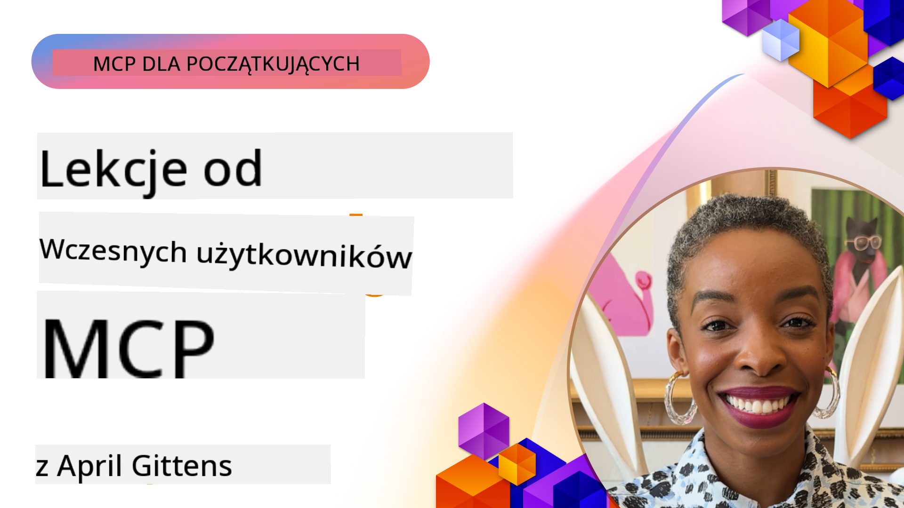

<!--
CO_OP_TRANSLATOR_METADATA:
{
  "original_hash": "261078280431a58292789702da620407",
  "translation_date": "2025-07-29T01:27:52+00:00",
  "source_file": "07-LessonsfromEarlyAdoption/README.md",
  "language_code": "pl"
}
-->
# 🌟 Lekcje od wczesnych użytkowników

[](https://youtu.be/jds7dSmNptE)

_(Kliknij obrazek powyżej, aby obejrzeć wideo z tej lekcji)_

## 🎯 Co obejmuje ten moduł

Ten moduł bada, jak prawdziwe organizacje i deweloperzy wykorzystują Model Context Protocol (MCP) do rozwiązywania rzeczywistych wyzwań i napędzania innowacji. Dzięki szczegółowym studiom przypadków i praktycznym projektom odkryjesz, jak MCP umożliwia bezpieczną, skalowalną integrację AI, łącząc modele językowe, narzędzia i dane przedsiębiorstwa.

### 📚 Zobacz MCP w działaniu

Chcesz zobaczyć te zasady zastosowane w gotowych do produkcji narzędziach? Sprawdź nasz [**Przewodnik po 10 serwerach MCP Microsoftu, które zmieniają produktywność deweloperów**](microsoft-mcp-servers.md), który prezentuje rzeczywiste serwery MCP Microsoftu, które możesz używać już dziś.

## Przegląd

Ta lekcja bada, jak wczesni użytkownicy wykorzystali Model Context Protocol (MCP) do rozwiązywania rzeczywistych wyzwań i napędzania innowacji w różnych branżach. Dzięki szczegółowym studiom przypadków i praktycznym projektom zobaczysz, jak MCP umożliwia standaryzowaną, bezpieczną i skalowalną integrację AI—łącząc duże modele językowe, narzędzia i dane przedsiębiorstwa w jednolitym frameworku. Zdobędziesz praktyczne doświadczenie w projektowaniu i budowaniu rozwiązań opartych na MCP, nauczysz się sprawdzonych wzorców implementacji i odkryjesz najlepsze praktyki wdrażania MCP w środowiskach produkcyjnych. Lekcja podkreśla również pojawiające się trendy, przyszłe kierunki i zasoby open-source, które pomogą Ci pozostać na czele technologii MCP i jej rozwijającego się ekosystemu.

## Cele nauki

- Analizowanie rzeczywistych implementacji MCP w różnych branżach
- Projektowanie i budowanie kompletnych aplikacji opartych na MCP
- Badanie pojawiających się trendów i przyszłych kierunków technologii MCP
- Zastosowanie najlepszych praktyk w rzeczywistych scenariuszach rozwoju

## Rzeczywiste implementacje MCP

### Studium przypadku 1: Automatyzacja wsparcia klienta w przedsiębiorstwie

Międzynarodowa korporacja wdrożyła rozwiązanie oparte na MCP, aby standaryzować interakcje AI w swoich systemach wsparcia klienta. Dzięki temu mogli:

- Stworzyć jednolity interfejs dla wielu dostawców LLM
- Utrzymać spójne zarządzanie promptami w różnych działach
- Wdrożyć solidne kontrole bezpieczeństwa i zgodności
- Łatwo przełączać się między różnymi modelami AI w zależności od potrzeb

**Implementacja techniczna:**

```python
# Python MCP server implementation for customer support
import logging
import asyncio
from modelcontextprotocol import create_server, ServerConfig
from modelcontextprotocol.server import MCPServer
from modelcontextprotocol.transports import create_http_transport
from modelcontextprotocol.resources import ResourceDefinition
from modelcontextprotocol.prompts import PromptDefinition
from modelcontextprotocol.tool import ToolDefinition

# Configure logging
logging.basicConfig(level=logging.INFO)

async def main():
    # Create server configuration
    config = ServerConfig(
        name="Enterprise Customer Support Server",
        version="1.0.0",
        description="MCP server for handling customer support inquiries"
    )
    
    # Initialize MCP server
    server = create_server(config)
    
    # Register knowledge base resources
    server.resources.register(
        ResourceDefinition(
            name="customer_kb",
            description="Customer knowledge base documentation"
        ),
        lambda params: get_customer_documentation(params)
    )
    
    # Register prompt templates
    server.prompts.register(
        PromptDefinition(
            name="support_template",
            description="Templates for customer support responses"
        ),
        lambda params: get_support_templates(params)
    )
    
    # Register support tools
    server.tools.register(
        ToolDefinition(
            name="ticketing",
            description="Create and update support tickets"
        ),
        handle_ticketing_operations
    )
    
    # Start server with HTTP transport
    transport = create_http_transport(port=8080)
    await server.run(transport)

if __name__ == "__main__":
    asyncio.run(main())
```

**Rezultaty:** 30% redukcja kosztów modeli, 45% poprawa spójności odpowiedzi i zwiększona zgodność w operacjach globalnych.

### Studium przypadku 2: Asystent diagnostyczny w opiece zdrowotnej

Dostawca usług medycznych opracował infrastrukturę MCP, aby zintegrować wiele wyspecjalizowanych modeli AI medycznych, jednocześnie zapewniając ochronę wrażliwych danych pacjentów:

- Bezproblemowe przełączanie między modelami ogólnymi a specjalistycznymi
- Ścisłe kontrole prywatności i ścieżki audytu
- Integracja z istniejącymi systemami Elektronicznej Dokumentacji Medycznej (EHR)
- Spójne projektowanie promptów dla terminologii medycznej

**Implementacja techniczna:**

```csharp
// C# MCP host application implementation in healthcare application
using Microsoft.Extensions.DependencyInjection;
using ModelContextProtocol.SDK.Client;
using ModelContextProtocol.SDK.Security;
using ModelContextProtocol.SDK.Resources;

public class DiagnosticAssistant
{
    private readonly MCPHostClient _mcpClient;
    private readonly PatientContext _patientContext;
    
    public DiagnosticAssistant(PatientContext patientContext)
    {
        _patientContext = patientContext;
        
        // Configure MCP client with healthcare-specific settings
        var clientOptions = new ClientOptions
        {
            Name = "Healthcare Diagnostic Assistant",
            Version = "1.0.0",
            Security = new SecurityOptions
            {
                Encryption = EncryptionLevel.Medical,
                AuditEnabled = true
            }
        };
        
        _mcpClient = new MCPHostClientBuilder()
            .WithOptions(clientOptions)
            .WithTransport(new HttpTransport("https://healthcare-mcp.example.org"))
            .WithAuthentication(new HIPAACompliantAuthProvider())
            .Build();
    }
    
    public async Task<DiagnosticSuggestion> GetDiagnosticAssistance(
        string symptoms, string patientHistory)
    {
        // Create request with appropriate resources and tool access
        var resourceRequest = new ResourceRequest
        {
            Name = "patient_records",
            Parameters = new Dictionary<string, object>
            {
                ["patientId"] = _patientContext.PatientId,
                ["requestingProvider"] = _patientContext.ProviderId
            }
        };
        
        // Request diagnostic assistance using appropriate prompt
        var response = await _mcpClient.SendPromptRequestAsync(
            promptName: "diagnostic_assistance",
            parameters: new Dictionary<string, object>
            {
                ["symptoms"] = symptoms,
                patientHistory = patientHistory,
                relevantGuidelines = _patientContext.GetRelevantGuidelines()
            });
            
        return DiagnosticSuggestion.FromMCPResponse(response);
    }
}
```

**Rezultaty:** Ulepszone sugestie diagnostyczne dla lekarzy przy pełnej zgodności z HIPAA oraz znacząca redukcja przełączania kontekstu między systemami.

### Studium przypadku 3: Analiza ryzyka w usługach finansowych

Instytucja finansowa wdrożyła MCP, aby standaryzować procesy analizy ryzyka w różnych działach:

- Stworzenie jednolitego interfejsu dla modeli ryzyka kredytowego, wykrywania oszustw i ryzyka inwestycyjnego
- Wdrożenie ścisłych kontroli dostępu i wersjonowania modeli
- Zapewnienie audytowalności wszystkich rekomendacji AI
- Utrzymanie spójnego formatowania danych w różnych systemach

**Implementacja techniczna:**

```java
// Java MCP server for financial risk assessment
import org.mcp.server.*;
import org.mcp.security.*;

public class FinancialRiskMCPServer {
    public static void main(String[] args) {
        // Create MCP server with financial compliance features
        MCPServer server = new MCPServerBuilder()
            .withModelProviders(
                new ModelProvider("risk-assessment-primary", new AzureOpenAIProvider()),
                new ModelProvider("risk-assessment-audit", new LocalLlamaProvider())
            )
            .withPromptTemplateDirectory("./compliance/templates")
            .withAccessControls(new SOCCompliantAccessControl())
            .withDataEncryption(EncryptionStandard.FINANCIAL_GRADE)
            .withVersionControl(true)
            .withAuditLogging(new DatabaseAuditLogger())
            .build();
            
        server.addRequestValidator(new FinancialDataValidator());
        server.addResponseFilter(new PII_RedactionFilter());
        
        server.start(9000);
        
        System.out.println("Financial Risk MCP Server running on port 9000");
    }
}
```

**Rezultaty:** Zwiększona zgodność regulacyjna, 40% szybsze cykle wdrażania modeli i poprawiona spójność oceny ryzyka w działach.

### Studium przypadku 4: Serwer MCP Microsoft Playwright do automatyzacji przeglądarek

Microsoft opracował [serwer MCP Playwright](https://github.com/microsoft/playwright-mcp), aby umożliwić bezpieczną, standaryzowaną automatyzację przeglądarek za pomocą Model Context Protocol. Ten gotowy do produkcji serwer pozwala agentom AI i LLM na interakcję z przeglądarkami internetowymi w kontrolowany, audytowalny i rozszerzalny sposób—umożliwiając takie przypadki użycia jak automatyczne testowanie stron, ekstrakcja danych i kompleksowe przepływy pracy.

> **🎯 Gotowe narzędzie produkcyjne**
> 
> To studium przypadku prezentuje rzeczywisty serwer MCP, który możesz używać już dziś! Dowiedz się więcej o serwerze MCP Playwright i 9 innych gotowych do produkcji serwerach MCP Microsoftu w naszym [**Przewodniku po serwerach MCP Microsoftu**](microsoft-mcp-servers.md#8--playwright-mcp-server).

**Kluczowe funkcje:**
- Udostępnia możliwości automatyzacji przeglądarek (nawigacja, wypełnianie formularzy, przechwytywanie zrzutów ekranu itp.) jako narzędzia MCP
- Wdraża ścisłe kontrole dostępu i sandboxing, aby zapobiec nieautoryzowanym działaniom
- Zapewnia szczegółowe dzienniki audytu dla wszystkich interakcji z przeglądarką
- Wspiera integrację z Azure OpenAI i innymi dostawcami LLM dla automatyzacji sterowanej przez agentów
- Zasila możliwości przeglądania GitHub Copilot Coding Agent

**Implementacja techniczna:**

```typescript
// TypeScript: Registering Playwright browser automation tools in an MCP server
import { createServer, ToolDefinition } from 'modelcontextprotocol';
import { launch } from 'playwright';

const server = createServer({
  name: 'Playwright MCP Server',
  version: '1.0.0',
  description: 'MCP server for browser automation using Playwright'
});

// Register a tool for navigating to a URL and capturing a screenshot
server.tools.register(
  new ToolDefinition({
    name: 'navigate_and_screenshot',
    description: 'Navigate to a URL and capture a screenshot',
    parameters: {
      url: { type: 'string', description: 'The URL to visit' }
    }
  }),
  async ({ url }) => {
    const browser = await launch();
    const page = await browser.newPage();
    await page.goto(url);
    const screenshot = await page.screenshot();
    await browser.close();
    return { screenshot };
  }
);

// Start the MCP server
server.listen(8080);
```

**Rezultaty:**

- Umożliwiono bezpieczną, programową automatyzację przeglądarek dla agentów AI i LLM
- Zredukowano wysiłek związany z ręcznym testowaniem i poprawiono pokrycie testowe aplikacji internetowych
- Zapewniono wielokrotnego użytku, rozszerzalny framework do integracji narzędzi opartych na przeglądarkach w środowiskach przedsiębiorstw
- Zasila możliwości przeglądania GitHub Copilot

**Referencje:**

- [Repozytorium GitHub serwera MCP Playwright](https://github.com/microsoft/playwright-mcp)
- [Rozwiązania AI i automatyzacji Microsoftu](https://azure.microsoft.com/en-us/products/ai-services/)

### Studium przypadku 5: Azure MCP – Model Context Protocol klasy korporacyjnej jako usługa

Serwer Azure MCP ([https://aka.ms/azmcp](https://aka.ms/azmcp)) to zarządzana przez Microsoft implementacja Model Context Protocol klasy korporacyjnej, zaprojektowana do zapewnienia skalowalnych, bezpiecznych i zgodnych możliwości serwera MCP jako usługi w chmurze. Azure MCP umożliwia organizacjom szybkie wdrażanie, zarządzanie i integrację serwerów MCP z usługami Azure AI, danymi i bezpieczeństwem, redukując koszty operacyjne i przyspieszając adopcję AI.

> **🎯 Gotowe narzędzie produkcyjne**
> 
> To rzeczywisty serwer MCP, który możesz używać już dziś! Dowiedz się więcej o serwerze MCP Azure AI Foundry w naszym [**Przewodniku po serwerach MCP Microsoftu**](microsoft-mcp-servers.md).

- W pełni zarządzane hostowanie serwera MCP z wbudowanym skalowaniem, monitorowaniem i bezpieczeństwem
- Natywna integracja z Azure OpenAI, Azure AI Search i innymi usługami Azure
- Uwierzytelnianie i autoryzacja klasy korporacyjnej za pomocą Microsoft Entra ID
- Wsparcie dla niestandardowych narzędzi, szablonów promptów i konektorów zasobów
- Zgodność z wymaganiami bezpieczeństwa i regulacyjnymi przedsiębiorstw

**Implementacja techniczna:**

```yaml
# Example: Azure MCP server deployment configuration (YAML)
apiVersion: mcp.microsoft.com/v1
kind: McpServer
metadata:
  name: enterprise-mcp-server
spec:
  modelProviders:
    - name: azure-openai
      type: AzureOpenAI
      endpoint: https://<your-openai-resource>.openai.azure.com/
      apiKeySecret: <your-azure-keyvault-secret>
  tools:
    - name: document_search
      type: AzureAISearch
      endpoint: https://<your-search-resource>.search.windows.net/
      apiKeySecret: <your-azure-keyvault-secret>
  authentication:
    type: EntraID
    tenantId: <your-tenant-id>
  monitoring:
    enabled: true
    logAnalyticsWorkspace: <your-log-analytics-id>
```

**Rezultaty:**  
- Skrócenie czasu realizacji projektów AI w przedsiębiorstwach dzięki gotowej do użycia, zgodnej platformie serwera MCP
- Uproszczona integracja LLM, narzędzi i źródeł danych przedsiębiorstwa
- Zwiększone bezpieczeństwo, widoczność i efektywność operacyjna dla obciążeń MCP
- Poprawiona jakość kodu dzięki najlepszym praktykom Azure SDK i aktualnym wzorcom uwierzytelniania

**Referencje:**  
- [Dokumentacja Azure MCP](https://aka.ms/azmcp)
- [Repozytorium GitHub serwera MCP Azure](https://github.com/Azure/azure-mcp)
- [Usługi AI Azure](https://azure.microsoft.com/en-us/products/ai-services/)

### Studium przypadku 6: NLWeb

MCP (Model Context Protocol) to rozwijający się protokół dla chatbotów i asystentów AI do interakcji z narzędziami. Każda instancja NLWeb jest również serwerem MCP, który obsługuje jedną podstawową metodę, ask, używaną do zadawania pytania stronie internetowej w języku naturalnym. Odpowiedź wykorzystuje schema.org, szeroko stosowane słownictwo do opisu danych internetowych. W uproszczeniu, MCP jest dla NLWeb tym, czym Http jest dla HTML. NLWeb łączy protokoły, formaty Schema.org i przykładowy kod, aby pomóc witrynom szybko tworzyć te punkty końcowe, przynosząc korzyści zarówno ludziom poprzez interfejsy konwersacyjne, jak i maszynom poprzez naturalną interakcję agentów.

NLWeb składa się z dwóch odrębnych komponentów:
- Protokół, bardzo prosty na początek, do interfejsu z witryną w języku naturalnym oraz format, wykorzystujący json i schema.org dla zwróconej odpowiedzi. Zobacz dokumentację REST API, aby uzyskać więcej szczegółów.
- Prosta implementacja (1), która wykorzystuje istniejące oznaczenia, dla witryn, które można abstrakcyjnie traktować jako listy elementów (produkty, przepisy, atrakcje, recenzje itp.). Wraz z zestawem widżetów interfejsu użytkownika, witryny mogą łatwo zapewnić konwersacyjne interfejsy do swojej zawartości. Zobacz dokumentację "Life of a chat query", aby uzyskać więcej szczegółów na temat działania.

**Referencje:**  
- [Dokumentacja Azure MCP](https://aka.ms/azmcp)  
- [NLWeb](https://github.com/microsoft/NlWeb)

### Studium przypadku 7: Serwer MCP Azure AI Foundry – Integracja agentów AI w przedsiębiorstwie

Serwery MCP Azure AI Foundry pokazują, jak MCP może być używane do orkiestracji i zarządzania agentami AI oraz przepływami pracy w środowiskach przedsiębiorstw. Dzięki integracji MCP z Azure AI Foundry organizacje mogą standaryzować interakcje agentów, korzystać z zarządzania przepływami Foundry i zapewniać bezpieczne, skalowalne wdrożenia.

> **🎯 Gotowe narzędzie produkcyjne**
> 
> To rzeczywisty serwer MCP, który możesz używać już dziś! Dowiedz się więcej o serwerze MCP Azure AI Foundry w naszym [**Przewodniku po serwerach MCP Microsoftu**](microsoft-mcp-servers.md#9--azure-ai-foundry-mcp-server).

**Kluczowe funkcje:**
- Kompleksowy dostęp do ekosystemu AI Azure, w tym katalogów modeli i zarządzania wdrożeniami
- Indeksowanie wiedzy za pomocą Azure AI Search dla aplikacji RAG
- Narzędzia oceny wydajności modeli AI i zapewnienia jakości
- Integracja z katalogiem i laboratoriami Azure AI Foundry dla najnowszych modeli badawczych
- Zarządzanie agentami i możliwości oceny w scenariuszach produkcyjnych

**Rezultaty:**
- Szybkie prototypowanie i solidne monitorowanie przepływów pracy agentów AI
- Bezproblemowa integracja z usługami AI Azure dla zaawansowanych scenariuszy
- Jednolity interfejs do budowania, wdrażania i monitorowania pipeline'ów agentów
- Zwiększone bezpieczeństwo, zgodność i efektywność operacyjna dla przedsiębiorstw
- Przyspieszona adopcja AI przy jednoczesnym zachowaniu kontroli nad złożonymi procesami sterowanymi przez agentów

**Referencje:**
- [Repozytorium GitHub serwera MCP Azure AI Foundry](https://github.com/azure-ai-foundry/mcp-foundry)
- [Integracja agentów AI Azure z MCP (Blog Microsoft Foundry)](https://devblogs.microsoft.com/foundry/integrating-azure-ai-agents-mcp/)

### Studium przypadku 8: Foundry MCP Playground – Eksperymentowanie i prototypowanie

Foundry MCP Playground oferuje gotowe środowisko do eksperymentowania z serwerami MCP i integracjami Azure AI Foundry. Deweloperzy mogą szybko prototypować, testować i oceniać modele AI oraz przepływy pracy agentów, korzystając z zasobów katalogu i laboratoriów Azure AI Foundry. Playground upraszcza konfigurację, dostarcza przykładowe projekty i wspiera współpracę zespołową, ułatwiając eksplorację najlepszych praktyk i nowych scenariuszy przy minimalnym nakładzie pracy. Jest szczególnie przydatny dla zespołów, które chcą weryfikować pomysły, dzielić się eksperymentami i przyspieszać naukę bez potrzeby skomplikowanej infrastruktury. Obniżając barierę wejścia, playground wspiera innowacje i wkład społeczności w ekosystem MCP i Azure AI Foundry.

**Referencje:**

- [Repozytorium GitHub Foundry MCP Playground](https://github.com/azure-ai-foundry/foundry-mcp-playground)

### Studium przypadku 9: Serwer MCP Microsoft Learn Docs – Dostęp do dokumentacji zasilany AI

Serwer MCP Microsoft Learn Docs to usługa hostowana w chmurze, która zapewnia asystentom AI dostęp w czasie rzeczywistym do oficjalnej dokumentacji Microsoftu za pomocą Model Context Protocol. Ten gotowy do produkcji serwer łączy się z kompleksowym ekosystemem Microsoft Learn i umożliwia semantyczne wyszukiwanie we wszystkich oficjalnych źródłach Microsoftu.
> **🎯 Narzędzie gotowe do produkcji**
> 
> To jest prawdziwy serwer MCP, którego możesz używać już dziś! Dowiedz się więcej o serwerze MCP w dokumentacji Microsoft Learn w naszym [**Przewodniku po serwerach MCP Microsoft**](microsoft-mcp-servers.md#1--microsoft-learn-docs-mcp-server).
**Kluczowe funkcje:**
- Dostęp w czasie rzeczywistym do oficjalnej dokumentacji Microsoft, dokumentacji Azure i Microsoft 365
- Zaawansowane możliwości semantycznego wyszukiwania, które rozumieją kontekst i intencje
- Zawsze aktualne informacje dzięki publikacji treści Microsoft Learn
- Kompleksowe pokrycie dokumentacji Microsoft Learn, Azure i Microsoft 365
- Zwraca do 10 wysokiej jakości fragmentów treści z tytułami artykułów i adresami URL

**Dlaczego to ważne:**
- Rozwiązuje problem „nieaktualnej wiedzy AI” w zakresie technologii Microsoft
- Zapewnia, że asystenci AI mają dostęp do najnowszych funkcji .NET, C#, Azure i Microsoft 365
- Dostarcza autorytatywnych, pierwszorzędnych informacji dla precyzyjnego generowania kodu
- Niezbędne dla programistów pracujących z szybko rozwijającymi się technologiami Microsoft

**Rezultaty:**
- Znacząco poprawiona dokładność kodu generowanego przez AI dla technologii Microsoft
- Skrócony czas poszukiwania aktualnej dokumentacji i najlepszych praktyk
- Zwiększona produktywność programistów dzięki kontekstowemu wyszukiwaniu dokumentacji
- Bezproblemowa integracja z przepływami pracy programistycznej bez opuszczania IDE

**Referencje:**
- [Microsoft Learn Docs MCP Server GitHub Repository](https://github.com/MicrosoftDocs/mcp)
- [Microsoft Learn Documentation](https://learn.microsoft.com/)

## Projekty praktyczne

### Projekt 1: Budowa serwera MCP obsługującego wielu dostawców

**Cel:** Stworzenie serwera MCP, który może kierować żądania do różnych dostawców modeli AI na podstawie określonych kryteriów.

**Wymagania:**
- Obsługa co najmniej trzech różnych dostawców modeli (np. OpenAI, Anthropic, modele lokalne)
- Implementacja mechanizmu routingu na podstawie metadanych żądania
- Stworzenie systemu konfiguracji do zarządzania poświadczeniami dostawców
- Dodanie mechanizmów buforowania w celu optymalizacji wydajności i kosztów
- Zbudowanie prostego panelu do monitorowania użycia

**Kroki implementacji:**
1. Przygotowanie podstawowej infrastruktury serwera MCP
2. Implementacja adapterów dostawców dla każdej usługi modelu AI
3. Stworzenie logiki routingu na podstawie atrybutów żądania
4. Dodanie mechanizmów buforowania dla częstych żądań
5. Opracowanie panelu monitorowania
6. Testowanie z różnymi wzorcami żądań

**Technologie:** Wybór między Pythonem (.NET/Java/Python w zależności od preferencji), Redis do buforowania oraz prosty framework webowy do panelu.

### Projekt 2: System zarządzania szablonami promptów dla przedsiębiorstw

**Cel:** Opracowanie systemu opartego na MCP do zarządzania, wersjonowania i wdrażania szablonów promptów w organizacji.

**Wymagania:**
- Stworzenie centralnego repozytorium dla szablonów promptów
- Implementacja wersjonowania i procesów zatwierdzania
- Budowa funkcji testowania szablonów z przykładowymi danymi wejściowymi
- Opracowanie kontroli dostępu opartej na rolach
- Stworzenie API do pobierania i wdrażania szablonów

**Kroki implementacji:**
1. Zaprojektowanie schematu bazy danych do przechowywania szablonów
2. Stworzenie podstawowego API do operacji CRUD na szablonach
3. Implementacja systemu wersjonowania
4. Budowa procesu zatwierdzania
5. Opracowanie frameworku testowego
6. Stworzenie prostego interfejsu webowego do zarządzania
7. Integracja z serwerem MCP

**Technologie:** Dowolny framework backendowy, baza danych SQL lub NoSQL oraz framework frontendowy do interfejsu zarządzania.

### Projekt 3: Platforma generowania treści oparta na MCP

**Cel:** Zbudowanie platformy generowania treści, która wykorzystuje MCP do zapewnienia spójnych wyników dla różnych typów treści.

**Wymagania:**
- Obsługa wielu formatów treści (posty na blogu, media społecznościowe, teksty marketingowe)
- Implementacja generowania opartego na szablonach z opcjami personalizacji
- Stworzenie systemu przeglądu i opinii na temat treści
- Śledzenie metryk wydajności treści
- Obsługa wersjonowania i iteracji treści

**Kroki implementacji:**
1. Przygotowanie infrastruktury klienta MCP
2. Stworzenie szablonów dla różnych typów treści
3. Budowa pipeline’u generowania treści
4. Implementacja systemu przeglądu
5. Opracowanie systemu śledzenia metryk
6. Stworzenie interfejsu użytkownika do zarządzania szablonami i generowania treści

**Technologie:** Wybrany język programowania, framework webowy i system baz danych.

## Przyszłe kierunki rozwoju technologii MCP

### Nowe trendy

1. **Multi-modalny MCP**
   - Rozszerzenie MCP w celu standaryzacji interakcji z modelami obrazów, dźwięków i wideo
   - Rozwój zdolności do rozumowania między modalnościami
   - Standaryzowane formaty promptów dla różnych modalności

2. **Federacyjna infrastruktura MCP**
   - Rozproszone sieci MCP, które mogą dzielić zasoby między organizacjami
   - Standaryzowane protokoły do bezpiecznego udostępniania modeli
   - Techniki obliczeń zachowujących prywatność

3. **Rynki MCP**
   - Ekosystemy do udostępniania i monetyzacji szablonów MCP i wtyczek
   - Procesy zapewnienia jakości i certyfikacji
   - Integracja z rynkami modeli

4. **MCP dla obliczeń brzegowych**
   - Adaptacja standardów MCP dla urządzeń o ograniczonych zasobach
   - Optymalizowane protokoły dla środowisk o niskiej przepustowości
   - Specjalistyczne implementacje MCP dla ekosystemów IoT

5. **Ramowe regulacje**
   - Rozwój rozszerzeń MCP dla zgodności regulacyjnej
   - Standaryzowane ścieżki audytu i interfejsy wyjaśnialności
   - Integracja z powstającymi ramami zarządzania AI

### Rozwiązania MCP od Microsoft

Microsoft i Azure opracowały kilka repozytoriów open-source, które pomagają programistom wdrażać MCP w różnych scenariuszach:

#### Organizacja Microsoft

1. [playwright-mcp](https://github.com/microsoft/playwright-mcp) - Serwer MCP Playwright do automatyzacji przeglądarek i testowania
2. [files-mcp-server](https://github.com/microsoft/files-mcp-server) - Implementacja serwera MCP OneDrive do lokalnych testów i wkładu społeczności
3. [NLWeb](https://github.com/microsoft/NlWeb) - NLWeb to zbiór otwartych protokołów i narzędzi open source, koncentrujący się na ustanowieniu warstwy podstawowej dla AI Web

#### Organizacja Azure-Samples

1. [mcp](https://github.com/Azure-Samples/mcp) - Linki do przykładów, narzędzi i zasobów do budowy i integracji serwerów MCP na Azure w różnych językach
2. [mcp-auth-servers](https://github.com/Azure-Samples/mcp-auth-servers) - Referencyjne serwery MCP demonstrujące uwierzytelnianie zgodnie z aktualną specyfikacją Model Context Protocol
3. [remote-mcp-functions](https://github.com/Azure-Samples/remote-mcp-functions) - Strona startowa dla implementacji zdalnych serwerów MCP w Azure Functions z linkami do repozytoriów specyficznych dla języka
4. [remote-mcp-functions-python](https://github.com/Azure-Samples/remote-mcp-functions-python) - Szablon szybkiego startu do budowy i wdrażania niestandardowych zdalnych serwerów MCP za pomocą Azure Functions z Pythonem
5. [remote-mcp-functions-dotnet](https://github.com/Azure-Samples/remote-mcp-functions-dotnet) - Szablon szybkiego startu do budowy i wdrażania niestandardowych zdalnych serwerów MCP za pomocą Azure Functions z .NET/C#
6. [remote-mcp-functions-typescript](https://github.com/Azure-Samples/remote-mcp-functions-typescript) - Szablon szybkiego startu do budowy i wdrażania niestandardowych zdalnych serwerów MCP za pomocą Azure Functions z TypeScript
7. [remote-mcp-apim-functions-python](https://github.com/Azure-Samples/remote-mcp-apim-functions-python) - Azure API Management jako AI Gateway do zdalnych serwerów MCP za pomocą Pythona
8. [AI-Gateway](https://github.com/Azure-Samples/AI-Gateway) - Eksperymenty APIM ❤️ AI, w tym funkcje MCP, integracja z Azure OpenAI i AI Foundry

Te repozytoria oferują różne implementacje, szablony i zasoby do pracy z Model Context Protocol w różnych językach programowania i usługach Azure. Obejmują szeroki zakres przypadków użycia, od podstawowych implementacji serwerów po uwierzytelnianie, wdrażanie w chmurze i scenariusze integracji dla przedsiębiorstw.

#### Katalog zasobów MCP

[Katalog zasobów MCP](https://github.com/microsoft/mcp/tree/main/Resources) w oficjalnym repozytorium Microsoft MCP oferuje starannie dobraną kolekcję przykładowych zasobów, szablonów promptów i definicji narzędzi do użycia z serwerami Model Context Protocol. Ten katalog został zaprojektowany, aby pomóc programistom szybko rozpocząć pracę z MCP, oferując gotowe do użycia elementy i przykłady najlepszych praktyk:

- **Szablony promptów:** Gotowe szablony promptów dla typowych zadań i scenariuszy AI, które można dostosować do własnych implementacji serwerów MCP.
- **Definicje narzędzi:** Przykładowe schematy narzędzi i metadane do standaryzacji integracji i wywoływania narzędzi w różnych serwerach MCP.
- **Przykładowe zasoby:** Przykładowe definicje zasobów do łączenia się z źródłami danych, API i zewnętrznymi usługami w ramach MCP.
- **Implementacje referencyjne:** Praktyczne przykłady pokazujące, jak strukturyzować i organizować zasoby, prompty i narzędzia w rzeczywistych projektach MCP.

Te zasoby przyspieszają rozwój, promują standaryzację i pomagają zapewnić najlepsze praktyki podczas budowy i wdrażania rozwiązań opartych na MCP.

#### Katalog zasobów MCP

- [MCP Resources (Sample Prompts, Tools, and Resource Definitions)](https://github.com/microsoft/mcp/tree/main/Resources)

### Możliwości badawcze

- Efektywne techniki optymalizacji promptów w ramach MCP
- Modele bezpieczeństwa dla wdrożeń MCP w środowiskach wielodostępowych
- Benchmarking wydajności różnych implementacji MCP
- Metody formalnej weryfikacji serwerów MCP

## Podsumowanie

Model Context Protocol (MCP) szybko kształtuje przyszłość standaryzowanej, bezpiecznej i interoperacyjnej integracji AI w różnych branżach. Dzięki studiom przypadków i projektom praktycznym w tej lekcji zobaczyłeś, jak wczesni użytkownicy — w tym Microsoft i Azure — wykorzystują MCP do rozwiązywania rzeczywistych wyzwań, przyspieszania adopcji AI oraz zapewnienia zgodności, bezpieczeństwa i skalowalności. Modularne podejście MCP umożliwia organizacjom łączenie dużych modeli językowych, narzędzi i danych przedsiębiorstwa w jednolitym, audytowalnym frameworku. W miarę jak MCP będzie się rozwijać, zaangażowanie w społeczność, eksploracja zasobów open-source i stosowanie najlepszych praktyk będą kluczowe dla budowy solidnych, przyszłościowych rozwiązań AI.

## Dodatkowe zasoby

- [MCP Foundry GitHub Repository](https://github.com/azure-ai-foundry/mcp-foundry)
- [Foundry MCP Playground](https://github.com/azure-ai-foundry/foundry-mcp-playground)
- [Integrating Azure AI Agents with MCP (Microsoft Foundry Blog)](https://devblogs.microsoft.com/foundry/integrating-azure-ai-agents-mcp/)
- [MCP GitHub Repository (Microsoft)](https://github.com/microsoft/mcp)
- [MCP Resources Directory (Sample Prompts, Tools, and Resource Definitions)](https://github.com/microsoft/mcp/tree/main/Resources)
- [MCP Community & Documentation](https://modelcontextprotocol.io/introduction)
- [Azure MCP Documentation](https://aka.ms/azmcp)
- [Playwright MCP Server GitHub Repository](https://github.com/microsoft/playwright-mcp)
- [Files MCP Server (OneDrive)](https://github.com/microsoft/files-mcp-server)
- [Azure-Samples MCP](https://github.com/Azure-Samples/mcp)
- [MCP Auth Servers (Azure-Samples)](https://github.com/Azure-Samples/mcp-auth-servers)
- [Remote MCP Functions (Azure-Samples)](https://github.com/Azure-Samples/remote-mcp-functions)
- [Remote MCP Functions Python (Azure-Samples)](https://github.com/Azure-Samples/remote-mcp-functions-python)
- [Remote MCP Functions .NET (Azure-Samples)](https://github.com/Azure-Samples/remote-mcp-functions-dotnet)
- [Remote MCP Functions TypeScript (Azure-Samples)](https://github.com/Azure-Samples/remote-mcp-functions-typescript)
- [Remote MCP APIM Functions Python (Azure-Samples)](https://github.com/Azure-Samples/remote-mcp-apim-functions-python)
- [AI-Gateway (Azure-Samples)](https://github.com/Azure-Samples/AI-Gateway)
- [Microsoft AI and Automation Solutions](https://azure.microsoft.com/en-us/products/ai-services/)

## Ćwiczenia

1. Przeanalizuj jedno ze studiów przypadków i zaproponuj alternatywne podejście do implementacji.
2. Wybierz jeden z pomysłów na projekt i stwórz szczegółową specyfikację techniczną.
3. Zbadaj branżę, która nie została uwzględniona w studiach przypadków, i zaproponuj, jak MCP może rozwiązać jej specyficzne wyzwania.
4. Eksploruj jeden z przyszłych kierunków i opracuj koncepcję nowego rozszerzenia MCP, które go wspiera.

Dalej: [Microsoft MCP Server](../07-LessonsfromEarlyAdoption/microsoft-mcp-servers.md)

**Zastrzeżenie**:  
Ten dokument został przetłumaczony za pomocą usługi tłumaczenia AI [Co-op Translator](https://github.com/Azure/co-op-translator). Chociaż dokładamy wszelkich starań, aby tłumaczenie było precyzyjne, prosimy pamiętać, że automatyczne tłumaczenia mogą zawierać błędy lub nieścisłości. Oryginalny dokument w jego rodzimym języku powinien być uznawany za wiarygodne źródło. W przypadku informacji o kluczowym znaczeniu zaleca się skorzystanie z profesjonalnego tłumaczenia przez człowieka. Nie ponosimy odpowiedzialności za jakiekolwiek nieporozumienia lub błędne interpretacje wynikające z użycia tego tłumaczenia.