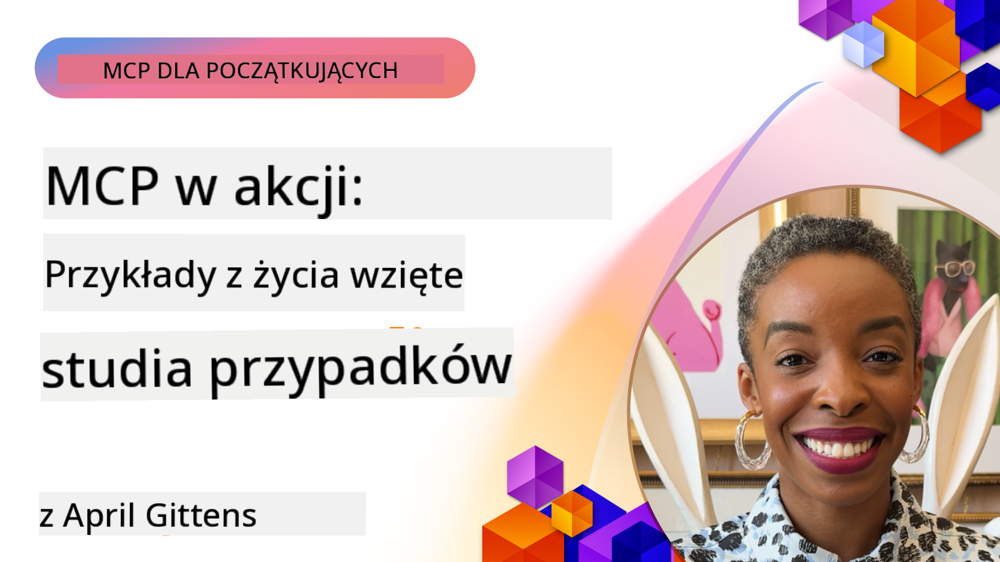

<!--
CO_OP_TRANSLATOR_METADATA:
{
  "original_hash": "1611dc5f6a2a35a789fc4c95fc5bfbe8",
  "translation_date": "2025-09-26T18:22:10+00:00",
  "source_file": "09-CaseStudy/README.md",
  "language_code": "pl"
}
-->
# MCP w praktyce: Studia przypadków z rzeczywistego świata

_(Kliknij obrazek powyżej, aby obejrzeć wideo z tej lekcji)_

Model Context Protocol (MCP) zmienia sposób, w jaki aplikacje AI współdziałają z danymi, narzędziami i usługami. W tej sekcji przedstawiamy studia przypadków z rzeczywistego świata, które pokazują praktyczne zastosowania MCP w różnych scenariuszach biznesowych.

## Przegląd

Ta sekcja prezentuje konkretne przykłady wdrożeń MCP, podkreślając, jak organizacje wykorzystują ten protokół do rozwiązywania złożonych wyzwań biznesowych. Analizując te studia przypadków, zdobędziesz wiedzę na temat wszechstronności, skalowalności i praktycznych korzyści MCP w rzeczywistych zastosowaniach.

## Kluczowe cele nauki

Dzięki analizie tych studiów przypadków dowiesz się:

- Jak MCP może być zastosowany do rozwiązywania konkretnych problemów biznesowych
- O różnych wzorcach integracji i podejściach architektonicznych
- O najlepszych praktykach wdrażania MCP w środowiskach korporacyjnych
- O wyzwaniach i rozwiązaniach napotkanych podczas rzeczywistych wdrożeń
- Jak zidentyfikować możliwości zastosowania podobnych wzorców w swoich projektach

## Prezentowane studia przypadków

### 1. [Azure AI Travel Agents – Implementacja referencyjna](./travelagentsample.md)

Ten przypadek bada kompleksowe rozwiązanie referencyjne Microsoftu, które pokazuje, jak zbudować wieloagentową aplikację do planowania podróży opartą na AI, wykorzystując MCP, Azure OpenAI i Azure AI Search. Projekt prezentuje:

- Orkiestrację wieloagentową za pomocą MCP
- Integrację danych korporacyjnych z Azure AI Search
- Bezpieczną, skalowalną architekturę opartą na usługach Azure
- Rozszerzalne narzędzia z wielokrotnego użytku komponentami MCP
- Konwersacyjną obsługę użytkownika wspieraną przez Azure OpenAI

Szczegóły architektury i implementacji dostarczają cennych informacji na temat budowy złożonych systemów wieloagentowych z MCP jako warstwą koordynacyjną.

### 2. [Aktualizacja elementów Azure DevOps na podstawie danych z YouTube](./UpdateADOItemsFromYT.md)

Ten przypadek pokazuje praktyczne zastosowanie MCP do automatyzacji procesów roboczych. Demonstruje, jak narzędzia MCP mogą być używane do:

- Wyodrębniania danych z platform internetowych (YouTube)
- Aktualizacji elementów roboczych w systemach Azure DevOps
- Tworzenia powtarzalnych przepływów automatyzacji
- Integracji danych z różnych systemów

Przykład ten ilustruje, jak nawet stosunkowo proste implementacje MCP mogą przynieść znaczące korzyści w zakresie efektywności, automatyzując rutynowe zadania i poprawiając spójność danych w systemach.

### 3. [Pobieranie dokumentacji w czasie rzeczywistym za pomocą MCP](./docs-mcp/README.md)

Ten przypadek prowadzi Cię przez proces łączenia klienta konsolowego Python z serwerem Model Context Protocol (MCP) w celu pobierania i rejestrowania w czasie rzeczywistym kontekstowej dokumentacji Microsoftu. Dowiesz się, jak:

- Połączyć się z serwerem MCP za pomocą klienta Python i oficjalnego SDK MCP
- Korzystać z klientów HTTP do efektywnego pobierania danych w czasie rzeczywistym
- Wywoływać narzędzia dokumentacyjne na serwerze i rejestrować odpowiedzi bezpośrednio w konsoli
- Włączyć aktualną dokumentację Microsoftu do swojego przepływu pracy bez opuszczania terminala

Rozdział zawiera zadanie praktyczne, minimalny działający przykład kodu oraz linki do dodatkowych zasobów umożliwiających pogłębienie wiedzy. Zobacz pełny przewodnik i kod w powiązanym rozdziale, aby zrozumieć, jak MCP może zmienić dostęp do dokumentacji i produktywność programistów w środowiskach konsolowych.

### 4. [Interaktywna aplikacja webowa do generowania planów nauki z MCP](./docs-mcp/README.md)

Ten przypadek pokazuje, jak zbudować interaktywną aplikację webową za pomocą Chainlit i Model Context Protocol (MCP), aby generować spersonalizowane plany nauki na dowolny temat. Użytkownicy mogą określić temat (np. "certyfikacja AI-900") i czas nauki (np. 8 tygodni), a aplikacja dostarczy tygodniowy podział rekomendowanych treści. Chainlit umożliwia konwersacyjną obsługę czatu, czyniąc doświadczenie angażującym i adaptacyjnym.

- Konwersacyjna aplikacja webowa wspierana przez Chainlit
- Wprowadzenie przez użytkownika tematów i czasu nauki
- Tygodniowe rekomendacje treści za pomocą MCP
- Odpowiedzi w czasie rzeczywistym w interfejsie czatu

Projekt ilustruje, jak konwersacyjna AI i MCP mogą być połączone w celu stworzenia dynamicznych, interaktywnych narzędzi edukacyjnych w nowoczesnym środowisku webowym.

### 5. [Dokumentacja w edytorze z serwerem MCP w VS Code](./docs-mcp/README.md)

Ten przypadek pokazuje, jak można przenieść dokumentację Microsoft Learn Docs bezpośrednio do środowiska VS Code za pomocą serwera MCP — bez konieczności przełączania kart przeglądarki! Dowiesz się, jak:

- Natychmiast wyszukiwać i czytać dokumentację w VS Code za pomocą panelu MCP lub palety poleceń
- Odnosić się do dokumentacji i wstawiać linki bezpośrednio do plików README lub markdown kursów
- Korzystać z GitHub Copilot i MCP razem dla płynnych, wspieranych przez AI przepływów dokumentacji i kodu
- Walidować i ulepszać dokumentację dzięki opiniom w czasie rzeczywistym i dokładności źródeł Microsoftu
- Zintegrować MCP z przepływami GitHub dla ciągłej walidacji dokumentacji

Implementacja obejmuje:

- Przykładową konfigurację `.vscode/mcp.json` dla łatwego ustawienia
- Przewodniki oparte na zrzutach ekranu dotyczące doświadczenia w edytorze
- Wskazówki dotyczące łączenia Copilot i MCP dla maksymalnej produktywności

Ten scenariusz jest idealny dla autorów kursów, pisarzy dokumentacji i programistów, którzy chcą pozostać skoncentrowani w edytorze, pracując z dokumentacją, Copilotem i narzędziami walidacyjnymi — wszystko wspierane przez MCP.

### 6. [Tworzenie serwera MCP w APIM](./apimsample.md)

Ten przypadek dostarcza przewodnik krok po kroku, jak stworzyć serwer MCP za pomocą Azure API Management (APIM). Obejmuje:

- Konfigurację serwera MCP w Azure API Management
- Udostępnianie operacji API jako narzędzi MCP
- Konfigurowanie polityk ograniczania szybkości i bezpieczeństwa
- Testowanie serwera MCP za pomocą Visual Studio Code i GitHub Copilot

Przykład ilustruje, jak wykorzystać możliwości Azure do stworzenia solidnego serwera MCP, który może być używany w różnych aplikacjach, poprawiając integrację systemów AI z korporacyjnymi API.

### 7. [Rejestr MCP GitHub — Przyspieszenie integracji agentów](https://github.com/mcp)

Ten przypadek bada, jak Rejestr MCP GitHub, uruchomiony we wrześniu 2025 roku, rozwiązuje kluczowy problem w ekosystemie AI: rozproszoną odkrywalność i wdrażanie serwerów Model Context Protocol (MCP).

#### Przegląd
**Rejestr MCP** rozwiązuje rosnący problem rozproszonych serwerów MCP w różnych repozytoriach i rejestrach, co wcześniej powodowało wolną i podatną na błędy integrację. Te serwery umożliwiają agentom AI interakcję z zewnętrznymi systemami, takimi jak API, bazy danych i źródła dokumentacji.

#### Problem
Programiści budujący przepływy agentów napotykali kilka wyzwań:
- **Słaba odkrywalność** serwerów MCP na różnych platformach
- **Redundantne pytania dotyczące konfiguracji** rozproszone po forach i dokumentacji
- **Ryzyko bezpieczeństwa** związane z niezweryfikowanymi i niepewnymi źródłami
- **Brak standaryzacji** w jakości i kompatybilności serwerów

#### Architektura rozwiązania
Rejestr MCP GitHub centralizuje zaufane serwery MCP z kluczowymi funkcjami:
- **Instalacja jednym kliknięciem** w VS Code dla uproszczonej konfiguracji
- **Sortowanie według sygnałów** na podstawie gwiazdek, aktywności i walidacji społeczności
- **Bezpośrednia integracja** z GitHub Copilot i innymi narzędziami kompatybilnymi z MCP
- **Model otwartych kontrybucji**, umożliwiający wkład zarówno społeczności, jak i partnerów korporacyjnych

#### Wpływ biznesowy
Rejestr przyniósł wymierne korzyści:
- **Szybsze wdrożenie** dla programistów korzystających z narzędzi takich jak Microsoft Learn MCP Server, który przesyła oficjalną dokumentację bezpośrednio do agentów
- **Zwiększona produktywność** dzięki wyspecjalizowanym serwerom, takim jak `github-mcp-server`, umożliwiającym automatyzację GitHub w języku naturalnym (tworzenie PR, ponowne uruchamianie CI, skanowanie kodu)
- **Większe zaufanie do ekosystemu** dzięki kuratorowanym listom i przejrzystym standardom konfiguracji

#### Wartość strategiczna
Dla praktyków specjalizujących się w zarządzaniu cyklem życia agentów i powtarzalnych przepływach pracy, Rejestr MCP oferuje:
- **Modularne wdrażanie agentów** z standaryzowanymi komponentami
- **Pipelines walidacyjne wspierane przez rejestr** dla spójnego testowania i weryfikacji
- **Interoperacyjność między narzędziami**, umożliwiająca płynną integrację na różnych platformach AI

Ten przypadek pokazuje, że Rejestr MCP to nie tylko katalog — to fundamentalna platforma dla skalowalnej integracji modeli i wdrażania systemów agentowych w rzeczywistych zastosowaniach.

## Podsumowanie

Te siedem kompleksowych studiów przypadków pokazuje niezwykłą wszechstronność i praktyczne zastosowania Model Context Protocol w różnych rzeczywistych scenariuszach. Od złożonych systemów planowania podróży wieloagentowych i zarządzania API korporacyjnymi po usprawnione przepływy dokumentacji i rewolucyjny Rejestr MCP GitHub, te przykłady pokazują, jak MCP zapewnia standaryzowany, skalowalny sposób łączenia systemów AI z narzędziami, danymi i usługami, których potrzebują, aby dostarczać wyjątkową wartość.

Studia przypadków obejmują wiele wymiarów implementacji MCP:
- **Integracja korporacyjna**: Automatyzacja Azure API Management i Azure DevOps
- **Orkiestracja wieloagentowa**: Planowanie podróży z koordynowanymi agentami AI
- **Produktywność programistów**: Integracja z VS Code i dostęp do dokumentacji w czasie rzeczywistym
- **Rozwój ekosystemu**: Rejestr MCP GitHub jako platforma fundamentalna
- **Zastosowania edukacyjne**: Generatory planów nauki i interfejsy konwersacyjne

Analizując te wdrożenia, zdobędziesz kluczowe informacje na temat:
- **Wzorów architektonicznych** dla różnych skal i przypadków użycia
- **Strategii implementacji**, które równoważą funkcjonalność z łatwością utrzymania
- **Rozważań dotyczących bezpieczeństwa i skalowalności** dla wdrożeń produkcyjnych
- **Najlepszych praktyk** w zakresie rozwoju serwerów MCP i integracji klientów
- **Myślenia ekosystemowego** w budowaniu połączonych rozwiązań wspieranych przez AI

Te przykłady wspólnie pokazują, że MCP to nie tylko teoretyczne ramy, ale dojrzały, gotowy do produkcji protokół umożliwiający praktyczne rozwiązania złożonych wyzwań biznesowych. Niezależnie od tego, czy budujesz proste narzędzia automatyzacji, czy zaawansowane systemy wieloagentowe, wzorce i podejścia przedstawione tutaj stanowią solidną podstawę dla Twoich własnych projektów MCP.

## Dodatkowe zasoby

- [Azure AI Travel Agents GitHub Repository](https://github.com/Azure-Samples/azure-ai-travel-agents)
- [Azure DevOps MCP Tool](https://github.com/microsoft/azure-devops-mcp)
- [Playwright MCP Tool](https://github.com/microsoft/playwright-mcp)
- [Microsoft Docs MCP Server](https://github.com/MicrosoftDocs/mcp)
- [GitHub MCP Registry — Przyspieszenie integracji agentów](https://github.com/mcp)
- [Przykłady społeczności MCP](https://github.com/microsoft/mcp)

Następny: Laboratorium praktyczne [Usprawnianie przepływów AI: Budowa serwera MCP za pomocą zestawu narzędzi AI](../10-StreamliningAIWorkflowsBuildingAnMCPServerWithAIToolkit/README.md)

---

