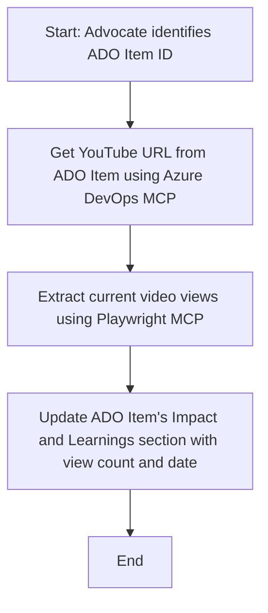

<!--
CO_OP_TRANSLATOR_METADATA:
{
  "original_hash": "14a2dfbea55ef735660a06bd6bdfe5f3",
  "translation_date": "2025-07-14T06:12:04+00:00",
  "source_file": "09-CaseStudy/UpdateADOItemsFromYT.md",
  "language_code": "pl"
}
-->
# Studium przypadku: Aktualizacja elementów Azure DevOps danymi z YouTube za pomocą MCP

> **Disclaimer:** Istnieją dostępne narzędzia online i raporty, które mogą automatyzować proces aktualizacji elementów Azure DevOps danymi z platform takich jak YouTube. Poniższy scenariusz jest przedstawiony wyłącznie jako przykładowe zastosowanie, ilustrujące, jak narzędzia MCP mogą być wykorzystane do automatyzacji i integracji.

## Przegląd

To studium przypadku pokazuje jeden z przykładów, jak Model Context Protocol (MCP) i jego narzędzia mogą być użyte do automatyzacji procesu aktualizacji elementów pracy Azure DevOps (ADO) informacjami pochodzącymi z platform online, takich jak YouTube. Opisany scenariusz to tylko jedna z ilustracji szerszych możliwości tych narzędzi, które można dostosować do wielu podobnych potrzeb automatyzacji.

W tym przykładzie Advocate śledzi sesje online za pomocą elementów ADO, gdzie każdy element zawiera URL do filmu na YouTube. Wykorzystując narzędzia MCP, Advocate może na bieżąco aktualizować elementy ADO o najnowsze metryki wideo, takie jak liczba wyświetleń, w sposób powtarzalny i zautomatyzowany. Podejście to można uogólnić na inne przypadki, gdzie informacje z źródeł online muszą być zintegrowane z ADO lub innymi systemami.

## Scenariusz

Advocate odpowiada za monitorowanie wpływu sesji online i zaangażowania społeczności. Każda sesja jest rejestrowana jako element pracy ADO w projekcie 'DevRel', a element zawiera pole z URL filmu na YouTube. Aby dokładnie raportować zasięg sesji, Advocate musi zaktualizować element ADO o aktualną liczbę wyświetleń filmu oraz datę pobrania tych informacji.

## Użyte narzędzia

- [Azure DevOps MCP](https://github.com/microsoft/azure-devops-mcp): Umożliwia programowy dostęp i aktualizację elementów pracy ADO za pomocą MCP.
- [Playwright MCP](https://github.com/microsoft/playwright-mcp): Automatyzuje działania w przeglądarce, aby wyciągać dane na żywo ze stron internetowych, takich jak statystyki filmów na YouTube.

## Krok po kroku

1. **Zidentyfikuj element ADO**: Zacznij od ID elementu pracy ADO (np. 1234) w projekcie 'DevRel'.
2. **Pobierz URL YouTube**: Użyj narzędzia Azure DevOps MCP, aby uzyskać URL filmu z elementu pracy.
3. **Wyciągnij liczbę wyświetleń**: Użyj narzędzia Playwright MCP, aby przejść do URL YouTube i pobrać aktualną liczbę wyświetleń.
4. **Zaktualizuj element ADO**: Zapisz najnowszą liczbę wyświetleń oraz datę pobrania w sekcji 'Impact and Learnings' elementu pracy ADO, korzystając z narzędzia Azure DevOps MCP.

## Przykładowy prompt

```bash
- Work with the ADO Item ID: 1234
- The project is '2025-Awesome'
- Get the YouTube URL for the ADO item
- Use Playwright to get the current views from the YouTube video
- Update the ADO item with the current video views and the updated date of the information
```

## Diagram Mermaid



## Implementacja techniczna

- **Orkiestracja MCP**: Przepływ pracy jest koordynowany przez serwer MCP, który zarządza użyciem narzędzi Azure DevOps MCP i Playwright MCP.
- **Automatyzacja**: Proces może być uruchamiany ręcznie lub zaplanowany do regularnego wykonywania, aby utrzymywać elementy ADO na bieżąco.
- **Rozszerzalność**: Ten sam schemat można rozszerzyć o aktualizację elementów ADO o inne metryki online (np. polubienia, komentarze) lub dane z innych platform.

## Wyniki i wpływ

- **Efektywność**: Zmniejsza nakład pracy manualnej Advocates, automatyzując pobieranie i aktualizację metryk wideo.
- **Dokładność**: Zapewnia, że elementy ADO odzwierciedlają najświeższe dane dostępne z źródeł online.
- **Powtarzalność**: Dostarcza powtarzalny przepływ pracy dla podobnych scenariuszy z innymi źródłami danych lub metrykami.

## Źródła

- [Azure DevOps MCP](https://github.com/microsoft/azure-devops-mcp)
- [Playwright MCP](https://github.com/microsoft/playwright-mcp)
- [Model Context Protocol (MCP)](https://modelcontextprotocol.io/)

**Zastrzeżenie**:  
Niniejszy dokument został przetłumaczony przy użyciu usługi tłumaczenia AI [Co-op Translator](https://github.com/Azure/co-op-translator). Chociaż dokładamy starań, aby tłumaczenie było jak najbardziej precyzyjne, prosimy mieć na uwadze, że automatyczne tłumaczenia mogą zawierać błędy lub nieścisłości. Oryginalny dokument w języku źródłowym należy traktować jako źródło autorytatywne. W przypadku informacji o kluczowym znaczeniu zalecane jest skorzystanie z profesjonalnego tłumaczenia wykonanego przez człowieka. Nie ponosimy odpowiedzialności za jakiekolwiek nieporozumienia lub błędne interpretacje wynikające z korzystania z tego tłumaczenia.