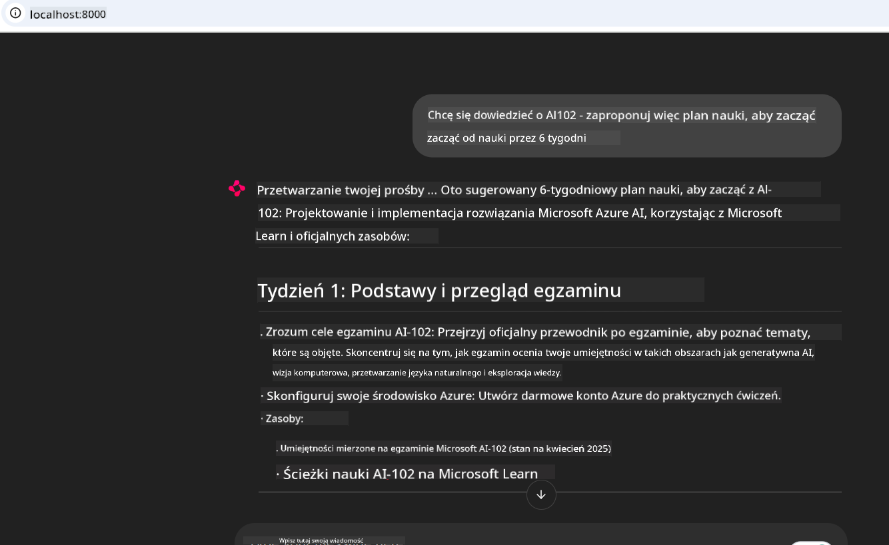

<!--
CO_OP_TRANSLATOR_METADATA:
{
  "original_hash": "4319d291c9d124ecafea52b3d04bfa0e",
  "translation_date": "2025-07-14T06:23:40+00:00",
  "source_file": "09-CaseStudy/docs-mcp/README.md",
  "language_code": "pl"
}
-->
# Studium przypadku: Łączenie się z serwerem Microsoft Learn Docs MCP z klienta

Czy zdarzyło Ci się kiedyś żonglować między stronami dokumentacji, Stack Overflow i nieskończoną liczbą kart w przeglądarce, próbując rozwiązać problem w swoim kodzie? Może masz drugi monitor tylko do dokumentacji albo ciągle przełączasz się między IDE a przeglądarką. Czy nie byłoby lepiej, gdyby dokumentacja była dostępna bezpośrednio w Twoim środowisku pracy — zintegrowana z aplikacjami, IDE lub nawet własnymi narzędziami? W tym studium przypadku pokażemy, jak to zrobić, łącząc się bezpośrednio z serwerem Microsoft Learn Docs MCP z własnej aplikacji klienckiej.

## Przegląd

Nowoczesne programowanie to nie tylko pisanie kodu — to także znajdowanie właściwych informacji we właściwym czasie. Dokumentacja jest wszędzie, ale rzadko tam, gdzie jest najbardziej potrzebna: w Twoich narzędziach i procesach pracy. Integrując pobieranie dokumentacji bezpośrednio z aplikacji, możesz zaoszczędzić czas, ograniczyć przełączanie kontekstu i zwiększyć produktywność. W tej sekcji pokażemy, jak połączyć klienta z serwerem Microsoft Learn Docs MCP, aby uzyskać dostęp do dokumentacji w czasie rzeczywistym, dostosowanej do kontekstu, bez opuszczania aplikacji.

Przeprowadzimy Cię przez proces nawiązywania połączenia, wysyłania zapytania i efektywnego obsługiwania strumieniowych odpowiedzi. Takie podejście nie tylko usprawnia pracę, ale także otwiera drzwi do tworzenia inteligentniejszych, bardziej pomocnych narzędzi dla programistów.

## Cele nauki

Dlaczego to robimy? Bo najlepsze doświadczenia programistyczne to te, które eliminują przeszkody. Wyobraź sobie świat, w którym Twój edytor kodu, chatbot lub aplikacja webowa mogą natychmiast odpowiadać na pytania dotyczące dokumentacji, korzystając z najnowszych treści Microsoft Learn. Po zakończeniu tego rozdziału będziesz potrafił:

- Zrozumieć podstawy komunikacji klient-serwer MCP dla dokumentacji
- Zaimplementować aplikację konsolową lub webową łączącą się z serwerem Microsoft Learn Docs MCP
- Korzystać ze strumieniowych klientów HTTP do pobierania dokumentacji w czasie rzeczywistym
- Logować i interpretować odpowiedzi dokumentacji w swojej aplikacji

Zobaczysz, jak te umiejętności pomogą Ci tworzyć narzędzia, które są nie tylko reaktywne, ale naprawdę interaktywne i świadome kontekstu.

## Scenariusz 1 - Pobieranie dokumentacji w czasie rzeczywistym z MCP

W tym scenariuszu pokażemy, jak połączyć klienta z serwerem Microsoft Learn Docs MCP, aby uzyskać dostęp do dokumentacji w czasie rzeczywistym, dostosowanej do kontekstu, bez opuszczania aplikacji.

Przejdźmy do praktyki. Twoim zadaniem jest napisanie aplikacji, która łączy się z serwerem Microsoft Learn Docs MCP, wywołuje narzędzie `microsoft_docs_search` i loguje strumieniową odpowiedź w konsoli.

### Dlaczego takie podejście?
Bo to podstawa do budowania bardziej zaawansowanych integracji — niezależnie od tego, czy chcesz zasilić chatbota, rozszerzenie IDE czy pulpit webowy.

Kod i instrukcje do tego scenariusza znajdziesz w folderze [`solution`](./solution/README.md) w ramach tego studium przypadku. Kroki przeprowadzą Cię przez konfigurację połączenia:
- Użyj oficjalnego SDK MCP i strumieniowego klienta HTTP do nawiązania połączenia
- Wywołaj narzędzie `microsoft_docs_search` z parametrem zapytania, aby pobrać dokumentację
- Zaimplementuj odpowiednie logowanie i obsługę błędów
- Stwórz interaktywny interfejs konsolowy, który pozwoli użytkownikom wpisywać wiele zapytań

Ten scenariusz pokazuje, jak:
- Połączyć się z serwerem Docs MCP
- Wysłać zapytanie
- Przetworzyć i wyświetlić wyniki

Tak może wyglądać uruchomienie rozwiązania:

```
Prompt> What is Azure Key Vault?
Answer> Azure Key Vault is a cloud service for securely storing and accessing secrets. ...
```

Poniżej znajduje się minimalny przykładowy kod. Pełny kod i szczegóły dostępne są w folderze rozwiązania.

<details>
<summary>Python</summary>

```python
import asyncio
from mcp.client.streamable_http import streamablehttp_client
from mcp import ClientSession

async def main():
    async with streamablehttp_client("https://learn.microsoft.com/api/mcp") as (read_stream, write_stream, _):
        async with ClientSession(read_stream, write_stream) as session:
            await session.initialize()
            result = await session.call_tool("microsoft_docs_search", {"query": "Azure Functions best practices"})
            print(result.content)

if __name__ == "__main__":
    asyncio.run(main())
```

- Pełną implementację i logowanie znajdziesz w pliku [`scenario1.py`](../../../../09-CaseStudy/docs-mcp/solution/python/scenario1.py).
- Instrukcje instalacji i użytkowania znajdują się w pliku [`README.md`](./solution/python/README.md) w tym samym folderze.
</details>

## Scenariusz 2 - Interaktywna aplikacja webowa do generowania planu nauki z MCP

W tym scenariuszu nauczysz się, jak zintegrować Docs MCP z projektem webowym. Celem jest umożliwienie użytkownikom wyszukiwania dokumentacji Microsoft Learn bezpośrednio z interfejsu webowego, dzięki czemu dokumentacja będzie natychmiast dostępna w Twojej aplikacji lub na stronie.

Zobaczysz, jak:
- Skonfigurować aplikację webową
- Połączyć się z serwerem Docs MCP
- Obsłużyć dane wejściowe użytkownika i wyświetlić wyniki

Tak może wyglądać uruchomienie rozwiązania:

```
User> I want to learn about AI102 - so suggest the roadmap to get it started from learn for 6 weeks

Assistant> Here’s a detailed 6-week roadmap to start your preparation for the AI-102: Designing and Implementing a Microsoft Azure AI Solution certification, using official Microsoft resources and focusing on exam skills areas:

---
## Week 1: Introduction & Fundamentals
- **Understand the Exam**: Review the [AI-102 exam skills outline](https://learn.microsoft.com/en-us/credentials/certifications/exams/ai-102/).
- **Set up Azure**: Sign up for a free Azure account if you don't have one.
- **Learning Path**: [Introduction to Azure AI services](https://learn.microsoft.com/en-us/training/modules/intro-to-azure-ai/)
- **Focus**: Get familiar with Azure portal, AI capabilities, and necessary tools.

....more weeks of the roadmap...

Let me know if you want module-specific recommendations or need more customized weekly tasks!
```

Poniżej znajduje się minimalny przykładowy kod. Pełny kod i szczegóły dostępne są w folderze rozwiązania.



<details>
<summary>Python (Chainlit)</summary>

Chainlit to framework do tworzenia konwersacyjnych aplikacji AI w sieci. Ułatwia tworzenie interaktywnych chatbotów i asystentów, którzy mogą wywoływać narzędzia MCP i wyświetlać wyniki w czasie rzeczywistym. Idealny do szybkiego prototypowania i przyjaznych interfejsów użytkownika.

```python
import chainlit as cl
import requests

MCP_URL = "https://learn.microsoft.com/api/mcp"

@cl.on_message
def handle_message(message):
    query = {"question": message}
    response = requests.post(MCP_URL, json=query)
    if response.ok:
        result = response.json()
        cl.Message(content=result.get("answer", "No answer found.")).send()
    else:
        cl.Message(content="Error: " + response.text).send()
```

- Pełną implementację znajdziesz w pliku [`scenario2.py`](../../../../09-CaseStudy/docs-mcp/solution/python/scenario2.py).
- Instrukcje konfiguracji i uruchomienia znajdują się w pliku [`README.md`](./solution/python/README.md).
</details>

## Scenariusz 3: Dokumentacja w edytorze z serwerem MCP w VS Code

Jeśli chcesz mieć Microsoft Learn Docs bezpośrednio w VS Code (zamiast przełączać się między kartami przeglądarki), możesz użyć serwera MCP w swoim edytorze. Pozwala to na:
- Wyszukiwanie i czytanie dokumentacji w VS Code bez opuszczania środowiska kodowania.
- Odwoływanie się do dokumentacji i wstawianie linków bezpośrednio do plików README lub kursów.
- Wykorzystanie GitHub Copilot i MCP razem dla płynnego, wspieranego AI przepływu pracy z dokumentacją.

**Zobaczysz, jak:**
- Dodać poprawny plik `.vscode/mcp.json` do katalogu głównego projektu (przykład poniżej).
- Otworzyć panel MCP lub użyć palety poleceń w VS Code, aby wyszukiwać i wstawiać dokumentację.
- Odwoływać się do dokumentacji bezpośrednio w plikach markdown podczas pracy.
- Połączyć ten sposób pracy z GitHub Copilot dla jeszcze większej produktywności.

Oto przykład konfiguracji serwera MCP w VS Code:

```json
{
  "servers": {
    "LearnDocsMCP": {
      "url": "https://learn.microsoft.com/api/mcp"
    }
  }
}
```

</details>

> Aby uzyskać szczegółowy przewodnik ze zrzutami ekranu i krok po kroku, zobacz [`README.md`](./solution/scenario3/README.md).


To podejście jest idealne dla osób tworzących kursy techniczne, piszących dokumentację lub rozwijających kod z częstą potrzebą odwołań.

## Najważniejsze wnioski

Integracja dokumentacji bezpośrednio z narzędziami to nie tylko wygoda — to prawdziwa zmiana w produktywności. Łącząc się z serwerem Microsoft Learn Docs MCP z klienta, możesz:

- Wyeliminować przełączanie kontekstu między kodem a dokumentacją
- Pobierać aktualną, dostosowaną do kontekstu dokumentację w czasie rzeczywistym
- Tworzyć inteligentniejsze, bardziej interaktywne narzędzia dla programistów

Te umiejętności pomogą Ci tworzyć rozwiązania, które są nie tylko efektywne, ale też przyjemne w użyciu.

## Dodatkowe zasoby

Aby pogłębić wiedzę, zapoznaj się z tymi oficjalnymi materiałami:

- [Microsoft Learn Docs MCP Server (GitHub)](https://github.com/MicrosoftDocs/mcp)
- [Pierwsze kroki z Azure MCP Server (mcp-python)](https://learn.microsoft.com/en-us/azure/developer/azure-mcp-server/get-started#create-the-python-app)
- [Czym jest Azure MCP Server?](https://learn.microsoft.com/en-us/azure/developer/azure-mcp-server/)
- [Wprowadzenie do Model Context Protocol (MCP)](https://modelcontextprotocol.io/introduction)
- [Dodawanie wtyczek z serwera MCP (Python)](https://learn.microsoft.com/en-us/semantic-kernel/concepts/plugins/adding-mcp-plugins)

**Zastrzeżenie**:  
Niniejszy dokument został przetłumaczony przy użyciu usługi tłumaczenia AI [Co-op Translator](https://github.com/Azure/co-op-translator). Mimo że dążymy do dokładności, prosimy mieć na uwadze, że automatyczne tłumaczenia mogą zawierać błędy lub nieścisłości. Oryginalny dokument w języku źródłowym powinien być uznawany za źródło autorytatywne. W przypadku informacji krytycznych zalecane jest skorzystanie z profesjonalnego tłumaczenia wykonanego przez człowieka. Nie ponosimy odpowiedzialności za jakiekolwiek nieporozumienia lub błędne interpretacje wynikające z korzystania z tego tłumaczenia.