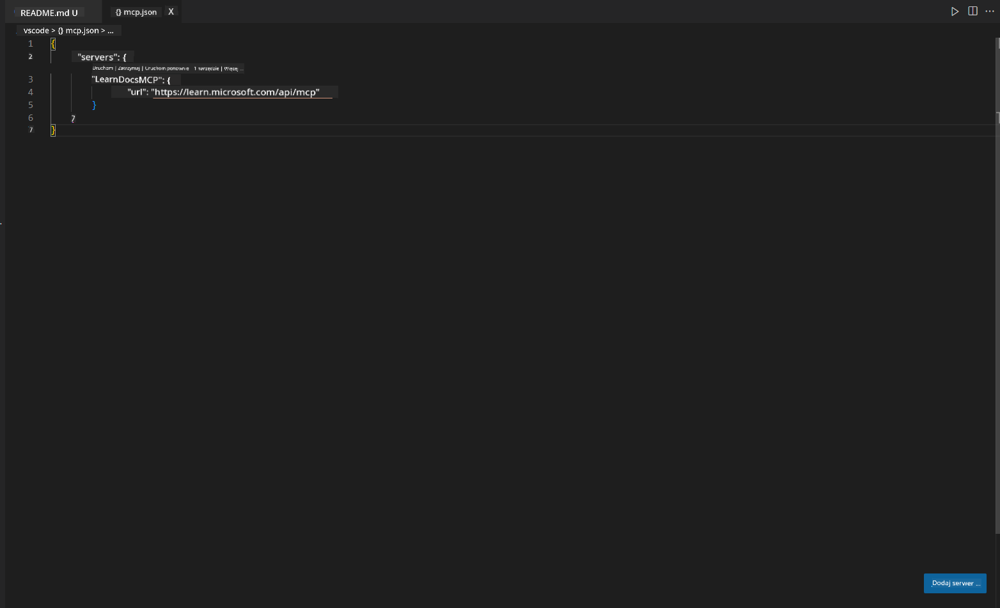
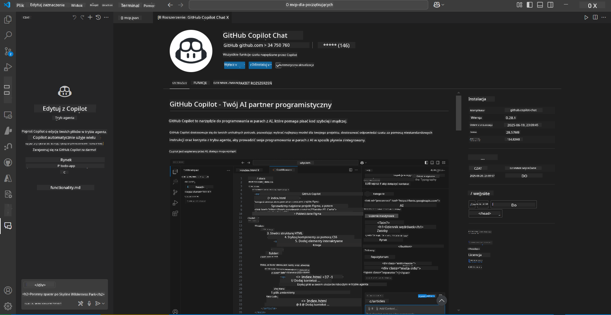
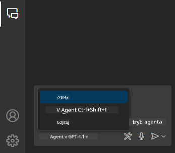
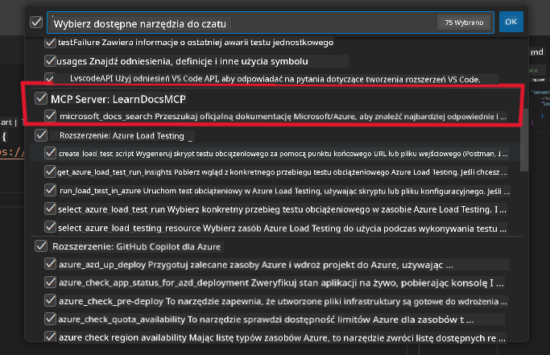
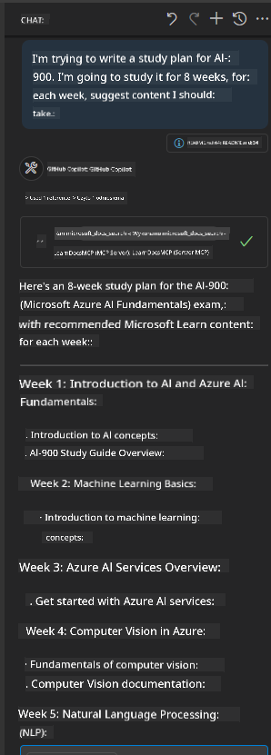
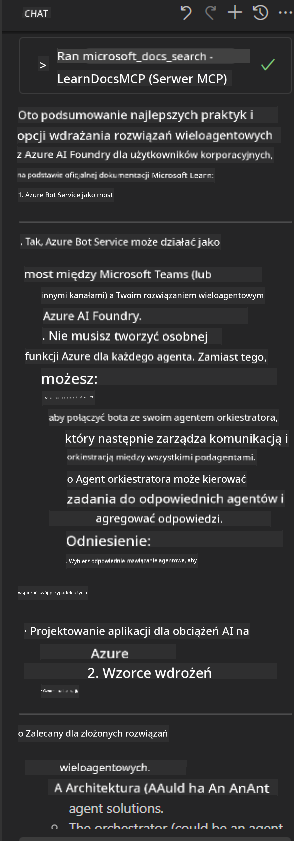

<!--
CO_OP_TRANSLATOR_METADATA:
{
  "original_hash": "db532b1ec386c9ce38c791653dc3c881",
  "translation_date": "2025-07-14T06:51:07+00:00",
  "source_file": "09-CaseStudy/docs-mcp/solution/scenario3/README.md",
  "language_code": "pl"
}
-->
# Scenariusz 3: Dokumentacja w edytorze z serwerem MCP w VS Code

## Przegląd

W tym scenariuszu nauczysz się, jak wprowadzić Microsoft Learn Docs bezpośrednio do środowiska Visual Studio Code za pomocą serwera MCP. Zamiast ciągłego przełączania się między kartami przeglądarki w poszukiwaniu dokumentacji, możesz uzyskać dostęp, wyszukiwać i odwoływać się do oficjalnych materiałów bezpośrednio w edytorze. Takie podejście usprawnia Twój workflow, pozwala zachować koncentrację i umożliwia płynną integrację z narzędziami takimi jak GitHub Copilot.

- Wyszukuj i czytaj dokumentację w VS Code, nie opuszczając środowiska kodowania.
- Odwołuj się do dokumentacji i wstawiaj linki bezpośrednio do plików README lub materiałów kursu.
- Korzystaj jednocześnie z GitHub Copilot i MCP, aby uzyskać płynny, wspomagany AI workflow dokumentacyjny.

## Cele nauki

Pod koniec tego rozdziału będziesz wiedzieć, jak skonfigurować i używać serwera MCP w VS Code, aby usprawnić swoją pracę z dokumentacją i proces tworzenia oprogramowania. Będziesz potrafił:

- Skonfigurować swoje środowisko pracy do korzystania z serwera MCP w celu wyszukiwania dokumentacji.
- Wyszukiwać i wstawiać dokumentację bezpośrednio z poziomu VS Code.
- Łączyć możliwości GitHub Copilot i MCP, aby zwiększyć produktywność dzięki wsparciu AI.

Te umiejętności pomogą Ci zachować koncentrację, poprawić jakość dokumentacji i zwiększyć efektywność jako programista lub autor techniczny.

## Rozwiązanie

Aby uzyskać dostęp do dokumentacji w edytorze, wykonasz serię kroków integrujących serwer MCP z VS Code i GitHub Copilot. To rozwiązanie jest idealne dla autorów kursów, twórców dokumentacji i programistów, którzy chcą pozostać skupieni w edytorze podczas pracy z dokumentami i Copilotem.

- Szybko dodawaj linki referencyjne do README podczas pisania dokumentacji kursu lub projektu.
- Korzystaj z Copilota do generowania kodu i MCP do natychmiastowego znajdowania i cytowania odpowiednich materiałów.
- Zachowaj skupienie w edytorze i zwiększ produktywność.

### Przewodnik krok po kroku

Aby zacząć, wykonaj następujące kroki. Do każdego kroku możesz dodać zrzut ekranu z folderu assets, aby wizualnie zobrazować proces.

1. **Dodaj konfigurację MCP:**  
   W katalogu głównym projektu utwórz plik `.vscode/mcp.json` i dodaj następującą konfigurację:  
   ```json
   {
     "servers": {
       "LearnDocsMCP": {
         "url": "https://learn.microsoft.com/api/mcp"
       }
     }
   }
   ```  
   Ta konfiguracja informuje VS Code, jak połączyć się z [`Microsoft Learn Docs MCP server`](https://github.com/MicrosoftDocs/mcp).  
   
   
    
2. **Otwórz panel GitHub Copilot Chat:**  
   Jeśli nie masz jeszcze zainstalowanego rozszerzenia GitHub Copilot, przejdź do widoku Extensions w VS Code i zainstaluj je. Możesz pobrać je bezpośrednio z [Visual Studio Code Marketplace](https://marketplace.visualstudio.com/items?itemName=GitHub.copilot-chat). Następnie otwórz panel Copilot Chat z paska bocznego.  
   
   

3. **Włącz tryb agenta i zweryfikuj narzędzia:**  
   W panelu Copilot Chat włącz tryb agenta.  
   
     
   
   Po włączeniu trybu agenta sprawdź, czy serwer MCP jest wymieniony jako jedno z dostępnych narzędzi. To zapewnia, że agent Copilot ma dostęp do serwera dokumentacji, aby pobierać odpowiednie informacje.  
   
   

4. **Rozpocznij nową rozmowę i zadaj pytanie agentowi:**  
   Otwórz nową rozmowę w panelu Copilot Chat. Teraz możesz zadawać agentowi pytania dotyczące dokumentacji. Agent użyje serwera MCP, aby pobrać i wyświetlić odpowiednie materiały Microsoft Learn bezpośrednio w edytorze.  

   - *"Próbuję napisać plan nauki dla tematu X. Zamierzam uczyć się go przez 8 tygodni, na każdy tydzień zasugeruj treści, które powinienem przerobić."*  
   
   

5. **Zapytania na żywo:**  

   > Weźmy przykład zapytania z sekcji [#get-help](https://discord.gg/D6cRhjHWSC) na Discordzie Azure AI Foundry ([zobacz oryginalną wiadomość](https://discord.com/channels/1113626258182504448/1385498306720829572)):  
   
   *"Szukam odpowiedzi, jak wdrożyć rozwiązanie wieloagentowe z agentami AI rozwijanymi na platformie Azure AI Foundry. Widzę, że nie ma bezpośredniej metody wdrożenia, takiej jak kanały Copilot Studio. Jakie są różne sposoby wdrożenia, aby użytkownicy korporacyjni mogli współdziałać i wykonać zadanie?  
   Istnieje wiele artykułów/blogów, które mówią, że można użyć usługi Azure Bot jako pomostu między MS Teams a agentami Azure AI Foundry. Czy to zadziała, jeśli skonfiguruję Azure Bot, który łączy się z Orchestrator Agent na Azure AI Foundry za pomocą funkcji Azure do orkiestracji, czy muszę stworzyć funkcję Azure dla każdego agenta AI w rozwiązaniu wieloagentowym, aby wykonać orkiestrację w Bot Framework? Inne sugestie są mile widziane."*  
   
     
   
   Agent odpowie odpowiednimi linkami do dokumentacji i podsumowaniami, które możesz bezpośrednio wstawić do swoich plików markdown lub użyć jako odniesienia w kodzie.

### Przykładowe zapytania

Oto kilka przykładowych zapytań, które możesz wypróbować. Pokażą one, jak serwer MCP i Copilot mogą współpracować, aby zapewnić natychmiastową, kontekstową dokumentację i odniesienia bez opuszczania VS Code:

- "Pokaż mi, jak używać triggerów Azure Functions."
- "Wstaw link do oficjalnej dokumentacji Azure Key Vault."
- "Jakie są najlepsze praktyki zabezpieczania zasobów Azure?"
- "Znajdź szybki start dla usług Azure AI."

Te zapytania pokażą, jak serwer MCP i Copilot mogą współpracować, aby zapewnić natychmiastową, kontekstową dokumentację i odniesienia bez opuszczania VS Code.

---

**Zastrzeżenie**:  
Niniejszy dokument został przetłumaczony przy użyciu usługi tłumaczenia AI [Co-op Translator](https://github.com/Azure/co-op-translator). Chociaż dokładamy starań, aby tłumaczenie było jak najbardziej precyzyjne, prosimy mieć na uwadze, że automatyczne tłumaczenia mogą zawierać błędy lub nieścisłości. Oryginalny dokument w języku źródłowym powinien być uznawany za źródło autorytatywne. W przypadku informacji o kluczowym znaczeniu zalecane jest skorzystanie z profesjonalnego tłumaczenia wykonanego przez człowieka. Nie ponosimy odpowiedzialności za jakiekolwiek nieporozumienia lub błędne interpretacje wynikające z korzystania z tego tłumaczenia.