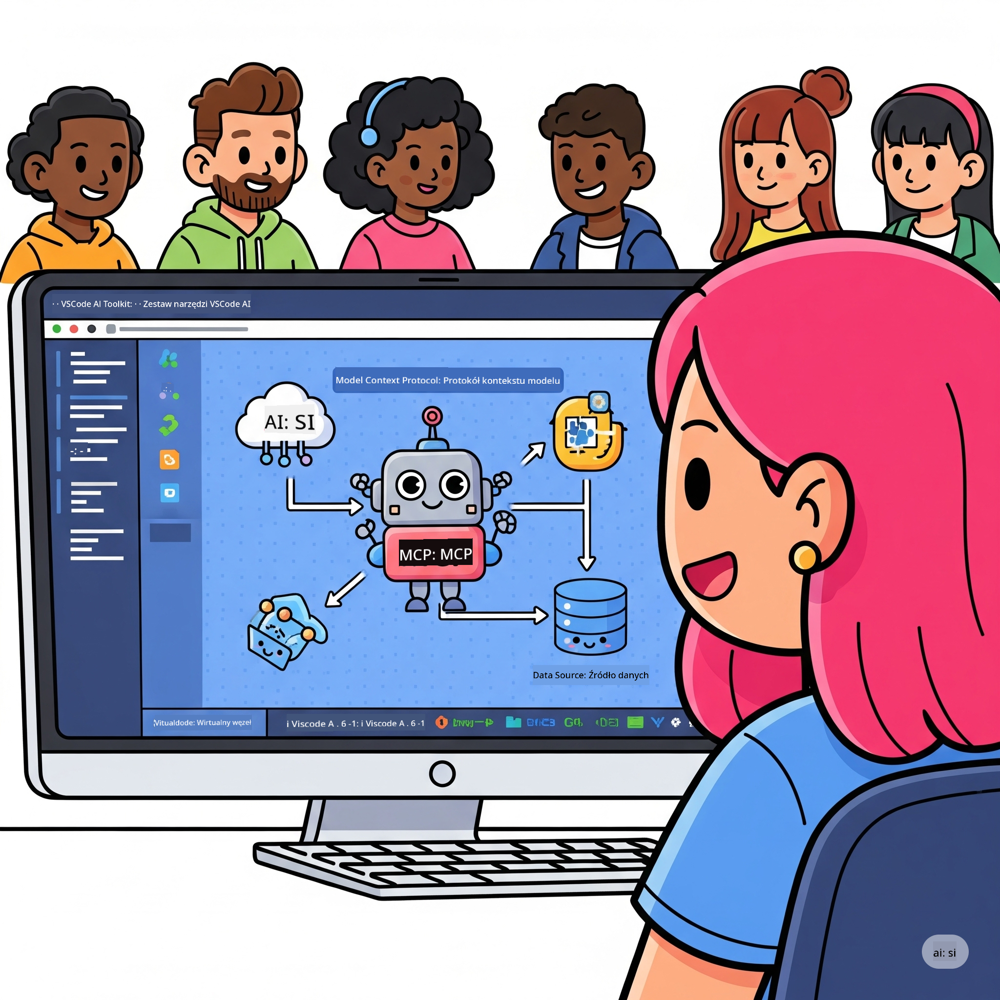

<!--
CO_OP_TRANSLATOR_METADATA:
{
  "original_hash": "1b000fd6e1b04c047578bfc5d07d54eb",
  "translation_date": "2025-07-29T01:36:50+00:00",
  "source_file": "10-StreamliningAIWorkflowsBuildingAnMCPServerWithAIToolkit/README.md",
  "language_code": "pl"
}
-->
# Usprawnianie Pracy z AI: Tworzenie Serwera MCP za pomocą AI Toolkit

## 🎯 Przegląd

_(Kliknij obrazek powyżej, aby obejrzeć wideo z tej lekcji)_

Witamy na **Warsztatach Model Context Protocol (MCP)**! Ten kompleksowy warsztat praktyczny łączy dwie nowoczesne technologie, które rewolucjonizują rozwój aplikacji AI:

- **🔗 Model Context Protocol (MCP)**: Otwarty standard dla bezproblemowej integracji narzędzi AI
- **🛠️ AI Toolkit dla Visual Studio Code (AITK)**: Potężne rozszerzenie Microsoftu do tworzenia aplikacji AI

### 🎓 Czego się nauczysz

Po ukończeniu tego warsztatu opanujesz sztukę budowania inteligentnych aplikacji, które łączą modele AI z rzeczywistymi narzędziami i usługami. Od automatycznego testowania po niestandardowe integracje API – zdobędziesz praktyczne umiejętności rozwiązywania złożonych wyzwań biznesowych.

## 🏗️ Stos Technologiczny

### 🔌 Model Context Protocol (MCP)

MCP to **"USB-C dla AI"** – uniwersalny standard łączący modele AI z zewnętrznymi narzędziami i źródłami danych.

**✨ Kluczowe Funkcje:**

- 🔄 **Standaryzowana Integracja**: Uniwersalny interfejs do łączenia narzędzi AI
- 🏛️ **Elastyczna Architektura**: Lokalne i zdalne serwery przez stdio/SSE
- 🧰 **Bogaty Ekosystem**: Narzędzia, podpowiedzi i zasoby w jednym protokole
- 🔒 **Gotowość dla Przedsiębiorstw**: Wbudowane bezpieczeństwo i niezawodność

**🎯 Dlaczego MCP jest ważne:**
Podobnie jak USB-C wyeliminowało chaos kabli, MCP eliminuje złożoność integracji AI. Jeden protokół, nieskończone możliwości.

### 🤖 AI Toolkit dla Visual Studio Code (AITK)

Flagowe rozszerzenie Microsoftu do tworzenia aplikacji AI, które przekształca VS Code w potężne narzędzie AI.

**🚀 Kluczowe Możliwości:**

- 📦 **Katalog Modeli**: Dostęp do modeli z Azure AI, GitHub, Hugging Face, Ollama
- ⚡ **Lokalne Wnioskowanie**: Wykorzystanie ONNX na CPU/GPU/NPU
- 🏗️ **Agent Builder**: Wizualne tworzenie agentów AI z integracją MCP
- 🎭 **Multi-Modalność**: Obsługa tekstu, obrazu i danych strukturalnych

**💡 Korzyści dla Twórców:**

- Wdrożenie modeli bez konfiguracji
- Wizualne projektowanie podpowiedzi
- Interaktywne środowisko testowe
- Bezproblemowa integracja z serwerami MCP

## 📚 Ścieżka Nauki

### [🚀 Moduł 1: Podstawy AI Toolkit](./lab1/README.md)

**Czas trwania**: 15 minut

- 🛠️ Instalacja i konfiguracja AI Toolkit dla VS Code
- 🗂️ Eksploracja Katalogu Modeli (ponad 100 modeli z GitHub, ONNX, OpenAI, Anthropic, Google)
- 🎮 Opanowanie Interaktywnego Środowiska Testowego do testowania modeli w czasie rzeczywistym
- 🤖 Tworzenie pierwszego agenta AI za pomocą Agent Builder
- 📊 Ocena wydajności modeli za pomocą wbudowanych metryk (F1, trafność, podobieństwo, spójność)
- ⚡ Nauka przetwarzania wsadowego i obsługi multi-modalności

**🎯 Efekt nauki**: Stworzenie funkcjonalnego agenta AI z pełnym zrozumieniem możliwości AITK

### [🌐 Moduł 2: Podstawy MCP z AI Toolkit](./lab2/README.md)

**Czas trwania**: 20 minut

- 🧠 Opanowanie architektury i koncepcji Model Context Protocol (MCP)
- 🌐 Eksploracja ekosystemu serwerów MCP Microsoftu
- 🤖 Tworzenie agenta automatyzacji przeglądarki za pomocą serwera MCP Playwright
- 🔧 Integracja serwerów MCP z Agent Builder w AI Toolkit
- 📊 Konfiguracja i testowanie narzędzi MCP w agentach
- 🚀 Eksport i wdrożenie agentów zasilanych MCP do produkcji

**🎯 Efekt nauki**: Wdrożenie agenta AI wzbogaconego o zewnętrzne narzędzia dzięki MCP

### [🔧 Moduł 3: Zaawansowany Rozwój MCP z AI Toolkit](./lab3/README.md)

**Czas trwania**: 20 minut

- 💻 Tworzenie niestandardowych serwerów MCP za pomocą AI Toolkit
- 🐍 Konfiguracja i użycie najnowszego MCP Python SDK (v1.9.3)
- 🔍 Ustawienie i wykorzystanie MCP Inspector do debugowania
- 🛠️ Budowa serwera MCP Pogody z profesjonalnymi przepływami debugowania
- 🧪 Debugowanie serwerów MCP w środowiskach Agent Builder i Inspector

**🎯 Efekt nauki**: Tworzenie i debugowanie niestandardowych serwerów MCP za pomocą nowoczesnych narzędzi

### [🐙 Moduł 4: Praktyczny Rozwój MCP - Niestandardowy Serwer Klonowania GitHub](./lab4/README.md)

**Czas trwania**: 30 minut

- 🏗️ Tworzenie rzeczywistego serwera MCP Klonowania GitHub dla przepływów pracy deweloperskiej
- 🔄 Implementacja inteligentnego klonowania repozytoriów z walidacją i obsługą błędów
- 📁 Tworzenie inteligentnego zarządzania katalogami i integracji z VS Code
- 🤖 Wykorzystanie trybu agenta GitHub Copilot z niestandardowymi narzędziami MCP
- 🛡️ Zastosowanie niezawodności gotowej do produkcji i kompatybilności międzyplatformowej

**🎯 Efekt nauki**: Wdrożenie gotowego do produkcji serwera MCP, który usprawnia rzeczywiste przepływy pracy deweloperskiej

## 💡 Zastosowania i Wpływ w Rzeczywistości

### 🏢 Przypadki Użycia w Przedsiębiorstwach

#### 🔄 Automatyzacja DevOps

Przekształć swój przepływ pracy dzięki inteligentnej automatyzacji:

- **Inteligentne Zarządzanie Repozytoriami**: Recenzje kodu i decyzje o scalaniu napędzane AI
- **Inteligentne CI/CD**: Automatyczna optymalizacja pipeline'ów na podstawie zmian w kodzie
- **Klasyfikacja Problemów**: Automatyczne przypisywanie i klasyfikacja błędów

#### 🧪 Rewolucja w Zapewnianiu Jakości

Podnieś poziom testowania dzięki automatyzacji napędzanej AI:

- **Inteligentne Generowanie Testów**: Automatyczne tworzenie kompleksowych zestawów testów
- **Testy Wizualnej Regresji**: Wykrywanie zmian w interfejsie użytkownika za pomocą AI
- **Monitorowanie Wydajności**: Proaktywne identyfikowanie i rozwiązywanie problemów

#### 📊 Inteligencja w Przepływach Danych

Twórz inteligentniejsze przepływy przetwarzania danych:

- **Adaptacyjne Procesy ETL**: Samooptymalizujące się transformacje danych
- **Wykrywanie Anomalii**: Monitorowanie jakości danych w czasie rzeczywistym
- **Inteligentne Kierowanie**: Inteligentne zarządzanie przepływem danych

#### 🎧 Ulepszanie Doświadczeń Klienta

Twórz wyjątkowe interakcje z klientami:

- **Wsparcie Świadome Kontekstu**: Agenci AI z dostępem do historii klienta
- **Proaktywne Rozwiązywanie Problemów**: Predykcyjna obsługa klienta
- **Integracja Wielokanałowa**: Ujednolicone doświadczenie AI na różnych platformach

## 🛠️ Wymagania i Konfiguracja

### 💻 Wymagania Systemowe

| Komponent | Wymaganie | Uwagi |
|-----------|-----------|-------|
| **System Operacyjny** | Windows 10+, macOS 10.15+, Linux | Dowolny nowoczesny system operacyjny |
| **Visual Studio Code** | Najnowsza stabilna wersja | Wymagane dla AITK |
| **Node.js** | v18.0+ i npm | Do tworzenia serwerów MCP |
| **Python** | 3.10+ | Opcjonalne dla serwerów MCP w Pythonie |
| **Pamięć** | Minimum 8GB RAM | 16GB zalecane dla lokalnych modeli |

### 🔧 Środowisko Deweloperskie

#### Zalecane Rozszerzenia VS Code

- **AI Toolkit** (ms-windows-ai-studio.windows-ai-studio)
- **Python** (ms-python.python)
- **Python Debugger** (ms-python.debugpy)
- **GitHub Copilot** (GitHub.copilot) – Opcjonalne, ale przydatne

#### Opcjonalne Narzędzia

- **uv**: Nowoczesny menedżer pakietów Python
- **MCP Inspector**: Wizualne narzędzie do debugowania serwerów MCP
- **Playwright**: Do przykładów automatyzacji przeglądarki

## 🎖️ Efekty Nauki i Ścieżka Certyfikacji

### 🏆 Lista Kontrolna Umiejętności

Po ukończeniu tego warsztatu osiągniesz biegłość w:

#### 🎯 Kluczowe Kompetencje

- [ ] **Mistrzostwo w Protokole MCP**: Dogłębne zrozumienie architektury i wzorców implementacji
- [ ] **Biegłość w AITK**: Eksperckie wykorzystanie AI Toolkit do szybkiego rozwoju
- [ ] **Tworzenie Niestandardowych Serwerów**: Budowa, wdrażanie i utrzymanie serwerów MCP
- [ ] **Integracja Narzędzi**: Bezproblemowe łączenie AI z istniejącymi przepływami pracy
- [ ] **Zastosowanie Rozwiązań**: Wykorzystanie zdobytych umiejętności do rozwiązywania rzeczywistych wyzwań biznesowych

#### 🔧 Umiejętności Techniczne

- [ ] Konfiguracja AI Toolkit w VS Code
- [ ] Projektowanie i implementacja niestandardowych serwerów MCP
- [ ] Integracja modeli GitHub z architekturą MCP
- [ ] Tworzenie zautomatyzowanych przepływów testowych z Playwright
- [ ] Wdrożenie agentów AI do produkcji
- [ ] Debugowanie i optymalizacja wydajności serwerów MCP

#### 🚀 Zaawansowane Możliwości

- [ ] Projektowanie integracji AI na skalę przedsiębiorstwa
- [ ] Wdrażanie najlepszych praktyk bezpieczeństwa dla aplikacji AI
- [ ] Projektowanie skalowalnych architektur serwerów MCP
- [ ] Tworzenie niestandardowych łańcuchów narzędzi dla specyficznych dziedzin
- [ ] Mentoring w zakresie rozwoju aplikacji AI

## 📖 Dodatkowe Zasoby

- [Specyfikacja MCP](https://modelcontextprotocol.io/docs)
- [Repozytorium GitHub AI Toolkit](https://github.com/microsoft/vscode-ai-toolkit)
- [Kolekcja Przykładowych Serwerów MCP](https://github.com/modelcontextprotocol/servers)
- [Przewodnik Najlepszych Praktyk](https://modelcontextprotocol.io/docs/best-practices)

---

**🚀 Gotowy, aby zrewolucjonizować swój przepływ pracy z AI?**

Budujmy razem przyszłość inteligentnych aplikacji z MCP i AI Toolkit!

**Zastrzeżenie**:  
Ten dokument został przetłumaczony za pomocą usługi tłumaczenia AI [Co-op Translator](https://github.com/Azure/co-op-translator). Chociaż staramy się zapewnić dokładność, prosimy mieć na uwadze, że automatyczne tłumaczenia mogą zawierać błędy lub nieścisłości. Oryginalny dokument w jego rodzimym języku powinien być uznawany za wiarygodne źródło. W przypadku informacji krytycznych zaleca się skorzystanie z profesjonalnego tłumaczenia przez człowieka. Nie ponosimy odpowiedzialności za jakiekolwiek nieporozumienia lub błędne interpretacje wynikające z użycia tego tłumaczenia.