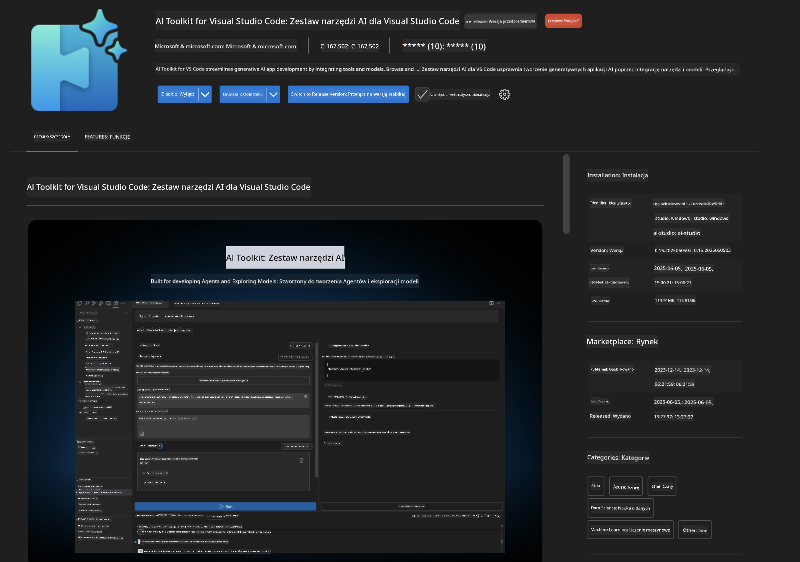
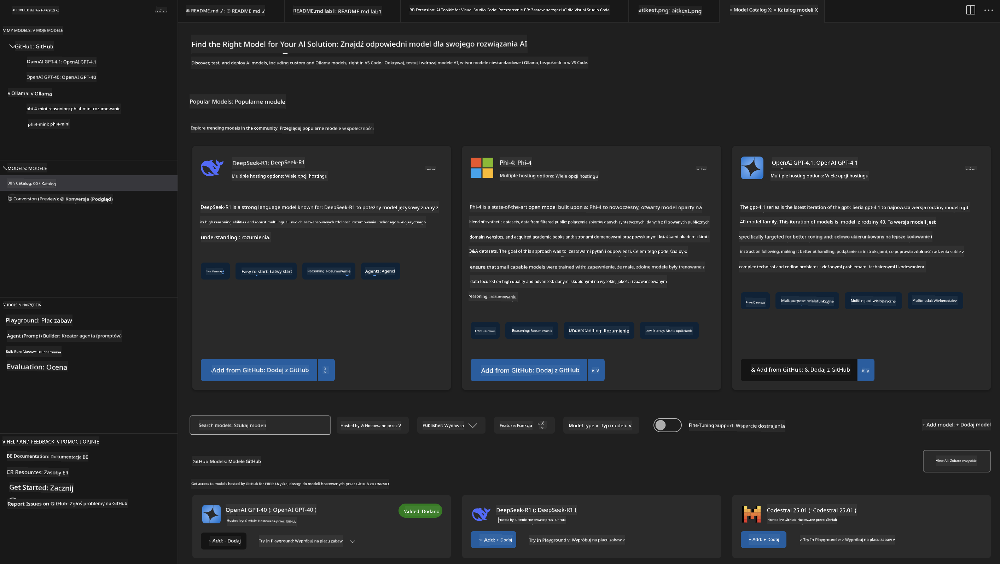
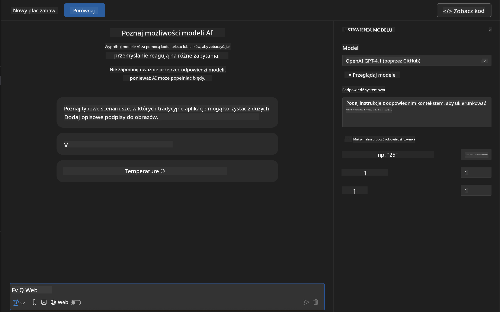
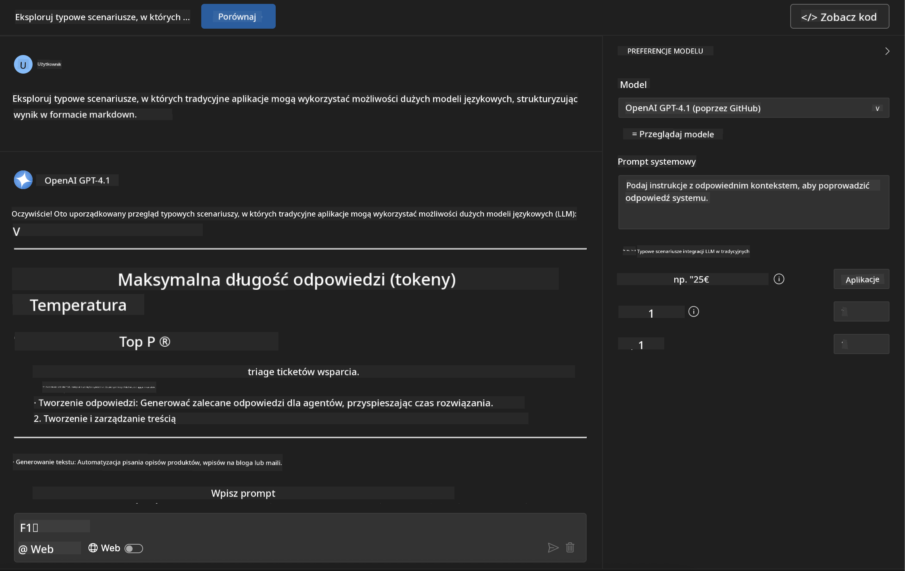
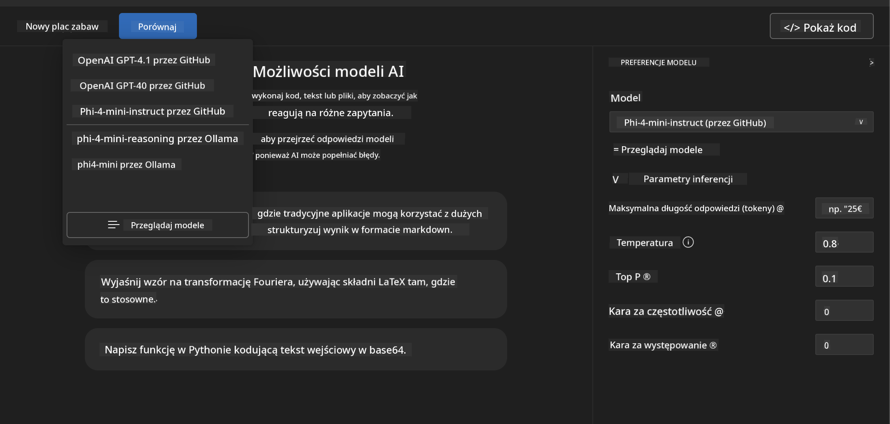
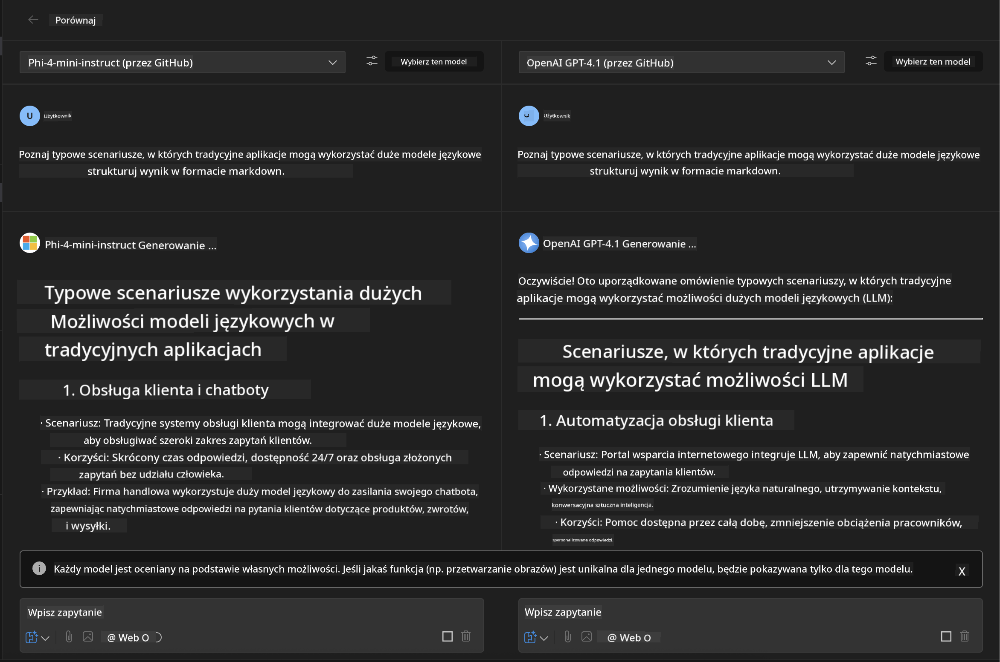
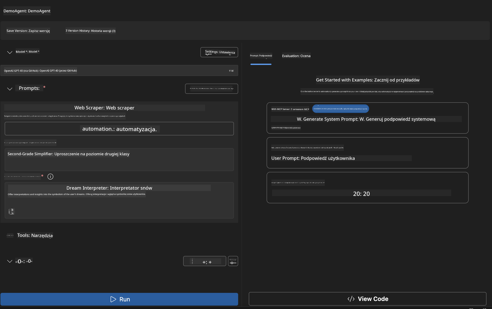
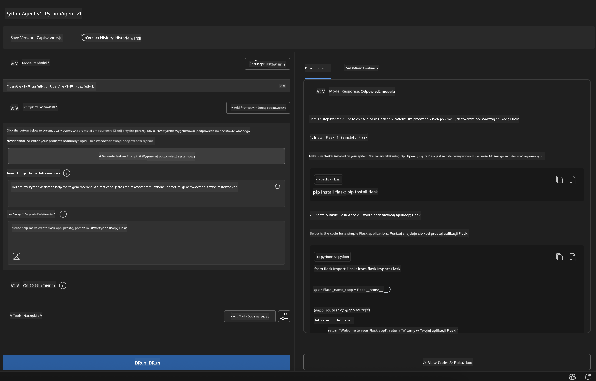

<!--
CO_OP_TRANSLATOR_METADATA:
{
  "original_hash": "2aa9dbc165e104764fa57e8a0d3f1c73",
  "translation_date": "2025-07-14T07:26:19+00:00",
  "source_file": "10-StreamliningAIWorkflowsBuildingAnMCPServerWithAIToolkit/lab1/README.md",
  "language_code": "pl"
}
-->
# 🚀 Moduł 1: Podstawy AI Toolkit

[]()
[]()
[]()

## 📋 Cele nauki

Po ukończeniu tego modułu będziesz potrafił:
- ✅ Zainstalować i skonfigurować AI Toolkit dla Visual Studio Code
- ✅ Poruszać się po Model Catalog i rozumieć różne źródła modeli
- ✅ Korzystać z Playground do testowania i eksperymentowania z modelami
- ✅ Tworzyć własnych agentów AI za pomocą Agent Builder
- ✅ Porównywać wydajność modeli różnych dostawców
- ✅ Stosować najlepsze praktyki w prompt engineering

## 🧠 Wprowadzenie do AI Toolkit (AITK)

**AI Toolkit dla Visual Studio Code** to flagowe rozszerzenie Microsoftu, które przekształca VS Code w kompleksowe środowisko do tworzenia AI. Łączy badania nad AI z praktycznym tworzeniem aplikacji, udostępniając generatywną AI programistom na każdym poziomie zaawansowania.

### 🌟 Kluczowe możliwości

| Funkcja | Opis | Przykład zastosowania |
|---------|-------------|----------|
| **🗂️ Model Catalog** | Dostęp do ponad 100 modeli z GitHub, ONNX, OpenAI, Anthropic, Google | Odkrywanie i wybór modeli |
| **🔌 BYOM Support** | Integracja własnych modeli (lokalnych/zdalnych) | Wdrażanie niestandardowych modeli |
| **🎮 Interactive Playground** | Testowanie modeli w czasie rzeczywistym z interfejsem czatu | Szybkie prototypowanie i testowanie |
| **📎 Multi-Modal Support** | Obsługa tekstu, obrazów i załączników | Złożone aplikacje AI |
| **⚡ Batch Processing** | Uruchamianie wielu promptów jednocześnie | Efektywne testowanie |
| **📊 Model Evaluation** | Wbudowane metryki (F1, trafność, podobieństwo, spójność) | Ocena wydajności |

### 🎯 Dlaczego AI Toolkit jest ważny

- **🚀 Przyspieszenie rozwoju**: Od pomysłu do prototypu w kilka minut
- **🔄 Zunifikowany workflow**: Jeden interfejs dla wielu dostawców AI
- **🧪 Łatwa eksperymentacja**: Porównuj modele bez skomplikowanej konfiguracji
- **📈 Gotowość produkcyjna**: Płynne przejście od prototypu do wdrożenia

## 🛠️ Wymagania wstępne i konfiguracja

### 📦 Instalacja rozszerzenia AI Toolkit

**Krok 1: Otwórz Marketplace rozszerzeń**
1. Uruchom Visual Studio Code
2. Przejdź do widoku rozszerzeń (`Ctrl+Shift+X` lub `Cmd+Shift+X`)
3. Wyszukaj "AI Toolkit"

**Krok 2: Wybierz wersję**
- **🟢 Release**: Zalecana do użytku produkcyjnego
- **🔶 Pre-release**: Wczesny dostęp do najnowszych funkcji

**Krok 3: Zainstaluj i aktywuj**



### ✅ Lista kontrolna weryfikacji
- [ ] Ikona AI Toolkit pojawia się w pasku bocznym VS Code
- [ ] Rozszerzenie jest włączone i aktywne
- [ ] Brak błędów instalacji w panelu wyjścia

## 🧪 Ćwiczenie praktyczne 1: Eksploracja modeli GitHub

**🎯 Cel**: Opanować Model Catalog i przetestować pierwszy model AI

### 📊 Krok 1: Poruszanie się po Model Catalog

Model Catalog to twoje wejście do ekosystemu AI. Agreguje modele od różnych dostawców, ułatwiając ich odkrywanie i porównywanie.

**🔍 Przewodnik po nawigacji:**

Kliknij **MODELS - Catalog** w pasku bocznym AI Toolkit



**💡 Wskazówka**: Szukaj modeli z konkretnymi funkcjami dopasowanymi do twoich potrzeb (np. generowanie kodu, kreatywne pisanie, analiza).

**⚠️ Uwaga**: Modele hostowane na GitHub (GitHub Models) są darmowe, ale podlegają limitom zapytań i tokenów. Aby korzystać z modeli spoza GitHub (np. hostowanych przez Azure AI lub inne endpointy), musisz podać odpowiedni klucz API lub dane uwierzytelniające.

### 🚀 Krok 2: Dodaj i skonfiguruj swój pierwszy model

**Strategia wyboru modelu:**
- **GPT-4.1**: Najlepszy do złożonego rozumowania i analizy
- **Phi-4-mini**: Lekki, szybki do prostych zadań

**🔧 Proces konfiguracji:**
1. Wybierz **OpenAI GPT-4.1** z katalogu
2. Kliknij **Add to My Models** - model zostanie zarejestrowany do użytku
3. Wybierz **Try in Playground**, aby uruchomić środowisko testowe
4. Poczekaj na inicjalizację modelu (pierwsze uruchomienie może chwilę potrwać)



**⚙️ Parametry modelu:**
- **Temperature**: Kontroluje kreatywność (0 = deterministyczny, 1 = kreatywny)
- **Max Tokens**: Maksymalna długość odpowiedzi
- **Top-p**: Nucleus sampling dla różnorodności odpowiedzi

### 🎯 Krok 3: Opanuj interfejs Playground

Playground to twoje laboratorium eksperymentów z AI. Oto jak wykorzystać jego potencjał:

**🎨 Najlepsze praktyki w prompt engineering:**
1. **Bądź konkretny**: Jasne, szczegółowe instrukcje dają lepsze wyniki
2. **Dostarcz kontekst**: Dołącz istotne informacje tła
3. **Używaj przykładów**: Pokaż modelowi, czego oczekujesz
4. **Iteruj**: Ulepszaj prompt na podstawie pierwszych wyników

**🧪 Scenariusze testowe:**
```markdown
# Example 1: Code Generation
"Write a Python function that calculates the factorial of a number using recursion. Include error handling and docstrings."

# Example 2: Creative Writing
"Write a professional email to a client explaining a project delay, maintaining a positive tone while being transparent about challenges."

# Example 3: Data Analysis
"Analyze this sales data and provide insights: [paste your data]. Focus on trends, anomalies, and actionable recommendations."
```



### 🏆 Ćwiczenie wyzwanie: Porównanie wydajności modeli

**🎯 Cel**: Porównaj różne modele, używając tych samych promptów, aby poznać ich mocne strony

**📋 Instrukcje:**
1. Dodaj **Phi-4-mini** do swojego środowiska
2. Użyj tego samego promptu dla GPT-4.1 i Phi-4-mini



3. Porównaj jakość odpowiedzi, szybkość i dokładność
4. Zanotuj swoje obserwacje w sekcji wyników



**💡 Kluczowe wnioski do odkrycia:**
- Kiedy używać LLM, a kiedy SLM
- Równowaga między kosztem a wydajnością
- Specjalistyczne możliwości różnych modeli

## 🤖 Ćwiczenie praktyczne 2: Tworzenie własnych agentów z Agent Builder

**🎯 Cel**: Stwórz wyspecjalizowanych agentów AI dopasowanych do konkretnych zadań i procesów

### 🏗️ Krok 1: Poznaj Agent Builder

Agent Builder to miejsce, gdzie AI Toolkit naprawdę błyszczy. Pozwala tworzyć dedykowanych asystentów AI, łączących moc dużych modeli językowych z niestandardowymi instrukcjami, parametrami i specjalistyczną wiedzą.

**🧠 Elementy architektury agenta:**
- **Core Model**: Podstawowy LLM (GPT-4, Groks, Phi itd.)
- **System Prompt**: Definiuje osobowość i zachowanie agenta
- **Parametry**: Dostosowane ustawienia dla optymalnej wydajności
- **Integracja narzędzi**: Połączenie z zewnętrznymi API i usługami MCP
- **Pamięć**: Kontekst rozmowy i utrzymanie sesji



### ⚙️ Krok 2: Szczegółowa konfiguracja agenta

**🎨 Tworzenie skutecznych system promptów:**
```markdown
# Template Structure:
## Role Definition
You are a [specific role] with expertise in [domain].

## Capabilities
- List specific abilities
- Define scope of knowledge
- Clarify limitations

## Behavior Guidelines
- Response style (formal, casual, technical)
- Output format preferences
- Error handling approach

## Examples
Provide 2-3 examples of ideal interactions
```

*Oczywiście możesz też użyć Generate System Prompt, aby AI pomogło Ci wygenerować i zoptymalizować prompt*

**🔧 Optymalizacja parametrów:**
| Parametr | Zalecany zakres | Przykład zastosowania |
|-----------|------------------|----------|
| **Temperature** | 0.1-0.3 | Odpowiedzi techniczne/faktyczne |
| **Temperature** | 0.7-0.9 | Zadania kreatywne/burza mózgów |
| **Max Tokens** | 500-1000 | Zwięzłe odpowiedzi |
| **Max Tokens** | 2000-4000 | Szczegółowe wyjaśnienia |

### 🐍 Krok 3: Ćwiczenie praktyczne - Agent programowania w Pythonie

**🎯 Misja**: Stwórz wyspecjalizowanego asystenta do kodowania w Pythonie

**📋 Kroki konfiguracji:**

1. **Wybór modelu**: Wybierz **Claude 3.5 Sonnet** (świetny do kodu)

2. **Projekt system promptu**:
```markdown
# Python Programming Expert Agent

## Role
You are a senior Python developer with 10+ years of experience. You excel at writing clean, efficient, and well-documented Python code.

## Capabilities
- Write production-ready Python code
- Debug complex issues
- Explain code concepts clearly
- Suggest best practices and optimizations
- Provide complete working examples

## Response Format
- Always include docstrings
- Add inline comments for complex logic
- Suggest testing approaches
- Mention relevant libraries when applicable

## Code Quality Standards
- Follow PEP 8 style guidelines
- Use type hints where appropriate
- Handle exceptions gracefully
- Write readable, maintainable code
```

3. **Konfiguracja parametrów**:
   - Temperature: 0.2 (dla spójnego, niezawodnego kodu)
   - Max Tokens: 2000 (szczegółowe wyjaśnienia)
   - Top-p: 0.9 (zrównoważona kreatywność)



### 🧪 Krok 4: Testowanie twojego agenta Python

**Scenariusze testowe:**
1. **Podstawowa funkcja**: "Stwórz funkcję do znajdowania liczb pierwszych"
2. **Złożony algorytm**: "Zaimplementuj drzewo binarne z metodami insert, delete i search"
3. **Problem z życia**: "Zbuduj web scraper obsługujący limitowanie zapytań i ponawianie prób"
4. **Debugowanie**: "Napraw ten kod [wklej błędny kod]"

**🏆 Kryteria sukcesu:**
- ✅ Kod działa bez błędów
- ✅ Zawiera odpowiednią dokumentację
- ✅ Stosuje najlepsze praktyki Pythona
- ✅ Dostarcza jasne wyjaśnienia
- ✅ Proponuje ulepszenia

## 🎓 Podsumowanie Modułu 1 i kolejne kroki

### 📊 Sprawdzenie wiedzy

Sprawdź, czy potrafisz:
- [ ] Wyjaśnić różnice między modelami w katalogu
- [ ] Stworzyć i przetestować własnego agenta
- [ ] Optymalizować parametry dla różnych zastosowań
- [ ] Projektować skuteczne system prompty

### 📚 Dodatkowe materiały

- **Dokumentacja AI Toolkit**: [Official Microsoft Docs](https://github.com/microsoft/vscode-ai-toolkit)
- **Przewodnik po prompt engineering**: [Best Practices](https://platform.openai.com/docs/guides/prompt-engineering)
- **Modele w AI Toolkit**: [Models in Develpment](https://github.com/microsoft/vscode-ai-toolkit/blob/main/doc/models.md)

**🎉 Gratulacje!** Opanowałeś podstawy AI Toolkit i jesteś gotowy na tworzenie bardziej zaawansowanych aplikacji AI!

### 🔜 Przejdź do następnego modułu

Chcesz poznać bardziej zaawansowane funkcje? Kontynuuj do **[Moduł 2: MCP z AI Toolkit Fundamentals](../lab2/README.md)**, gdzie nauczysz się:
- Łączyć agentów z zewnętrznymi narzędziami za pomocą Model Context Protocol (MCP)
- Tworzyć agentów automatyzujących przeglądarkę z Playwright
- Integrować serwery MCP z agentami AI Toolkit
- Wzmacniać agentów danymi i możliwościami zewnętrznymi

**Zastrzeżenie**:  
Niniejszy dokument został przetłumaczony za pomocą usługi tłumaczenia AI [Co-op Translator](https://github.com/Azure/co-op-translator). Mimo że dążymy do jak największej dokładności, prosimy mieć na uwadze, że tłumaczenia automatyczne mogą zawierać błędy lub nieścisłości. Oryginalny dokument w języku źródłowym powinien być uznawany za źródło autorytatywne. W przypadku informacji o kluczowym znaczeniu zalecane jest skorzystanie z profesjonalnego tłumaczenia wykonanego przez człowieka. Nie ponosimy odpowiedzialności za jakiekolwiek nieporozumienia lub błędne interpretacje wynikające z korzystania z tego tłumaczenia.