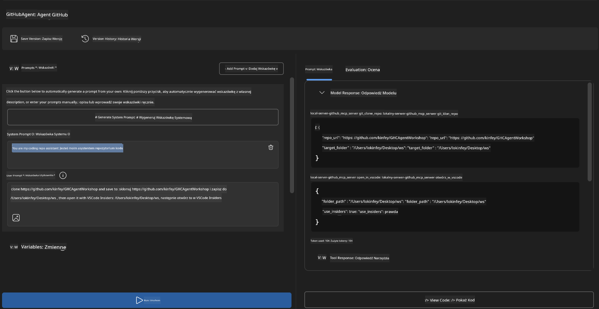
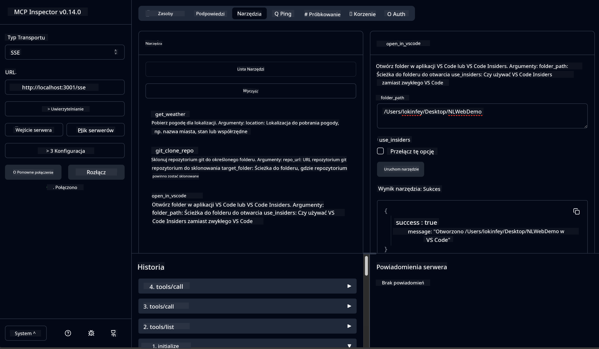

<!--
CO_OP_TRANSLATOR_METADATA:
{
  "original_hash": "f83bc722dc758efffd68667d6a1db470",
  "translation_date": "2025-07-14T08:41:35+00:00",
  "source_file": "10-StreamliningAIWorkflowsBuildingAnMCPServerWithAIToolkit/lab4/README.md",
  "language_code": "pl"
}
-->
# 🐙 Moduł 4: Praktyczny rozwój MCP - Własny serwer klonowania GitHub


> **⚡ Szybki start:** Zbuduj produkcyjny serwer MCP, który automatyzuje klonowanie repozytoriów GitHub i integrację z VS Code w zaledwie 30 minut!

## 🎯 Cele nauki

Po zakończeniu tego laboratorium będziesz potrafił:

- ✅ Stworzyć własny serwer MCP do rzeczywistych procesów deweloperskich
- ✅ Zaimplementować funkcję klonowania repozytoriów GitHub przez MCP
- ✅ Zintegrować własne serwery MCP z VS Code i Agent Builder
- ✅ Korzystać z trybu Agent Mode GitHub Copilot z własnymi narzędziami MCP
- ✅ Testować i wdrażać własne serwery MCP w środowiskach produkcyjnych

## 📋 Wymagania wstępne

- Ukończenie laboratoriów 1-3 (podstawy MCP i zaawansowany rozwój)
- Subskrypcja GitHub Copilot ([dostępna darmowa rejestracja](https://github.com/github-copilot/signup))
- VS Code z rozszerzeniami AI Toolkit i GitHub Copilot
- Zainstalowany i skonfigurowany Git CLI

## 🏗️ Przegląd projektu

### **Rzeczywiste wyzwanie deweloperskie**
Jako programiści często korzystamy z GitHub, aby klonować repozytoria i otwierać je w VS Code lub VS Code Insiders. Ten ręczny proces obejmuje:
1. Otwarcie terminala/wiersza poleceń
2. Przejście do wybranego katalogu
3. Uruchomienie polecenia `git clone`
4. Otwarcie VS Code w sklonowanym katalogu

**Nasze rozwiązanie MCP upraszcza to do jednego inteligentnego polecenia!**

### **Co zbudujesz**
**GitHub Clone MCP Server** (`git_mcp_server`), który oferuje:

| Funkcja | Opis | Korzyść |
|---------|-------------|---------|
| 🔄 **Inteligentne klonowanie repozytoriów** | Klonowanie repozytoriów GitHub z walidacją | Automatyczne sprawdzanie błędów |
| 📁 **Inteligentne zarządzanie katalogami** | Bezpieczne sprawdzanie i tworzenie katalogów | Zapobiega nadpisywaniu |
| 🚀 **Wieloplatformowa integracja z VS Code** | Otwarcie projektów w VS Code/Insiders | Płynne przejście w workflow |
| 🛡️ **Solidna obsługa błędów** | Obsługa problemów z siecią, uprawnieniami i ścieżkami | Gotowość do produkcji |

---

## 📖 Implementacja krok po kroku

### Krok 1: Utwórz agenta GitHub w Agent Builder

1. **Uruchom Agent Builder** przez rozszerzenie AI Toolkit
2. **Stwórz nowego agenta** z następującą konfiguracją:
   ```
   Agent Name: GitHubAgent
   ```

3. **Zainicjuj własny serwer MCP:**
   - Przejdź do **Narzędzia** → **Dodaj narzędzie** → **Serwer MCP**
   - Wybierz **"Utwórz nowy serwer MCP"**
   - Wybierz **szablon Python** dla maksymalnej elastyczności
   - **Nazwa serwera:** `git_mcp_server`

### Krok 2: Skonfiguruj tryb Agent Mode GitHub Copilot

1. **Otwórz GitHub Copilot** w VS Code (Ctrl/Cmd + Shift + P → "GitHub Copilot: Open")
2. **Wybierz model agenta** w interfejsie Copilot
3. **Wybierz model Claude 3.7** dla lepszych zdolności rozumowania
4. **Włącz integrację MCP** dla dostępu do narzędzi

> **💡 Pro Tip:** Claude 3.7 zapewnia lepsze zrozumienie procesów deweloperskich i wzorców obsługi błędów.

### Krok 3: Zaimplementuj podstawową funkcjonalność serwera MCP

**Użyj poniższego szczegółowego promptu z trybem Agent Mode GitHub Copilot:**

```
Create two MCP tools with the following comprehensive requirements:

🔧 TOOL A: clone_repository
Requirements:
- Clone any GitHub repository to a specified local folder
- Return the absolute path of the successfully cloned project
- Implement comprehensive validation:
  ✓ Check if target directory already exists (return error if exists)
  ✓ Validate GitHub URL format (https://github.com/user/repo)
  ✓ Verify git command availability (prompt installation if missing)
  ✓ Handle network connectivity issues
  ✓ Provide clear error messages for all failure scenarios

🚀 TOOL B: open_in_vscode
Requirements:
- Open specified folder in VS Code or VS Code Insiders
- Cross-platform compatibility (Windows/Linux/macOS)
- Use direct application launch (not terminal commands)
- Auto-detect available VS Code installations
- Handle cases where VS Code is not installed
- Provide user-friendly error messages

Additional Requirements:
- Follow MCP 1.9.3 best practices
- Include proper type hints and documentation
- Implement logging for debugging purposes
- Add input validation for all parameters
- Include comprehensive error handling
```

### Krok 4: Przetestuj swój serwer MCP

#### 4a. Test w Agent Builder

1. **Uruchom konfigurację debugowania** w Agent Builder
2. **Skonfiguruj swojego agenta tym promptem systemowym:**

```
SYSTEM_PROMPT:
You are my intelligent coding repository assistant. You help developers efficiently clone GitHub repositories and set up their development environment. Always provide clear feedback about operations and handle errors gracefully.
```

3. **Testuj realistyczne scenariusze użytkownika:**

```
USER_PROMPT EXAMPLES:

Scenario : Basic Clone and Open
"Clone {Your GitHub Repo link such as https://github.com/kinfey/GHCAgentWorkshop
 } and save to {The global path you specify}, then open it with VS Code Insiders"
```



**Oczekiwane wyniki:**
- ✅ Pomyślne klonowanie z potwierdzeniem ścieżki
- ✅ Automatyczne uruchomienie VS Code
- ✅ Jasne komunikaty o błędach dla nieprawidłowych scenariuszy
- ✅ Poprawna obsługa przypadków brzegowych

#### 4b. Test w MCP Inspector



---

**🎉 Gratulacje!** Udało Ci się stworzyć praktyczny, gotowy do produkcji serwer MCP, który rozwiązuje rzeczywiste wyzwania w procesach deweloperskich. Twój własny serwer klonowania GitHub pokazuje moc MCP w automatyzacji i zwiększaniu produktywności programistów.

### 🏆 Osiągnięcia:
- ✅ **MCP Developer** - Stworzenie własnego serwera MCP
- ✅ **Workflow Automator** - Uproszczenie procesów deweloperskich  
- ✅ **Integration Expert** - Połączenie wielu narzędzi deweloperskich
- ✅ **Production Ready** - Budowa rozwiązań gotowych do wdrożenia

---

## 🎓 Zakończenie warsztatów: Twoja droga z Model Context Protocol

**Drogi Uczestniku Warsztatów,**

Gratulacje z okazji ukończenia wszystkich czterech modułów warsztatów Model Context Protocol! Przeszedłeś długą drogę od poznania podstaw AI Toolkit po tworzenie produkcyjnych serwerów MCP, które rozwiązują rzeczywiste wyzwania deweloperskie.

### 🚀 Podsumowanie Twojej ścieżki nauki:

**[Moduł 1](../lab1/README.md)**: Zacząłeś od poznania podstaw AI Toolkit, testowania modeli i tworzenia pierwszego agenta AI.

**[Moduł 2](../lab2/README.md)**: Poznałeś architekturę MCP, zintegrowałeś Playwright MCP i stworzyłeś pierwszego agenta automatyzującego przeglądarkę.

**[Moduł 3](../lab3/README.md)**: Rozwinąłeś umiejętności tworzenia własnych serwerów MCP na przykładzie Weather MCP i opanowałeś narzędzia do debugowania.

**[Moduł 4](../lab4/README.md)**: Zastosowałeś wszystko, tworząc praktyczne narzędzie automatyzujące workflow z repozytoriami GitHub.

### 🌟 Co opanowałeś:

- ✅ **Ekosystem AI Toolkit**: Modele, agenci i wzorce integracji
- ✅ **Architektura MCP**: Projekt klient-serwer, protokoły transportowe i bezpieczeństwo
- ✅ **Narzędzia deweloperskie**: Od Playground przez Inspector po wdrożenie produkcyjne
- ✅ **Własny rozwój**: Budowa, testowanie i wdrażanie własnych serwerów MCP
- ✅ **Praktyczne zastosowania**: Rozwiązywanie rzeczywistych problemów workflow za pomocą AI

### 🔮 Twoje kolejne kroki:

1. **Zbuduj własny serwer MCP**: Wykorzystaj zdobyte umiejętności do automatyzacji swoich unikalnych procesów
2. **Dołącz do społeczności MCP**: Dziel się swoimi projektami i ucz się od innych
3. **Poznaj zaawansowaną integrację**: Połącz serwery MCP z systemami korporacyjnymi
4. **Wspieraj open source**: Pomagaj rozwijać narzędzia i dokumentację MCP

Pamiętaj, że te warsztaty to dopiero początek. Ekosystem Model Context Protocol szybko się rozwija, a Ty jesteś teraz gotowy, by być na czele narzędzi deweloperskich wspieranych przez AI.

**Dziękujemy za udział i zaangażowanie w naukę!**

Mamy nadzieję, że warsztaty zainspirowały Cię do tworzenia i korzystania z narzędzi AI w Twojej codziennej pracy deweloperskiej.

**Powodzenia w kodowaniu!**

---

**Zastrzeżenie**:  
Niniejszy dokument został przetłumaczony za pomocą usługi tłumaczenia AI [Co-op Translator](https://github.com/Azure/co-op-translator). Mimo że dążymy do jak największej dokładności, prosimy mieć na uwadze, że automatyczne tłumaczenia mogą zawierać błędy lub nieścisłości. Oryginalny dokument w języku źródłowym powinien być uznawany za źródło autorytatywne. W przypadku informacji o kluczowym znaczeniu zalecane jest skorzystanie z profesjonalnego tłumaczenia wykonanego przez człowieka. Nie ponosimy odpowiedzialności za jakiekolwiek nieporozumienia lub błędne interpretacje wynikające z korzystania z tego tłumaczenia.