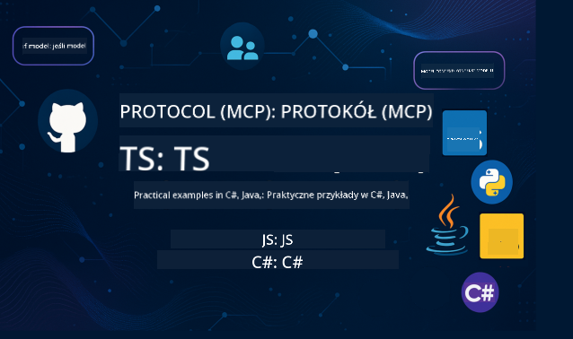

<!--
CO_OP_TRANSLATOR_METADATA:
{
  "original_hash": "866c8877136cb03e1efb9ad633a2f0a6",
  "translation_date": "2025-08-26T17:40:28+00:00",
  "source_file": "README.md",
  "language_code": "pl"
}
-->
 

Wykonaj poniższe kroki, aby rozpocząć korzystanie z tych zasobów:
1. **Forkuj repozytorium**: Kliknij 
2. **Sklonuj repozytorium**:   `git clone https://github.com/microsoft/mcp-for-beginners.git`
3. [**Dołącz do Azure AI Foundry Discord, aby spotkać ekspertów i innych programistów**](https://discord.com/invite/ByRwuEEgH4)

### 🌐 Obsługa wielu języków

#### Obsługiwane za pomocą GitHub Action (zautomatyzowane i zawsze aktualne)

 [Arabski](../ar/README.md) | [Bengalski](../bn/README.md) | [Bułgarski](../bg/README.md) | [Birmański (Myanmar)](../my/README.md) | [Chiński (uproszczony)](../zh/README.md) | [Chiński (tradycyjny, Hongkong)](../hk/README.md) | [Chiński (tradycyjny, Makau)](../mo/README.md) | [Chiński (tradycyjny, Tajwan)](../tw/README.md) | [Chorwacki](../hr/README.md) | [Czeski](../cs/README.md) | [Duński](../da/README.md) | [Holenderski](../nl/README.md) | [Fiński](../fi/README.md) | [Francuski](../fr/README.md) | [Niemiecki](../de/README.md) | [Grecki](../el/README.md) | [Hebrajski](../he/README.md) | [Hindi](../hi/README.md) | [Węgierski](../hu/README.md) | [Indonezyjski](../id/README.md) | [Włoski](../it/README.md) | [Japoński](../ja/README.md) | [Koreański](../ko/README.md) | [Malajski](../ms/README.md) | [Marathi](../mr/README.md) | [Nepalski](../ne/README.md) | [Norweski](../no/README.md) | [Perski (Farsi)](../fa/README.md) | [Polski](./README.md) | [Portugalski (Brazylia)](../br/README.md) | [Portugalski (Portugalia)](../pt/README.md) | [Pendżabski (Gurmukhi)](../pa/README.md) | [Rumuński](../ro/README.md) | [Rosyjski](../ru/README.md) | [Serbski (cyrylica)](../sr/README.md) | [Słowacki](../sk/README.md) | [Słoweński](../sl/README.md) | [Hiszpański](../es/README.md) | [Suahili](../sw/README.md) | [Szwedzki](../sv/README.md) | [Tagalog (Filipiński)](../tl/README.md) | [Tajski](../th/README.md) | [Turecki](../tr/README.md) | [Ukraiński](../uk/README.md) | [Urdu](../ur/README.md) | [Wietnamski](../vi/README.md)

# 🚀 Program nauczania Model Context Protocol (MCP) dla początkujących

## **Poznaj MCP dzięki praktycznym przykładom kodu w C#, Java, JavaScript, Rust, Python i TypeScript**

## 🧠 Przegląd programu nauczania Model Context Protocol

**Model Context Protocol (MCP)** to nowoczesne ramy, które mają na celu standaryzację interakcji między modelami AI a aplikacjami klienckimi. Ten otwartoźródłowy program nauczania oferuje uporządkowaną ścieżkę nauki, zawierającą praktyczne przykłady kodu i rzeczywiste przypadki użycia w popularnych językach programowania, takich jak C#, Java, JavaScript, TypeScript i Python.

Niezależnie od tego, czy jesteś programistą AI, architektem systemów, czy inżynierem oprogramowania, ten przewodnik jest Twoim kompleksowym źródłem wiedzy na temat podstaw MCP i strategii wdrażania.

## 🔗 Oficjalne zasoby MCP

- 📘 [Dokumentacja MCP](https://modelcontextprotocol.io/) – Szczegółowe samouczki i przewodniki użytkownika  
- 📜 [Specyfikacja MCP](https://modelcontextprotocol.io/docs/) – Architektura protokołu i odniesienia techniczne  
- 📜 [Oryginalna specyfikacja MCP](https://spec.modelcontextprotocol.io/) – Starsze odniesienia techniczne (mogą zawierać dodatkowe szczegóły)  
- 🧑‍💻 [Repozytorium MCP na GitHub](https://github.com/modelcontextprotocol) – Otwartoźródłowe SDK, narzędzia i przykłady kodu
- 🌐 [Społeczność MCP](https://github.com/orgs/modelcontextprotocol/discussions) – Dołącz do dyskusji i wnieś swój wkład w społeczność

## 🧭 Przegląd programu nauczania MCP

### 📚 Kompletny program nauczania

| Moduł | Temat | Opis | Link |
|-------|-------|------|------|
| **Moduły 1-3: Podstawy** | | | |
| 00 | Wprowadzenie do MCP | Przegląd Model Context Protocol i jego znaczenia w procesach AI | [Czytaj więcej](./00-Introduction/README.md) |
| 01 | Wyjaśnienie podstawowych pojęć | Szczegółowe omówienie podstawowych koncepcji MCP | [Czytaj więcej](./01-CoreConcepts/README.md) |
| 02 | Bezpieczeństwo w MCP | Zagrożenia bezpieczeństwa i najlepsze praktyki | [Czytaj więcej](./02-Security/README.md) |
| 03 | Pierwsze kroki z MCP | Konfiguracja środowiska, podstawowe serwery/klienci, integracja | [Czytaj więcej](./03-GettingStarted/README.md) |
| **Moduł 3: Tworzenie pierwszego serwera i klienta** | | | |
| 3.1 | Pierwszy serwer | Tworzenie pierwszego serwera MCP | [Przewodnik](./03-GettingStarted/01-first-server/README.md) |
| 3.2 | Pierwszy klient | Tworzenie podstawowego klienta MCP | [Przewodnik](./03-GettingStarted/02-client/README.md) |
| 3.3 | Klient z LLM | Integracja dużych modeli językowych | [Przewodnik](./03-GettingStarted/03-llm-client/README.md) |
| 3.4 | Integracja z VS Code | Konsumpcja serwerów MCP w VS Code | [Przewodnik](./03-GettingStarted/04-vscode/README.md) |
| 3.5 | Serwer stdio | Tworzenie serwerów z wykorzystaniem transportu stdio | [Przewodnik](./03-GettingStarted/05-stdio-server/README.md) |
| 3.6 | HTTP Streaming | Implementacja HTTP streamingu w MCP | [Przewodnik](./03-GettingStarted/06-http-streaming/README.md) |
| 3.7 | AI Toolkit | Wykorzystanie AI Toolkit z MCP | [Przewodnik](./03-GettingStarted/07-aitk/README.md) |
| 3.8 | Testowanie | Testowanie implementacji serwera MCP | [Przewodnik](./03-GettingStarted/08-testing/README.md) |
| 3.9 | Wdrożenie | Wdrażanie serwerów MCP do produkcji | [Przewodnik](./03-GettingStarted/09-deployment/README.md) |
| **Moduły 4-5: Praktyczne i zaawansowane** | | | |
| 04 | Praktyczna implementacja | SDK, debugowanie, testowanie, szablony promptów | [Czytaj więcej](./04-PracticalImplementation/README.md) |
| 05 | Zaawansowane tematy w MCP | AI multimodalne, skalowanie, zastosowania korporacyjne | [Czytaj więcej](./05-AdvancedTopics/README.md) |
| 5.1 | Integracja z Azure | Integracja MCP z Azure | [Przewodnik](./05-AdvancedTopics/mcp-integration/README.md) |
| 5.2 | Multimodalność | Praca z wieloma modalnościami | [Przewodnik](./05-AdvancedTopics/mcp-multi-modality/README.md) |
| 5.3 | Demo OAuth2 | Implementacja uwierzytelniania OAuth2 | [Przewodnik](./05-AdvancedTopics/mcp-oauth2-demo/README.md) |
| 5.4 | Konteksty główne | Zrozumienie i implementacja kontekstów głównych | [Przewodnik](./05-AdvancedTopics/mcp-root-contexts/README.md) |
| 5.5 | Routing | Strategie routingu w MCP | [Przewodnik](./05-AdvancedTopics/mcp-routing/README.md) |
| 5.6 | Próbkowanie | Techniki prób w MCP | [Przewodnik](./05-AdvancedTopics/mcp-sampling/README.md) |
| 5.7 | Skalowanie | Skalowanie implementacji MCP | [Przewodnik](./05-AdvancedTopics/mcp-scaling/README.md) |
| 5.8 | Bezpieczeństwo | Zaawansowane kwestie bezpieczeństwa | [Przewodnik](./05-AdvancedTopics/mcp-security/README.md) |
| 5.9 | Wyszukiwanie w sieci | Implementacja funkcji wyszukiwania w sieci | [Przewodnik](./05-AdvancedTopics/web-search-mcp/README.md) |
| 5.10 | Streaming w czasie rzeczywistym | Tworzenie funkcji streamingu w czasie rzeczywistym | [Przewodnik](./05-AdvancedTopics/mcp-realtimestreaming/README.md) |
| 5.11 | Wyszukiwanie w czasie rzeczywistym | Implementacja wyszukiwania w czasie rzeczywistym | [Przewodnik](./05-AdvancedTopics/mcp-realtimesearch/README.md) |
| 5.12 | Uwierzytelnianie Entra ID | Uwierzytelnianie za pomocą Microsoft Entra ID | [Przewodnik](./05-AdvancedTopics/mcp-security-entra/README.md) |
| 5.13 | Integracja z Foundry | Integracja z Azure AI Foundry | [Przewodnik](./05-AdvancedTopics/mcp-foundry-agent-integration/README.md) |
| 5.14 | Inżynieria kontekstów | Techniki efektywnej inżynierii kontekstów | [Przewodnik](./05-AdvancedTopics/mcp-contextengineering/README.md) |
| **Moduły 6-10: Społeczność i najlepsze praktyki** | | | |
| 06 | Wkład społeczności | Jak przyczynić się do rozwoju ekosystemu MCP | [Przewodnik](./06-CommunityContributions/README.md) |
| 07 | Wnioski z wczesnego wdrożenia | Historie rzeczywistych implementacji | [Przewodnik](./07-LessonsFromEarlyAdoption/README.md) |
| 08 | Najlepsze praktyki dla MCP | Wydajność, odporność na błędy, niezawodność | [Przewodnik](./08-BestPractices/README.md) |
| 09 | Studia przypadków MCP | Praktyczne przykłady implementacji | [Przewodnik](./09-CaseStudy/README.md) |
| 10 | Warsztaty praktyczne | Tworzenie serwera MCP z AI Toolkit | [Laboratorium](./10-StreamliningAIWorkflowsBuildingAnMCPServerWithAIToolkit/README.md) |

### 💻 Przykładowe projekty kodu

#### Podstawowe przykłady MCP kalkulatora

| Język | Opis | Link |
|-------|------|------|
| C# | Przykład serwera MCP | [Zobacz kod](./03-GettingStarted/samples/csharp/README.md) |
| Java | MCP Kalkulator | [Zobacz kod](./03-GettingStarted/samples/java/calculator/README.md) |
| JavaScript | Demo MCP | [Zobacz kod](./03-GettingStarted/samples/javascript/README.md) |
| Python | Serwer MCP | [Zobacz kod](../../03-GettingStarted/samples/python/mcp_calculator_server.py) |
| TypeScript | Przykład MCP | [Zobacz kod](./03-GettingStarted/samples/typescript/README.md) |
| Rust | Przykład MCP | [Zobacz kod](./03-GettingStarted/samples/rust/README.md) |

#### Zaawansowane implementacje MCP

| Język | Opis | Link |
|-------|------|------|
| C# | Zaawansowany przykład | [View Code](./04-PracticalImplementation/samples/csharp/README.md) |
| Java z Spring | Przykład aplikacji kontenerowej | [View Code](./04-PracticalImplementation/samples/java/containerapp/README.md) |
| JavaScript | Zaawansowany przykład | [View Code](./04-PracticalImplementation/samples/javascript/README.md) |
| Python | Złożona implementacja | [View Code](../../04-PracticalImplementation/samples/python/READMEmd) |
| TypeScript | Przykład kontenera | [View Code](./04-PracticalImplementation/samples/typescript/README.md) |

## 🎯 Wymagania wstępne do nauki MCP

Aby w pełni skorzystać z tego programu nauczania, powinieneś posiadać:

- Podstawową wiedzę programistyczną w co najmniej jednym z następujących języków: C#, Java, JavaScript, Python lub TypeScript
- Zrozumienie modelu klient-serwer i API
- Znajomość koncepcji REST i HTTP
- (Opcjonalnie) Podstawy w zakresie AI/ML

- Dołączenie do naszych dyskusji społecznościowych w celu uzyskania wsparcia

## 📚 Przewodnik nauki i zasoby

To repozytorium zawiera różne zasoby, które pomogą Ci efektywnie się uczyć:

### Przewodnik nauki

Dostępny jest kompleksowy [Przewodnik nauki](./study_guide.md), który pomoże Ci efektywnie poruszać się po tym repozytorium. Przewodnik zawiera:

- Wizualną mapę programu nauczania obejmującą wszystkie omawiane tematy
- Szczegółowy podział każdej sekcji repozytorium
- Wskazówki dotyczące korzystania z projektów przykładowych
- Rekomendowane ścieżki nauki dla różnych poziomów zaawansowania
- Dodatkowe zasoby uzupełniające Twoją podróż edukacyjną

### Dziennik zmian

Prowadzimy szczegółowy [Dziennik zmian](./changelog.md), który śledzi wszystkie istotne aktualizacje materiałów programu nauczania, w tym:

- Dodanie nowej treści
- Zmiany strukturalne
- Ulepszenia funkcji
- Aktualizacje dokumentacji

## 🛠️ Jak efektywnie korzystać z tego programu nauczania

Każda lekcja w tym przewodniku zawiera:

1. Jasne wyjaśnienia koncepcji MCP  
2. Przykłady kodu na żywo w różnych językach  
3. Ćwiczenia do tworzenia rzeczywistych aplikacji MCP  
4. Dodatkowe zasoby dla zaawansowanych uczniów  

## Wydarzenia 

### [MCP Dev Days Lipiec 2025](https://developer.microsoft.com/en-us/reactor/series/S-1563/)
#### [➡️ Obejrzyj na żądanie - MCP Dev Days](https://developer.microsoft.com/en-us/reactor/series/S-1563/)
Przygotuj się na dwa dni głębokich technicznych wglądów, nawiązywania kontaktów społecznościowych i praktycznej nauki podczas MCP Dev Days, wirtualnego wydarzenia poświęconego Model Context Protocol (MCP) — nowemu standardowi łączącemu modele AI i narzędzia, na których się opierają.
Możesz obejrzeć MCP Dev Days, rejestrując się na naszej stronie wydarzenia: https://aka.ms/mcpdevdays. 

#### [Dzień 1: MCP Produktywność, Narzędzia dla programistów i Społeczność:](https://developer.microsoft.com/en-us/reactor/series/S-1563/)

Skupia się na umożliwieniu programistom korzystania z MCP w ich codziennym przepływie pracy oraz na świętowaniu niesamowitej społeczności MCP. Dołączą do nas członkowie społeczności i partnerzy, tacy jak Arcade, Block, Okta i Neon, aby pokazać, jak współpracują z Microsoftem, aby kształtować otwarty, rozszerzalny ekosystem MCP.  
Dema rzeczywiste w VS Code, Visual Studio, GitHub Copilot i popularnych narzędziach społecznościowych  
Praktyczne, kontekstowe przepływy pracy dla programistów  
Sesje prowadzone przez społeczność i wglądy  
Niezależnie od tego, czy dopiero zaczynasz przygodę z MCP, czy już z nim budujesz, Dzień 1 dostarczy inspiracji i praktycznych wskazówek.

#### [Dzień 2: Budowanie serwerów MCP z pewnością](https://developer.microsoft.com/en-us/reactor/series/S-1563/)

Skierowany do twórców MCP. Zgłębimy strategie implementacji i najlepsze praktyki dotyczące tworzenia serwerów MCP oraz integracji MCP w przepływach pracy AI.

#### Tematy obejmują:

- Tworzenie serwerów MCP i ich integracja z doświadczeniami agentów
- Rozwój oparty na promptach
- Najlepsze praktyki w zakresie bezpieczeństwa
- Korzystanie z bloków konstrukcyjnych, takich jak Functions, ACA i API Management
- Wyrównanie rejestru i narzędzia (1P + 3P)

Jeśli jesteś programistą, twórcą narzędzi lub strategiem produktów AI, ten dzień jest pełen wglądów, których potrzebujesz, aby budować skalowalne, bezpieczne i przyszłościowe rozwiązania MCP.

### MCP Boot Camp Sierpień 2025
Naucz się w intensywnych sesjach wideo, jak tworzyć serwery MCP, integrować je z VS Code i profesjonalnie wdrażać na Azure na podstawie treści z programu MCP dla początkujących. Zdobądź praktyczne umiejętności w technologii, którą już wykorzystują największe firmy.

#### [➡️ Obejrzyj na żądanie MCP Bootcamp | Angielski](https://developer.microsoft.com/en-us/reactor/series/s-1568/)
#### [➡️ Obejrzyj na żądanie MCP Bootcamp | Portugalski](https://developer.microsoft.com/en-us/reactor/series/S-1566/)
#### [➡️ Obejrzyj na żądanie MCP Bootcamp | Hiszpański](https://developer.microsoft.com/en-us/reactor/series/S-1567/)

## 🌟 Podziękowania dla społeczności

Dziękujemy Microsoft Valued Professional [Shivam Goyal](https://www.linkedin.com/in/shivam2003/) za wkład w ważne przykłady kodu. 

## 📜 Informacje o licencji

Treść ta jest licencjonowana na podstawie **MIT License**. Warunki i zasady znajdziesz w [LICENSE](../../LICENSE).

## 🤝 Wytyczne dotyczące wkładu

Ten projekt przyjmuje wkłady i sugestie. Większość wkładów wymaga od Ciebie zgody na
Contributor License Agreement (CLA), deklarując, że masz prawo i faktycznie udzielasz nam
praw do korzystania z Twojego wkładu. Szczegóły znajdziesz na 
<https://cla.opensource.microsoft.com>.

Gdy przesyłasz pull request, bot CLA automatycznie określi, czy musisz dostarczyć
CLA i odpowiednio oznaczy PR (np. status check, komentarz). Po prostu postępuj zgodnie z instrukcjami
podanymi przez bota. Musisz to zrobić tylko raz dla wszystkich repozytoriów korzystających z naszego CLA.

Ten projekt przyjął [Microsoft Open Source Code of Conduct](https://opensource.microsoft.com/codeofconduct/).
Więcej informacji znajdziesz w [Code of Conduct FAQ](https://opensource.microsoft.com/codeofconduct/faq/) lub
skontaktuj się z [opencode@microsoft.com](mailto:opencode@microsoft.com) w przypadku dodatkowych pytań lub komentarzy.

## 📂 Struktura repozytorium

Repozytorium jest zorganizowane w następujący sposób:

- **Core Curriculum (00-10)**: Główna treść zorganizowana w dziesięć kolejnych modułów
- **images/**: Diagramy i ilustracje używane w całym programie nauczania
- **translations/**: Obsługa wielu języków z automatycznymi tłumaczeniami
- **translated_images/**: Lokalizowane wersje diagramów i ilustracji
- **study_guide.md**: Kompleksowy przewodnik po repozytorium
- **changelog.md**: Rejestr wszystkich istotnych zmian w materiałach programu nauczania
- **mcp.json**: Plik konfiguracyjny dla specyfikacji MCP
- **CODE_OF_CONDUCT.md, LICENSE, SECURITY.md, SUPPORT.md**: Dokumenty dotyczące zarządzania projektem

## 🎒 Inne kursy
Nasz zespół tworzy inne kursy! Sprawdź:

- [AI Agents For Beginners](https://github.com/microsoft/ai-agents-for-beginners?WT.mc_id=academic-105485-koreyst)
- [Generative AI for Beginners using .NET](https://github.com/microsoft/Generative-AI-for-beginners-dotnet?WT.mc_id=academic-105485-koreyst)
- [Generative AI for Beginners using JavaScript](https://github.com/microsoft/generative-ai-with-javascript?WT.mc_id=academic-105485-koreyst)
- [Generative AI for Beginners](https://github.com/microsoft/generative-ai-for-beginners?WT.mc_id=academic-105485-koreyst)
- [Generative AI for Beginners using Java](https://github.com/microsoft/generative-ai-for-beginners-java?WT.mc_id=academic-105485-koreyst)
- [ML for Beginners](https://aka.ms/ml-beginners?WT.mc_id=academic-105485-koreyst)
- [Data Science for Beginners](https://aka.ms/datascience-beginners?WT.mc_id=academic-105485-koreyst)
- [AI for Beginners](https://aka.ms/ai-beginners?WT.mc_id=academic-105485-koreyst)
- [Cybersecurity for Beginners](https://github.com/microsoft/Security-101?WT.mc_id=academic-96948-sayoung)
- [Web Dev for Beginners](https://aka.ms/webdev-beginners?WT.mc_id=academic-105485-koreyst)
- [IoT for Beginners](https://aka.ms/iot-beginners?WT.mc_id=academic-105485-koreyst)
- [XR Development for Beginners](https://github.com/microsoft/xr-development-for-beginners?WT.mc_id=academic-105485-koreyst)
- [Mastering GitHub Copilot for AI Paired Programming](https://aka.ms/GitHubCopilotAI?WT.mc_id=academic-105485-koreyst)
- [Mastering GitHub Copilot for C#/.NET Developers](https://github.com/microsoft/mastering-github-copilot-for-dotnet-csharp-developers?WT.mc_id=academic-105485-koreyst)
- [Choose Your Own Copilot Adventure](https://github.com/microsoft/CopilotAdventures?WT.mc_id=academic-105485-koreyst)

## ™️ Informacja o znakach towarowych

Ten projekt może zawierać znaki towarowe lub logotypy projektów, produktów lub usług. Autoryzowane użycie znaków towarowych lub logotypów Microsoftu podlega i musi być zgodne z
[Microsoft's Trademark & Brand Guidelines](https://www.microsoft.com/legal/intellectualproperty/trademarks/usage/general).
Użycie znaków towarowych lub logotypów Microsoftu w zmodyfikowanych wersjach tego projektu nie może powodować zamieszania ani sugerować sponsorowania przez Microsoft.
Każde użycie znaków towarowych lub logotypów stron trzecich podlega politykom tych stron trzecich.

---

**Zastrzeżenie**:  
Ten dokument został przetłumaczony za pomocą usługi tłumaczeniowej AI [Co-op Translator](https://github.com/Azure/co-op-translator). Chociaż dokładamy wszelkich starań, aby tłumaczenie było precyzyjne, prosimy pamiętać, że automatyczne tłumaczenia mogą zawierać błędy lub nieścisłości. Oryginalny dokument w jego rodzimym języku powinien być uznawany za wiarygodne źródło. W przypadku informacji krytycznych zaleca się skorzystanie z profesjonalnego tłumaczenia wykonanego przez człowieka. Nie ponosimy odpowiedzialności za jakiekolwiek nieporozumienia lub błędne interpretacje wynikające z korzystania z tego tłumaczenia.