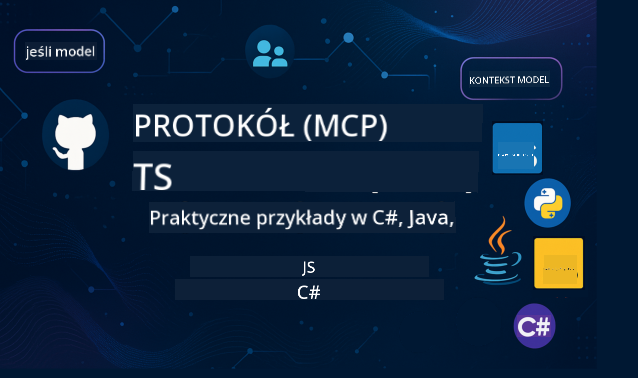

<!--
CO_OP_TRANSLATOR_METADATA:
{
  "original_hash": "2a21391378c12ecfef50f866329dfde0",
  "translation_date": "2025-05-17T05:08:31+00:00",
  "source_file": "README.md",
  "language_code": "pl"
}
-->

Śledź te kroki, aby zacząć korzystać z tych zasobów:
1. **Forkuj repozytorium**: Kliknij 
2. **Sklonuj repozytorium**: `git clone https://github.com/microsoft/mcp-for-beginners.git`
3. [**Dołącz do Microsoft Azure AI Foundry Discord, aby spotkać ekspertów i innych deweloperów**](https://discord.com/invite/ByRwuEEgH4)

### 🌐 Wsparcie dla wielu języków

#### Obsługiwane przez GitHub Action (Automatyczne i zawsze aktualne)
[Francuski](../fr/README.md) | [Hiszpański](../es/README.md) | [Niemiecki](../de/README.md) | [Rosyjski](../ru/README.md) | [Arabski](../ar/README.md) | [Perski (Farsi)](../fa/README.md) | [Urdu](../ur/README.md) | [Chiński (uproszczony)](../zh/README.md) | [Chiński (tradycyjny, Makau)](../mo/README.md) | [Chiński (tradycyjny, Hongkong)](../hk/README.md) | [Chiński (tradycyjny, Tajwan)](../tw/README.md) | [Japoński](../ja/README.md) | [Koreański](../ko/README.md) | [Hindi](../hi/README.md) | [Bengalski](../bn/README.md) | [Marathi](../mr/README.md) | [Nepalski](../ne/README.md) | [Pendżabski (Gurmukhi)](../pa/README.md) | [Portugalski (Portugalia)](../pt/README.md) | [Portugalski (Brazylia)](../br/README.md) | [Włoski](../it/README.md) | [Polski](./README.md) | [Turecki](../tr/README.md) | [Grecki](../el/README.md) | [Tajski](../th/README.md) | [Szwedzki](../sv/README.md) | [Duński](../da/README.md) | [Norweski](../no/README.md) | [Fiński](../fi/README.md) | [Holenderski](../nl/README.md) | [Hebrajski](../he/README.md) | [Wietnamski](../vi/README.md) | [Indonezyjski](../id/README.md) | [Malajski](../ms/README.md) | [Tagalog (Filipiński)](../tl/README.md) | [Suahili](../sw/README.md) | [Węgierski](../hu/README.md) | [Czeski](../cs/README.md) | [Słowacki](../sk/README.md) | [Rumuński](../ro/README.md) | [Bułgarski](../bg/README.md) | [Serbski (cyrylica)](../sr/README.md) | [Chorwacki](../hr/README.md) | [Słoweński](../sl/README.md)
# 🚀 Ostateczny przewodnik po programie nauczania Model Context Protocol (MCP) dla początkujących

## **Poznaj MCP z praktycznymi przykładami kodu w C#, Java, JavaScript, Python i TypeScript**

## 🧠 Przegląd programu nauczania Model Context Protocol

**Model Context Protocol (MCP)** to nowoczesne środowisko zaprojektowane do standaryzacji interakcji między modelami AI a aplikacjami klienckimi. Ten otwarty program nauczania oferuje zorganizowaną ścieżkę edukacyjną, uzupełnioną praktycznymi przykładami kodu i rzeczywistymi przypadkami użycia, w popularnych językach programowania, takich jak C#, Java, JavaScript, TypeScript i Python.

Niezależnie od tego, czy jesteś deweloperem AI, architektem systemów czy inżynierem oprogramowania, ten przewodnik jest Twoim kompleksowym źródłem wiedzy na temat podstaw MCP i strategii implementacji.

## 🔗 Oficjalne zasoby MCP

- 📘 [Dokumentacja MCP](https://modelcontextprotocol.io/) – Szczegółowe samouczki i przewodniki użytkownika  
- 📜 [Specyfikacja MCP](https://spec.modelcontextprotocol.io/) – Architektura protokołu i odniesienia techniczne  
- 🧑‍💻 [Repozytorium MCP na GitHub](https://github.com/modelcontextprotocol) – Otwarty kod SDK, narzędzia i przykłady kodu  

## 🧭 Kompletny program nauczania MCP

### 📌 [Wprowadzenie do MCP](./00-Introduction/README.md)

- Czym jest Model Context Protocol?
- Dlaczego standaryzacja ma znaczenie w procesach AI
- Praktyczne przypadki użycia i korzyści MCP

### 🧩 [Wyjaśnienie podstawowych koncepcji](./01-CoreConcepts/README.md)

- Zrozumienie architektury klient-serwer w MCP
- Kluczowe komponenty protokołu: żądania, odpowiedzi i schematy
- Wzorce wymiany wiadomości i danych w MCP

### 🔐 [Bezpieczeństwo w MCP](./02-Security/readme.md)

- Identyfikacja zagrożeń bezpieczeństwa w systemach opartych na MCP
- Techniki i najlepsze praktyki zabezpieczania implementacji

### 🚀 [Rozpoczęcie pracy z MCP](./03-GettingStarted/README.md)

- Konfiguracja środowiska
- Tworzenie podstawowych serwerów i klientów MCP
- Integracja MCP z istniejącymi aplikacjami

#### 🧮 Przykładowe projekty MCP Kalkulator:

  
<strong>Poznaj implementacje kodu według języka</strong>

  - [Przykład serwera MCP w C#](./03-GettingStarted/samples/csharp/README.md)
  - [Java MCP Kalkulator](./03-GettingStarted/samples/java/calculator/README.md)
  - [JavaScript MCP Demo](./03-GettingStarted/samples/javascript/README.md)
  - [Serwer MCP w Python](../../03-GettingStarted/samples/python/mcp_calculator_server.py)
  - [Przykład MCP w TypeScript](./03-GettingStarted/samples/typescript/README.md)

### 🛠️ [Praktyczna implementacja](./04-PracticalImplementation/README.md)

- Korzystanie z SDK w różnych językach
- Debugowanie, testowanie i walidacja
- Tworzenie szablonów i przepływów pracy

#### 💡 Zaawansowane projekty MCP Kalkulator:

  
<strong>Poznaj zaawansowane przykłady</strong>

  - [Zaawansowany przykład w C#](./04-PracticalImplementation/samples/csharp/README.md)
  - [Przykład aplikacji kontenerowej w Java](./04-PracticalImplementation/samples/java/containerapp/README.md)
  - [Zaawansowany przykład w JavaScript](./04-PracticalImplementation/samples/javascript/README.md)
  - [Złożona implementacja w Python](../../04-PracticalImplementation/samples/python/mcp_sample.py)
  - [Przykład kontenerowy w TypeScript](./04-PracticalImplementation/samples/typescript/README.md)

### 🎓 [Zaawansowane tematy w MCP](./05-AdvancedTopics/README.md)

- Wielomodalne przepływy pracy AI i rozszerzalność
- Strategie bezpiecznego skalowania
- MCP w ekosystemach przedsiębiorstw

### 🌍 [Wkład społeczności](./06-CommunityContributions/README.md)

- Jak wnosić kod i dokumentację
- Współpraca przez GitHub
- Ulepszenia i opinie kierowane przez społeczność

### 📈 [Wnioski z wczesnego wdrożenia](./07-CaseStudies/README.md)

- Rzeczywiste implementacje i co się sprawdziło
- Budowanie i wdrażanie rozwiązań opartych na MCP
- Trendy i przyszła mapa drogowa

### 📏 [Najlepsze praktyki dla MCP](./08-BestPractices/README.md)

- Optymalizacja wydajności
- Projektowanie odpornych systemów MCP
- Strategie testowania i odporności

### 📊 [Studia przypadków MCP](./09-CaseStudy/Readme.md)

- Głębokie analizy architektur rozwiązań MCP
- Plany wdrożeniowe i wskazówki dotyczące integracji
- Opisane diagramy i przewodniki po projektach

## 🎯 Wymagania wstępne do nauki MCP

Aby jak najlepiej wykorzystać ten program nauczania, powinieneś mieć:

- Podstawową wiedzę o C#, Java lub Python
- Zrozumienie modelu klient-serwer i API
- (Opcjonalnie) Znajomość koncepcji uczenia maszynowego

## 🛠️ Jak efektywnie korzystać z tego programu nauczania

Każda lekcja w tym przewodniku zawiera:

1. Jasne wyjaśnienia koncepcji MCP  
2. Przykłady kodu na żywo w różnych językach  
3. Ćwiczenia do budowy rzeczywistych aplikacji MCP  
4. Dodatkowe zasoby dla zaawansowanych uczniów  

## 📜 Informacje o licencji

Treść ta jest licencjonowana na podstawie **MIT License**. Aby zapoznać się z warunkami, zobacz [LICENSE](../../LICENSE).

## 🤝 Zasady dotyczące wkładu

Ten projekt przyjmuje wkłady i sugestie. Większość wkładów wymaga zgody na Umowę licencyjną dla współtwórców (CLA), deklarującą, że masz prawo do udzielenia nam prawa do korzystania z Twojego wkładu. Aby uzyskać szczegóły, odwiedź <https://cla.opensource.microsoft.com>.

Kiedy przesyłasz pull request, bot CLA automatycznie określi, czy musisz dostarczyć CLA i odpowiednio oznaczy PR (np. sprawdzenie statusu, komentarz). Wystarczy, że postąpisz zgodnie z instrukcjami dostarczonymi przez bota. Musisz to zrobić tylko raz dla wszystkich repozytoriów korzystających z naszego CLA.

Ten projekt przyjął [Kodeks postępowania Microsoft Open Source](https://opensource.microsoft.com/codeofconduct/).
Aby uzyskać więcej informacji, zobacz [FAQ dotyczące kodeksu postępowania](https://opensource.microsoft.com/codeofconduct/faq/) lub skontaktuj się z [opencode@microsoft.com](mailto:opencode@microsoft.com) w przypadku dodatkowych pytań lub komentarzy.

## ™️ Powiadomienie o znakach towarowych

Ten projekt może zawierać znaki towarowe lub logo projektów, produktów lub usług. Autoryzowane użycie znaków towarowych lub logo Microsoftu podlega i musi być zgodne z [Wytycznymi dotyczącymi znaków towarowych i marki Microsoft](https://www.microsoft.com/legal/intellectualproperty/trademarks/usage/general).
Użycie znaków towarowych lub logo Microsoftu w zmodyfikowanych wersjach tego projektu nie może powodować zamieszania ani sugerować sponsorowania przez Microsoft.
Każde użycie znaków towarowych lub logo stron trzecich podlega politykom tych stron trzecich.

**Zastrzeżenie**:  
Ten dokument został przetłumaczony przy użyciu usługi tłumaczenia AI [Co-op Translator](https://github.com/Azure/co-op-translator). Chociaż staramy się zapewnić dokładność, prosimy mieć na uwadze, że automatyczne tłumaczenia mogą zawierać błędy lub nieścisłości. Oryginalny dokument w jego języku ojczystym powinien być uznawany za źródło autorytatywne. W przypadku informacji o kluczowym znaczeniu zaleca się profesjonalne tłumaczenie przez człowieka. Nie ponosimy odpowiedzialności za jakiekolwiek nieporozumienia lub błędne interpretacje wynikające z użycia tego tłumaczenia.