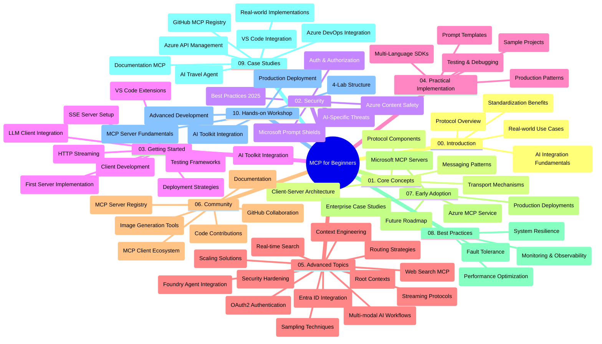

<!--
CO_OP_TRANSLATOR_METADATA:
{
  "original_hash": "719117a0a5f34ade7b5dfb61ee06fb13",
  "translation_date": "2025-09-26T18:21:38+00:00",
  "source_file": "study_guide.md",
  "language_code": "pl"
}
-->
# Protokół Kontekstu Modelu (MCP) dla Początkujących - Przewodnik do Nauki

Ten przewodnik oferuje przegląd struktury repozytorium i zawartości programu nauczania "Protokół Kontekstu Modelu (MCP) dla Początkujących". Skorzystaj z niego, aby efektywnie poruszać się po repozytorium i maksymalnie wykorzystać dostępne zasoby.

## Przegląd Repozytorium

Protokół Kontekstu Modelu (MCP) to ustandaryzowane ramy dla interakcji między modelami AI a aplikacjami klienckimi. Początkowo stworzony przez Anthropic, MCP jest obecnie utrzymywany przez szerszą społeczność MCP za pośrednictwem oficjalnej organizacji GitHub. Repozytorium zawiera kompleksowy program nauczania z praktycznymi przykładami kodu w językach C#, Java, JavaScript, Python i TypeScript, przeznaczony dla deweloperów AI, architektów systemów i inżynierów oprogramowania.

## Wizualna Mapa Programu Nauczania

## Struktura Repozytorium

Repozytorium jest podzielone na dziesięć głównych sekcji, z których każda koncentruje się na różnych aspektach MCP:

1. **Wprowadzenie (00-Introduction/)**
   - Przegląd Protokółu Kontekstu Modelu
   - Dlaczego standaryzacja jest ważna w procesach AI
   - Praktyczne zastosowania i korzyści

2. **Podstawowe Koncepcje (01-CoreConcepts/)**
   - Architektura klient-serwer
   - Kluczowe komponenty protokołu
   - Wzorce komunikacji w MCP

3. **Bezpieczeństwo (02-Security/)**
   - Zagrożenia bezpieczeństwa w systemach opartych na MCP
   - Najlepsze praktyki zabezpieczania implementacji
   - Strategie uwierzytelniania i autoryzacji
   - **Kompleksowa Dokumentacja Bezpieczeństwa**:
     - Najlepsze Praktyki Bezpieczeństwa MCP 2025
     - Przewodnik Implementacji Bezpieczeństwa Azure Content Safety
     - Kontrole i Techniki Bezpieczeństwa MCP
     - Szybki Przewodnik po Najlepszych Praktykach MCP
   - **Kluczowe Tematy Bezpieczeństwa**:
     - Ataki na wstrzykiwanie promptów i zatruwanie narzędzi
     - Przejęcie sesji i problemy z zdezorientowanym zastępcą
     - Luki w przekazywaniu tokenów
     - Nadmierne uprawnienia i kontrola dostępu
     - Bezpieczeństwo łańcucha dostaw dla komponentów AI
     - Integracja Microsoft Prompt Shields

4. **Pierwsze Kroki (03-GettingStarted/)**
   - Konfiguracja środowiska
   - Tworzenie podstawowych serwerów i klientów MCP
   - Integracja z istniejącymi aplikacjami
   - Zawiera sekcje dotyczące:
     - Pierwszej implementacji serwera
     - Rozwoju klienta
     - Integracji klienta LLM
     - Integracji z VS Code
     - Serwera SSE (Server-Sent Events)
     - Streamingu HTTP
     - Integracji z AI Toolkit
     - Strategii testowania
     - Wytycznych dotyczących wdrożenia

5. **Praktyczna Implementacja (04-PracticalImplementation/)**
   - Korzystanie z SDK w różnych językach programowania
   - Techniki debugowania, testowania i walidacji
   - Tworzenie wielokrotnego użytku szablonów promptów i przepływów pracy
   - Przykładowe projekty z przykładami implementacji

6. **Zaawansowane Tematy (05-AdvancedTopics/)**
   - Techniki inżynierii kontekstu
   - Integracja agentów Foundry
   - Wielomodalne przepływy pracy AI
   - Demos uwierzytelniania OAuth2
   - Możliwości wyszukiwania w czasie rzeczywistym
   - Streaming w czasie rzeczywistym
   - Implementacja kontekstów głównych
   - Strategie routingu
   - Techniki próbkowania
   - Podejścia do skalowania
   - Rozważania dotyczące bezpieczeństwa
   - Integracja bezpieczeństwa Entra ID
   - Integracja wyszukiwania w sieci

7. **Wkład Społeczności (06-CommunityContributions/)**
   - Jak wnosić kod i dokumentację
   - Współpraca przez GitHub
   - Ulepszenia i opinie napędzane przez społeczność
   - Korzystanie z różnych klientów MCP (Claude Desktop, Cline, VSCode)
   - Praca z popularnymi serwerami MCP, w tym generowanie obrazów

8. **Lekcje z Wczesnej Adopcji (07-LessonsfromEarlyAdoption/)**
   - Implementacje w rzeczywistych scenariuszach i historie sukcesu
   - Budowanie i wdrażanie rozwiązań opartych na MCP
   - Trendy i przyszła mapa drogowa
   - **Przewodnik po Serwerach MCP Microsoft**: Kompleksowy przewodnik po 10 gotowych do produkcji serwerach MCP Microsoft, w tym:
     - Serwer MCP Microsoft Learn Docs
     - Serwer MCP Azure (15+ specjalistycznych konektorów)
     - Serwer MCP GitHub
     - Serwer MCP Azure DevOps
     - Serwer MCP MarkItDown
     - Serwer MCP SQL Server
     - Serwer MCP Playwright
     - Serwer MCP Dev Box
     - Serwer MCP Azure AI Foundry
     - Serwer MCP Microsoft 365 Agents Toolkit

9. **Najlepsze Praktyki (08-BestPractices/)**
   - Optymalizacja wydajności
   - Projektowanie odpornych na awarie systemów MCP
   - Strategie testowania i odporności

10. **Studia Przypadków (09-CaseStudy/)**
    - **Siedem kompleksowych studiów przypadków** pokazujących wszechstronność MCP w różnych scenariuszach:
    - **Azure AI Travel Agents**: Orkiestracja wieloagentowa z Azure OpenAI i AI Search
    - **Integracja Azure DevOps**: Automatyzacja procesów przepływu pracy z aktualizacjami danych YouTube
    - **Pobieranie Dokumentacji w Czasie Rzeczywistym**: Klient konsolowy Python ze streamingiem HTTP
    - **Interaktywny Generator Planów Nauki**: Aplikacja webowa Chainlit z AI konwersacyjnym
    - **Dokumentacja w Edytorze**: Integracja VS Code z przepływami pracy GitHub Copilot
    - **Zarządzanie API Azure**: Integracja API dla przedsiębiorstw z tworzeniem serwera MCP
    - **Rejestr MCP GitHub**: Rozwój ekosystemu i platforma integracji agentów
    - Przykłady implementacji obejmujące integrację przedsiębiorstw, produktywność deweloperów i rozwój ekosystemu

11. **Warsztaty Praktyczne (10-StreamliningAIWorkflowsBuildingAnMCPServerWithAIToolkit/)**
    - Kompleksowe warsztaty praktyczne łączące MCP z AI Toolkit
    - Tworzenie inteligentnych aplikacji łączących modele AI z narzędziami rzeczywistymi
    - Moduły praktyczne obejmujące podstawy, rozwój niestandardowych serwerów i strategie wdrożenia produkcyjnego
    - **Struktura Laboratorium**:
      - Laboratorium 1: Podstawy Serwera MCP
      - Laboratorium 2: Zaawansowany Rozwój Serwera MCP
      - Laboratorium 3: Integracja AI Toolkit
      - Laboratorium 4: Wdrożenie Produkcyjne i Skalowanie
    - Podejście oparte na nauce w laboratorium z instrukcjami krok po kroku

## Dodatkowe Zasoby

Repozytorium zawiera wspierające zasoby:

- **Folder obrazów**: Zawiera diagramy i ilustracje używane w całym programie nauczania
- **Tłumaczenia**: Obsługa wielu języków z automatycznymi tłumaczeniami dokumentacji
- **Oficjalne Zasoby MCP**:
  - [Dokumentacja MCP](https://modelcontextprotocol.io/)
  - [Specyfikacja MCP](https://spec.modelcontextprotocol.io/)
  - [Repozytorium MCP na GitHub](https://github.com/modelcontextprotocol)

## Jak Korzystać z Tego Repozytorium

1. **Nauka Sekwencyjna**: Przejdź przez rozdziały w kolejności (00 do 10) dla uporządkowanego doświadczenia edukacyjnego.
2. **Skupienie na Języku**: Jeśli interesuje Cię konkretny język programowania, przejrzyj katalogi z przykładami implementacji w preferowanym języku.
3. **Praktyczna Implementacja**: Zacznij od sekcji "Pierwsze Kroki", aby skonfigurować środowisko i stworzyć swój pierwszy serwer i klient MCP.
4. **Zaawansowana Eksploracja**: Po opanowaniu podstaw, zagłęb się w zaawansowane tematy, aby poszerzyć swoją wiedzę.
5. **Zaangażowanie Społeczności**: Dołącz do społeczności MCP poprzez dyskusje na GitHub i kanały Discord, aby nawiązać kontakt z ekspertami i innymi deweloperami.

## Klienci i Narzędzia MCP

Program nauczania obejmuje różne klientów i narzędzia MCP:

1. **Oficjalni Klienci**:
   - Visual Studio Code 
   - MCP w Visual Studio Code
   - Claude Desktop
   - Claude w VSCode 
   - Claude API

2. **Klienci Społeczności**:
   - Cline (oparty na terminalu)
   - Cursor (edytor kodu)
   - ChatMCP
   - Windsurf

3. **Narzędzia Zarządzania MCP**:
   - MCP CLI
   - MCP Manager
   - MCP Linker
   - MCP Router

## Popularne Serwery MCP

Repozytorium przedstawia różne serwery MCP, w tym:

1. **Oficjalne Serwery MCP Microsoft**:
   - Serwer MCP Microsoft Learn Docs
   - Serwer MCP Azure (15+ specjalistycznych konektorów)
   - Serwer MCP GitHub
   - Serwer MCP Azure DevOps
   - Serwer MCP MarkItDown
   - Serwer MCP SQL Server
   - Serwer MCP Playwright
   - Serwer MCP Dev Box
   - Serwer MCP Azure AI Foundry
   - Serwer MCP Microsoft 365 Agents Toolkit

2. **Oficjalne Serwery Referencyjne**:
   - Filesystem
   - Fetch
   - Memory
   - Sequential Thinking

3. **Generowanie Obrazów**:
   - Azure OpenAI DALL-E 3
   - Stable Diffusion WebUI
   - Replicate

4. **Narzędzia Rozwojowe**:
   - Git MCP
   - Terminal Control
   - Code Assistant

5. **Specjalistyczne Serwery**:
   - Salesforce
   - Microsoft Teams
   - Jira & Confluence

## Wkład

Repozytorium zaprasza społeczność do wniesienia swojego wkładu. Zobacz sekcję Wkład Społeczności, aby uzyskać wskazówki, jak skutecznie przyczynić się do rozwoju ekosystemu MCP.

## Dziennik Zmian

| Data | Zmiany |
|------|---------|
| 26 września 2025 | - Dodano studium przypadku Rejestru MCP GitHub do sekcji 09-CaseStudy - Zaktualizowano Studia Przypadków, aby odzwierciedlić siedem kompleksowych studiów przypadków - Ulepszono opisy studiów przypadków o szczegóły implementacji - Zaktualizowano Wizualną Mapę Programu Nauczania, aby uwzględnić Rejestr MCP GitHub - Zrewidowano strukturę przewodnika nauki, aby odzwierciedlić skupienie na rozwoju ekosystemu |
| 18 lipca 2025 | - Zaktualizowano strukturę repozytorium, aby uwzględnić Przewodnik po Serwerach MCP Microsoft - Dodano kompleksową listę 10 gotowych do produkcji serwerów MCP Microsoft - Ulepszono sekcję Popularne Serwery MCP o Oficjalne Serwery MCP Microsoft - Zaktualizowano sekcję Studia Przypadków o rzeczywiste przykłady plików - Dodano szczegóły struktury laboratorium dla Warsztatów Praktycznych |
| 16 lipca 2025 | - Zaktualizowano strukturę repozytorium, aby odzwierciedlić aktualną zawartość - Dodano sekcję Klienci i Narzędzia MCP - Dodano sekcję Popularne Serwery MCP - Zaktualizowano Wizualną Mapę Programu Nauczania o wszystkie aktualne tematy - Ulepszono sekcję Zaawansowane Tematy o wszystkie specjalistyczne obszary - Zaktualizowano Studia Przypadków, aby odzwierciedlić rzeczywiste przykłady - Wyjaśniono pochodzenie MCP jako stworzone przez Anthropic |
| 11 czerwca 2025 | - Pierwsze utworzenie przewodnika nauki - Dodano Wizualną Mapę Programu Nauczania - Zarysowano strukturę repozytorium - Uwzględniono przykładowe projekty i dodatkowe zasoby |

---

*Ten przewodnik został zaktualizowany 26 września 2025 roku i przedstawia przegląd repozytorium na ten dzień. Zawartość repozytorium może być aktualizowana po tej dacie.*

---

