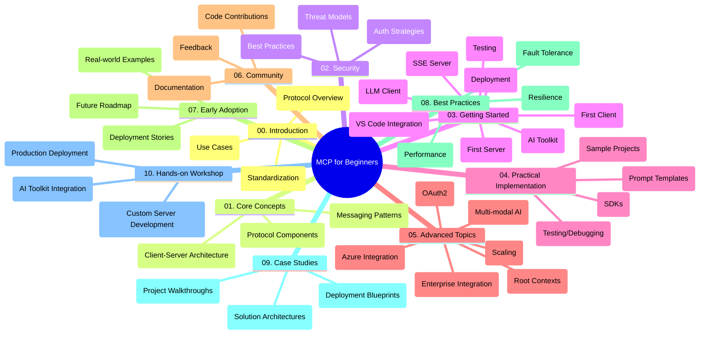

<!--
CO_OP_TRANSLATOR_METADATA:
{
  "original_hash": "a607d4febc94caee9a12b77795f7fc9a",
  "translation_date": "2025-06-11T16:43:20+00:00",
  "source_file": "study_guide.md",
  "language_code": "pl"
}
-->
# Model Context Protocol (MCP) dla początkujących – przewodnik nauki

Ten przewodnik nauki przedstawia przegląd struktury i zawartości repozytorium dla kursu „Model Context Protocol (MCP) dla początkujących”. Skorzystaj z niego, aby sprawnie poruszać się po repozytorium i w pełni wykorzystać dostępne zasoby.

## Przegląd repozytorium

Model Context Protocol (MCP) to ustandaryzowany framework do interakcji między modelami AI a aplikacjami klienckimi. To repozytorium oferuje kompleksowy kurs z praktycznymi przykładami kodu w C#, Java, JavaScript, Python i TypeScript, skierowany do deweloperów AI, architektów systemów oraz inżynierów oprogramowania.

## Wizualna mapa kursu

## Struktura repozytorium

Repozytorium podzielone jest na dziesięć głównych sekcji, z których każda skupia się na innym aspekcie MCP:

1. **Introduction (00-Introduction/)**
   - Wprowadzenie do Model Context Protocol
   - Dlaczego standaryzacja jest ważna w pipeline’ach AI
   - Praktyczne zastosowania i korzyści

2. **Core Concepts (01-CoreConcepts/)**
   - Architektura klient-serwer
   - Kluczowe elementy protokołu
   - Wzorce komunikacji w MCP

3. **Security (02-Security/)**
   - Zagrożenia bezpieczeństwa w systemach opartych na MCP
   - Najlepsze praktyki zabezpieczania implementacji
   - Strategie uwierzytelniania i autoryzacji

4. **Getting Started (03-GettingStarted/)**
   - Konfiguracja środowiska i ustawienia
   - Tworzenie podstawowych serwerów i klientów MCP
   - Integracja z istniejącymi aplikacjami
   - Podsekcje dotyczące pierwszego serwera, pierwszego klienta, klienta LLM, integracji z VS Code, serwera SSE, AI Toolkit, testowania i wdrożenia

5. **Practical Implementation (04-PracticalImplementation/)**
   - Korzystanie z SDK w różnych językach programowania
   - Techniki debugowania, testowania i walidacji
   - Tworzenie wielokrotnego użytku szablonów promptów i workflowów
   - Przykładowe projekty z przykładami implementacji

6. **Advanced Topics (05-AdvancedTopics/)**
   - Wielomodalne workflow AI i rozszerzalność
   - Strategie bezpiecznego skalowania
   - MCP w ekosystemach korporacyjnych
   - Tematy specjalistyczne, takie jak integracja z Azure, multimodalność, OAuth2, root contexts, routing, sampling, skalowanie, bezpieczeństwo, integracja z wyszukiwarką internetową i streaming

7. **Community Contributions (06-CommunityContributions/)**
   - Jak wnosić wkład w kod i dokumentację
   - Współpraca przez GitHub
   - Ulepszenia i opinie społeczności

8. **Lessons from Early Adoption (07-LessonsfromEarlyAdoption/)**
   - Przykłady wdrożeń i historie sukcesu
   - Budowanie i wdrażanie rozwiązań opartych na MCP
   - Trendy i plan rozwoju na przyszłość

9. **Best Practices (08-BestPractices/)**
   - Optymalizacja wydajności i tuning
   - Projektowanie odpornych systemów MCP
   - Strategie testowania i odporności

10. **Case Studies (09-CaseStudy/)**
    - Dogłębne analizy architektur rozwiązań MCP
    - Plany wdrożeniowe i wskazówki integracyjne
    - Opisane diagramy i przewodniki po projektach

11. **Hands-on Workshop (10-StreamliningAIWorkflowsBuildingAnMCPServerWithAIToolkit/)**
    - Kompleksowe warsztaty praktyczne łączące MCP z Microsoft AI Toolkit dla VS Code
    - Tworzenie inteligentnych aplikacji łączących modele AI z narzędziami rzeczywistymi
    - Praktyczne moduły obejmujące podstawy, tworzenie własnego serwera oraz strategie wdrożenia produkcyjnego

## Przykładowe projekty

Repozytorium zawiera wiele przykładowych projektów pokazujących implementację MCP w różnych językach programowania:

### Podstawowe przykłady kalkulatora MCP
- Przykład serwera MCP w C#
- Kalkulator MCP w Javie
- Demo MCP w JavaScript
- Serwer MCP w Pythonie
- Przykład MCP w TypeScript

### Zaawansowane projekty kalkulatora MCP
- Zaawansowany przykład w C#
- Przykład aplikacji kontenerowej w Javie
- Zaawansowany przykład w JavaScript
- Złożona implementacja w Pythonie
- Przykład kontenera w TypeScript

## Dodatkowe zasoby

Repozytorium zawiera również materiały wspierające:

- **Folder Images**: zawiera diagramy i ilustracje używane w kursie
- **Translations**: wsparcie wielojęzyczne z automatycznymi tłumaczeniami dokumentacji
- **Oficjalne zasoby MCP**:
  - [MCP Documentation](https://modelcontextprotocol.io/)
  - [MCP Specification](https://spec.modelcontextprotocol.io/)
  - [MCP GitHub Repository](https://github.com/modelcontextprotocol)

## Jak korzystać z repozytorium

1. **Nauka krok po kroku**: Przechodź przez rozdziały po kolei (od 00 do 10), aby uczyć się w uporządkowany sposób.
2. **Skupienie na konkretnym języku**: Jeśli interesuje Cię konkretny język programowania, przeglądaj foldery ze wzorcami dla wybranego języka.
3. **Praktyczna implementacja**: Zacznij od sekcji „Getting Started”, aby skonfigurować środowisko i stworzyć pierwszy serwer oraz klienta MCP.
4. **Zaawansowane zagadnienia**: Po opanowaniu podstaw, zagłęb się w tematy zaawansowane, aby poszerzyć swoją wiedzę.
5. **Zaangażowanie społeczności**: Dołącz do [Azure AI Foundry Discord](https://discord.com/invite/ByRwuEEgH4), aby łączyć się z ekspertami i innymi deweloperami.

## Wkład w projekt

To repozytorium zachęca do wkładu ze strony społeczności. Szczegóły znajdziesz w sekcji Community Contributions.

---

*Ten przewodnik nauki został stworzony 11 czerwca 2025 roku i przedstawia stan repozytorium na ten dzień. Zawartość repozytorium mogła ulec zmianie od tego czasu.*

**Zastrzeżenie**:  
Niniejszy dokument został przetłumaczony przy użyciu automatycznej usługi tłumaczeniowej AI [Co-op Translator](https://github.com/Azure/co-op-translator). Mimo że dążymy do dokładności, prosimy mieć na uwadze, że tłumaczenia automatyczne mogą zawierać błędy lub niedokładności. Oryginalny dokument w języku źródłowym powinien być traktowany jako źródło wiarygodne. W przypadku informacji o kluczowym znaczeniu zalecane jest skorzystanie z profesjonalnego tłumaczenia wykonanego przez człowieka. Nie ponosimy odpowiedzialności za jakiekolwiek nieporozumienia lub błędne interpretacje wynikające z korzystania z tego tłumaczenia.