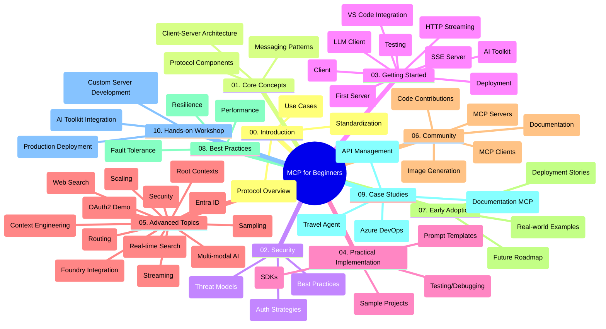

<!--
CO_OP_TRANSLATOR_METADATA:
{
  "original_hash": "77bfab7090f987a5b9fe078f50dbda13",
  "translation_date": "2025-07-16T22:31:31+00:00",
  "source_file": "study_guide.md",
  "language_code": "pl"
}
-->
# Model Context Protocol (MCP) dla początkujących – przewodnik nauki

Ten przewodnik nauki przedstawia przegląd struktury i zawartości repozytorium dla kursu „Model Context Protocol (MCP) dla początkujących”. Skorzystaj z tego przewodnika, aby efektywnie poruszać się po repozytorium i w pełni wykorzystać dostępne zasoby.

## Przegląd repozytorium

Model Context Protocol (MCP) to ustandaryzowane ramy do interakcji między modelami AI a aplikacjami klienckimi. Początkowo stworzony przez Anthropic, MCP jest obecnie utrzymywany przez szerszą społeczność MCP za pośrednictwem oficjalnej organizacji na GitHubie. To repozytorium oferuje kompleksowy program nauczania z praktycznymi przykładami kodu w C#, Java, JavaScript, Python oraz TypeScript, przeznaczony dla deweloperów AI, architektów systemów i inżynierów oprogramowania.

## Wizualna mapa programu nauczania

## Struktura repozytorium

Repozytorium jest podzielone na dziesięć głównych sekcji, z których każda skupia się na różnych aspektach MCP:

1. **Wprowadzenie (00-Introduction/)**
   - Przegląd Model Context Protocol
   - Dlaczego standaryzacja jest ważna w pipeline’ach AI
   - Praktyczne zastosowania i korzyści

2. **Podstawowe koncepcje (01-CoreConcepts/)**
   - Architektura klient-serwer
   - Kluczowe elementy protokołu
   - Wzorce komunikacji w MCP

3. **Bezpieczeństwo (02-Security/)**
   - Zagrożenia bezpieczeństwa w systemach opartych na MCP
   - Najlepsze praktyki zabezpieczania implementacji
   - Strategie uwierzytelniania i autoryzacji

4. **Pierwsze kroki (03-GettingStarted/)**
   - Konfiguracja środowiska i ustawienia
   - Tworzenie podstawowych serwerów i klientów MCP
   - Integracja z istniejącymi aplikacjami
   - Zawiera sekcje dotyczące:
     - Pierwszej implementacji serwera
     - Tworzenia klienta
     - Integracji klienta LLM
     - Integracji z VS Code
     - Serwera Server-Sent Events (SSE)
     - Strumieniowania HTTP
     - Integracji z AI Toolkit
     - Strategii testowania
     - Wytycznych dotyczących wdrożenia

5. **Praktyczna implementacja (04-PracticalImplementation/)**
   - Korzystanie z SDK w różnych językach programowania
   - Techniki debugowania, testowania i walidacji
   - Tworzenie wielokrotnego użytku szablonów promptów i workflowów
   - Przykładowe projekty z przykładami implementacji

6. **Zaawansowane tematy (05-AdvancedTopics/)**
   - Techniki inżynierii kontekstu
   - Integracja agenta Foundry
   - Wielomodalne workflowy AI
   - Demonstracje uwierzytelniania OAuth2
   - Możliwości wyszukiwania w czasie rzeczywistym
   - Strumieniowanie w czasie rzeczywistym
   - Implementacja root contexts
   - Strategie routingu
   - Techniki próbkowania
   - Podejścia do skalowania
   - Aspekty bezpieczeństwa
   - Integracja bezpieczeństwa Entra ID
   - Integracja wyszukiwania w sieci

7. **Wkład społeczności (06-CommunityContributions/)**
   - Jak wnosić kod i dokumentację
   - Współpraca przez GitHub
   - Ulepszenia i opinie napędzane przez społeczność
   - Korzystanie z różnych klientów MCP (Claude Desktop, Cline, VSCode)
   - Praca z popularnymi serwerami MCP, w tym generowaniem obrazów

8. **Wnioski z wczesnej adopcji (07-LessonsfromEarlyAdoption/)**
   - Realne implementacje i historie sukcesu
   - Budowa i wdrażanie rozwiązań opartych na MCP
   - Trendy i przyszła mapa drogowa

9. **Najlepsze praktyki (08-BestPractices/)**
   - Optymalizacja wydajności i strojenie
   - Projektowanie odpornych na błędy systemów MCP
   - Strategie testowania i odporności

10. **Studia przypadków (09-CaseStudy/)**
    - Studium przypadku: integracja Azure API Management
    - Studium przypadku: implementacja agenta podróży
    - Studium przypadku: integracja Azure DevOps z YouTube
    - Przykłady implementacji z szczegółową dokumentacją

11. **Warsztaty praktyczne (10-StreamliningAIWorkflowsBuildingAnMCPServerWithAIToolkit/)**
    - Kompleksowe warsztaty praktyczne łączące MCP z AI Toolkit
    - Budowa inteligentnych aplikacji łączących modele AI z narzędziami rzeczywistymi
    - Praktyczne moduły obejmujące podstawy, tworzenie niestandardowych serwerów i strategie wdrożenia produkcyjnego
    - Podejście oparte na laboratoriach z instrukcjami krok po kroku

## Dodatkowe zasoby

Repozytorium zawiera materiały wspierające:

- **Folder Images**: Zawiera diagramy i ilustracje używane w całym programie nauczania
- **Tłumaczenia**: Wsparcie wielojęzyczne z automatycznymi tłumaczeniami dokumentacji
- **Oficjalne zasoby MCP**:
  - [MCP Documentation](https://modelcontextprotocol.io/)
  - [MCP Specification](https://spec.modelcontextprotocol.io/)
  - [MCP GitHub Repository](https://github.com/modelcontextprotocol)

## Jak korzystać z tego repozytorium

1. **Nauka sekwencyjna**: Przechodź przez rozdziały po kolei (od 00 do 10), aby uzyskać uporządkowaną ścieżkę nauki.
2. **Skupienie na konkretnym języku**: Jeśli interesuje Cię konkretny język programowania, sprawdź katalogi z przykładami implementacji w wybranym języku.
3. **Praktyczna implementacja**: Zacznij od sekcji „Pierwsze kroki”, aby skonfigurować środowisko i stworzyć swój pierwszy serwer i klient MCP.
4. **Zaawansowane eksploracje**: Gdy opanujesz podstawy, zagłęb się w zaawansowane tematy, aby poszerzyć wiedzę.
5. **Zaangażowanie społeczności**: Dołącz do społeczności MCP poprzez dyskusje na GitHubie i kanały Discord, aby nawiązać kontakt z ekspertami i innymi deweloperami.

## Klienci i narzędzia MCP

Program nauczania obejmuje różne klientów i narzędzia MCP:

1. **Oficjalni klienci**:
   - Claude Desktop
   - Claude w VSCode
   - Claude API

2. **Klienci społecznościowi**:
   - Cline (terminalowy)
   - Cursor (edytor kodu)
   - ChatMCP
   - Windsurf

3. **Narzędzia do zarządzania MCP**:
   - MCP CLI
   - MCP Manager
   - MCP Linker
   - MCP Router

## Popularne serwery MCP

Repozytorium przedstawia różne serwery MCP, w tym:

1. **Oficjalne serwery referencyjne**:
   - Filesystem
   - Fetch
   - Memory
   - Sequential Thinking

2. **Generowanie obrazów**:
   - Azure OpenAI DALL-E 3
   - Stable Diffusion WebUI
   - Replicate

3. **Narzędzia deweloperskie**:
   - Git MCP
   - Terminal Control
   - Code Assistant

4. **Specjalistyczne serwery**:
   - Salesforce
   - Microsoft Teams
   - Jira & Confluence

## Wkład w projekt

To repozytorium zachęca społeczność do współtworzenia. Zobacz sekcję Wkład społeczności, aby dowiedzieć się, jak skutecznie wnosić swój wkład w ekosystem MCP.

## Dziennik zmian

| Data | Zmiany |
|------|---------|
| 16 lipca 2025 | - Zaktualizowano strukturę repozytorium, aby odzwierciedlić aktualną zawartość - Dodano sekcję Klienci i narzędzia MCP - Dodano sekcję Popularne serwery MCP - Zaktualizowano wizualną mapę programu nauczania o wszystkie aktualne tematy - Rozbudowano sekcję Zaawansowane tematy o wszystkie specjalistyczne obszary - Zaktualizowano studia przypadków, aby odzwierciedlały rzeczywiste przykłady - Wyjaśniono pochodzenie MCP jako stworzonego przez Anthropic |
| 11 czerwca 2025 | - Pierwotne utworzenie przewodnika nauki - Dodano wizualną mapę programu nauczania - Nakreślono strukturę repozytorium - Dodano przykładowe projekty i dodatkowe zasoby |

---

*Ten przewodnik nauki został zaktualizowany 16 lipca 2025 i przedstawia przegląd repozytorium na ten dzień. Zawartość repozytorium może być aktualizowana po tej dacie.*

**Zastrzeżenie**:  
Niniejszy dokument został przetłumaczony za pomocą usługi tłumaczenia AI [Co-op Translator](https://github.com/Azure/co-op-translator). Mimo że dążymy do dokładności, prosimy mieć na uwadze, że automatyczne tłumaczenia mogą zawierać błędy lub nieścisłości. Oryginalny dokument w języku źródłowym powinien być uznawany za źródło autorytatywne. W przypadku informacji o kluczowym znaczeniu zalecane jest skorzystanie z profesjonalnego tłumaczenia wykonanego przez człowieka. Nie ponosimy odpowiedzialności za jakiekolwiek nieporozumienia lub błędne interpretacje wynikające z korzystania z tego tłumaczenia.