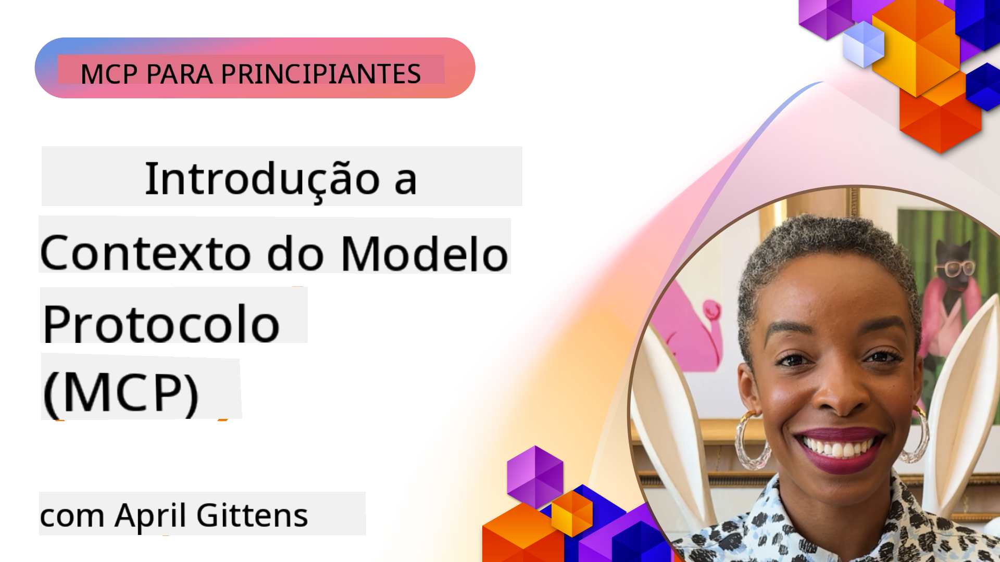
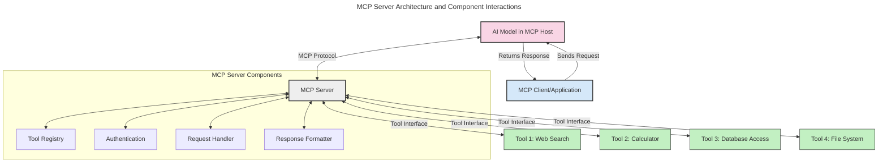
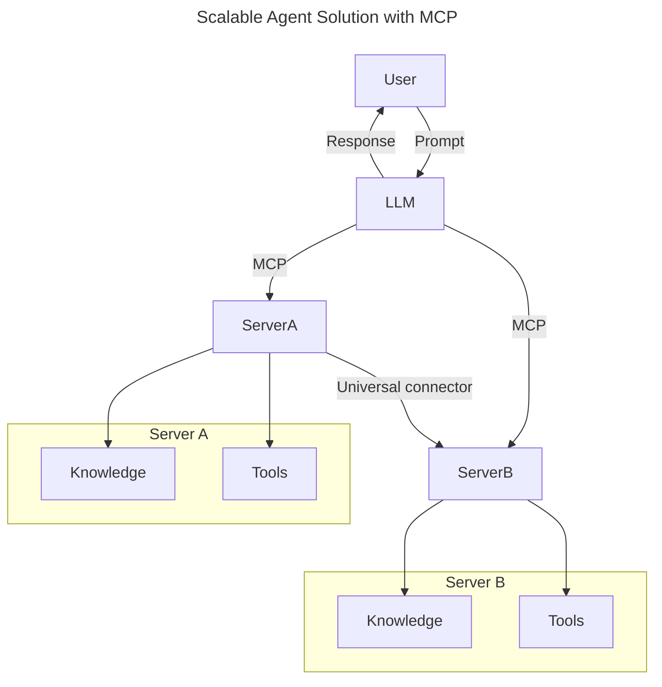
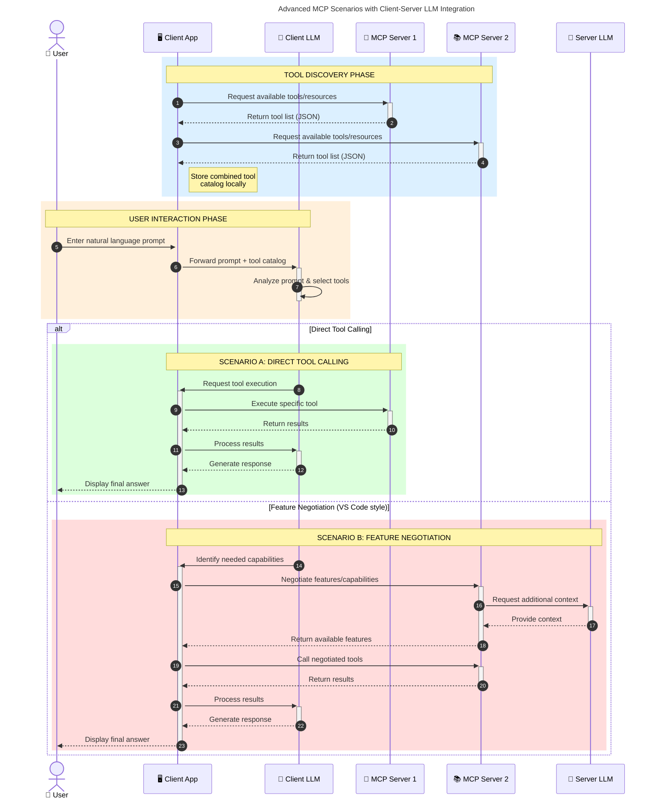

<!--
CO_OP_TRANSLATOR_METADATA:
{
  "original_hash": "2bbbcded256d46a24e3f448384a2b4a2",
  "translation_date": "2025-07-29T00:39:42+00:00",
  "source_file": "00-Introduction/README.md",
  "language_code": "pt"
}
-->
# Introdução ao Protocolo de Contexto de Modelo (MCP): Por Que Ele É Importante para Aplicações de IA Escaláveis

_(Clique na imagem acima para assistir ao vídeo desta lição)_

As aplicações de IA generativa representam um grande avanço, pois frequentemente permitem que o utilizador interaja com a aplicação através de prompts em linguagem natural. No entanto, à medida que mais tempo e recursos são investidos nessas aplicações, é importante garantir que seja fácil integrar funcionalidades e recursos de forma a permitir extensibilidade, que a aplicação suporte mais de um modelo e consiga lidar com as diversas particularidades dos modelos. Em resumo, construir aplicações de IA generativa é simples no início, mas, à medida que crescem e se tornam mais complexas, é necessário começar a definir uma arquitetura e, provavelmente, adotar um padrão para garantir que as aplicações sejam desenvolvidas de forma consistente. É aqui que o MCP entra em cena para organizar as coisas e fornecer um padrão.

---

## **🔍 O Que É o Protocolo de Contexto de Modelo (MCP)?**

O **Protocolo de Contexto de Modelo (MCP)** é uma **interface aberta e padronizada** que permite que Modelos de Linguagem de Grande Escala (LLMs) interajam de forma fluida com ferramentas externas, APIs e fontes de dados. Ele fornece uma arquitetura consistente para ampliar as funcionalidades dos modelos de IA além dos seus dados de treino, permitindo sistemas de IA mais inteligentes, escaláveis e responsivos.

---

## **🎯 Por Que a Padronização em IA É Importante**

À medida que as aplicações de IA generativa se tornam mais complexas, é essencial adotar padrões que garantam **escalabilidade, extensibilidade** e **manutenibilidade**. O MCP aborda essas necessidades ao:

- Unificar as integrações entre modelos e ferramentas
- Reduzir soluções personalizadas frágeis e pontuais
- Permitir que múltiplos modelos coexistam em um único ecossistema

---

## **📚 Objetivos de Aprendizagem**

Ao final deste artigo, você será capaz de:

- Definir o **Protocolo de Contexto de Modelo (MCP)** e seus casos de uso
- Compreender como o MCP padroniza a comunicação entre modelos e ferramentas
- Identificar os componentes principais da arquitetura do MCP
- Explorar aplicações reais do MCP em contextos empresariais e de desenvolvimento

---

## **💡 Por Que o Protocolo de Contexto de Modelo (MCP) É Revolucionário**

### **🔗 O MCP Resolve a Fragmentação nas Interações de IA**

Antes do MCP, integrar modelos com ferramentas exigia:

- Código personalizado para cada par ferramenta-modelo
- APIs não padronizadas para cada fornecedor
- Quebras frequentes devido a atualizações
- Baixa escalabilidade com o aumento de ferramentas

### **✅ Benefícios da Padronização do MCP**

| **Benefício**             | **Descrição**                                                                  |
|---------------------------|-------------------------------------------------------------------------------|
| Interoperabilidade        | LLMs funcionam de forma fluida com ferramentas de diferentes fornecedores     |
| Consistência              | Comportamento uniforme em plataformas e ferramentas                          |
| Reutilização              | Ferramentas desenvolvidas uma vez podem ser usadas em vários projetos         |
| Desenvolvimento Acelerado | Redução do tempo de desenvolvimento com interfaces padronizadas e plug-and-play |

---

## **🧱 Visão Geral da Arquitetura de Alto Nível do MCP**

O MCP segue um modelo **cliente-servidor**, onde:

- **Hosts MCP** executam os modelos de IA
- **Clientes MCP** iniciam solicitações
- **Servidores MCP** fornecem contexto, ferramentas e capacidades

### **Componentes Principais:**

- **Recursos** – Dados estáticos ou dinâmicos para os modelos  
- **Prompts** – Fluxos de trabalho predefinidos para geração orientada  
- **Ferramentas** – Funções executáveis, como pesquisa e cálculos  
- **Amostragem** – Comportamento agente através de interações recursivas  

---

## Como Funcionam os Servidores MCP

Os servidores MCP operam da seguinte forma:

- **Fluxo de Solicitação**:  
    1. O Cliente MCP envia uma solicitação ao Modelo de IA em execução em um Host MCP.  
    2. O Modelo de IA identifica quando precisa de ferramentas ou dados externos.  
    3. O modelo comunica-se com o Servidor MCP usando o protocolo padronizado.  

- **Funcionalidade do Servidor MCP**:  
    - Registro de Ferramentas: Mantém um catálogo de ferramentas disponíveis e suas capacidades.  
    - Autenticação: Verifica permissões para acesso às ferramentas.  
    - Manipulador de Solicitações: Processa solicitações de ferramentas recebidas do modelo.  
    - Formatador de Respostas: Estrutura as saídas das ferramentas em um formato compreensível pelo modelo.  

- **Execução de Ferramentas**:  
    - O servidor encaminha solicitações para as ferramentas externas apropriadas.  
    - As ferramentas executam suas funções especializadas (pesquisa, cálculos, consultas a bases de dados, etc.).  
    - Os resultados são retornados ao modelo em um formato consistente.  

- **Conclusão da Resposta**:  
    - O modelo de IA incorpora as saídas das ferramentas na sua resposta.  
    - A resposta final é enviada de volta para a aplicação cliente.  

## 👨‍💻 Como Construir um Servidor MCP (Com Exemplos)

Os servidores MCP permitem estender as capacidades dos LLMs fornecendo dados e funcionalidades.

Pronto para experimentar? Aqui estão exemplos de como criar um servidor MCP simples em diferentes linguagens:

- **Exemplo em Python**: https://github.com/modelcontextprotocol/python-sdk

- **Exemplo em TypeScript**: https://github.com/modelcontextprotocol/typescript-sdk

- **Exemplo em Java**: https://github.com/modelcontextprotocol/java-sdk

- **Exemplo em C#/.NET**: https://github.com/modelcontextprotocol/csharp-sdk

---

## 🌍 Casos de Uso Reais para o MCP

O MCP possibilita uma ampla gama de aplicações ao estender as capacidades da IA:

| **Aplicação**              | **Descrição**                                                                  |
|----------------------------|-------------------------------------------------------------------------------|
| Integração de Dados Empresariais | Conectar LLMs a bases de dados, CRMs ou ferramentas internas               |
| Sistemas de IA Agentes     | Permitir agentes autônomos com acesso a ferramentas e fluxos de decisão       |
| Aplicações Multimodais     | Combinar ferramentas de texto, imagem e áudio em uma única aplicação de IA    |
| Integração de Dados em Tempo Real | Incorporar dados ao vivo nas interações de IA para resultados mais precisos e atuais |

### 🧠 MCP = Padrão Universal para Interações de IA

O Protocolo de Contexto de Modelo (MCP) atua como um padrão universal para interações de IA, assim como o USB-C padronizou conexões físicas para dispositivos. No mundo da IA, o MCP fornece uma interface consistente, permitindo que modelos (clientes) integrem-se de forma fluida com ferramentas e provedores de dados externos (servidores). Isso elimina a necessidade de protocolos personalizados e diversos para cada API ou fonte de dados.

Sob o MCP, uma ferramenta compatível com MCP (referida como servidor MCP) segue um padrão unificado. Esses servidores podem listar as ferramentas ou ações que oferecem e executar essas ações quando solicitados por um agente de IA. Plataformas de agentes de IA que suportam MCP são capazes de descobrir ferramentas disponíveis nos servidores e invocá-las através deste protocolo padrão.

### 💡 Facilita o acesso ao conhecimento

Além de oferecer ferramentas, o MCP também facilita o acesso ao conhecimento. Ele permite que aplicações forneçam contexto a modelos de linguagem de grande escala (LLMs) ao conectá-los a várias fontes de dados. Por exemplo, um servidor MCP pode representar o repositório de documentos de uma empresa, permitindo que agentes recuperem informações relevantes sob demanda. Outro servidor pode lidar com ações específicas, como enviar e-mails ou atualizar registos. Do ponto de vista do agente, essas são simplesmente ferramentas que ele pode usar—algumas ferramentas retornam dados (contexto de conhecimento), enquanto outras executam ações. O MCP gerencia ambos de forma eficiente.

Um agente que se conecta a um servidor MCP aprende automaticamente as capacidades disponíveis e os dados acessíveis do servidor através de um formato padrão. Essa padronização permite a disponibilidade dinâmica de ferramentas. Por exemplo, adicionar um novo servidor MCP ao sistema de um agente torna suas funções imediatamente utilizáveis, sem necessidade de personalização adicional das instruções do agente.

Essa integração simplificada alinha-se ao fluxo representado no diagrama mermaid, onde os servidores fornecem tanto ferramentas quanto conhecimento, garantindo colaboração fluida entre sistemas.

### 👉 Exemplo: Solução Escalável de Agentes

### 🔄 Cenários Avançados de MCP com Integração de LLM no Lado do Cliente

Além da arquitetura básica do MCP, existem cenários avançados onde tanto o cliente quanto o servidor contêm LLMs, permitindo interações mais sofisticadas:

---

## 🔐 Benefícios Práticos do MCP

Aqui estão os benefícios práticos de usar o MCP:

- **Atualidade**: Modelos podem acessar informações atualizadas além dos seus dados de treino  
- **Extensão de Capacidades**: Modelos podem utilizar ferramentas especializadas para tarefas para as quais não foram treinados  
- **Redução de Alucinações**: Fontes de dados externas fornecem uma base factual  
- **Privacidade**: Dados sensíveis podem permanecer em ambientes seguros em vez de serem incorporados em prompts  

---

## 📌 Principais Conclusões

As seguintes são as principais conclusões sobre o uso do MCP:

- O **MCP** padroniza como os modelos de IA interagem com ferramentas e dados  
- Promove **extensibilidade, consistência e interoperabilidade**  
- O MCP ajuda a **reduzir o tempo de desenvolvimento, melhorar a confiabilidade e ampliar as capacidades dos modelos**  
- A arquitetura cliente-servidor **permite aplicações de IA flexíveis e extensíveis**  

---

## 🧠 Exercício

Pense em uma aplicação de IA que você gostaria de construir.

- Quais **ferramentas ou dados externos** poderiam melhorar suas capacidades?  
- Como o MCP poderia tornar a integração **mais simples e confiável**?  

---

## Recursos Adicionais

- [Repositório GitHub do MCP](https://github.com/modelcontextprotocol)

---

## O Que Vem a Seguir

Próximo: [Capítulo 1: Conceitos Fundamentais](../01-CoreConcepts/README.md)

**Aviso Legal**:  
Este documento foi traduzido utilizando o serviço de tradução por IA [Co-op Translator](https://github.com/Azure/co-op-translator). Embora nos esforcemos para garantir a precisão, esteja ciente de que traduções automáticas podem conter erros ou imprecisões. O documento original na sua língua nativa deve ser considerado a fonte autoritária. Para informações críticas, recomenda-se a tradução profissional realizada por humanos. Não nos responsabilizamos por quaisquer mal-entendidos ou interpretações incorretas decorrentes do uso desta tradução.