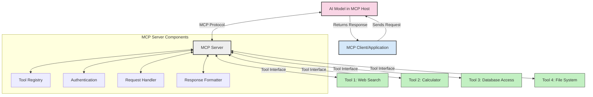
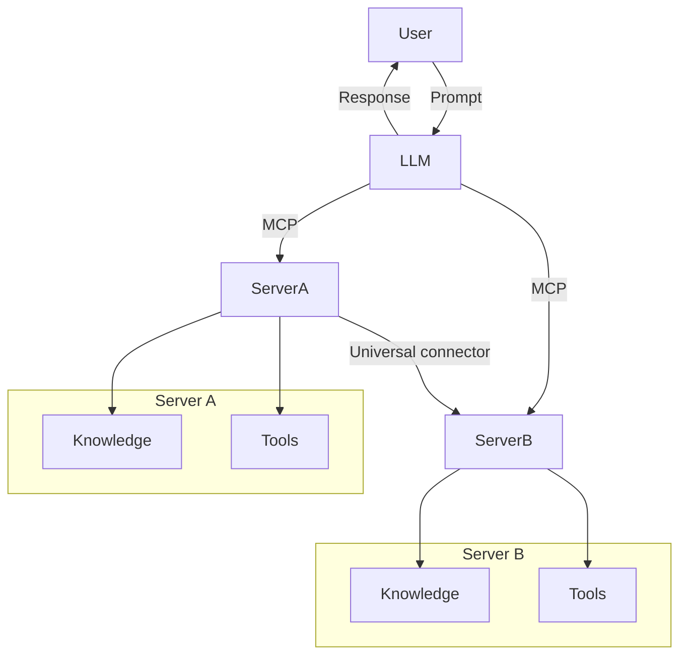

<!--
CO_OP_TRANSLATOR_METADATA:
{
  "original_hash": "cf84f987e1b771d2201408e110dfd2db",
  "translation_date": "2025-05-20T16:46:34+00:00",
  "source_file": "00-Introduction/README.md",
  "language_code": "pt"
}
-->
# Introdução ao Model Context Protocol (MCP): Por Que É Importante para Aplicações de IA Escaláveis

Aplicações de IA generativa representam um grande avanço, pois frequentemente permitem que o usuário interaja com o app usando comandos em linguagem natural. No entanto, à medida que mais tempo e recursos são investidos nessas aplicações, é importante garantir que você possa integrar funcionalidades e recursos de forma fácil, que seja simples estender, que seu app suporte mais de um modelo e suas particularidades. Em resumo, construir apps de IA generativa é fácil no início, mas à medida que cresce e se torna mais complexo, é necessário começar a definir uma arquitetura e, provavelmente, depender de um padrão para garantir que seus apps sejam construídos de forma consistente. É aí que o MCP entra para organizar tudo e fornecer um padrão.

---

## **🔍 O que é o Model Context Protocol (MCP)?**

O **Model Context Protocol (MCP)** é uma **interface aberta e padronizada** que permite que Grandes Modelos de Linguagem (LLMs) interajam de forma fluida com ferramentas externas, APIs e fontes de dados. Ele oferece uma arquitetura consistente para ampliar a funcionalidade dos modelos de IA além dos dados de treinamento, possibilitando sistemas de IA mais inteligentes, escaláveis e responsivos.

---

## **🎯 Por que a padronização em IA é importante**

À medida que aplicações de IA generativa se tornam mais complexas, é essencial adotar padrões que garantam **escalabilidade, extensibilidade** e **manutenibilidade**. O MCP atende a essas necessidades ao:

- Unificar integrações entre modelos e ferramentas
- Reduzir soluções frágeis e pontuais
- Permitir que múltiplos modelos coexistam em um mesmo ecossistema

---

## **📚 Objetivos de Aprendizagem**

Ao final deste artigo, você será capaz de:

- Definir o **Model Context Protocol (MCP)** e seus casos de uso
- Entender como o MCP padroniza a comunicação entre modelos e ferramentas
- Identificar os componentes principais da arquitetura MCP
- Explorar aplicações reais do MCP em contextos empresariais e de desenvolvimento

---

## **💡 Por que o Model Context Protocol (MCP) é revolucionário**

### **🔗 MCP resolve a fragmentação nas interações de IA**

Antes do MCP, integrar modelos com ferramentas exigia:

- Código personalizado para cada par ferramenta-modelo
- APIs não padronizadas para cada fornecedor
- Quebras frequentes devido a atualizações
- Baixa escalabilidade conforme aumentavam as ferramentas

### **✅ Benefícios da padronização MCP**

| **Benefício**             | **Descrição**                                                                   |
|---------------------------|---------------------------------------------------------------------------------|
| Interoperabilidade        | LLMs funcionam perfeitamente com ferramentas de diferentes fornecedores         |
| Consistência             | Comportamento uniforme entre plataformas e ferramentas                          |
| Reutilização             | Ferramentas construídas uma vez podem ser usadas em vários projetos e sistemas  |
| Desenvolvimento acelerado | Redução do tempo de desenvolvimento com interfaces padronizadas e plug-and-play |

---

## **🧱 Visão geral da arquitetura MCP em alto nível**

O MCP segue um **modelo cliente-servidor**, onde:

- **Hosts MCP** executam os modelos de IA
- **Clientes MCP** iniciam as requisições
- **Servidores MCP** fornecem contexto, ferramentas e capacidades

### **Componentes principais:**

- **Recursos** – Dados estáticos ou dinâmicos para os modelos  
- **Prompts** – Fluxos pré-definidos para geração guiada  
- **Ferramentas** – Funções executáveis como busca, cálculos  
- **Amostragem** – Comportamento agentivo via interações recursivas

---

## Como funcionam os Servidores MCP

Os servidores MCP operam da seguinte forma:

- **Fluxo de requisição**:  
    1. O Cliente MCP envia uma requisição para o Modelo de IA rodando em um Host MCP.  
    2. O Modelo de IA identifica quando precisa de ferramentas externas ou dados.  
    3. O modelo se comunica com o Servidor MCP usando o protocolo padronizado.

- **Funcionalidades do Servidor MCP**:  
    - Registro de Ferramentas: Mantém um catálogo das ferramentas disponíveis e suas capacidades.  
    - Autenticação: Verifica permissões para acesso às ferramentas.  
    - Gerenciador de Requisições: Processa solicitações de ferramentas feitas pelo modelo.  
    - Formatador de Resposta: Estrutura as saídas das ferramentas em um formato que o modelo compreenda.

- **Execução das Ferramentas**:  
    - O servidor direciona as requisições para as ferramentas externas apropriadas  
    - As ferramentas executam suas funções especializadas (busca, cálculo, consultas a banco de dados, etc.)  
    - Os resultados são retornados ao modelo em formato consistente.

- **Conclusão da Resposta**:  
    - O modelo de IA incorpora as saídas das ferramentas na sua resposta.  
    - A resposta final é enviada de volta para a aplicação cliente.

## 👨‍💻 Como Construir um Servidor MCP (Com Exemplos)

Servidores MCP permitem que você estenda as capacidades dos LLMs fornecendo dados e funcionalidades.

Quer experimentar? Aqui estão exemplos de como criar um servidor MCP simples em diferentes linguagens:

- **Exemplo em Python**: https://github.com/modelcontextprotocol/python-sdk

- **Exemplo em TypeScript**: https://github.com/modelcontextprotocol/typescript-sdk

- **Exemplo em Java**: https://github.com/modelcontextprotocol/java-sdk

- **Exemplo em C#/.NET**: https://github.com/modelcontextprotocol/csharp-sdk

## 🌍 Casos de Uso Reais para MCP

O MCP possibilita uma ampla gama de aplicações ao ampliar as capacidades da IA:

| **Aplicação**               | **Descrição**                                                                 |
|-----------------------------|-------------------------------------------------------------------------------|
| Integração de Dados Empresariais | Conectar LLMs a bancos de dados, CRMs ou ferramentas internas              |
| Sistemas de IA Agentiva      | Habilitar agentes autônomos com acesso a ferramentas e fluxos de decisão      |
| Aplicações multimodais       | Combinar ferramentas de texto, imagem e áudio em um único app de IA unificado |
| Integração de Dados em Tempo Real | Trazer dados ao vivo para interações de IA para resultados mais precisos e atuais |

### 🧠 MCP = Padrão Universal para Interações de IA

O Model Context Protocol (MCP) atua como um padrão universal para interações de IA, assim como o USB-C padronizou conexões físicas para dispositivos. No mundo da IA, o MCP fornece uma interface consistente, permitindo que modelos (clientes) integrem-se perfeitamente com ferramentas externas e provedores de dados (servidores). Isso elimina a necessidade de protocolos diversos e personalizados para cada API ou fonte de dados.

Sob o MCP, uma ferramenta compatível (referida como servidor MCP) segue um padrão unificado. Esses servidores podem listar as ferramentas ou ações que oferecem e executar essas ações quando solicitadas por um agente de IA. Plataformas de agentes de IA que suportam MCP são capazes de descobrir ferramentas disponíveis nos servidores e invocá-las por meio desse protocolo padrão.

### 💡 Facilita o acesso ao conhecimento

Além de oferecer ferramentas, o MCP também facilita o acesso ao conhecimento. Ele permite que aplicações forneçam contexto para grandes modelos de linguagem (LLMs) ao conectá-los a várias fontes de dados. Por exemplo, um servidor MCP pode representar o repositório de documentos de uma empresa, permitindo que agentes recuperem informações relevantes sob demanda. Outro servidor pode lidar com ações específicas, como enviar e-mails ou atualizar registros. Do ponto de vista do agente, são simplesmente ferramentas que podem usar — algumas retornam dados (contexto de conhecimento), outras executam ações. O MCP gerencia ambos de forma eficiente.

Um agente conectado a um servidor MCP aprende automaticamente as capacidades disponíveis e os dados acessíveis do servidor por meio de um formato padrão. Essa padronização permite disponibilidade dinâmica de ferramentas. Por exemplo, adicionar um novo servidor MCP ao sistema de um agente torna suas funções imediatamente utilizáveis sem necessidade de personalização adicional das instruções do agente.

Essa integração simplificada está alinhada com o fluxo mostrado no diagrama mermaid, onde servidores fornecem tanto ferramentas quanto conhecimento, garantindo colaboração fluida entre sistemas.

### 👉 Exemplo: Solução de agente escalável

## 🔐 Benefícios práticos do MCP

Aqui estão os benefícios práticos de usar MCP:

- **Atualização constante**: Modelos podem acessar informações atualizadas além dos dados de treinamento  
- **Extensão de capacidades**: Modelos podem usar ferramentas especializadas para tarefas que não foram treinados  
- **Redução de alucinações**: Fontes externas de dados fornecem base factual  
- **Privacidade**: Dados sensíveis podem permanecer em ambientes seguros, sem precisar estar embutidos nos prompts

## 📌 Principais conclusões

Os seguintes pontos são os principais aprendizados para usar MCP:

- **MCP** padroniza como modelos de IA interagem com ferramentas e dados  
- Promove **extensibilidade, consistência e interoperabilidade**  
- MCP ajuda a **reduzir o tempo de desenvolvimento, melhorar a confiabilidade e ampliar as capacidades do modelo**  
- A arquitetura cliente-servidor **possibilita aplicações de IA flexíveis e extensíveis**

## 🧠 Exercício

Pense em uma aplicação de IA que você gostaria de construir.

- Quais **ferramentas externas ou dados** poderiam ampliar suas capacidades?  
- Como o MCP poderia tornar a integração **mais simples e confiável**?

## Recursos adicionais

- [Repositório MCP no GitHub](https://github.com/modelcontextprotocol)

## O que vem a seguir

Próximo: [Capítulo 1: Conceitos Básicos](/01-CoreConcepts/README.md)

**Aviso Legal**:  
Este documento foi traduzido utilizando o serviço de tradução por IA [Co-op Translator](https://github.com/Azure/co-op-translator). Embora nos esforcemos para garantir a precisão, esteja ciente de que traduções automáticas podem conter erros ou imprecisões. O documento original em seu idioma nativo deve ser considerado a fonte autorizada. Para informações críticas, recomenda-se tradução profissional humana. Não nos responsabilizamos por quaisquer mal-entendidos ou interpretações incorretas decorrentes do uso desta tradução.