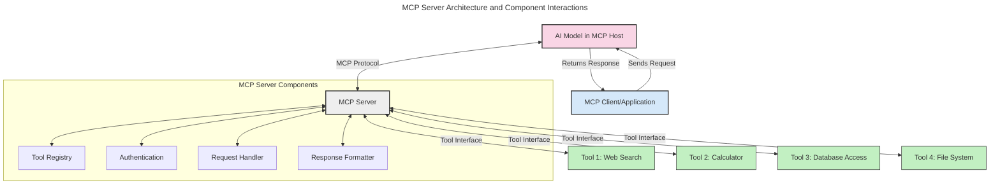
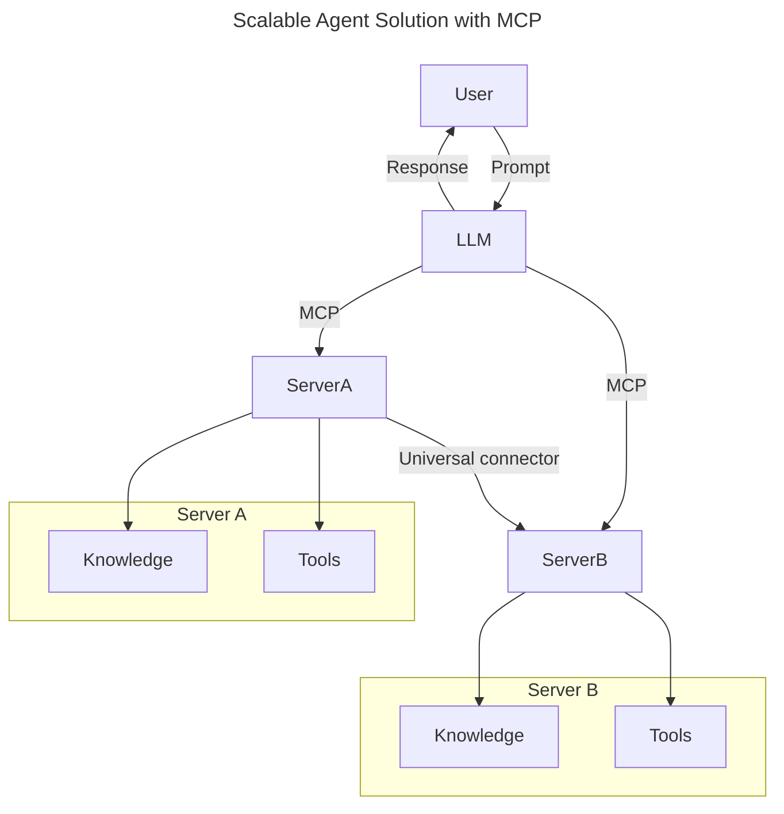
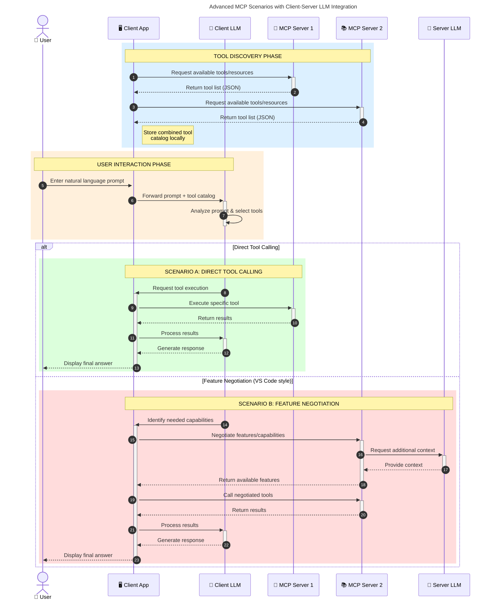

<!--
CO_OP_TRANSLATOR_METADATA:
{
  "original_hash": "105c2ddbb77bc38f7e9df009e1b06e45",
  "translation_date": "2025-07-13T15:31:15+00:00",
  "source_file": "00-Introduction/README.md",
  "language_code": "pt"
}
-->
# Introdução ao Protocolo de Contexto de Modelo (MCP): Por Que É Importante para Aplicações de IA Escaláveis

As aplicações de IA generativa representam um grande avanço, pois frequentemente permitem que o utilizador interaja com a aplicação usando comandos em linguagem natural. No entanto, à medida que se investe mais tempo e recursos nestas aplicações, é importante garantir que seja fácil integrar funcionalidades e recursos de forma a que a aplicação seja extensível, possa suportar mais do que um modelo e lide com as várias particularidades dos modelos. Em suma, criar aplicações de IA generativa é simples no início, mas à medida que crescem e se tornam mais complexas, é necessário começar a definir uma arquitetura e provavelmente recorrer a um padrão para garantir que as aplicações são construídas de forma consistente. É aqui que o MCP entra para organizar e fornecer um padrão.

---

## **🔍 O Que É o Protocolo de Contexto de Modelo (MCP)?**

O **Protocolo de Contexto de Modelo (MCP)** é uma **interface aberta e padronizada** que permite que Grandes Modelos de Linguagem (LLMs) interajam de forma fluida com ferramentas externas, APIs e fontes de dados. Proporciona uma arquitetura consistente para ampliar a funcionalidade dos modelos de IA para além dos seus dados de treino, permitindo sistemas de IA mais inteligentes, escaláveis e responsivos.

---

## **🎯 Por Que a Padronização na IA É Importante**

À medida que as aplicações de IA generativa se tornam mais complexas, é essencial adotar padrões que garantam **escalabilidade, extensibilidade** e **manutenção**. O MCP responde a estas necessidades ao:

- Unificar as integrações entre modelos e ferramentas
- Reduzir soluções frágeis e personalizadas pontuais
- Permitir que múltiplos modelos coexistam num único ecossistema

---

## **📚 Objetivos de Aprendizagem**

No final deste artigo, será capaz de:

- Definir o **Protocolo de Contexto de Modelo (MCP)** e os seus casos de uso
- Compreender como o MCP padroniza a comunicação entre modelo e ferramenta
- Identificar os componentes principais da arquitetura MCP
- Explorar aplicações reais do MCP em contextos empresariais e de desenvolvimento

---

## **💡 Por Que o Protocolo de Contexto de Modelo (MCP) É Revolucionário**

### **🔗 MCP Resolve a Fragmentação nas Interações de IA**

Antes do MCP, integrar modelos com ferramentas exigia:

- Código personalizado para cada par ferramenta-modelo
- APIs não padronizadas para cada fornecedor
- Quebras frequentes devido a atualizações
- Escalabilidade limitada com o aumento do número de ferramentas

### **✅ Benefícios da Padronização MCP**

| **Benefício**            | **Descrição**                                                                 |
|--------------------------|-------------------------------------------------------------------------------|
| Interoperabilidade       | LLMs funcionam sem problemas com ferramentas de diferentes fornecedores       |
| Consistência             | Comportamento uniforme entre plataformas e ferramentas                        |
| Reutilização             | Ferramentas criadas uma vez podem ser usadas em vários projetos e sistemas    |
| Desenvolvimento Acelerado| Reduz o tempo de desenvolvimento usando interfaces padronizadas e plug-and-play|

---

## **🧱 Visão Geral da Arquitetura MCP a Alto Nível**

O MCP segue um **modelo cliente-servidor**, onde:

- **Hosts MCP** executam os modelos de IA
- **Clientes MCP** iniciam pedidos
- **Servidores MCP** fornecem contexto, ferramentas e capacidades

### **Componentes Principais:**

- **Recursos** – Dados estáticos ou dinâmicos para os modelos  
- **Prompts** – Fluxos de trabalho pré-definidos para geração guiada  
- **Ferramentas** – Funções executáveis como pesquisa, cálculos  
- **Amostragem** – Comportamento agente via interações recursivas

---

## Como Funcionam os Servidores MCP

Os servidores MCP operam da seguinte forma:

- **Fluxo de Pedido**:  
    1. O Cliente MCP envia um pedido ao Modelo de IA que está a correr num Host MCP.  
    2. O Modelo de IA identifica quando precisa de ferramentas ou dados externos.  
    3. O modelo comunica com o Servidor MCP usando o protocolo padronizado.

- **Funcionalidades do Servidor MCP**:  
    - Registo de Ferramentas: Mantém um catálogo das ferramentas disponíveis e suas capacidades.  
    - Autenticação: Verifica permissões para acesso às ferramentas.  
    - Gestor de Pedidos: Processa os pedidos de ferramentas recebidos do modelo.  
    - Formatador de Respostas: Estrutura as saídas das ferramentas num formato que o modelo compreende.

- **Execução das Ferramentas**:  
    - O servidor encaminha os pedidos para as ferramentas externas apropriadas  
    - As ferramentas executam as suas funções especializadas (pesquisa, cálculo, consultas a bases de dados, etc.)  
    - Os resultados são devolvidos ao modelo num formato consistente.

- **Conclusão da Resposta**:  
    - O modelo de IA incorpora as saídas das ferramentas na sua resposta.  
    - A resposta final é enviada de volta à aplicação cliente.

## 👨‍💻 Como Construir um Servidor MCP (Com Exemplos)

Os servidores MCP permitem-lhe expandir as capacidades dos LLMs fornecendo dados e funcionalidades.

Pronto para experimentar? Aqui estão exemplos de como criar um servidor MCP simples em diferentes linguagens:

- **Exemplo em Python**: https://github.com/modelcontextprotocol/python-sdk

- **Exemplo em TypeScript**: https://github.com/modelcontextprotocol/typescript-sdk

- **Exemplo em Java**: https://github.com/modelcontextprotocol/java-sdk

- **Exemplo em C#/.NET**: https://github.com/modelcontextprotocol/csharp-sdk

## 🌍 Casos de Uso Reais para MCP

O MCP permite uma vasta gama de aplicações ao expandir as capacidades da IA:

| **Aplicação**               | **Descrição**                                                                 |
|----------------------------|-------------------------------------------------------------------------------|
| Integração de Dados Empresariais | Liga LLMs a bases de dados, CRMs ou ferramentas internas                  |
| Sistemas de IA Agentes      | Permite agentes autónomos com acesso a ferramentas e fluxos de decisão       |
| Aplicações Multimodais      | Combina texto, imagem e áudio numa única aplicação de IA unificada           |
| Integração de Dados em Tempo Real | Introduz dados ao vivo nas interações de IA para resultados mais precisos e atuais |

### 🧠 MCP = Padrão Universal para Interações de IA

O Protocolo de Contexto de Modelo (MCP) funciona como um padrão universal para interações de IA, tal como o USB-C padronizou as ligações físicas para dispositivos. No mundo da IA, o MCP fornece uma interface consistente, permitindo que os modelos (clientes) integrem-se facilmente com ferramentas externas e fornecedores de dados (servidores). Isto elimina a necessidade de protocolos diversos e personalizados para cada API ou fonte de dados.

No MCP, uma ferramenta compatível (denominada servidor MCP) segue um padrão unificado. Estes servidores podem listar as ferramentas ou ações que oferecem e executar essas ações quando solicitadas por um agente de IA. Plataformas de agentes de IA que suportam MCP são capazes de descobrir as ferramentas disponíveis nos servidores e invocá-las através deste protocolo padrão.

### 💡 Facilita o acesso ao conhecimento

Para além de oferecer ferramentas, o MCP também facilita o acesso ao conhecimento. Permite que as aplicações forneçam contexto aos grandes modelos de linguagem (LLMs) ao ligá-los a várias fontes de dados. Por exemplo, um servidor MCP pode representar o repositório de documentos de uma empresa, permitindo que os agentes recuperem informação relevante sob demanda. Outro servidor pode tratar ações específicas, como enviar emails ou atualizar registos. Do ponto de vista do agente, estas são simplesmente ferramentas que pode usar — algumas devolvem dados (contexto de conhecimento), outras executam ações. O MCP gere ambos de forma eficiente.

Um agente que se liga a um servidor MCP aprende automaticamente as capacidades disponíveis e os dados acessíveis através de um formato padrão. Esta padronização permite a disponibilidade dinâmica de ferramentas. Por exemplo, adicionar um novo servidor MCP ao sistema de um agente torna as suas funções imediatamente utilizáveis sem necessidade de personalizar as instruções do agente.

Esta integração simplificada está alinhada com o fluxo representado no diagrama mermaid, onde os servidores fornecem tanto ferramentas como conhecimento, garantindo uma colaboração fluida entre sistemas.

### 👉 Exemplo: Solução de Agente Escalável

### 🔄 Cenários Avançados MCP com Integração de LLM no Lado do Cliente

Para além da arquitetura básica MCP, existem cenários avançados onde tanto o cliente como o servidor contêm LLMs, permitindo interações mais sofisticadas:

## 🔐 Benefícios Práticos do MCP

Aqui estão os benefícios práticos de usar MCP:

- **Atualização**: Os modelos podem aceder a informação atualizada para além dos seus dados de treino  
- **Extensão de Capacidades**: Os modelos podem usar ferramentas especializadas para tarefas para as quais não foram treinados  
- **Redução de Alucinações**: Fontes de dados externas fornecem uma base factual  
- **Privacidade**: Dados sensíveis podem permanecer em ambientes seguros em vez de serem incorporados nos prompts

## 📌 Principais Conclusões

Aqui ficam as principais conclusões sobre o uso do MCP:

- O **MCP** padroniza a forma como os modelos de IA interagem com ferramentas e dados  
- Promove **extensibilidade, consistência e interoperabilidade**  
- O MCP ajuda a **reduzir o tempo de desenvolvimento, melhorar a fiabilidade e ampliar as capacidades dos modelos**  
- A arquitetura cliente-servidor **permite aplicações de IA flexíveis e extensíveis**

## 🧠 Exercício

Pense numa aplicação de IA que gostaria de construir.

- Que **ferramentas externas ou dados** poderiam melhorar as suas capacidades?  
- De que forma o MCP poderia tornar a integração **mais simples e fiável?**

## Recursos Adicionais

- [Repositório MCP no GitHub](https://github.com/modelcontextprotocol)

## O que vem a seguir

Seguinte: [Capítulo 1: Conceitos Fundamentais](../01-CoreConcepts/README.md)

**Aviso Legal**:  
Este documento foi traduzido utilizando o serviço de tradução automática [Co-op Translator](https://github.com/Azure/co-op-translator). Embora nos esforcemos pela precisão, por favor tenha em conta que traduções automáticas podem conter erros ou imprecisões. O documento original na sua língua nativa deve ser considerado a fonte autorizada. Para informações críticas, recomenda-se tradução profissional humana. Não nos responsabilizamos por quaisquer mal-entendidos ou interpretações erradas decorrentes da utilização desta tradução.