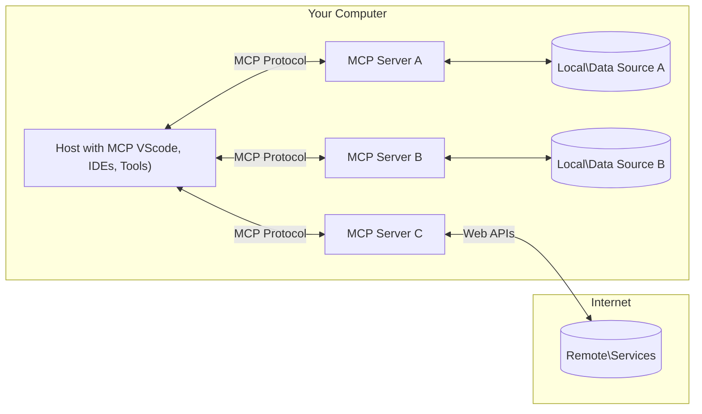

<!--
CO_OP_TRANSLATOR_METADATA:
{
  "original_hash": "b3b4a6ad10c3c0edbf7fa7cfa0ec496b",
  "translation_date": "2025-07-02T07:09:34+00:00",
  "source_file": "01-CoreConcepts/README.md",
  "language_code": "pt"
}
-->
# 📖 Conceitos Fundamentais do MCP: Dominar o Model Context Protocol para Integração de IA

O [Model Context Protocol (MCP)](https://github.com/modelcontextprotocol) é uma estrutura poderosa e padronizada que otimiza a comunicação entre Grandes Modelos de Linguagem (LLMs) e ferramentas externas, aplicações e fontes de dados. Este guia otimizado para SEO irá conduzi-lo pelos conceitos fundamentais do MCP, garantindo que compreenda a sua arquitetura cliente-servidor, componentes essenciais, mecânica de comunicação e melhores práticas de implementação.

## Visão Geral

Esta lição explora a arquitetura fundamental e os componentes que constituem o ecossistema do Model Context Protocol (MCP). Vai aprender sobre a arquitetura cliente-servidor, os componentes-chave e os mecanismos de comunicação que impulsionam as interações MCP.

## 👩‍🎓 Objetivos Principais de Aprendizagem

No final desta lição, você irá:

- Compreender a arquitetura cliente-servidor do MCP.
- Identificar os papéis e responsabilidades dos Hosts, Clientes e Servidores.
- Analisar as características principais que tornam o MCP uma camada de integração flexível.
- Aprender como a informação circula dentro do ecossistema MCP.
- Obter insights práticos através de exemplos de código em .NET, Java, Python e JavaScript.

## 🔎 Arquitetura do MCP: Uma Análise Detalhada

O ecossistema MCP é construído sobre um modelo cliente-servidor. Esta estrutura modular permite que aplicações de IA interajam eficientemente com ferramentas, bases de dados, APIs e recursos contextuais. Vamos decompor esta arquitetura nos seus componentes principais.

No seu núcleo, o MCP segue uma arquitetura cliente-servidor onde uma aplicação host pode conectar-se a múltiplos servidores:



- **Hosts MCP**: Programas como VSCode, Claude Desktop, IDEs ou ferramentas de IA que desejam aceder a dados através do MCP
- **Clientes MCP**: Clientes do protocolo que mantêm conexões 1:1 com os servidores
- **Servidores MCP**: Programas leves que expõem capacidades específicas através do Model Context Protocol padronizado
- **Fontes de Dados Locais**: Os ficheiros, bases de dados e serviços do seu computador aos quais os servidores MCP podem aceder de forma segura
- **Serviços Remotos**: Sistemas externos disponíveis na internet que os servidores MCP podem ligar via APIs.

O Protocolo MCP é um padrão em evolução; pode consultar as últimas atualizações na [especificação do protocolo](https://modelcontextprotocol.io/specification/2025-06-18/)

### 1. Hosts

No Model Context Protocol (MCP), os Hosts desempenham um papel crucial como a interface principal através da qual os utilizadores interagem com o protocolo. Hosts são aplicações ou ambientes que iniciam conexões com servidores MCP para aceder a dados, ferramentas e prompts. Exemplos de Hosts incluem ambientes de desenvolvimento integrados (IDEs) como o Visual Studio Code, ferramentas de IA como o Claude Desktop, ou agentes personalizados criados para tarefas específicas.

**Hosts** são aplicações LLM que iniciam conexões. Eles:

- Executam ou interagem com modelos de IA para gerar respostas.
- Iniciam conexões com servidores MCP.
- Gerem o fluxo da conversa e a interface do utilizador.
- Controlam permissões e restrições de segurança.
- Gerem o consentimento do utilizador para partilha de dados e execução de ferramentas.

### 2. Clientes

Os Clientes são componentes essenciais que facilitam a interação entre Hosts e servidores MCP. Funcionam como intermediários, permitindo que os Hosts acedam e utilizem as funcionalidades fornecidas pelos servidores MCP. Têm um papel fundamental em garantir uma comunicação fluida e uma troca eficiente de dados dentro da arquitetura MCP.

**Clientes** são conectores dentro da aplicação host. Eles:

- Enviam pedidos aos servidores com prompts/instruções.
- Negociam capacidades com os servidores.
- Gerem pedidos de execução de ferramentas provenientes dos modelos.
- Processam e apresentam respostas aos utilizadores.

### 3. Servidores

Os Servidores são responsáveis por tratar pedidos dos clientes MCP e fornecer respostas adequadas. Gerem várias operações como recuperação de dados, execução de ferramentas e geração de prompts. Garantem que a comunicação entre clientes e Hosts é eficiente e fiável, mantendo a integridade do processo de interação.

**Servidores** são serviços que fornecem contexto e capacidades. Eles:

- Registam funcionalidades disponíveis (recursos, prompts, ferramentas)
- Recebem e executam chamadas de ferramentas do cliente
- Fornecem informação contextual para melhorar as respostas do modelo
- Devolvem os resultados ao cliente
- Mantêm estado entre interações quando necessário

Qualquer pessoa pode desenvolver servidores para expandir as capacidades do modelo com funcionalidades especializadas.

### 4. Funcionalidades dos Servidores

Os servidores no Model Context Protocol (MCP) oferecem blocos fundamentais que permitem interações ricas entre clientes, hosts e modelos de linguagem. Estas funcionalidades são desenhadas para ampliar as capacidades do MCP, oferecendo contexto estruturado, ferramentas e prompts.

Os servidores MCP podem oferecer qualquer uma das seguintes funcionalidades:

#### 📑 Recursos

Recursos no Model Context Protocol (MCP) abrangem vários tipos de contexto e dados que podem ser utilizados por utilizadores ou modelos de IA. Estes incluem:

- **Dados Contextuais**: Informação e contexto que os utilizadores ou modelos de IA podem aproveitar para tomada de decisões e execução de tarefas.
- **Bases de Conhecimento e Repositórios de Documentos**: Coleções de dados estruturados e não estruturados, como artigos, manuais e trabalhos de investigação, que fornecem insights e informação valiosa.
- **Ficheiros e Bases de Dados Locais**: Dados armazenados localmente em dispositivos ou dentro de bases de dados, acessíveis para processamento e análise.
- **APIs e Serviços Web**: Interfaces e serviços externos que oferecem dados e funcionalidades adicionais, permitindo integração com vários recursos e ferramentas online.

Um exemplo de recurso pode ser um esquema de base de dados ou um ficheiro que pode ser acedido assim:

```text
file://log.txt
database://schema
```

### 🤖 Prompts

Prompts no Model Context Protocol (MCP) incluem vários modelos predefinidos e padrões de interação desenhados para simplificar fluxos de trabalho dos utilizadores e melhorar a comunicação. Estes incluem:

- **Mensagens e Fluxos de Trabalho Modelados**: Mensagens e processos pré-estruturados que guiam os utilizadores em tarefas e interações específicas.
- **Padrões de Interação Predefinidos**: Sequências padronizadas de ações e respostas que facilitam uma comunicação consistente e eficiente.
- **Modelos de Conversa Especializados**: Templates personalizáveis adaptados para tipos específicos de conversas, garantindo interações relevantes e contextualmente apropriadas.

Um modelo de prompt pode ser assim:

```markdown
Generate a product slogan based on the following {{product}} with the following {{keywords}}
```

#### ⛏️ Ferramentas

Ferramentas no Model Context Protocol (MCP) são funções que o modelo de IA pode executar para realizar tarefas específicas. Estas ferramentas são desenhadas para aumentar as capacidades do modelo de IA, fornecendo operações estruturadas e fiáveis. Os aspetos chave incluem:

- **Funções para o modelo de IA executar**: Ferramentas são funções executáveis que o modelo de IA pode invocar para realizar várias tarefas.
- **Nome Único e Descrição**: Cada ferramenta tem um nome distinto e uma descrição detalhada que explica o seu propósito e funcionalidade.
- **Parâmetros e Resultados**: As ferramentas aceitam parâmetros específicos e devolvem resultados estruturados, garantindo resultados consistentes e previsíveis.
- **Funções Discretas**: Ferramentas executam funções discretas como pesquisas na web, cálculos e consultas a bases de dados.

Um exemplo de ferramenta pode ser assim:

```typescript
server.tool(
  "GetProducts",
  {
    pageSize: z.string().optional(),
    pageCount: z.string().optional()
  }, () => {
    // return results from API
  }
)
```

## Funcionalidades dos Clientes

No Model Context Protocol (MCP), os clientes oferecem várias funcionalidades chave aos servidores, melhorando a funcionalidade geral e a interação dentro do protocolo. Uma das funcionalidades notáveis é a Amostragem.

### 👉 Amostragem

- **Comportamentos Agentes Iniciados pelo Servidor**: Os clientes permitem que os servidores iniciem ações ou comportamentos específicos autonomamente, ampliando as capacidades dinâmicas do sistema.
- **Interações Recursivas com LLMs**: Esta funcionalidade permite interações recursivas com grandes modelos de linguagem (LLMs), possibilitando um processamento mais complexo e iterativo das tarefas.
- **Pedido de Completações Adicionais do Modelo**: Os servidores podem solicitar completações adicionais ao modelo, garantindo que as respostas sejam completas e contextualmente relevantes.

## Fluxo de Informação no MCP

O Model Context Protocol (MCP) define um fluxo estruturado de informação entre hosts, clientes, servidores e modelos. Compreender este fluxo ajuda a clarificar como os pedidos dos utilizadores são processados e como ferramentas externas e dados são integrados nas respostas do modelo.

- **Host Inicia a Conexão**  
  A aplicação host (como um IDE ou interface de chat) estabelece uma ligação a um servidor MCP, tipicamente via STDIO, WebSocket ou outro transporte suportado.

- **Negociação de Capacidades**  
  O cliente (embutido no host) e o servidor trocam informação sobre as funcionalidades, ferramentas, recursos e versões do protocolo que suportam. Isto assegura que ambos os lados compreendem as capacidades disponíveis para a sessão.

- **Pedido do Utilizador**  
  O utilizador interage com o host (por exemplo, insere um prompt ou comando). O host recolhe esta entrada e passa-a para o cliente para processamento.

- **Uso de Recurso ou Ferramenta**  
  - O cliente pode pedir contexto ou recursos adicionais ao servidor (como ficheiros, entradas de base de dados ou artigos de base de conhecimento) para enriquecer a compreensão do modelo.
  - Se o modelo determinar que uma ferramenta é necessária (por exemplo, para obter dados, realizar um cálculo ou chamar uma API), o cliente envia um pedido de invocação da ferramenta ao servidor, especificando o nome da ferramenta e os parâmetros.

- **Execução pelo Servidor**  
  O servidor recebe o pedido de recurso ou ferramenta, executa as operações necessárias (como correr uma função, consultar uma base de dados ou recuperar um ficheiro) e devolve os resultados ao cliente num formato estruturado.

- **Geração da Resposta**  
  O cliente integra as respostas do servidor (dados de recursos, resultados de ferramentas, etc.) na interação contínua com o modelo. O modelo usa esta informação para gerar uma resposta abrangente e contextualmente relevante.

- **Apresentação do Resultado**  
  O host recebe a saída final do cliente e apresenta-a ao utilizador, frequentemente incluindo tanto o texto gerado pelo modelo como quaisquer resultados das execuções de ferramentas ou consultas a recursos.

Este fluxo permite que o MCP suporte aplicações de IA avançadas, interativas e conscientes do contexto, ligando modelos a ferramentas externas e fontes de dados de forma fluida.

## Detalhes do Protocolo

O MCP (Model Context Protocol) é construído sobre [JSON-RPC 2.0](https://www.jsonrpc.org/), fornecendo um formato de mensagem padronizado e independente de linguagem para comunicação entre hosts, clientes e servidores. Esta base permite interações fiáveis, estruturadas e extensíveis em várias plataformas e linguagens de programação.

### Funcionalidades Principais do Protocolo

O MCP estende o JSON-RPC 2.0 com convenções adicionais para invocação de ferramentas, acesso a recursos e gestão de prompts. Suporta múltiplas camadas de transporte (STDIO, WebSocket, SSE) e permite comunicação segura, extensível e independente de linguagem entre componentes.

#### 🧢 Protocolo Base

- **Formato de Mensagens JSON-RPC**: Todos os pedidos e respostas usam a especificação JSON-RPC 2.0, garantindo estrutura consistente para chamadas de métodos, parâmetros, resultados e tratamento de erros.
- **Conexões Stateful**: As sessões MCP mantêm estado através de múltiplos pedidos, suportando conversas contínuas, acumulação de contexto e gestão de recursos.
- **Negociação de Capacidades**: Durante a configuração da conexão, clientes e servidores trocam informação sobre funcionalidades suportadas, versões do protocolo, ferramentas e recursos disponíveis. Isto garante que ambos os lados compreendem as capacidades um do outro e podem adaptar-se em conformidade.

#### ➕ Utilitários Adicionais

A seguir, algumas utilidades e extensões do protocolo que o MCP oferece para melhorar a experiência do desenvolvedor e permitir cenários avançados:

- **Opções de Configuração**: O MCP permite configuração dinâmica de parâmetros da sessão, como permissões de ferramentas, acesso a recursos e definições do modelo, adaptadas a cada interação.
- **Monitorização de Progresso**: Operações longas podem reportar atualizações de progresso, permitindo interfaces responsivas e melhor experiência do utilizador durante tarefas complexas.
- **Cancelamento de Pedidos**: Os clientes podem cancelar pedidos em curso, permitindo que os utilizadores interrompam operações que já não são necessárias ou que estejam a demorar demasiado.
- **Relatório de Erros**: Mensagens e códigos de erro padronizados ajudam a diagnosticar problemas, tratar falhas de forma elegante e fornecer feedback acionável a utilizadores e desenvolvedores.
- **Registos (Logging)**: Tanto clientes como servidores podem emitir registos estruturados para auditoria, depuração e monitorização das interações do protocolo.

Ao aproveitar estas funcionalidades, o MCP assegura uma comunicação robusta, segura e flexível entre modelos de linguagem e ferramentas ou fontes de dados externas.

### 🔐 Considerações de Segurança

As implementações MCP devem aderir a vários princípios-chave de segurança para garantir interações seguras e confiáveis:

- **Consentimento e Controlo do Utilizador**: Os utilizadores devem fornecer consentimento explícito antes que qualquer dado seja acedido ou operações executadas. Devem ter controlo claro sobre que dados são partilhados e que ações são autorizadas, suportados por interfaces intuitivas para rever e aprovar atividades.

- **Privacidade dos Dados**: Os dados dos utilizadores só devem ser expostos com consentimento explícito e devem ser protegidos por controlos de acesso adequados. As implementações MCP devem prevenir a transmissão não autorizada de dados e garantir que a privacidade é mantida em todas as interações.

- **Segurança das Ferramentas**: Antes de invocar qualquer ferramenta, é necessário consentimento explícito do utilizador. Os utilizadores devem compreender claramente a funcionalidade de cada ferramenta, e devem ser aplicadas fronteiras de segurança robustas para evitar execuções não intencionais ou inseguras.

Ao seguir estes princípios, o MCP assegura que a confiança, privacidade e segurança do utilizador são mantidas em todas as interações do protocolo.

## Exemplos de Código: Componentes Principais

A seguir estão exemplos de código em várias linguagens populares que ilustram como implementar componentes chave de servidores MCP e ferramentas.

### Exemplo .NET: Criar um Servidor MCP Simples com Ferramentas

Aqui está um exemplo prático em .NET que demonstra como implementar um servidor MCP simples com ferramentas personalizadas. Este exemplo mostra como definir e registar ferramentas, tratar pedidos e ligar o servidor usando o Model Context Protocol.

```csharp
using System;
using System.Threading.Tasks;
using ModelContextProtocol.Server;
using ModelContextProtocol.Server.Transport;
using ModelContextProtocol.Server.Tools;

public class WeatherServer
{
    public static async Task Main(string[] args)
    {
        // Create an MCP server
        var server = new McpServer(
            name: "Weather MCP Server",
            version: "1.0.0"
        );
        
        // Register our custom weather tool
        server.AddTool<string, WeatherData>("weatherTool", 
            description: "Gets current weather for a location",
            execute: async (location) => {
                // Call weather API (simplified)
                var weatherData = await GetWeatherDataAsync(location);
                return weatherData;
            });
        
        // Connect the server using stdio transport
        var transport = new StdioServerTransport();
        await server.ConnectAsync(transport);
        
        Console.WriteLine("Weather MCP Server started");
        
        // Keep the server running until process is terminated
        await Task.Delay(-1);
    }
    
    private static async Task<WeatherData> GetWeatherDataAsync(string location)
    {
        // This would normally call a weather API
        // Simplified for demonstration
        await Task.Delay(100); // Simulate API call
        return new WeatherData { 
            Temperature = 72.5,
            Conditions = "Sunny",
            Location = location
        };
    }
}

public class WeatherData
{
    public double Temperature { get; set; }
    public string Conditions { get; set; }
    public string Location { get; set; }
}
```

### Exemplo Java: Componentes de Servidor MCP

Este exemplo demonstra o mesmo servidor MCP e registo de ferramentas do exemplo em .NET acima, mas implementado em Java.

```java
import io.modelcontextprotocol.server.McpServer;
import io.modelcontextprotocol.server.McpToolDefinition;
import io.modelcontextprotocol.server.transport.StdioServerTransport;
import io.modelcontextprotocol.server.tool.ToolExecutionContext;
import io.modelcontextprotocol.server.tool.ToolResponse;

public class WeatherMcpServer {
    public static void main(String[] args) throws Exception {
        // Create an MCP server
        McpServer server = McpServer.builder()
            .name("Weather MCP Server")
            .version("1.0.0")
            .build();
            
        // Register a weather tool
        server.registerTool(McpToolDefinition.builder("weatherTool")
            .description("Gets current weather for a location")
            .parameter("location", String.class)
            .execute((ToolExecutionContext ctx) -> {
                String location = ctx.getParameter("location", String.class);
                
                // Get weather data (simplified)
                WeatherData data = getWeatherData(location);
                
                // Return formatted response
                return ToolResponse.content(
                    String.format("Temperature: %.1f°F, Conditions: %s, Location: %s", 
                    data.getTemperature(), 
                    data.getConditions(), 
                    data.getLocation())
                );
            })
            .build());
        
        // Connect the server using stdio transport
        try (StdioServerTransport transport = new StdioServerTransport()) {
            server.connect(transport);
            System.out.println("Weather MCP Server started");
            // Keep server running until process is terminated
            Thread.currentThread().join();
        }
    }
    
    private static WeatherData getWeatherData(String location) {
        // Implementation would call a weather API
        // Simplified for example purposes
        return new WeatherData(72.5, "Sunny", location);
    }
}

class WeatherData {
    private double temperature;
    private String conditions;
    private String location;
    
    public WeatherData(double temperature, String conditions, String location) {
        this.temperature = temperature;
        this.conditions = conditions;
        this.location = location;
    }
    
    public double getTemperature() {
        return temperature;
    }
    
    public String getConditions() {
        return conditions;
    }
    
    public String getLocation() {
        return location;
    }
}
```

### Exemplo Python: Construir um Servidor MCP

Neste exemplo mostramos como construir um servidor MCP em Python. Também mostramos duas formas diferentes de criar ferramentas.

```python
#!/usr/bin/env python3
import asyncio
from mcp.server.fastmcp import FastMCP
from mcp.server.transports.stdio import serve_stdio

# Create a FastMCP server
mcp = FastMCP(
    name="Weather MCP Server",
    version="1.0.0"
)

@mcp.tool()
def get_weather(location: str) -> dict:
    """Gets current weather for a location."""
    # This would normally call a weather API
    # Simplified for demonstration
    return {
        "temperature": 72.5,
        "conditions": "Sunny",
        "location": location
    }

# Alternative approach using a class
class WeatherTools:
    @mcp.tool()
    def forecast(self, location: str, days: int = 1) -> dict:
        """Gets weather forecast for a location for the specified number of days."""
        # This would normally call a weather API forecast endpoint
        # Simplified for demonstration
        return {
            "location": location,
            "forecast": [
                {"day": i+1, "temperature": 70 + i, "conditions": "Partly Cloudy"}
                for i in range(days)
            ]
        }

# Instantiate the class to register its tools
weather_tools = WeatherTools()

# Start the server using stdio transport
if __name__ == "__main__":
    asyncio.run(serve_stdio(mcp))
```

### Exemplo JavaScript: Criar um Servidor MCP

Este exemplo mostra a criação de um servidor MCP em JavaScript e como registar duas ferramentas relacionadas com o tempo.

```javascript
// Using the official Model Context Protocol SDK
import { McpServer } from "@modelcontextprotocol/sdk/server/mcp.js";
import { StdioServerTransport } from "@modelcontextprotocol/sdk/server/stdio.js";
import { z } from "zod"; // For parameter validation

// Create an MCP server
const server = new McpServer({
  name: "Weather MCP Server",
  version: "1.0.0"
});

// Define a weather tool
server.tool(
  "weatherTool",
  {
    location: z.string().describe("The location to get weather for")
  },
  async ({ location }) => {
    // This would normally call a weather API
    // Simplified for demonstration
    const weatherData = await getWeatherData(location);
    
    return {
      content: [
        { 
          type: "text", 
          text: `Temperature: ${weatherData.temperature}°F, Conditions: ${weatherData.conditions}, Location: ${weatherData.location}` 
        }
      ]
    };
  }
);

// Define a forecast tool
server.tool(
  "forecastTool",
  {
    location: z.string(),
    days: z.number().default(3).describe("Number of days for forecast")
  },
  async ({ location, days }) => {
    // This would normally call a weather API
    // Simplified for demonstration
    const forecast = await getForecastData(location, days);
    
    return {
      content: [
        { 
          type: "text", 
          text: `${days}-day forecast for ${location}: ${JSON.stringify(forecast)}` 
        }
      ]
    };
  }
);

// Helper functions
async function getWeatherData(location) {
  // Simulate API call
  return {
    temperature: 72.5,
    conditions: "Sunny",
    location: location
  };
}

async function getForecastData(location, days) {
  // Simulate API call
  return Array.from({ length: days }, (_, i) => ({
    day: i + 1,
    temperature: 70 + Math.floor(Math.random() * 10),
    conditions: i % 2 === 0 ? "Sunny" : "Partly Cloudy"
  }));
}

// Connect the server using stdio transport
const transport = new StdioServerTransport();
server.connect(transport).catch(console.error);

console.log("Weather MCP Server started");
```

Este exemplo em JavaScript demonstra como criar um cliente MCP que se conecta a um servidor, envia um prompt e processa a resposta incluindo quaisquer chamadas de ferramentas realizadas.

## Segurança e Autorização

O MCP inclui vários conceitos e mecanismos integrados para gerir segurança e autorização ao longo do protocolo:

1. **Controlo de Permissões de Ferramentas**:  
  Os clientes podem especificar quais ferramentas um modelo pode usar durante uma sessão. Isto garante que apenas ferramentas explicitamente autorizadas estão acessíveis, reduzindo o risco de operações não intencionais ou inseguras. As permissões podem ser configuradas dinamicamente com base nas preferências do utilizador, políticas organizacionais ou contexto da interação.

2. **Autenticação**:  
  Os servidores podem exigir autenticação antes de conceder acesso a ferramentas, recursos ou operações sensíveis. Isto pode envolver chaves de API, tokens OAuth ou outros esquemas de autenticação. A autenticação adequada garante que apenas clientes e utilizadores confiáveis possam invocar capacidades do lado do servidor.

3. **Validação**:  
  A validação de parâmetros é aplicada para todas as invocações de ferramentas. Cada ferramenta define os tipos, formatos e restrições esperadas para os seus parâmetros, e o servidor valida os pedidos recebidos em conformidade. Isto previne que entradas malformadas ou maliciosas atinjam as implementações das ferramentas e ajuda a manter a integridade das operações.

4. **Limitação de Taxa (Rate Limiting)**:  
  Para prevenir abusos e garantir uso justo dos recursos do servidor, os servidores MCP podem implementar limitação de taxa para chamadas de ferramentas e acesso a recursos. Os limites podem ser aplicados por utilizador, por sessão ou globalmente, ajudando a proteger contra ataques de negação de serviço ou consumo excessivo de recursos.

Ao combinar estes mecanismos, o MCP fornece uma base segura para integrar modelos de linguagem com ferramentas e fontes de dados externas, ao mesmo tempo que oferece a utilizadores e desenvolvedores controlo detalhado sobre o acesso e uso.

## Mensagens do Protocolo

A comunicação MCP usa mensagens JSON estruturadas para facilitar interações claras e fiáveis entre clientes, servidores e modelos. Os principais tipos de mensagem incluem:

- **Pedido do Cliente**  
  Enviado do cliente para o servidor, esta mensagem normalmente inclui:
  - O prompt ou comando do utilizador
  - Histórico da conversa para contexto
  - Configuração e permissões das ferramentas
  - Qualquer metadado adicional ou informação da sessão

- **Resposta do Modelo**  
  Retornada pelo modelo (via cliente), esta mensagem contém:
  - Texto gerado ou completamento baseado no prompt e contexto
  - Instruções opcionais de chamada de ferramenta caso o modelo determine que deve ser invocada
  - Referências a recursos ou contexto adicional conforme necessário

- **Pedido de Ferramenta**  
  Enviado do cliente para o servidor quando uma ferramenta precisa ser executada. Esta mensagem inclui:
  - O nome da ferramenta a invocar
  - Parâmetros requeridos pela ferramenta (validados segundo o esquema da ferramenta)
  - Informação contextual ou identificadores para rastrear o pedido

- **Resposta da Ferramenta**  
  Retornada pelo servidor após executar uma ferramenta. Esta mensagem fornece:
  - Resultados da execução da ferramenta (dados estruturados ou conteúdo)
  - Quaisquer erros ou informação de estado se a chamada da ferramenta fal

**Aviso Legal**:  
Este documento foi traduzido utilizando o serviço de tradução automática [Co-op Translator](https://github.com/Azure/co-op-translator). Embora nos esforcemos para garantir a precisão, por favor tenha em conta que traduções automáticas podem conter erros ou imprecisões. O documento original no seu idioma nativo deve ser considerado a fonte autoritativa. Para informações críticas, recomenda-se tradução profissional humana. Não nos responsabilizamos por quaisquer mal-entendidos ou interpretações erradas decorrentes da utilização desta tradução.