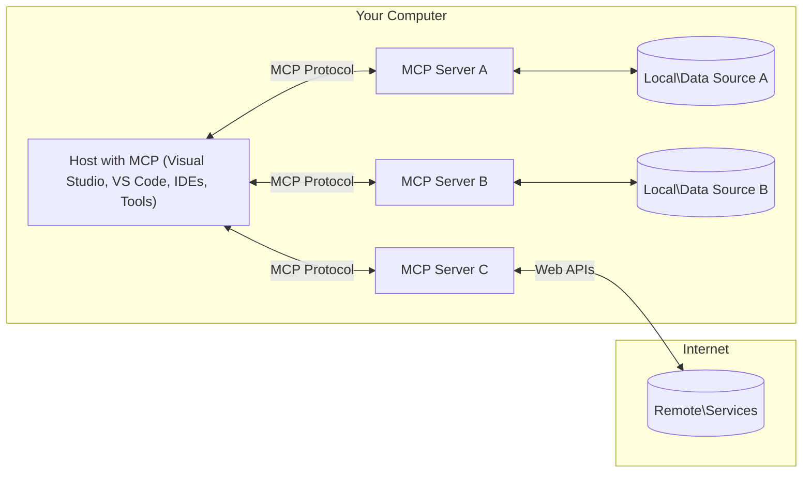

<!--
CO_OP_TRANSLATOR_METADATA:
{
  "original_hash": "11010ad254e48628bb6a457be2211640",
  "translation_date": "2025-08-12T07:53:39+00:00",
  "source_file": "01-CoreConcepts/README.md",
  "language_code": "pt"
}
-->
# 📖 Conceitos Fundamentais do MCP: Dominar o Protocolo de Contexto de Modelo para Integração de IA

[](https://youtu.be/earDzWGtE84)

_(Clique na imagem acima para assistir ao vídeo desta lição)_

O [Model Context Protocol (MCP)](https://github.com/modelcontextprotocol) é uma estrutura poderosa e padronizada que otimiza a comunicação entre Modelos de Linguagem de Grande Escala (LLMs) e ferramentas, aplicações e fontes de dados externas. Este guia irá conduzi-lo pelos conceitos fundamentais do MCP, garantindo que compreenda sua arquitetura cliente-servidor, componentes essenciais, mecânicas de comunicação e melhores práticas de implementação.

## Visão Geral

Esta lição explora a arquitetura fundamental e os componentes que compõem o ecossistema do Model Context Protocol (MCP). Você aprenderá sobre a arquitetura cliente-servidor, os principais componentes e os mecanismos de comunicação que impulsionam as interações do MCP.

## 👩‍🎓 Objetivos de Aprendizagem

Ao final desta lição, você será capaz de:

- Compreender a arquitetura cliente-servidor do MCP.
- Identificar os papéis e responsabilidades de Hosts, Clientes e Servidores.
- Analisar os principais recursos que tornam o MCP uma camada de integração flexível.
- Aprender como a informação flui dentro do ecossistema do MCP.
- Obter insights práticos através de exemplos de código em .NET, Java, Python e JavaScript.

## 🔎 Arquitetura do MCP: Uma Análise Detalhada

O ecossistema do MCP é construído sobre um modelo cliente-servidor. Esta estrutura modular permite que aplicações de IA interajam de forma eficiente com ferramentas, bases de dados, APIs e recursos contextuais. Vamos detalhar esta arquitetura em seus componentes principais.

No seu núcleo, o MCP segue uma arquitetura cliente-servidor onde uma aplicação host pode conectar-se a múltiplos servidores:



- **Hosts MCP**: Programas como VSCode, Claude Desktop, IDEs ou ferramentas de IA que desejam acessar dados através do MCP.
- **Clientes MCP**: Clientes do protocolo que mantêm conexões 1:1 com servidores.
- **Servidores MCP**: Programas leves que expõem capacidades específicas através do Protocolo de Contexto de Modelo padronizado.
- **Fontes de Dados Locais**: Arquivos, bases de dados e serviços do seu computador que os servidores MCP podem acessar de forma segura.
- **Serviços Remotos**: Sistemas externos disponíveis na internet que os servidores MCP podem conectar-se através de APIs.

O Protocolo MCP é um padrão em evolução. Você pode ver as atualizações mais recentes na [especificação do protocolo](https://modelcontextprotocol.io/specification/2025-06-18/).

### 1. Hosts

No Model Context Protocol (MCP), os Hosts desempenham um papel crucial como a interface primária através da qual os utilizadores interagem com o protocolo. Hosts são aplicações ou ambientes que iniciam conexões com servidores MCP para acessar dados, ferramentas e prompts. Exemplos de Hosts incluem ambientes de desenvolvimento integrados (IDEs) como o Visual Studio Code, ferramentas de IA como o Claude Desktop ou agentes personalizados projetados para tarefas específicas.

**Hosts** são aplicações que iniciam conexões com LLMs. Eles:

- Executam ou interagem com modelos de IA para gerar respostas.
- Iniciam conexões com servidores MCP.
- Gerem o fluxo de conversação e a interface do utilizador.
- Controlam permissões e restrições de segurança.
- Lidam com o consentimento do utilizador para compartilhamento de dados e execução de ferramentas.

### 2. Clientes

Os Clientes são componentes essenciais que facilitam a interação entre Hosts e servidores MCP. Eles atuam como intermediários, permitindo que os Hosts acessem e utilizem as funcionalidades fornecidas pelos servidores MCP. Eles desempenham um papel crucial em garantir uma comunicação fluida e uma troca de dados eficiente dentro da arquitetura do MCP.

**Clientes** são conectores dentro da aplicação host. Eles:

- Enviam pedidos aos servidores com prompts/instruções.
- Negociam capacidades com os servidores.
- Gerem pedidos de execução de ferramentas a partir dos modelos.
- Processam e exibem respostas aos utilizadores.

### 3. Servidores

Os Servidores são responsáveis por lidar com pedidos dos clientes MCP e fornecer respostas apropriadas. Mais comumente, os servidores atuam como ferramentas que oferecem uma capacidade específica ao LLM. Eles gerem várias operações, como recuperação de dados, execução de ferramentas e geração de prompts. Os servidores garantem que a comunicação entre clientes e Hosts seja eficiente e confiável, mantendo a integridade do processo de interação.

**Servidores** são serviços que fornecem contexto e capacidades. Eles:

- Registram recursos disponíveis (recursos, prompts, ferramentas).
- Recebem e executam chamadas de ferramentas do cliente.
- Fornecem informações contextuais para melhorar as respostas do modelo.
- Retornam saídas ao cliente.
- Mantêm o estado entre interações, quando necessário.

Os servidores podem ser desenvolvidos por qualquer pessoa para estender as capacidades do modelo com funcionalidades especializadas.

### 4. Funcionalidades dos Servidores

Os servidores no Model Context Protocol (MCP) fornecem blocos de construção fundamentais que permitem interações ricas entre clientes, hosts e modelos de linguagem. Estas funcionalidades são projetadas para melhorar as capacidades do MCP, oferecendo contexto estruturado, ferramentas e prompts.

Os servidores MCP podem oferecer qualquer uma das seguintes funcionalidades:

#### 📑 Recursos 

Recursos no Model Context Protocol (MCP) abrangem vários tipos de contexto e dados que podem ser utilizados por utilizadores ou modelos de IA. Estes incluem:

- **Dados Contextuais**: Informações e contextos que os utilizadores ou modelos de IA podem aproveitar para tomada de decisões e execução de tarefas.
- **Bases de Conhecimento e Repositórios de Documentos**: Coleções de dados estruturados e não estruturados, como artigos, manuais e documentos de pesquisa, que fornecem insights e informações valiosas.
- **Arquivos e Bases de Dados Locais**: Dados armazenados localmente em dispositivos ou dentro de bases de dados, acessíveis para processamento e análise.
- **APIs e Serviços Web**: Interfaces e serviços externos que oferecem dados e funcionalidades adicionais, permitindo integração com vários recursos e ferramentas online.

Um exemplo de recurso pode ser um esquema de base de dados ou um arquivo que pode ser acessado assim:

```text
file://log.txt
database://schema
```

### 🤖 Prompts
Prompts no Model Context Protocol (MCP) incluem vários modelos pré-definidos e padrões de interação projetados para simplificar fluxos de trabalho dos utilizadores e melhorar a comunicação. Estes incluem:

- **Mensagens e Fluxos de Trabalho Modelados**: Mensagens e processos pré-estruturados que orientam os utilizadores em tarefas e interações específicas.
- **Padrões de Interação Pré-definidos**: Sequências padronizadas de ações e respostas que facilitam uma comunicação consistente e eficiente.
- **Modelos de Conversação Especializados**: Modelos personalizáveis adaptados para tipos específicos de conversas, garantindo interações relevantes e contextualmente apropriadas.

Um modelo de prompt pode ser assim:

```markdown
Generate a product slogan based on the following {{product}} with the following {{keywords}}
```

#### ⛏️ Ferramentas

Ferramentas no Model Context Protocol (MCP) são funções que o modelo de IA pode executar para realizar tarefas específicas. Estas ferramentas são projetadas para melhorar as capacidades do modelo de IA, fornecendo operações estruturadas e confiáveis. Os principais aspetos incluem:

- **Funções para o modelo de IA executar**: Ferramentas são funções executáveis que o modelo de IA pode invocar para realizar várias tarefas.
- **Nome e Descrição Únicos**: Cada ferramenta tem um nome distinto e uma descrição detalhada que explica seu propósito e funcionalidade.
- **Parâmetros e Saídas**: Ferramentas aceitam parâmetros específicos e retornam saídas estruturadas, garantindo resultados consistentes e previsíveis.
- **Funções Discretas**: Ferramentas executam funções discretas, como pesquisas na web, cálculos e consultas a bases de dados.

Um exemplo de ferramenta pode ser assim:

```typescript
server.tool(
  "GetProducts",
  {
    pageSize: z.string().optional(),
    pageCount: z.string().optional()
  }, () => {
    // return results from API
  }
)
```

## Funcionalidades dos Clientes
No Model Context Protocol (MCP), os clientes oferecem várias funcionalidades importantes aos servidores, melhorando a funcionalidade geral e a interação dentro do protocolo. Uma das funcionalidades notáveis é a Amostragem.

### 👉 Amostragem

- **Comportamentos Agentes Iniciados pelo Servidor**: Os clientes permitem que os servidores iniciem ações ou comportamentos específicos de forma autónoma, melhorando as capacidades dinâmicas do sistema.
- **Interações Recursivas com LLMs**: Esta funcionalidade permite interações recursivas com modelos de linguagem de grande escala (LLMs), possibilitando um processamento mais complexo e iterativo de tarefas.
- **Solicitação de Completações Adicionais do Modelo**: Os servidores podem solicitar completações adicionais do modelo, garantindo que as respostas sejam completas e contextualmente relevantes.

## Fluxo de Informação no MCP

O Model Context Protocol (MCP) define um fluxo estruturado de informações entre hosts, clientes, servidores e modelos. Compreender este fluxo ajuda a esclarecer como os pedidos dos utilizadores são processados e como ferramentas e dados externos são integrados nas respostas do modelo.

- **Host Inicia Conexão**  
  A aplicação host (como um IDE ou interface de chat) estabelece uma conexão com um servidor MCP, tipicamente via STDIO, WebSocket ou outro transporte suportado.

- **Negociação de Capacidades**  
  O cliente (embutido no host) e o servidor trocam informações sobre suas funcionalidades suportadas, ferramentas, recursos e versões do protocolo. Isso garante que ambos os lados compreendam as capacidades disponíveis para a sessão.

- **Pedido do Utilizador**  
  O utilizador interage com o host (por exemplo, insere um prompt ou comando). O host coleta esta entrada e a passa para o cliente para processamento.

- **Uso de Recursos ou Ferramentas**  
  - O cliente pode solicitar contexto ou recursos adicionais ao servidor (como arquivos, entradas de bases de dados ou artigos de bases de conhecimento) para enriquecer a compreensão do modelo.
  - Se o modelo determinar que uma ferramenta é necessária (por exemplo, para buscar dados, realizar um cálculo ou chamar uma API), o cliente envia um pedido de invocação de ferramenta ao servidor, especificando o nome da ferramenta e os parâmetros.

- **Execução pelo Servidor**  
  O servidor recebe o pedido de recurso ou ferramenta, executa as operações necessárias (como executar uma função, consultar uma base de dados ou recuperar um arquivo) e retorna os resultados ao cliente em um formato estruturado.

- **Geração de Resposta**  
  O cliente integra as respostas do servidor (dados de recursos, saídas de ferramentas, etc.) na interação em andamento com o modelo. O modelo usa essas informações para gerar uma resposta abrangente e contextualmente relevante.

- **Apresentação do Resultado**  
  O host recebe a saída final do cliente e a apresenta ao utilizador, frequentemente incluindo tanto o texto gerado pelo modelo quanto quaisquer resultados de execuções de ferramentas ou consultas de recursos.

Este fluxo permite que o MCP suporte aplicações de IA avançadas, interativas e conscientes do contexto, conectando perfeitamente modelos a ferramentas e fontes de dados externas.

## Detalhes do Protocolo

O MCP (Model Context Protocol) é construído sobre o [JSON-RPC 2.0](https://www.jsonrpc.org/), fornecendo um formato de mensagem padronizado e independente de linguagem para comunicação entre hosts, clientes e servidores. Esta base permite interações confiáveis, estruturadas e extensíveis em diversas plataformas e linguagens de programação.

### Principais Funcionalidades do Protocolo

O MCP estende o JSON-RPC 2.0 com convenções adicionais para invocação de ferramentas, acesso a recursos e gestão de prompts. Ele suporta múltiplas camadas de transporte (STDIO, WebSocket, SSE) e permite uma comunicação segura, extensível e independente de linguagem entre os componentes.

#### 🧢 Protocolo Base

- **Formato de Mensagem JSON-RPC**: Todos os pedidos e respostas utilizam a especificação JSON-RPC 2.0, garantindo uma estrutura consistente para chamadas de método, parâmetros, resultados e tratamento de erros.
- **Conexões com Estado**: As sessões MCP mantêm estado entre múltiplos pedidos, suportando conversas contínuas, acumulação de contexto e gestão de recursos.
- **Negociação de Capacidades**: Durante a configuração da conexão, clientes e servidores trocam informações sobre funcionalidades suportadas, versões do protocolo, ferramentas disponíveis e recursos. Isso garante que ambos os lados compreendam as capacidades um do outro e possam adaptar-se adequadamente.

#### ➕ Utilitários Adicionais

Abaixo estão alguns utilitários adicionais e extensões do protocolo que o MCP fornece para melhorar a experiência do desenvolvedor e possibilitar cenários avançados:

- **Opções de Configuração**: O MCP permite a configuração dinâmica de parâmetros de sessão, como permissões de ferramentas, acesso a recursos e configurações do modelo, adaptados a cada interação.
- **Rastreamento de Progresso**: Operações de longa duração podem relatar atualizações de progresso, permitindo interfaces de utilizador responsivas e uma melhor experiência durante tarefas complexas.
- **Cancelamento de Pedidos**: Os clientes podem cancelar pedidos em andamento, permitindo que os utilizadores interrompam operações que não são mais necessárias ou que estão demorando muito.
- **Relatório de Erros**: Mensagens de erro e códigos padronizados ajudam a diagnosticar problemas, lidar com falhas de forma elegante e fornecer feedback acionável para utilizadores e desenvolvedores.
- **Registo de Logs**: Tanto clientes quanto servidores podem emitir logs estruturados para auditoria, depuração e monitoramento de interações do protocolo.

Ao aproveitar estas funcionalidades do protocolo, o MCP garante uma comunicação robusta, segura e flexível entre modelos de linguagem e ferramentas ou fontes de dados externas.

### 🔐 Considerações de Segurança

As implementações do MCP devem aderir a vários princípios de segurança fundamentais para garantir interações seguras e confiáveis:

- **Consentimento e Controle do Utilizador**: Os utilizadores devem fornecer consentimento explícito antes que quaisquer dados sejam acessados ou operações sejam realizadas. Eles devem ter controle claro sobre quais dados são compartilhados e quais ações são autorizadas, suportados por interfaces de utilizador intuitivas para revisão e aprovação de atividades.

- **Privacidade de Dados**: Os dados dos utilizadores só devem ser expostos com consentimento explícito e devem ser protegidos por controles de acesso apropriados. As implementações do MCP devem proteger contra transmissões de dados não autorizadas e garantir que a privacidade seja mantida em todas as interações.

- **Segurança de Ferramentas**: Antes de invocar qualquer ferramenta, é necessário o consentimento explícito do utilizador. Os utilizadores devem ter uma compreensão clara da funcionalidade de cada ferramenta, e limites de segurança robustos devem ser aplicados para evitar execuções de ferramentas não intencionais ou inseguras.

Ao seguir estes princípios, o MCP garante que a confiança, privacidade e segurança dos utilizadores sejam mantidas em todas as interações do protocolo.

## Exemplos de Código: Componentes Principais

Abaixo estão exemplos de código em várias linguagens de programação populares que ilustram como implementar componentes principais de servidores MCP e ferramentas.

### Exemplo em .NET: Criando um Servidor MCP Simples com Ferramentas

Aqui está um exemplo prático em .NET demonstrando como implementar um servidor MCP simples com ferramentas personalizadas. Este exemplo mostra como definir e registrar ferramentas, lidar com pedidos e conectar o servidor usando o Model Context Protocol.

```csharp
using System;
using System.Threading.Tasks;
using ModelContextProtocol.Server;
using ModelContextProtocol.Server.Transport;
using ModelContextProtocol.Server.Tools;

public class WeatherServer
{
    public static async Task Main(string[] args)
    {
        // Create an MCP server
        var server = new McpServer(
            name: "Weather MCP Server",
            version: "1.0.0"
        );
        
        // Register our custom weather tool
        server.AddTool<string, WeatherData>("weatherTool", 
            description: "Gets current weather for a location",
            execute: async (location) => {
                // Call weather API (simplified)
                var weatherData = await GetWeatherDataAsync(location);
                return weatherData;
            });
        
        // Connect the server using stdio transport
        var transport = new StdioServerTransport();
        await server.ConnectAsync(transport);
        
        Console.WriteLine("Weather MCP Server started");
        
        // Keep the server running until process is terminated
        await Task.Delay(-1);
    }
    
    private static async Task<WeatherData> GetWeatherDataAsync(string location)
    {
        // This would normally call a weather API
        // Simplified for demonstration
        await Task.Delay(100); // Simulate API call
        return new WeatherData { 
            Temperature = 72.5,
            Conditions = "Sunny",
            Location = location
        };
    }
}

public class WeatherData
{
    public double Temperature { get; set; }
    public string Conditions { get; set; }
    public string Location { get; set; }
}
```

### Exemplo em Java: Componentes do Servidor MCP

Este exemplo demonstra o mesmo servidor MCP e registro de ferramentas do exemplo em .NET acima, mas implementado em Java.

```java
import io.modelcontextprotocol.server.McpServer;
import io.modelcontextprotocol.server.McpToolDefinition;
import io.modelcontextprotocol.server.transport.StdioServerTransport;
import io.modelcontextprotocol.server.tool.ToolExecutionContext;
import io.modelcontextprotocol.server.tool.ToolResponse;

public class WeatherMcpServer {
    public static void main(String[] args) throws Exception {
        // Create an MCP server
        McpServer server = McpServer.builder()
            .name("Weather MCP Server")
            .version("1.0.0")
            .build();
            
        // Register a weather tool
        server.registerTool(McpToolDefinition.builder("weatherTool")
            .description("Gets current weather for a location")
            .parameter("location", String.class)
            .execute((ToolExecutionContext ctx) -> {
                String location = ctx.getParameter("location", String.class);
                
                // Get weather data (simplified)
                WeatherData data = getWeatherData(location);
                
                // Return formatted response
                return ToolResponse.content(
                    String.format("Temperature: %.1f°F, Conditions: %s, Location: %s", 
                    data.getTemperature(), 
                    data.getConditions(), 
                    data.getLocation())
                );
            })
            .build());
        
        // Connect the server using stdio transport
        try (StdioServerTransport transport = new StdioServerTransport()) {
            server.connect(transport);
            System.out.println("Weather MCP Server started");
            // Keep server running until process is terminated
            Thread.currentThread().join();
        }
    }
    
    private static WeatherData getWeatherData(String location) {
        // Implementation would call a weather API
        // Simplified for example purposes
        return new WeatherData(72.5, "Sunny", location);
    }
}

class WeatherData {
    private double temperature;
    private String conditions;
    private String location;
    
    public WeatherData(double temperature, String conditions, String location) {
        this.temperature = temperature;
        this.conditions = conditions;
        this.location = location;
    }
    
    public double getTemperature() {
        return temperature;
    }
    
    public String getConditions() {
        return conditions;
    }
    
    public String getLocation() {
        return location;
    }
}
```

### Exemplo em Python: Construindo um Servidor MCP

Neste exemplo, mostramos como construir um servidor MCP em Python. Também são apresentadas duas maneiras diferentes de criar ferramentas.

```python
#!/usr/bin/env python3
import asyncio
from mcp.server.fastmcp import FastMCP
from mcp.server.transports.stdio import serve_stdio

# Create a FastMCP server
mcp = FastMCP(
    name="Weather MCP Server",
    version="1.0.0"
)

@mcp.tool()
def get_weather(location: str) -> dict:
    """Gets current weather for a location."""
    # This would normally call a weather API
    # Simplified for demonstration
    return {
        "temperature": 72.5,
        "conditions": "Sunny",
        "location": location
    }

# Alternative approach using a class
class WeatherTools:
    @mcp.tool()
    def forecast(self, location: str, days: int = 1) -> dict:
        """Gets weather forecast for a location for the specified number of days."""
        # This would normally call a weather API forecast endpoint
        # Simplified for demonstration
        return {
            "location": location,
            "forecast": [
                {"day": i+1, "temperature": 70 + i, "conditions": "Partly Cloudy"}
                for i in range(days)
            ]
        }

# Instantiate the class to register its tools
weather_tools = WeatherTools()

# Start the server using stdio transport
if __name__ == "__main__":
    asyncio.run(serve_stdio(mcp))
```

### Exemplo em JavaScript: Criando um Servidor MCP
Este exemplo mostra a criação de um servidor MCP em JavaScript e como registar duas ferramentas relacionadas com meteorologia.

```javascript
// Using the official Model Context Protocol SDK
import { McpServer } from "@modelcontextprotocol/sdk/server/mcp.js";
import { StdioServerTransport } from "@modelcontextprotocol/sdk/server/stdio.js";
import { z } from "zod"; // For parameter validation

// Create an MCP server
const server = new McpServer({
  name: "Weather MCP Server",
  version: "1.0.0"
});

// Define a weather tool
server.tool(
  "weatherTool",
  {
    location: z.string().describe("The location to get weather for")
  },
  async ({ location }) => {
    // This would normally call a weather API
    // Simplified for demonstration
    const weatherData = await getWeatherData(location);
    
    return {
      content: [
        { 
          type: "text", 
          text: `Temperature: ${weatherData.temperature}°F, Conditions: ${weatherData.conditions}, Location: ${weatherData.location}` 
        }
      ]
    };
  }
);

// Define a forecast tool
server.tool(
  "forecastTool",
  {
    location: z.string(),
    days: z.number().default(3).describe("Number of days for forecast")
  },
  async ({ location, days }) => {
    // This would normally call a weather API
    // Simplified for demonstration
    const forecast = await getForecastData(location, days);
    
    return {
      content: [
        { 
          type: "text", 
          text: `${days}-day forecast for ${location}: ${JSON.stringify(forecast)}` 
        }
      ]
    };
  }
);

// Helper functions
async function getWeatherData(location) {
  // Simulate API call
  return {
    temperature: 72.5,
    conditions: "Sunny",
    location: location
  };
}

async function getForecastData(location, days) {
  // Simulate API call
  return Array.from({ length: days }, (_, i) => ({
    day: i + 1,
    temperature: 70 + Math.floor(Math.random() * 10),
    conditions: i % 2 === 0 ? "Sunny" : "Partly Cloudy"
  }));
}

// Connect the server using stdio transport
const transport = new StdioServerTransport();
server.connect(transport).catch(console.error);

console.log("Weather MCP Server started");
```

Este exemplo em JavaScript demonstra como criar um cliente MCP que se conecta a um servidor, envia uma solicitação e processa a resposta, incluindo quaisquer chamadas de ferramentas realizadas.

## Segurança e Autorização

O MCP inclui vários conceitos e mecanismos integrados para gerir segurança e autorização ao longo do protocolo:

1. **Controlo de Permissões de Ferramentas**:  
   Os clientes podem especificar quais ferramentas um modelo está autorizado a utilizar durante uma sessão. Isto garante que apenas ferramentas explicitamente autorizadas estejam acessíveis, reduzindo o risco de operações não intencionais ou inseguras. As permissões podem ser configuradas dinamicamente com base nas preferências do utilizador, políticas organizacionais ou no contexto da interação.

2. **Autenticação**:  
   Os servidores podem exigir autenticação antes de conceder acesso a ferramentas, recursos ou operações sensíveis. Isto pode envolver chaves de API, tokens OAuth ou outros esquemas de autenticação. Uma autenticação adequada garante que apenas clientes e utilizadores confiáveis possam invocar capacidades do lado do servidor.

3. **Validação**:  
   A validação de parâmetros é aplicada a todas as invocações de ferramentas. Cada ferramenta define os tipos, formatos e restrições esperados para os seus parâmetros, e o servidor valida os pedidos recebidos de acordo. Isto evita que entradas malformadas ou maliciosas cheguem às implementações das ferramentas e ajuda a manter a integridade das operações.

4. **Limitação de Taxa**:  
   Para prevenir abusos e garantir o uso justo dos recursos do servidor, os servidores MCP podem implementar limitação de taxa para chamadas de ferramentas e acesso a recursos. Os limites de taxa podem ser aplicados por utilizador, por sessão ou globalmente, ajudando a proteger contra ataques de negação de serviço ou consumo excessivo de recursos.

Ao combinar estes mecanismos, o MCP oferece uma base segura para integrar modelos de linguagem com ferramentas e fontes de dados externas, ao mesmo tempo que proporciona aos utilizadores e programadores um controlo detalhado sobre o acesso e a utilização.

## Mensagens do Protocolo

A comunicação MCP utiliza mensagens JSON estruturadas para facilitar interações claras e fiáveis entre clientes, servidores e modelos. Os principais tipos de mensagens incluem:

- **Pedido do Cliente**  
  Enviado do cliente para o servidor, esta mensagem normalmente inclui:
  - O pedido ou comando do utilizador
  - Histórico da conversa para contexto
  - Configuração e permissões das ferramentas
  - Qualquer metadado adicional ou informação de sessão

- **Resposta do Modelo**  
  Retornada pelo modelo (via cliente), esta mensagem contém:
  - Texto gerado ou conclusão com base no pedido e contexto
  - Instruções opcionais de chamada de ferramentas, caso o modelo determine que uma ferramenta deve ser invocada
  - Referências a recursos ou contexto adicional, conforme necessário

- **Pedido de Ferramenta**  
  Enviado do cliente para o servidor quando uma ferramenta precisa ser executada. Esta mensagem inclui:
  - O nome da ferramenta a ser invocada
  - Parâmetros necessários pela ferramenta (validados contra o esquema da ferramenta)
  - Informação contextual ou identificadores para rastrear o pedido

- **Resposta da Ferramenta**  
  Retornada pelo servidor após a execução de uma ferramenta. Esta mensagem fornece:
  - Os resultados da execução da ferramenta (dados estruturados ou conteúdo)
  - Quaisquer erros ou informações de estado, caso a chamada da ferramenta tenha falhado
  - Opcionalmente, metadados adicionais ou registos relacionados com a execução

Estas mensagens estruturadas garantem que cada etapa no fluxo de trabalho do MCP seja explícita, rastreável e extensível, suportando cenários avançados como conversas de múltiplas interações, encadeamento de ferramentas e gestão robusta de erros.

## Pontos-Chave

- O MCP utiliza uma arquitetura cliente-servidor para conectar modelos com capacidades externas  
- O ecossistema consiste em clientes, hosts, servidores, ferramentas e fontes de dados  
- A comunicação pode ocorrer através de STDIO, SSE ou WebSockets  
- As ferramentas são as unidades fundamentais de funcionalidade expostas aos modelos  
- Protocolos de comunicação estruturados garantem interações consistentes  

## Exercício

Desenhe uma ferramenta MCP simples que seria útil no seu domínio. Defina:  
1. O nome da ferramenta  
2. Os parâmetros que ela aceitaria  
3. A saída que ela retornaria  
4. Como um modelo poderia usar esta ferramenta para resolver problemas dos utilizadores  

---

## O que vem a seguir

Próximo: [Capítulo 2: Segurança](../02-Security/README.md)

**Aviso Legal**:  
Este documento foi traduzido utilizando o serviço de tradução por IA [Co-op Translator](https://github.com/Azure/co-op-translator). Embora nos esforcemos para garantir a precisão, esteja ciente de que traduções automáticas podem conter erros ou imprecisões. O documento original na sua língua nativa deve ser considerado a fonte oficial. Para informações críticas, recomenda-se a tradução profissional realizada por humanos. Não nos responsabilizamos por quaisquer mal-entendidos ou interpretações incorretas resultantes do uso desta tradução.