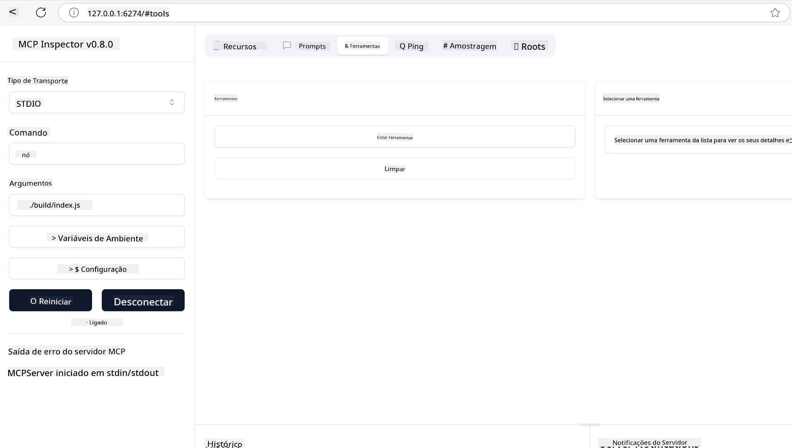
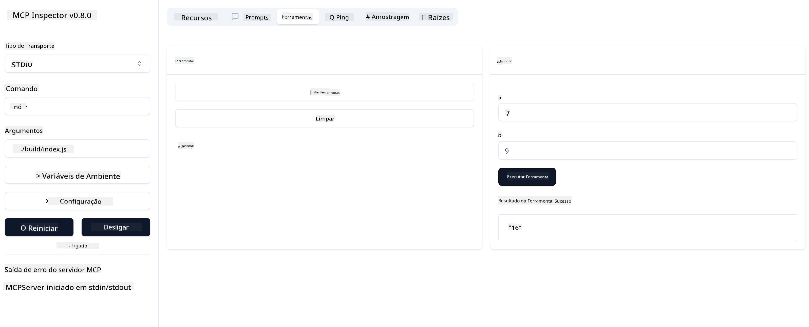

<!--
CO_OP_TRANSLATOR_METADATA:
{
  "original_hash": "e650db55873b456296a9c620069e2f71",
  "translation_date": "2025-06-02T11:07:44+00:00",
  "source_file": "03-GettingStarted/01-first-server/README.md",
  "language_code": "pt"
}
-->
### -2- Criar projeto

Agora que você instalou seu SDK, vamos criar um projeto a seguir:

### -3- Criar arquivos do projeto

### -4- Criar código do servidor

### -5- Adicionando uma ferramenta e um recurso

Adicione uma ferramenta e um recurso incluindo o seguinte código:

### -6 Código final

Vamos adicionar o último código necessário para que o servidor possa iniciar:

### -7- Testar o servidor

Inicie o servidor com o seguinte comando:

### -8- Executar usando o inspector

O inspector é uma ótima ferramenta que pode iniciar seu servidor e permite que você interaja com ele para testar se está funcionando. Vamos iniciá-lo:

> [!NOTE]
> pode parecer diferente no campo "command" pois contém o comando para rodar um servidor com seu runtime específico/

Você deverá ver a seguinte interface de usuário:

1. Conecte-se ao servidor selecionando o botão Connect  
   Uma vez conectado ao servidor, você deverá ver o seguinte:

   

2. Selecione "Tools" e "listTools", você verá "Add" aparecer, selecione "Add" e preencha os valores dos parâmetros.

   Você deverá ver a seguinte resposta, ou seja, um resultado da ferramenta "add":

   

Parabéns, você conseguiu criar e executar seu primeiro servidor!

### SDKs Oficiais

O MCP oferece SDKs oficiais para várias linguagens:
- [C# SDK](https://github.com/modelcontextprotocol/csharp-sdk) - Mantido em colaboração com a Microsoft
- [Java SDK](https://github.com/modelcontextprotocol/java-sdk) - Mantido em colaboração com Spring AI
- [TypeScript SDK](https://github.com/modelcontextprotocol/typescript-sdk) - Implementação oficial em TypeScript
- [Python SDK](https://github.com/modelcontextprotocol/python-sdk) - Implementação oficial em Python
- [Kotlin SDK](https://github.com/modelcontextprotocol/kotlin-sdk) - Implementação oficial em Kotlin
- [Swift SDK](https://github.com/modelcontextprotocol/swift-sdk) - Mantido em colaboração com Loopwork AI
- [Rust SDK](https://github.com/modelcontextprotocol/rust-sdk) - Implementação oficial em Rust

## Principais Lições

- Configurar um ambiente de desenvolvimento MCP é simples com SDKs específicos para cada linguagem
- Construir servidores MCP envolve criar e registrar ferramentas com esquemas claros
- Testar e depurar são essenciais para implementações MCP confiáveis

## Exemplos

- [Calculadora Java](../samples/java/calculator/README.md)
- [Calculadora .Net](../../../../03-GettingStarted/samples/csharp)
- [Calculadora JavaScript](../samples/javascript/README.md)
- [Calculadora TypeScript](../samples/typescript/README.md)
- [Calculadora Python](../../../../03-GettingStarted/samples/python)

## Exercício

Crie um servidor MCP simples com uma ferramenta de sua escolha:
1. Implemente a ferramenta na linguagem que preferir (.NET, Java, Python ou JavaScript).
2. Defina os parâmetros de entrada e valores de retorno.
3. Execute a ferramenta inspector para garantir que o servidor funcione como esperado.
4. Teste a implementação com várias entradas.

## Solução

[Solution](./solution/README.md)

## Recursos Adicionais

- [Repositório MCP no GitHub](https://github.com/microsoft/mcp-for-beginners)

## Próximos passos

Próximo: [Começando com Clientes MCP](/03-GettingStarted/02-client/README.md)

**Aviso Legal**:  
Este documento foi traduzido utilizando o serviço de tradução por IA [Co-op Translator](https://github.com/Azure/co-op-translator). Embora nos esforcemos para garantir a precisão, por favor, esteja ciente de que traduções automáticas podem conter erros ou imprecisões. O documento original em seu idioma nativo deve ser considerado a fonte autorizada. Para informações críticas, recomenda-se a tradução profissional realizada por humanos. Não nos responsabilizamos por quaisquer mal-entendidos ou interpretações incorretas decorrentes do uso desta tradução.