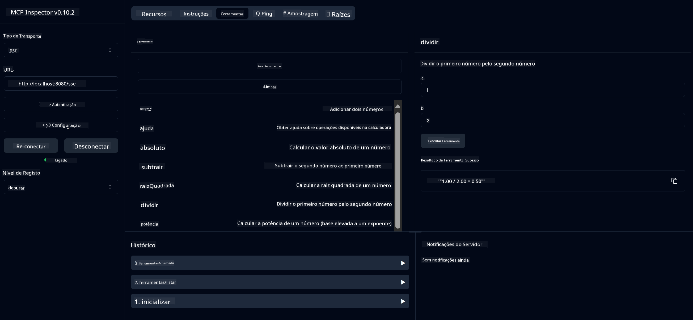

<!--
CO_OP_TRANSLATOR_METADATA:
{
  "original_hash": "004572534b5c86f847fac76bcbb76e89",
  "translation_date": "2025-07-22T08:12:26+00:00",
  "source_file": "03-GettingStarted/01-first-server/README.md",
  "language_code": "pt"
}
-->
# Introdução ao MCP

Bem-vindo aos seus primeiros passos com o Model Context Protocol (MCP)! Seja você iniciante no MCP ou alguém que deseja aprofundar seus conhecimentos, este guia irá orientá-lo no processo essencial de configuração e desenvolvimento. Descubra como o MCP permite uma integração perfeita entre modelos de IA e aplicações, e aprenda a preparar rapidamente o seu ambiente para criar e testar soluções baseadas no MCP.

> Resumo: Se você desenvolve aplicações de IA, sabe que pode adicionar ferramentas e outros recursos ao seu LLM (modelo de linguagem de grande escala) para torná-lo mais inteligente. No entanto, se você colocar essas ferramentas e recursos em um servidor, as capacidades do aplicativo e do servidor poderão ser usadas por qualquer cliente, com ou sem um LLM.

## Visão Geral

Esta lição oferece orientações práticas para configurar ambientes MCP e criar suas primeiras aplicações MCP. Você aprenderá a configurar as ferramentas e frameworks necessários, construir servidores MCP básicos, criar aplicações hospedeiras e testar suas implementações.

O Model Context Protocol (MCP) é um protocolo aberto que padroniza como as aplicações fornecem contexto para LLMs. Pense no MCP como uma porta USB-C para aplicações de IA - ele oferece uma maneira padronizada de conectar modelos de IA a diferentes fontes de dados e ferramentas.

## Objetivos de Aprendizagem

Ao final desta lição, você será capaz de:

- Configurar ambientes de desenvolvimento para MCP em C#, Java, Python, TypeScript e JavaScript
- Construir e implantar servidores MCP básicos com recursos personalizados (recursos, prompts e ferramentas)
- Criar aplicações hospedeiras que se conectam a servidores MCP
- Testar e depurar implementações MCP

## Configurando o Ambiente MCP

Antes de começar a trabalhar com o MCP, é importante preparar seu ambiente de desenvolvimento e entender o fluxo de trabalho básico. Esta seção irá guiá-lo pelos passos iniciais para garantir um início tranquilo com o MCP.

### Pré-requisitos

Antes de mergulhar no desenvolvimento com MCP, certifique-se de ter:

- **Ambiente de Desenvolvimento**: Para a linguagem escolhida (C#, Java, Python, TypeScript ou JavaScript)
- **IDE/Editor**: Visual Studio, Visual Studio Code, IntelliJ, Eclipse, PyCharm ou qualquer editor de código moderno
- **Gerenciadores de Pacotes**: NuGet, Maven/Gradle, pip ou npm/yarn
- **Chaves de API**: Para quaisquer serviços de IA que você planeja usar em suas aplicações hospedeiras

## Estrutura Básica de um Servidor MCP

Um servidor MCP geralmente inclui:

- **Configuração do Servidor**: Configuração de porta, autenticação e outras definições
- **Recursos**: Dados e contextos disponibilizados para os LLMs
- **Ferramentas**: Funcionalidades que os modelos podem invocar
- **Prompts**: Modelos para gerar ou estruturar texto

Aqui está um exemplo simplificado em TypeScript:

```typescript
import { Server, Tool, Resource } from "@modelcontextprotocol/typescript-server-sdk";

// Create a new MCP server
const server = new Server({
  port: 3000,
  name: "Example MCP Server",
  version: "1.0.0"
});

// Register a tool
server.registerTool({
  name: "calculator",
  description: "Performs basic calculations",
  parameters: {
    expression: {
      type: "string",
      description: "The math expression to evaluate"
    }
  },
  handler: async (params) => {
    const result = eval(params.expression);
    return { result };
  }
});

// Start the server
server.start();
```

No código acima, nós:

- Importamos as classes necessárias do SDK MCP para TypeScript.
- Criamos e configuramos uma nova instância de servidor MCP.
- Registramos uma ferramenta personalizada (`calculator`) com uma função manipuladora.
- Iniciamos o servidor para escutar solicitações MCP.

## Testando e Depurando

Antes de começar a testar seu servidor MCP, é importante entender as ferramentas disponíveis e as melhores práticas para depuração. Testes eficazes garantem que seu servidor se comporte como esperado e ajudam a identificar e resolver problemas rapidamente. A seção a seguir descreve abordagens recomendadas para validar sua implementação MCP.

O MCP fornece ferramentas para ajudá-lo a testar e depurar seus servidores:

- **Ferramenta Inspector**, uma interface gráfica que permite conectar-se ao seu servidor e testar ferramentas, prompts e recursos.
- **curl**, você também pode conectar-se ao seu servidor usando uma ferramenta de linha de comando como o curl ou outros clientes que possam criar e executar comandos HTTP.

### Usando o MCP Inspector

O [MCP Inspector](https://github.com/modelcontextprotocol/inspector) é uma ferramenta visual de teste que ajuda você a:

1. **Descobrir Capacidades do Servidor**: Detectar automaticamente recursos, ferramentas e prompts disponíveis
2. **Testar Execução de Ferramentas**: Experimentar diferentes parâmetros e ver respostas em tempo real
3. **Visualizar Metadados do Servidor**: Examinar informações do servidor, esquemas e configurações

```bash
# ex TypeScript, installing and running MCP Inspector
npx @modelcontextprotocol/inspector node build/index.js
```

Ao executar os comandos acima, o MCP Inspector abrirá uma interface web local no seu navegador. Você verá um painel exibindo os servidores MCP registrados, suas ferramentas, recursos e prompts disponíveis. A interface permite testar interativamente a execução de ferramentas, inspecionar metadados do servidor e visualizar respostas em tempo real, facilitando a validação e depuração de suas implementações de servidor MCP.

Aqui está uma captura de tela de como pode ser:


## Problemas Comuns de Configuração e Soluções

| Problema | Solução Possível |
|----------|------------------|
| Conexão recusada | Verifique se o servidor está em execução e se a porta está correta |
| Erros na execução de ferramentas | Revise a validação de parâmetros e o tratamento de erros |
| Falhas de autenticação | Verifique as chaves de API e permissões |
| Erros de validação de esquema | Certifique-se de que os parâmetros correspondem ao esquema definido |
| Servidor não inicia | Verifique conflitos de porta ou dependências ausentes |
| Erros de CORS | Configure os cabeçalhos CORS adequados para solicitações de origem cruzada |
| Problemas de autenticação | Verifique a validade do token e permissões |

## Desenvolvimento Local

Para desenvolvimento e testes locais, você pode executar servidores MCP diretamente na sua máquina:

1. **Inicie o processo do servidor**: Execute sua aplicação de servidor MCP
2. **Configure a rede**: Certifique-se de que o servidor está acessível na porta esperada
3. **Conecte os clientes**: Use URLs de conexão local como `http://localhost:3000`

```bash
# Example: Running a TypeScript MCP server locally
npm run start
# Server running at http://localhost:3000
```

## Construindo seu Primeiro Servidor MCP

Já cobrimos os [Conceitos Básicos](/01-CoreConcepts/README.md) em uma lição anterior, agora é hora de colocar esse conhecimento em prática.

### O que um servidor pode fazer

Antes de começarmos a escrever código, vamos lembrar o que um servidor pode fazer:

Um servidor MCP pode, por exemplo:

- Acessar arquivos e bancos de dados locais
- Conectar-se a APIs remotas
- Realizar cálculos
- Integrar-se com outras ferramentas e serviços
- Fornecer uma interface de usuário para interação

Ótimo, agora que sabemos o que podemos fazer, vamos começar a codificar.

## Exercício: Criando um Servidor

Para criar um servidor, você precisa seguir estes passos:

- Instalar o SDK MCP.
- Criar um projeto e configurar a estrutura do projeto.
- Escrever o código do servidor.
- Testar o servidor.

### -1- Criar Projeto

#### TypeScript

```sh
# Create project directory and initialize npm project
mkdir calculator-server
cd calculator-server
npm init -y
```

#### Python

```sh
# Create project dir
mkdir calculator-server
cd calculator-server
# Open the folder in Visual Studio Code - Skip this if you are using a different IDE
code .
```

#### .NET

```sh
dotnet new console -n McpCalculatorServer
cd McpCalculatorServer
```

#### Java

Para Java, crie um projeto Spring Boot:

```bash
curl https://start.spring.io/starter.zip \
  -d dependencies=web \
  -d javaVersion=21 \
  -d type=maven-project \
  -d groupId=com.example \
  -d artifactId=calculator-server \
  -d name=McpServer \
  -d packageName=com.microsoft.mcp.sample.server \
  -o calculator-server.zip
```

Extraia o arquivo zip:

```bash
unzip calculator-server.zip -d calculator-server
cd calculator-server
# optional remove the unused test
rm -rf src/test/java
```

Adicione a seguinte configuração completa ao seu arquivo *pom.xml*:

```xml
<?xml version="1.0" encoding="UTF-8"?>
<project xmlns="http://maven.apache.org/POM/4.0.0"
    xmlns:xsi="http://www.w3.org/2001/XMLSchema-instance"
    xsi:schemaLocation="http://maven.apache.org/POM/4.0.0 http://maven.apache.org/xsd/maven-4.0.0.xsd">
    <modelVersion>4.0.0</modelVersion>
    
    <!-- Spring Boot parent for dependency management -->
    <parent>
        <groupId>org.springframework.boot</groupId>
        <artifactId>spring-boot-starter-parent</artifactId>
        <version>3.5.0</version>
        <relativePath />
    </parent>

    <!-- Project coordinates -->
    <groupId>com.example</groupId>
    <artifactId>calculator-server</artifactId>
    <version>0.0.1-SNAPSHOT</version>
    <name>Calculator Server</name>
    <description>Basic calculator MCP service for beginners</description>

    <!-- Properties -->
    <properties>
        <java.version>21</java.version>
        <maven.compiler.source>21</maven.compiler.source>
        <maven.compiler.target>21</maven.compiler.target>
    </properties>

    <!-- Spring AI BOM for version management -->
    <dependencyManagement>
        <dependencies>
            <dependency>
                <groupId>org.springframework.ai</groupId>
                <artifactId>spring-ai-bom</artifactId>
                <version>1.0.0-SNAPSHOT</version>
                <type>pom</type>
                <scope>import</scope>
            </dependency>
        </dependencies>
    </dependencyManagement>

    <!-- Dependencies -->
    <dependencies>
        <dependency>
            <groupId>org.springframework.ai</groupId>
            <artifactId>spring-ai-starter-mcp-server-webflux</artifactId>
        </dependency>
        <dependency>
            <groupId>org.springframework.boot</groupId>
            <artifactId>spring-boot-starter-actuator</artifactId>
        </dependency>
        <dependency>
         <groupId>org.springframework.boot</groupId>
         <artifactId>spring-boot-starter-test</artifactId>
         <scope>test</scope>
      </dependency>
    </dependencies>

    <!-- Build configuration -->
    <build>
        <plugins>
            <plugin>
                <groupId>org.springframework.boot</groupId>
                <artifactId>spring-boot-maven-plugin</artifactId>
            </plugin>
            <plugin>
                <groupId>org.apache.maven.plugins</groupId>
                <artifactId>maven-compiler-plugin</artifactId>
                <configuration>
                    <release>21</release>
                </configuration>
            </plugin>
        </plugins>
    </build>

    <!-- Repositories for Spring AI snapshots -->
    <repositories>
        <repository>
            <id>spring-milestones</id>
            <name>Spring Milestones</name>
            <url>https://repo.spring.io/milestone</url>
            <snapshots>
                <enabled>false</enabled>
            </snapshots>
        </repository>
        <repository>
            <id>spring-snapshots</id>
            <name>Spring Snapshots</name>
            <url>https://repo.spring.io/snapshot</url>
            <releases>
                <enabled>false</enabled>
            </releases>
        </repository>
    </repositories>
</project>
```

### -2- Adicionar Dependências

Agora que você criou seu projeto, vamos adicionar as dependências:

#### TypeScript

```sh
# If not already installed, install TypeScript globally
npm install typescript -g

# Install the MCP SDK and Zod for schema validation
npm install @modelcontextprotocol/sdk zod
npm install -D @types/node typescript
```

#### Python

```sh
# Create a virtual env and install dependencies
python -m venv venv
venv\Scripts\activate
pip install "mcp[cli]"
```

#### Java

```bash
cd calculator-server
./mvnw clean install -DskipTests
```

### -3- Criar Arquivos do Projeto

#### TypeScript

Abra o arquivo *package.json* e substitua o conteúdo pelo seguinte para garantir que você possa construir e executar o servidor:

```json
{
  "name": "calculator-server",
  "version": "1.0.0",
  "main": "index.js",
  "type": "module",
  "scripts": {
    "start": "tsc && node ./build/index.js",
    "build": "tsc && node ./build/index.js"
  },
  "keywords": [],
  "author": "",
  "license": "ISC",
  "description": "A simple calculator server using Model Context Protocol",
  "dependencies": {
    "@modelcontextprotocol/sdk": "^1.16.0",
    "zod": "^3.25.76"
  },
  "devDependencies": {
    "@types/node": "^24.0.14",
    "typescript": "^5.8.3"
  }
}
```

Crie um *tsconfig.json* com o seguinte conteúdo:

```json
{
  "compilerOptions": {
    "target": "ES2022",
    "module": "Node16",
    "moduleResolution": "Node16",
    "outDir": "./build",
    "rootDir": "./src",
    "strict": true,
    "esModuleInterop": true,
    "skipLibCheck": true,
    "forceConsistentCasingInFileNames": true
  },
  "include": ["src/**/*"],
  "exclude": ["node_modules"]
}
```

Crie um diretório para o seu código-fonte:

```sh
mkdir src
touch src/index.ts
```

#### Python

Crie um arquivo *server.py*

```sh
touch server.py
```

#### .NET

Instale os pacotes NuGet necessários:

```sh
dotnet add package ModelContextProtocol --prerelease
dotnet add package Microsoft.Extensions.Hosting
```

#### Java

Para projetos Java Spring Boot, a estrutura do projeto é criada automaticamente.

### -4- Criar Código do Servidor

#### TypeScript

Crie um arquivo *index.ts* e adicione o seguinte código:

```typescript
import { McpServer, ResourceTemplate } from "@modelcontextprotocol/sdk/server/mcp.js";
import { StdioServerTransport } from "@modelcontextprotocol/sdk/server/stdio.js";
import { z } from "zod";
 
// Create an MCP server
const server = new McpServer({
  name: "Calculator MCP Server",
  version: "1.0.0"
});
```

Agora você tem um servidor, mas ele não faz muito. Vamos corrigir isso.

#### Python

```python
# server.py
from mcp.server.fastmcp import FastMCP

# Create an MCP server
mcp = FastMCP("Demo")
```

#### .NET

```csharp
using Microsoft.Extensions.DependencyInjection;
using Microsoft.Extensions.Hosting;
using Microsoft.Extensions.Logging;
using ModelContextProtocol.Server;
using System.ComponentModel;

var builder = Host.CreateApplicationBuilder(args);
builder.Logging.AddConsole(consoleLogOptions =>
{
    // Configure all logs to go to stderr
    consoleLogOptions.LogToStandardErrorThreshold = LogLevel.Trace;
});

builder.Services
    .AddMcpServer()
    .WithStdioServerTransport()
    .WithToolsFromAssembly();
await builder.Build().RunAsync();

// add features
```

#### Java

Para Java, crie os componentes principais do servidor. Primeiro, modifique a classe principal da aplicação:

*src/main/java/com/microsoft/mcp/sample/server/McpServerApplication.java*:

```java
package com.microsoft.mcp.sample.server;

import org.springframework.ai.tool.ToolCallbackProvider;
import org.springframework.ai.tool.method.MethodToolCallbackProvider;
import org.springframework.boot.SpringApplication;
import org.springframework.boot.autoconfigure.SpringBootApplication;
import org.springframework.context.annotation.Bean;
import com.microsoft.mcp.sample.server.service.CalculatorService;

@SpringBootApplication
public class McpServerApplication {

    public static void main(String[] args) {
        SpringApplication.run(McpServerApplication.class, args);
    }
    
    @Bean
    public ToolCallbackProvider calculatorTools(CalculatorService calculator) {
        return MethodToolCallbackProvider.builder().toolObjects(calculator).build();
    }
}
```

Crie o serviço de calculadora *src/main/java/com/microsoft/mcp/sample/server/service/CalculatorService.java*:

```java
package com.microsoft.mcp.sample.server.service;

import org.springframework.ai.tool.annotation.Tool;
import org.springframework.stereotype.Service;

/**
 * Service for basic calculator operations.
 * This service provides simple calculator functionality through MCP.
 */
@Service
public class CalculatorService {

    /**
     * Add two numbers
     * @param a The first number
     * @param b The second number
     * @return The sum of the two numbers
     */
    @Tool(description = "Add two numbers together")
    public String add(double a, double b) {
        double result = a + b;
        return formatResult(a, "+", b, result);
    }

    /**
     * Subtract one number from another
     * @param a The number to subtract from
     * @param b The number to subtract
     * @return The result of the subtraction
     */
    @Tool(description = "Subtract the second number from the first number")
    public String subtract(double a, double b) {
        double result = a - b;
        return formatResult(a, "-", b, result);
    }

    /**
     * Multiply two numbers
     * @param a The first number
     * @param b The second number
     * @return The product of the two numbers
     */
    @Tool(description = "Multiply two numbers together")
    public String multiply(double a, double b) {
        double result = a * b;
        return formatResult(a, "*", b, result);
    }

    /**
     * Divide one number by another
     * @param a The numerator
     * @param b The denominator
     * @return The result of the division
     */
    @Tool(description = "Divide the first number by the second number")
    public String divide(double a, double b) {
        if (b == 0) {
            return "Error: Cannot divide by zero";
        }
        double result = a / b;
        return formatResult(a, "/", b, result);
    }

    /**
     * Calculate the power of a number
     * @param base The base number
     * @param exponent The exponent
     * @return The result of raising the base to the exponent
     */
    @Tool(description = "Calculate the power of a number (base raised to an exponent)")
    public String power(double base, double exponent) {
        double result = Math.pow(base, exponent);
        return formatResult(base, "^", exponent, result);
    }

    /**
     * Calculate the square root of a number
     * @param number The number to find the square root of
     * @return The square root of the number
     */
    @Tool(description = "Calculate the square root of a number")
    public String squareRoot(double number) {
        if (number < 0) {
            return "Error: Cannot calculate square root of a negative number";
        }
        double result = Math.sqrt(number);
        return String.format("√%.2f = %.2f", number, result);
    }

    /**
     * Calculate the modulus (remainder) of division
     * @param a The dividend
     * @param b The divisor
     * @return The remainder of the division
     */
    @Tool(description = "Calculate the remainder when one number is divided by another")
    public String modulus(double a, double b) {
        if (b == 0) {
            return "Error: Cannot divide by zero";
        }
        double result = a % b;
        return formatResult(a, "%", b, result);
    }

    /**
     * Calculate the absolute value of a number
     * @param number The number to find the absolute value of
     * @return The absolute value of the number
     */
    @Tool(description = "Calculate the absolute value of a number")
    public String absolute(double number) {
        double result = Math.abs(number);
        return String.format("|%.2f| = %.2f", number, result);
    }

    /**
     * Get help about available calculator operations
     * @return Information about available operations
     */
    @Tool(description = "Get help about available calculator operations")
    public String help() {
        return "Basic Calculator MCP Service\n\n" +
               "Available operations:\n" +
               "1. add(a, b) - Adds two numbers\n" +
               "2. subtract(a, b) - Subtracts the second number from the first\n" +
               "3. multiply(a, b) - Multiplies two numbers\n" +
               "4. divide(a, b) - Divides the first number by the second\n" +
               "5. power(base, exponent) - Raises a number to a power\n" +
               "6. squareRoot(number) - Calculates the square root\n" + 
               "7. modulus(a, b) - Calculates the remainder of division\n" +
               "8. absolute(number) - Calculates the absolute value\n\n" +
               "Example usage: add(5, 3) will return 5 + 3 = 8";
    }

    /**
     * Format the result of a calculation
     */
    private String formatResult(double a, String operator, double b, double result) {
        return String.format("%.2f %s %.2f = %.2f", a, operator, b, result);
    }
}
```

**Componentes opcionais para um serviço pronto para produção:**

Crie uma configuração de inicialização *src/main/java/com/microsoft/mcp/sample/server/config/StartupConfig.java*:

```java
package com.microsoft.mcp.sample.server.config;

import org.springframework.boot.CommandLineRunner;
import org.springframework.context.annotation.Bean;
import org.springframework.context.annotation.Configuration;

@Configuration
public class StartupConfig {
    
    @Bean
    public CommandLineRunner startupInfo() {
        return args -> {
            System.out.println("\n" + "=".repeat(60));
            System.out.println("Calculator MCP Server is starting...");
            System.out.println("SSE endpoint: http://localhost:8080/sse");
            System.out.println("Health check: http://localhost:8080/actuator/health");
            System.out.println("=".repeat(60) + "\n");
        };
    }
}
```

Crie um controlador de saúde *src/main/java/com/microsoft/mcp/sample/server/controller/HealthController.java*:

```java
package com.microsoft.mcp.sample.server.controller;

import org.springframework.http.ResponseEntity;
import org.springframework.web.bind.annotation.GetMapping;
import org.springframework.web.bind.annotation.RestController;
import java.time.LocalDateTime;
import java.util.HashMap;
import java.util.Map;

@RestController
public class HealthController {
    
    @GetMapping("/health")
    public ResponseEntity<Map<String, Object>> healthCheck() {
        Map<String, Object> response = new HashMap<>();
        response.put("status", "UP");
        response.put("timestamp", LocalDateTime.now().toString());
        response.put("service", "Calculator MCP Server");
        return ResponseEntity.ok(response);
    }
}
```

Crie um manipulador de exceções *src/main/java/com/microsoft/mcp/sample/server/exception/GlobalExceptionHandler.java*:

```java
package com.microsoft.mcp.sample.server.exception;

import org.springframework.http.HttpStatus;
import org.springframework.http.ResponseEntity;
import org.springframework.web.bind.annotation.ExceptionHandler;
import org.springframework.web.bind.annotation.RestControllerAdvice;

@RestControllerAdvice
public class GlobalExceptionHandler {

    @ExceptionHandler(IllegalArgumentException.class)
    public ResponseEntity<ErrorResponse> handleIllegalArgumentException(IllegalArgumentException ex) {
        ErrorResponse error = new ErrorResponse(
            "Invalid_Input", 
            "Invalid input parameter: " + ex.getMessage());
        return new ResponseEntity<>(error, HttpStatus.BAD_REQUEST);
    }

    public static class ErrorResponse {
        private String code;
        private String message;

        public ErrorResponse(String code, String message) {
            this.code = code;
            this.message = message;
        }

        // Getters
        public String getCode() { return code; }
        public String getMessage() { return message; }
    }
}
```

Crie um banner personalizado *src/main/resources/banner.txt*:

```text
_____      _            _       _             
 / ____|    | |          | |     | |            
| |     __ _| | ___ _   _| | __ _| |_ ___  _ __ 
| |    / _` | |/ __| | | | |/ _` | __/ _ \| '__|
| |___| (_| | | (__| |_| | | (_| | || (_) | |   
 \_____\__,_|_|\___|\__,_|_|\__,_|\__\___/|_|   
                                                
Calculator MCP Server v1.0
Spring Boot MCP Application
```

### -5- Adicionar uma Ferramenta e um Recurso

Adicione uma ferramenta e um recurso com o seguinte código:

#### TypeScript

```typescript
server.tool(
  "add",
  { a: z.number(), b: z.number() },
  async ({ a, b }) => ({
    content: [{ type: "text", text: String(a + b) }]
  })
);

server.resource(
  "greeting",
  new ResourceTemplate("greeting://{name}", { list: undefined }),
  async (uri, { name }) => ({
    contents: [{
      uri: uri.href,
      text: `Hello, ${name}!`
    }]
  })
);
```

Sua ferramenta recebe os parâmetros `a` e `b` e executa uma função que produz uma resposta no formato:

```typescript
{
  contents: [{
    type: "text", content: "some content"
  }]
}
```

Seu recurso é acessado por meio de uma string "greeting" e recebe um parâmetro `name`, produzindo uma resposta semelhante à ferramenta:

```typescript
{
  uri: "<href>",
  text: "a text"
}
```

#### Python

```python
# Add an addition tool
@mcp.tool()
def add(a: int, b: int) -> int:
    """Add two numbers"""
    return a + b


# Add a dynamic greeting resource
@mcp.resource("greeting://{name}")
def get_greeting(name: str) -> str:
    """Get a personalized greeting"""
    return f"Hello, {name}!"
```

No código acima, nós:

- Definimos uma ferramenta `add` que recebe os parâmetros `a` e `p`, ambos inteiros.
- Criamos um recurso chamado `greeting` que recebe o parâmetro `name`.

#### .NET

Adicione isso ao seu arquivo Program.cs:

```csharp
[McpServerToolType]
public static class CalculatorTool
{
    [McpServerTool, Description("Adds two numbers")]
    public static string Add(int a, int b) => $"Sum {a + b}";
}
```

#### Java

As ferramentas já foram criadas na etapa anterior.

### -6- Código Final

Vamos adicionar o último código necessário para que o servidor possa iniciar:

#### TypeScript

```typescript
// Start receiving messages on stdin and sending messages on stdout
const transport = new StdioServerTransport();
await server.connect(transport);
```

Aqui está o código completo:

```typescript
// index.ts
import { McpServer, ResourceTemplate } from "@modelcontextprotocol/sdk/server/mcp.js";
import { StdioServerTransport } from "@modelcontextprotocol/sdk/server/stdio.js";
import { z } from "zod";

// Create an MCP server
const server = new McpServer({
  name: "Calculator MCP Server",
  version: "1.0.0"
});

// Add an addition tool
server.tool(
  "add",
  { a: z.number(), b: z.number() },
  async ({ a, b }) => ({
    content: [{ type: "text", text: String(a + b) }]
  })
);

// Add a dynamic greeting resource
server.resource(
  "greeting",
  new ResourceTemplate("greeting://{name}", { list: undefined }),
  async (uri, { name }) => ({
    contents: [{
      uri: uri.href,
      text: `Hello, ${name}!`
    }]
  })
);

// Start receiving messages on stdin and sending messages on stdout
const transport = new StdioServerTransport();
server.connect(transport);
```

#### Python

```python
# server.py
from mcp.server.fastmcp import FastMCP

# Create an MCP server
mcp = FastMCP("Demo")


# Add an addition tool
@mcp.tool()
def add(a: int, b: int) -> int:
    """Add two numbers"""
    return a + b


# Add a dynamic greeting resource
@mcp.resource("greeting://{name}")
def get_greeting(name: str) -> str:
    """Get a personalized greeting"""
    return f"Hello, {name}!"

# Main execution block - this is required to run the server
if __name__ == "__main__":
    mcp.run()
```

#### .NET

Crie um arquivo Program.cs com o seguinte conteúdo:

```csharp
using Microsoft.Extensions.DependencyInjection;
using Microsoft.Extensions.Hosting;
using Microsoft.Extensions.Logging;
using ModelContextProtocol.Server;
using System.ComponentModel;

var builder = Host.CreateApplicationBuilder(args);
builder.Logging.AddConsole(consoleLogOptions =>
{
    // Configure all logs to go to stderr
    consoleLogOptions.LogToStandardErrorThreshold = LogLevel.Trace;
});

builder.Services
    .AddMcpServer()
    .WithStdioServerTransport()
    .WithToolsFromAssembly();
await builder.Build().RunAsync();

[McpServerToolType]
public static class CalculatorTool
{
    [McpServerTool, Description("Adds two numbers")]
    public static string Add(int a, int b) => $"Sum {a + b}";
}
```

#### Java

Sua classe principal completa deve ser assim:

```java
// McpServerApplication.java
package com.microsoft.mcp.sample.server;

import org.springframework.ai.tool.ToolCallbackProvider;
import org.springframework.ai.tool.method.MethodToolCallbackProvider;
import org.springframework.boot.SpringApplication;
import org.springframework.boot.autoconfigure.SpringBootApplication;
import org.springframework.context.annotation.Bean;
import com.microsoft.mcp.sample.server.service.CalculatorService;

@SpringBootApplication
public class McpServerApplication {

    public static void main(String[] args) {
        SpringApplication.run(McpServerApplication.class, args);
    }
    
    @Bean
    public ToolCallbackProvider calculatorTools(CalculatorService calculator) {
        return MethodToolCallbackProvider.builder().toolObjects(calculator).build();
    }
}
```

### -7- Testar o Servidor

Inicie o servidor com o seguinte comando:

#### TypeScript

```sh
npm run build
```

#### Python

```sh
mcp run server.py
```

> Para usar o MCP Inspector, use `mcp dev server.py`, que inicia automaticamente o Inspector e fornece o token de sessão de proxy necessário. Se usar `mcp run server.py`, será necessário iniciar o Inspector manualmente e configurar a conexão.

#### .NET

Certifique-se de estar no diretório do seu projeto:

```sh
cd McpCalculatorServer
dotnet run
```

#### Java

```bash
./mvnw clean install -DskipTests
java -jar target/calculator-server-0.0.1-SNAPSHOT.jar
```

### -8- Executar Usando o Inspector

O Inspector é uma ótima ferramenta que pode iniciar seu servidor e permite que você interaja com ele para testar se está funcionando. Vamos iniciá-lo:

> [!NOTE]
> Pode parecer diferente no campo "command", pois contém o comando para executar um servidor com o seu runtime específico.

#### TypeScript

```sh
npx @modelcontextprotocol/inspector node build/index.js
```

Ou adicione ao seu *package.json* assim: `"inspector": "npx @modelcontextprotocol/inspector node build/index.js"` e então execute `npm run inspect`.

Python utiliza uma ferramenta Node.js chamada inspector. É possível chamá-la assim:

```sh
mcp dev server.py
```

No entanto, ela não implementa todos os métodos disponíveis na ferramenta, então é recomendado executar a ferramenta Node.js diretamente como abaixo:

```sh
npx @modelcontextprotocol/inspector mcp run server.py
```

Se você estiver usando uma ferramenta ou IDE que permite configurar comandos e argumentos para executar scripts, 
certifique-se de definir `python` no campo `Command` e `server.py` como `Arguments`. Isso garante que o script seja executado corretamente.

#### .NET

Certifique-se de estar no diretório do seu projeto:

```sh
cd McpCalculatorServer
npx @modelcontextprotocol/inspector dotnet run
```

#### Java

Certifique-se de que o servidor da calculadora está em execução. 
Depois, execute o inspector:

```cmd
npx @modelcontextprotocol/inspector
```

Na interface web do inspector:

1. Selecione "SSE" como o tipo de transporte
2. Defina a URL como: `http://localhost:8080/sse`
3. Clique em "Connect"



**Agora você está conectado ao servidor**
**A seção de teste do servidor Java está concluída agora**

A próxima seção é sobre interagir com o servidor.

Você deve ver a seguinte interface de usuário:


1. Conecte-se ao servidor selecionando o botão Connect. 
   Após conectar-se ao servidor, você deve ver o seguinte:

   

1. Selecione "Tools" e "listTools", você deve ver "Add" aparecer. Selecione "Add" e preencha os valores dos parâmetros.

   Você deve ver a seguinte resposta, ou seja, um resultado da ferramenta "add":

   

Parabéns, você conseguiu criar e executar seu primeiro servidor!

### SDKs Oficiais

O MCP fornece SDKs oficiais para várias linguagens:

- [C# SDK](https://github.com/modelcontextprotocol/csharp-sdk) - Mantido em colaboração com a Microsoft
- [Java SDK](https://github.com/modelcontextprotocol/java-sdk) - Mantido em colaboração com o Spring AI
- [TypeScript SDK](https://github.com/modelcontextprotocol/typescript-sdk) - A implementação oficial em TypeScript
- [Python SDK](https://github.com/modelcontextprotocol/python-sdk) - A implementação oficial em Python
- [Kotlin SDK](https://github.com/modelcontextprotocol/kotlin-sdk) - A implementação oficial em Kotlin  
- [Swift SDK](https://github.com/modelcontextprotocol/swift-sdk) - Mantido em colaboração com a Loopwork AI  
- [Rust SDK](https://github.com/modelcontextprotocol/rust-sdk) - A implementação oficial em Rust  

## Pontos-chave  

- Configurar um ambiente de desenvolvimento MCP é simples com SDKs específicos para cada linguagem  
- Construir servidores MCP envolve criar e registar ferramentas com esquemas claros  
- Testar e depurar são etapas essenciais para implementações MCP confiáveis  

## Exemplos  

- [Calculadora em Java](../samples/java/calculator/README.md)  
- [Calculadora em .Net](../../../../03-GettingStarted/samples/csharp)  
- [Calculadora em JavaScript](../samples/javascript/README.md)  
- [Calculadora em TypeScript](../samples/typescript/README.md)  
- [Calculadora em Python](../../../../03-GettingStarted/samples/python)  

## Tarefa  

Crie um servidor MCP simples com uma ferramenta à sua escolha:  

1. Implemente a ferramenta na sua linguagem preferida (.NET, Java, Python ou JavaScript).  
2. Defina os parâmetros de entrada e os valores de retorno.  
3. Execute a ferramenta de inspeção para garantir que o servidor funciona como esperado.  
4. Teste a implementação com vários tipos de entrada.  

## Solução  

[Solução](./solution/README.md)  

## Recursos adicionais  

- [Crie agentes usando o Model Context Protocol no Azure](https://learn.microsoft.com/azure/developer/ai/intro-agents-mcp)  
- [MCP remoto com Azure Container Apps (Node.js/TypeScript/JavaScript)](https://learn.microsoft.com/samples/azure-samples/mcp-container-ts/mcp-container-ts/)  
- [Agente MCP OpenAI em .NET](https://learn.microsoft.com/samples/azure-samples/openai-mcp-agent-dotnet/openai-mcp-agent-dotnet/)  

## O que vem a seguir  

Próximo: [Introdução aos Clientes MCP](../02-client/README.md)  

**Aviso Legal**:  
Este documento foi traduzido utilizando o serviço de tradução por IA [Co-op Translator](https://github.com/Azure/co-op-translator). Embora nos esforcemos pela precisão, esteja ciente de que traduções automáticas podem conter erros ou imprecisões. O documento original na sua língua nativa deve ser considerado a fonte autoritária. Para informações críticas, recomenda-se a tradução profissional realizada por humanos. Não nos responsabilizamos por quaisquer mal-entendidos ou interpretações incorretas decorrentes do uso desta tradução.