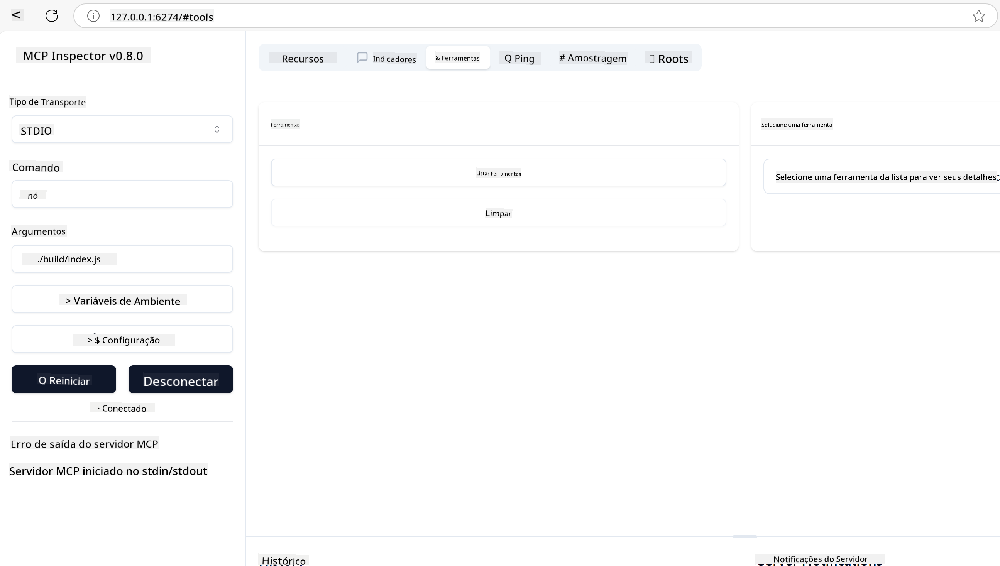
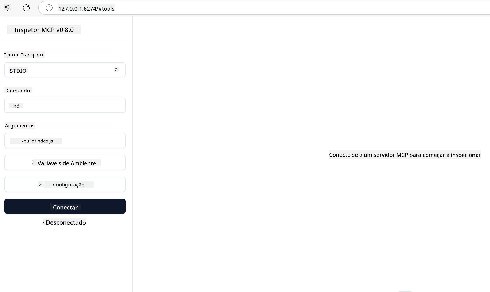
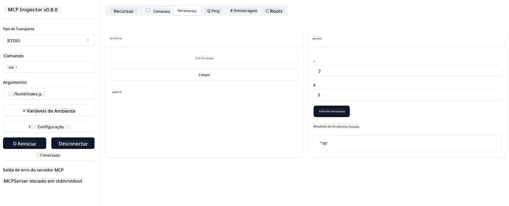

<!--
CO_OP_TRANSLATOR_METADATA:
{
  "original_hash": "5331ffd328a54b90f76706c52b673e27",
  "translation_date": "2025-05-17T08:32:26+00:00",
  "source_file": "03-GettingStarted/01-first-server/README.md",
  "language_code": "pt"
}
-->
# Introdução ao MCP

Bem-vindo aos seus primeiros passos com o Protocolo de Contexto de Modelo (MCP)! Seja você novo no MCP ou esteja buscando aprofundar seu entendimento, este guia irá conduzi-lo através do processo essencial de configuração e desenvolvimento. Você descobrirá como o MCP permite a integração perfeita entre modelos de IA e aplicações, e aprenderá a preparar rapidamente seu ambiente para construir e testar soluções com suporte ao MCP.

> TLDR; Se você desenvolve aplicativos de IA, sabe que pode adicionar ferramentas e outros recursos ao seu LLM (modelo de linguagem grande) para torná-lo mais conhecedor. No entanto, se você colocar essas ferramentas e recursos em um servidor, o aplicativo e as capacidades do servidor podem ser usados por qualquer cliente com ou sem um LLM.

## Visão Geral

Esta lição fornece orientações práticas sobre como configurar ambientes MCP e construir suas primeiras aplicações MCP. Você aprenderá a configurar as ferramentas e frameworks necessários, construir servidores MCP básicos, criar aplicações hospedeiras e testar suas implementações.

O Protocolo de Contexto de Modelo (MCP) é um protocolo aberto que padroniza como as aplicações fornecem contexto para LLMs. Pense no MCP como uma porta USB-C para aplicações de IA - ele fornece uma maneira padronizada de conectar modelos de IA a diferentes fontes de dados e ferramentas.

## Objetivos de Aprendizagem

Ao final desta lição, você será capaz de:

- Configurar ambientes de desenvolvimento para MCP em C#, Java, Python, TypeScript e JavaScript
- Construir e implantar servidores MCP básicos com recursos personalizados (recursos, prompts e ferramentas)
- Criar aplicações hospedeiras que se conectam a servidores MCP
- Testar e depurar implementações MCP

## Configurando Seu Ambiente MCP

Antes de começar a trabalhar com MCP, é importante preparar seu ambiente de desenvolvimento e entender o fluxo de trabalho básico. Esta seção irá guiá-lo através das etapas iniciais de configuração para garantir um início suave com o MCP.

### Pré-requisitos

Antes de mergulhar no desenvolvimento com MCP, certifique-se de ter:

- **Ambiente de Desenvolvimento**: Para a linguagem escolhida (C#, Java, Python, TypeScript ou JavaScript)
- **IDE/Editor**: Visual Studio, Visual Studio Code, IntelliJ, Eclipse, PyCharm, ou qualquer editor de código moderno
- **Gerenciadores de Pacotes**: NuGet, Maven/Gradle, pip, ou npm/yarn
- **Chaves de API**: Para quaisquer serviços de IA que você planeja usar em suas aplicações hospedeiras

## Estrutura Básica do Servidor MCP

Um servidor MCP normalmente inclui:

- **Configuração do Servidor**: Configuração de porta, autenticação e outras configurações
- **Recursos**: Dados e contexto disponibilizados para LLMs
- **Ferramentas**: Funcionalidades que os modelos podem invocar
- **Prompts**: Modelos para gerar ou estruturar texto

Aqui está um exemplo simplificado em TypeScript:

```typescript
import { Server, Tool, Resource } from "@modelcontextprotocol/typescript-server-sdk";

// Create a new MCP server
const server = new Server({
  port: 3000,
  name: "Example MCP Server",
  version: "1.0.0"
});

// Register a tool
server.registerTool({
  name: "calculator",
  description: "Performs basic calculations",
  parameters: {
    expression: {
      type: "string",
      description: "The math expression to evaluate"
    }
  },
  handler: async (params) => {
    const result = eval(params.expression);
    return { result };
  }
});

// Start the server
server.start();
```

No código anterior, nós:

- Importamos as classes necessárias do SDK MCP TypeScript.
- Criamos e configuramos uma nova instância de servidor MCP.
- Registramos uma ferramenta personalizada (`calculator`) com uma função de manipulação.
- Iniciamos o servidor para ouvir as solicitações MCP recebidas.

## Testando e Depurando

Antes de começar a testar seu servidor MCP, é importante entender as ferramentas disponíveis e as melhores práticas para depuração. Testes eficazes garantem que seu servidor se comporte conforme o esperado e ajudam a identificar e resolver problemas rapidamente. A seção a seguir descreve abordagens recomendadas para validar sua implementação MCP.

O MCP fornece ferramentas para ajudá-lo a testar e depurar seus servidores:

- **Ferramenta Inspector**, esta interface gráfica permite que você se conecte ao seu servidor e teste suas ferramentas, prompts e recursos.
- **curl**, você também pode se conectar ao seu servidor usando uma ferramenta de linha de comando como curl ou outros clientes que possam criar e executar comandos HTTP.

### Usando o MCP Inspector

O [MCP Inspector](https://github.com/modelcontextprotocol/inspector) é uma ferramenta de teste visual que ajuda você a:

1. **Descobrir Capacidades do Servidor**: Detectar automaticamente recursos, ferramentas e prompts disponíveis
2. **Testar Execução de Ferramentas**: Experimentar diferentes parâmetros e ver respostas em tempo real
3. **Visualizar Metadados do Servidor**: Examinar informações do servidor, esquemas e configurações

```bash
# ex TypeScript, installing and running MCP Inspector
npx @modelcontextprotocol/inspector node build/index.js
```

Quando você executa os comandos acima, o MCP Inspector lançará uma interface web local em seu navegador. Você pode esperar ver um painel exibindo seus servidores MCP registrados, suas ferramentas disponíveis, recursos e prompts. A interface permite que você teste interativamente a execução de ferramentas, inspecione metadados do servidor e visualize respostas em tempo real, facilitando a validação e depuração de suas implementações de servidor MCP.

Aqui está uma captura de tela de como pode parecer:



## Problemas Comuns de Configuração e Soluções

| Problema | Solução Possível |
|-------|-------------------|
| Conexão recusada | Verifique se o servidor está em execução e se a porta está correta |
| Erros de execução de ferramentas | Revise a validação de parâmetros e tratamento de erros |
| Falhas de autenticação | Verifique chaves de API e permissões |
| Erros de validação de esquema | Certifique-se de que os parâmetros correspondam ao esquema definido |
| Servidor não inicia | Verifique conflitos de porta ou dependências ausentes |
| Erros de CORS | Configure cabeçalhos CORS adequados para solicitações de origem cruzada |
| Problemas de autenticação | Verifique a validade do token e permissões |

## Desenvolvimento Local

Para desenvolvimento e teste local, você pode executar servidores MCP diretamente em sua máquina:

1. **Inicie o processo do servidor**: Execute seu aplicativo de servidor MCP
2. **Configure a rede**: Certifique-se de que o servidor esteja acessível na porta esperada
3. **Conecte clientes**: Use URLs de conexão local como `http://localhost:3000`

```bash
# Example: Running a TypeScript MCP server locally
npm run start
# Server running at http://localhost:3000
```

## Construindo seu primeiro Servidor MCP

Cobrimos [Conceitos básicos](/01-CoreConcepts/README.md) em uma lição anterior, agora é hora de colocar esse conhecimento em prática.

### O que um servidor pode fazer

Antes de começarmos a escrever código, vamos apenas nos lembrar do que um servidor pode fazer:

Um servidor MCP pode, por exemplo:

- Acessar arquivos e bancos de dados locais
- Conectar-se a APIs remotas
- Realizar cálculos
- Integrar-se com outras ferramentas e serviços
- Fornecer uma interface de usuário para interação

Ótimo, agora que sabemos o que podemos fazer por ele, vamos começar a codificar.

## Exercício: Criando um servidor

Para criar um servidor, você precisa seguir estas etapas:

- Instale o SDK do MCP.
- Crie um projeto e configure a estrutura do projeto.
- Escreva o código do servidor.
- Teste o servidor.

### -1- Instale o SDK

Isso difere um pouco dependendo do runtime escolhido, então escolha um dos runtimes abaixo:

A IA generativa pode gerar texto, imagens e até código.

### -2- Crie o projeto

Agora que você tem seu SDK instalado, vamos criar um projeto a seguir:

### -3- Crie os arquivos do projeto

### -4- Crie o código do servidor

### -5- Adicionando uma ferramenta e um recurso

Adicione uma ferramenta e um recurso adicionando o seguinte código:

### -6 Código final

Vamos adicionar o último código que precisamos para que o servidor possa iniciar:

### -7- Teste o servidor

Inicie o servidor com o seguinte comando:

### -8- Execute usando o inspector

O inspector é uma ótima ferramenta que pode iniciar seu servidor e permite que você interaja com ele para testar se ele funciona. Vamos iniciá-lo:

> [!NOTE]
> pode parecer diferente no campo "comando", pois contém o comando para executar um servidor com seu runtime específico.

Você deve ver a seguinte interface de usuário:



1. Conecte-se ao servidor selecionando o botão Conectar
   Assim que você se conectar ao servidor, deverá ver o seguinte:

   

1. Selecione "Ferramentas" e "listTools", você deve ver "Adicionar" aparecer, selecione "Adicionar" e preencha os valores dos parâmetros.

   Você deve ver a seguinte resposta, ou seja, um resultado da ferramenta "adicionar":

   

Parabéns, você conseguiu criar e executar seu primeiro servidor!

### SDKs Oficiais

O MCP fornece SDKs oficiais para várias linguagens:
- [C# SDK](https://github.com/modelcontextprotocol/csharp-sdk) - Mantido em colaboração com a Microsoft
- [Java SDK](https://github.com/modelcontextprotocol/java-sdk) - Mantido em colaboração com Spring AI
- [TypeScript SDK](https://github.com/modelcontextprotocol/typescript-sdk) - A implementação oficial em TypeScript
- [Python SDK](https://github.com/modelcontextprotocol/python-sdk) - A implementação oficial em Python
- [Kotlin SDK](https://github.com/modelcontextprotocol/kotlin-sdk) - A implementação oficial em Kotlin
- [Swift SDK](https://github.com/modelcontextprotocol/swift-sdk) - Mantido em colaboração com Loopwork AI
- [Rust SDK](https://github.com/modelcontextprotocol/rust-sdk) - A implementação oficial em Rust

## Principais Conclusões

- Configurar um ambiente de desenvolvimento MCP é simples com SDKs específicos para cada linguagem
- Construir servidores MCP envolve criar e registrar ferramentas com esquemas claros
- Testar e depurar são essenciais para implementações MCP confiáveis

## Exemplos

- [Calculadora Java](../samples/java/calculator/README.md)
- [Calculadora .Net](../../../../03-GettingStarted/samples/csharp)
- [Calculadora JavaScript](../samples/javascript/README.md)
- [Calculadora TypeScript](../samples/typescript/README.md)
- [Calculadora Python](../../../../03-GettingStarted/samples/python)

## Tarefa

Crie um servidor MCP simples com uma ferramenta de sua escolha:
1. Implemente a ferramenta em sua linguagem preferida (.NET, Java, Python ou JavaScript).
2. Defina parâmetros de entrada e valores de retorno.
3. Execute a ferramenta inspector para garantir que o servidor funcione conforme esperado.
4. Teste a implementação com várias entradas.

## Solução

[Solução](./solution/README.md)

## Recursos Adicionais

- [Repositório GitHub do MCP](https://github.com/microsoft/mcp-for-beginners)

## O que vem a seguir

Próximo: [Introdução aos Clientes MCP](/03-GettingStarted/02-client/README.md)

**Aviso Legal**:
Este documento foi traduzido usando o serviço de tradução por IA [Co-op Translator](https://github.com/Azure/co-op-translator). Embora nos esforcemos pela precisão, esteja ciente de que traduções automáticas podem conter erros ou imprecisões. O documento original em seu idioma nativo deve ser considerado a fonte autoritária. Para informações críticas, recomenda-se tradução profissional humana. Não nos responsabilizamos por quaisquer mal-entendidos ou interpretações incorretas decorrentes do uso desta tradução.