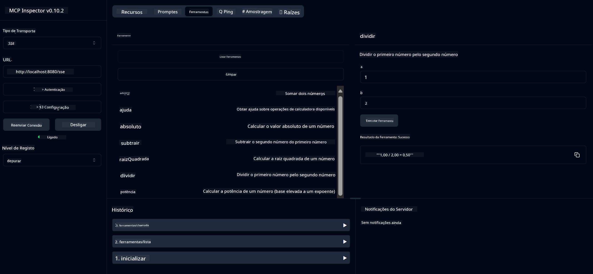

<!--
CO_OP_TRANSLATOR_METADATA:
{
  "original_hash": "ed9cab32cc67c12d8969b407aa47100a",
  "translation_date": "2025-07-13T17:53:52+00:00",
  "source_file": "03-GettingStarted/01-first-server/solution/java/README.md",
  "language_code": "pt"
}
-->
# Serviço Básico de Calculadora MCP

Este serviço fornece operações básicas de calculadora através do Model Context Protocol (MCP) usando Spring Boot com transporte WebFlux. Foi concebido como um exemplo simples para iniciantes que estão a aprender sobre implementações MCP.

Para mais informações, consulte a documentação de referência do [MCP Server Boot Starter](https://docs.spring.io/spring-ai/reference/api/mcp/mcp-server-boot-starter-docs.html).

## Utilização do Serviço

O serviço expõe os seguintes endpoints API através do protocolo MCP:

- `add(a, b)`: Soma dois números
- `subtract(a, b)`: Subtrai o segundo número ao primeiro
- `multiply(a, b)`: Multiplica dois números
- `divide(a, b)`: Divide o primeiro número pelo segundo (com verificação de zero)
- `power(base, exponent)`: Calcula a potência de um número
- `squareRoot(number)`: Calcula a raiz quadrada (com verificação de número negativo)
- `modulus(a, b)`: Calcula o resto da divisão
- `absolute(number)`: Calcula o valor absoluto

## Dependências

O projeto requer as seguintes dependências principais:

```xml
<dependency>
    <groupId>org.springframework.ai</groupId>
    <artifactId>spring-ai-starter-mcp-server-webflux</artifactId>
</dependency>
```

## Construção do Projeto

Construa o projeto usando Maven:
```bash
./mvnw clean install -DskipTests
```

## Execução do Servidor

### Usando Java

```bash
java -jar target/calculator-server-0.0.1-SNAPSHOT.jar
```

### Usando MCP Inspector

O MCP Inspector é uma ferramenta útil para interagir com serviços MCP. Para o usar com este serviço de calculadora:

1. **Instale e execute o MCP Inspector** numa nova janela de terminal:
   ```bash
   npx @modelcontextprotocol/inspector
   ```

2. **Aceda à interface web** clicando na URL apresentada pela aplicação (normalmente http://localhost:6274)

3. **Configure a ligação**:
   - Defina o tipo de transporte para "SSE"
   - Defina a URL para o endpoint SSE do seu servidor em execução: `http://localhost:8080/sse`
   - Clique em "Connect"

4. **Use as ferramentas**:
   - Clique em "List Tools" para ver as operações de calculadora disponíveis
   - Selecione uma ferramenta e clique em "Run Tool" para executar uma operação



**Aviso Legal**:  
Este documento foi traduzido utilizando o serviço de tradução automática [Co-op Translator](https://github.com/Azure/co-op-translator). Embora nos esforcemos por garantir a precisão, por favor tenha em conta que traduções automáticas podem conter erros ou imprecisões. O documento original na sua língua nativa deve ser considerado a fonte autorizada. Para informações críticas, recomenda-se a tradução profissional humana. Não nos responsabilizamos por quaisquer mal-entendidos ou interpretações incorretas decorrentes da utilização desta tradução.