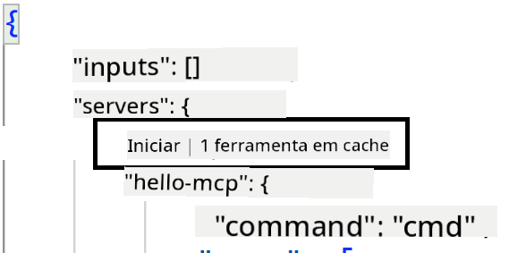

<!--
CO_OP_TRANSLATOR_METADATA:
{
  "original_hash": "54e9ffc5dba01afcb8880a9949fd1881",
  "translation_date": "2025-07-13T19:28:10+00:00",
  "source_file": "03-GettingStarted/04-vscode/README.md",
  "language_code": "pt"
}
-->
Vamos falar mais sobre como usar a interface visual nas próximas secções.

## Abordagem

Aqui está como devemos abordar isto a um nível elevado:

- Configurar um ficheiro para localizar o nosso MCP Server.
- Iniciar/Conectar ao servidor para que ele liste as suas capacidades.
- Usar essas capacidades através da interface do GitHub Copilot Chat.

Ótimo, agora que entendemos o fluxo, vamos tentar usar um MCP Server através do Visual Studio Code com um exercício.

## Exercício: Consumir um servidor

Neste exercício, vamos configurar o Visual Studio Code para encontrar o seu MCP server para que possa ser usado a partir da interface do GitHub Copilot Chat.

### -0- Passo prévio, ativar a descoberta do MCP Server

Pode ser necessário ativar a descoberta dos MCP Servers.

1. Vá a `File -> Preferences -> Settings` no Visual Studio Code.

1. Procure por "MCP" e ative `chat.mcp.discovery.enabled` no ficheiro settings.json.

### -1- Criar ficheiro de configuração

Comece por criar um ficheiro de configuração na raiz do seu projeto, vai precisar de um ficheiro chamado MCP.json e colocá-lo numa pasta chamada .vscode. Deve ficar assim:

```text
.vscode
|-- mcp.json
```

De seguida, vamos ver como adicionar uma entrada de servidor.

### -2- Configurar um servidor

Adicione o seguinte conteúdo ao *mcp.json*:

```json
{
    "inputs": [],
    "servers": {
       "hello-mcp": {
           "command": "node",
           "args": [
               "build/index.js"
           ]
       }
    }
}
```

Aqui está um exemplo simples de como iniciar um servidor escrito em Node.js, para outras plataformas indique o comando correto para iniciar o servidor usando `command` e `args`.

### -3- Iniciar o servidor

Agora que adicionou uma entrada, vamos iniciar o servidor:

1. Localize a sua entrada em *mcp.json* e certifique-se de encontrar o ícone "play":

    

1. Clique no ícone "play", deverá ver o ícone de ferramentas no GitHub Copilot Chat aumentar o número de ferramentas disponíveis. Se clicar nesse ícone de ferramentas, verá uma lista de ferramentas registadas. Pode marcar/desmarcar cada ferramenta dependendo se quer que o GitHub Copilot as use como contexto:

  

1. Para executar uma ferramenta, escreva um prompt que saiba que corresponde à descrição de uma das suas ferramentas, por exemplo um prompt como "add 22 to 1":

  

  Deve ver uma resposta a dizer 23.

## Tarefa

Tente adicionar uma entrada de servidor ao seu ficheiro *mcp.json* e certifique-se de que consegue iniciar/parar o servidor. Certifique-se também de que consegue comunicar com as ferramentas no seu servidor via interface do GitHub Copilot Chat.

## Solução

[Solução](./solution/README.md)

## Principais Conclusões

As principais conclusões deste capítulo são as seguintes:

- O Visual Studio Code é um excelente cliente que permite consumir vários MCP Servers e as suas ferramentas.
- A interface do GitHub Copilot Chat é como interage com os servidores.
- Pode pedir ao utilizador inputs como chaves API que podem ser passadas para o MCP Server ao configurar a entrada do servidor no ficheiro *mcp.json*.

## Exemplos

- [Calculadora Java](../samples/java/calculator/README.md)
- [Calculadora .Net](../../../../03-GettingStarted/samples/csharp)
- [Calculadora JavaScript](../samples/javascript/README.md)
- [Calculadora TypeScript](../samples/typescript/README.md)
- [Calculadora Python](../../../../03-GettingStarted/samples/python)

## Recursos Adicionais

- [Documentação do Visual Studio](https://code.visualstudio.com/docs/copilot/chat/mcp-servers)

## O que vem a seguir

- Seguinte: [Criar um Servidor SSE](../05-sse-server/README.md)

**Aviso Legal**:  
Este documento foi traduzido utilizando o serviço de tradução automática [Co-op Translator](https://github.com/Azure/co-op-translator). Embora nos esforcemos pela precisão, por favor tenha em conta que traduções automáticas podem conter erros ou imprecisões. O documento original na sua língua nativa deve ser considerado a fonte autorizada. Para informações críticas, recomenda-se tradução profissional humana. Não nos responsabilizamos por quaisquer mal-entendidos ou interpretações erradas decorrentes da utilização desta tradução.