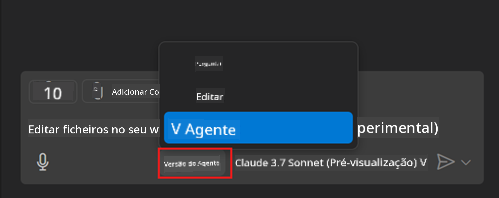
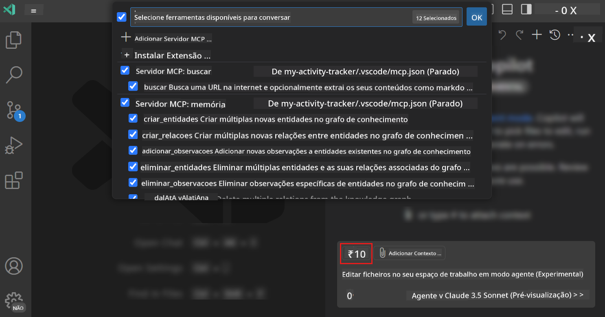
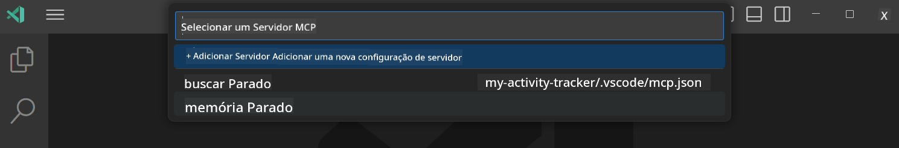

<!--
CO_OP_TRANSLATOR_METADATA:
{
  "original_hash": "8ea28e5e566edd5969337fd0b191ba3f",
  "translation_date": "2025-07-16T21:59:42+00:00",
  "source_file": "03-GettingStarted/04-vscode/README.md",
  "language_code": "pt"
}
-->
# Consumir um servidor a partir do modo Agente do GitHub Copilot

O Visual Studio Code e o GitHub Copilot podem funcionar como cliente e consumir um Servidor MCP. Perguntar-se-á por que razão quereríamos fazer isso? Bem, isso significa que todas as funcionalidades do Servidor MCP podem agora ser usadas diretamente no seu IDE. Imagine, por exemplo, adicionar o servidor MCP do GitHub, o que permitiria controlar o GitHub através de prompts em vez de digitar comandos específicos no terminal. Ou imagine qualquer outra coisa que possa melhorar a sua experiência de desenvolvimento, tudo controlado por linguagem natural. Já começa a perceber a vantagem, certo?

## Visão Geral

Esta lição explica como usar o Visual Studio Code e o modo Agente do GitHub Copilot como cliente para o seu Servidor MCP.

## Objetivos de Aprendizagem

No final desta lição, será capaz de:

- Consumir um Servidor MCP através do Visual Studio Code.
- Executar funcionalidades como ferramentas via GitHub Copilot.
- Configurar o Visual Studio Code para localizar e gerir o seu Servidor MCP.

## Utilização

Pode controlar o seu servidor MCP de duas formas diferentes:

- Interface de utilizador, verá como isso é feito mais adiante neste capítulo.
- Terminal, é possível controlar o servidor a partir do terminal usando o executável `code`:

  Para adicionar um servidor MCP ao seu perfil de utilizador, use a opção de linha de comando --add-mcp e forneça a configuração do servidor em JSON no formato {\"name\":\"server-name\",\"command\":...}.

  ```
  code --add-mcp "{\"name\":\"my-server\",\"command\": \"uvx\",\"args\": [\"mcp-server-fetch\"]}"
  ```

### Capturas de ecrã





Vamos falar mais sobre como usar a interface visual nas próximas secções.

## Abordagem

Aqui está como devemos abordar isto a um nível geral:

- Configurar um ficheiro para localizar o nosso Servidor MCP.
- Iniciar/Conectar ao servidor para que este liste as suas funcionalidades.
- Usar essas funcionalidades através da interface do GitHub Copilot Chat.

Ótimo, agora que entendemos o fluxo, vamos tentar usar um Servidor MCP através do Visual Studio Code num exercício.

## Exercício: Consumir um servidor

Neste exercício, vamos configurar o Visual Studio Code para localizar o seu servidor MCP para que possa ser usado na interface do GitHub Copilot Chat.

### -0- Passo prévio, ativar a descoberta do Servidor MCP

Pode ser necessário ativar a descoberta de Servidores MCP.

1. Vá a `File -> Preferences -> Settings` no Visual Studio Code.

1. Procure por "MCP" e ative `chat.mcp.discovery.enabled` no ficheiro settings.json.

### -1- Criar ficheiro de configuração

Comece por criar um ficheiro de configuração na raiz do seu projeto, precisará de um ficheiro chamado MCP.json e colocá-lo numa pasta chamada .vscode. Deve ficar assim:

```text
.vscode
|-- mcp.json
```

De seguida, vamos ver como adicionar uma entrada de servidor.

### -2- Configurar um servidor

Adicione o seguinte conteúdo ao *mcp.json*:

```json
{
    "inputs": [],
    "servers": {
       "hello-mcp": {
           "command": "node",
           "args": [
               "build/index.js"
           ]
       }
    }
}
```

Aqui tem um exemplo simples de como iniciar um servidor escrito em Node.js; para outras plataformas, indique o comando correto para iniciar o servidor usando `command` e `args`.

### -3- Iniciar o servidor

Agora que adicionou uma entrada, vamos iniciar o servidor:

1. Localize a sua entrada em *mcp.json* e certifique-se de que vê o ícone "play":

    

1. Clique no ícone "play", deverá ver o ícone de ferramentas no GitHub Copilot Chat aumentar o número de ferramentas disponíveis. Se clicar nesse ícone, verá uma lista das ferramentas registadas. Pode marcar/desmarcar cada ferramenta dependendo se quer que o GitHub Copilot as use como contexto:

  

1. Para executar uma ferramenta, escreva um prompt que saiba que corresponde à descrição de uma das suas ferramentas, por exemplo um prompt como "add 22 to 1":

  

  Deve ver uma resposta a dizer 23.

## Tarefa

Tente adicionar uma entrada de servidor ao seu ficheiro *mcp.json* e certifique-se de que consegue iniciar/parar o servidor. Certifique-se também de que consegue comunicar com as ferramentas do seu servidor através da interface do GitHub Copilot Chat.

## Solução

[Solution](./solution/README.md)

## Principais Conclusões

As principais conclusões deste capítulo são as seguintes:

- O Visual Studio Code é um excelente cliente que permite consumir vários Servidores MCP e as suas ferramentas.
- A interface do GitHub Copilot Chat é como interage com os servidores.
- Pode solicitar ao utilizador inputs como chaves de API que podem ser passadas para o Servidor MCP ao configurar a entrada do servidor no ficheiro *mcp.json*.

## Exemplos

- [Calculadora Java](../samples/java/calculator/README.md)
- [Calculadora .Net](../../../../03-GettingStarted/samples/csharp)
- [Calculadora JavaScript](../samples/javascript/README.md)
- [Calculadora TypeScript](../samples/typescript/README.md)
- [Calculadora Python](../../../../03-GettingStarted/samples/python)

## Recursos Adicionais

- [Documentação do Visual Studio](https://code.visualstudio.com/docs/copilot/chat/mcp-servers)

## Próximos Passos

- Seguinte: [Criar um Servidor SSE](../05-sse-server/README.md)

**Aviso Legal**:  
Este documento foi traduzido utilizando o serviço de tradução automática [Co-op Translator](https://github.com/Azure/co-op-translator). Embora nos esforcemos pela precisão, por favor tenha em conta que traduções automáticas podem conter erros ou imprecisões. O documento original na sua língua nativa deve ser considerado a fonte autorizada. Para informações críticas, recomenda-se tradução profissional humana. Não nos responsabilizamos por quaisquer mal-entendidos ou interpretações incorretas decorrentes da utilização desta tradução.