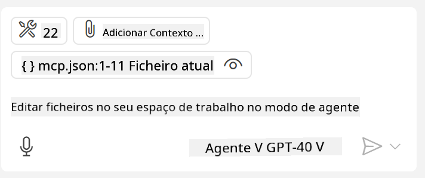
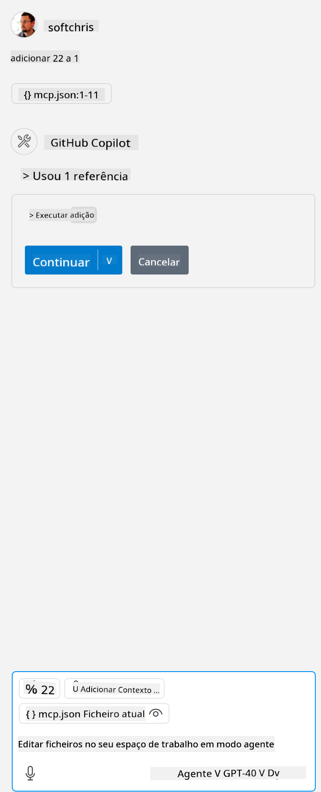

<!--
CO_OP_TRANSLATOR_METADATA:
{
  "original_hash": "c37fabfbc0dcbc9a4afb6d17e7d3be9f",
  "translation_date": "2025-05-17T11:06:21+00:00",
  "source_file": "03-GettingStarted/04-vscode/README.md",
  "language_code": "pt"
}
-->
Vamos falar mais sobre como usamos a interface visual nas próximas seções.

## Abordagem

Aqui está como precisamos abordar isso em um nível alto:

- Configurar um arquivo para encontrar nosso Servidor MCP.
- Iniciar/Conectar-se a esse servidor para listar suas capacidades.
- Usar essas capacidades através da interface de chat do GitHub Copilot.

Ótimo, agora que entendemos o fluxo, vamos tentar usar um Servidor MCP através do Visual Studio Code com um exercício.

## Exercício: Consumindo um servidor

Neste exercício, vamos configurar o Visual Studio Code para encontrar seu servidor MCP para que ele possa ser usado a partir da interface de chat do GitHub Copilot.

### -0- Passo preliminar, habilitar a descoberta de Servidores MCP

Pode ser necessário habilitar a descoberta de Servidores MCP.

1. Vá para `Arquivo -> Preferências -> Configurações` in Visual Studio Code.

1. Search for "MCP" and enable `chat.mcp.discovery.enabled` no arquivo settings.json.

### -1- Criar arquivo de configuração

Comece criando um arquivo de configuração na raiz do seu projeto, você precisará de um arquivo chamado MCP.json e colocá-lo em uma pasta chamada .vscode. Deve ficar assim:

```text
.vscode
|-- mcp.json
```

Em seguida, vamos ver como podemos adicionar uma entrada de servidor.

### -2- Configurar um servidor

Adicione o seguinte conteúdo ao *mcp.json*:

```json
{
    "inputs": [],
    "servers": {
       "hello-mcp": {
           "command": "cmd",
           "args": [
               "/c", "node", "<absolute path>\\build\\index.js"
           ]
       }
    }
}
```

Aqui está um exemplo simples de como iniciar um servidor escrito em Node.js, para outras plataformas, aponte o comando apropriado para iniciar o servidor usando `command` and `args`.

### -3- Iniciar o servidor

Agora que você adicionou uma entrada, vamos iniciar o servidor:

1. Localize sua entrada no *mcp.json* e certifique-se de encontrar o ícone de "play":

    

1. Clique no ícone de "play", você deve ver o ícone de ferramentas no chat do GitHub Copilot aumentar o número de ferramentas disponíveis. Se você clicar no ícone de ferramentas, verá uma lista de ferramentas registradas. Você pode marcar/desmarcar cada ferramenta dependendo se deseja que o GitHub Copilot as use como contexto:

  

1. Para executar uma ferramenta, digite um prompt que você sabe que corresponderá à descrição de uma de suas ferramentas, por exemplo, um prompt como "adicionar 22 a 1":

  

  Você deve ver uma resposta dizendo 23.

## Tarefa

Tente adicionar uma entrada de servidor ao seu arquivo *mcp.json* e certifique-se de que pode iniciar/parar o servidor. Certifique-se também de que pode se comunicar com as ferramentas no seu servidor via interface de chat do GitHub Copilot.

## Solução

[Solução](./solution/README.md)

## Principais Conclusões

As conclusões deste capítulo são as seguintes:

- O Visual Studio Code é um ótimo cliente que permite consumir vários Servidores MCP e suas ferramentas.
- A interface de chat do GitHub Copilot é como você interage com os servidores.
- Você pode solicitar ao usuário entradas como chaves de API que podem ser passadas para o Servidor MCP ao configurar a entrada do servidor no arquivo *mcp.json*.

## Exemplos

- [Calculadora Java](../samples/java/calculator/README.md)
- [Calculadora .Net](../../../../03-GettingStarted/samples/csharp)
- [Calculadora JavaScript](../samples/javascript/README.md)
- [Calculadora TypeScript](../samples/typescript/README.md)
- [Calculadora Python](../../../../03-GettingStarted/samples/python) 

## Recursos Adicionais

- [Documentação do Visual Studio](https://code.visualstudio.com/docs/copilot/chat/mcp-servers)

## O que vem a seguir

- Próximo: [Criando um Servidor SSE](/03-GettingStarted/05-sse-server/README.md)

**Aviso Legal**:  
Este documento foi traduzido usando o serviço de tradução por IA [Co-op Translator](https://github.com/Azure/co-op-translator). Embora nos esforcemos para garantir a precisão, esteja ciente de que traduções automáticas podem conter erros ou imprecisões. O documento original em seu idioma nativo deve ser considerado a fonte autorizada. Para informações críticas, recomenda-se a tradução humana profissional. Não nos responsabilizamos por quaisquer mal-entendidos ou interpretações incorretas decorrentes do uso desta tradução.