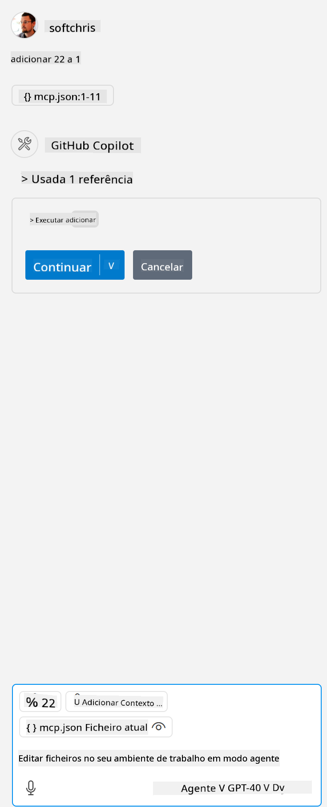

<!--
CO_OP_TRANSLATOR_METADATA:
{
  "original_hash": "5ef8f5821c1a04f7b1fc4f15098ecab8",
  "translation_date": "2025-07-13T19:41:47+00:00",
  "source_file": "03-GettingStarted/04-vscode/solution/README.md",
  "language_code": "pt"
}
-->
Isto corresponde a executar um comando como este: `node build/index.js`.

- Altere esta entrada do servidor para corresponder à localização do seu ficheiro de servidor ou ao que for necessário para iniciar o seu servidor, dependendo do runtime escolhido e da localização do servidor.

## Consumir as funcionalidades no servidor

- Clique no ícone `play`, assim que adicionar o *mcp.json* à pasta *./vscode*,

    Observe o ícone das ferramentas mudar para aumentar o número de ferramentas disponíveis. O ícone das ferramentas está localizado logo acima do campo de chat no GitHub Copilot.

## Executar uma ferramenta

- Escreva um prompt na sua janela de chat que corresponda à descrição da sua ferramenta. Por exemplo, para ativar a ferramenta `add`, escreva algo como "add 3 to 20".

    Deve ver uma ferramenta a ser apresentada acima da caixa de texto do chat, indicando que pode selecionar para executar a ferramenta, como nesta imagem:

    

    Selecionar a ferramenta deve produzir um resultado numérico a dizer "23" se o seu prompt foi como mencionámos anteriormente.

**Aviso Legal**:  
Este documento foi traduzido utilizando o serviço de tradução automática [Co-op Translator](https://github.com/Azure/co-op-translator). Embora nos esforcemos pela precisão, por favor tenha em conta que traduções automáticas podem conter erros ou imprecisões. O documento original na sua língua nativa deve ser considerado a fonte autorizada. Para informações críticas, recomenda-se tradução profissional humana. Não nos responsabilizamos por quaisquer mal-entendidos ou interpretações erradas decorrentes da utilização desta tradução.