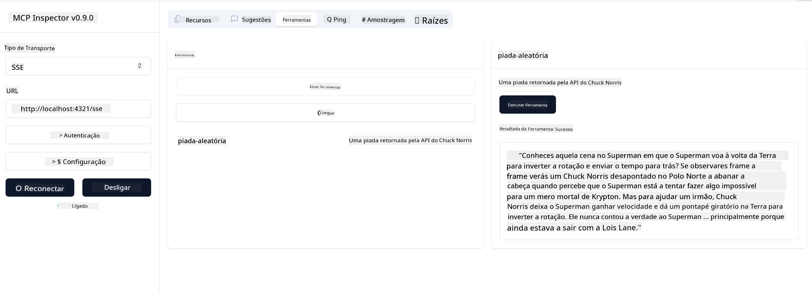

<!--
CO_OP_TRANSLATOR_METADATA:
{
  "original_hash": "d90ca3d326c48fab2ac0ebd3a9876f59",
  "translation_date": "2025-07-04T16:57:44+00:00",
  "source_file": "03-GettingStarted/05-sse-server/README.md",
  "language_code": "pt"
}
-->
Agora que sabemos um pouco mais sobre SSE, vamos construir um servidor SSE a seguir.

## Exercício: Criar um Servidor SSE

Para criar o nosso servidor, precisamos ter em mente duas coisas:

- Precisamos usar um servidor web para expor endpoints para conexão e mensagens.
- Construir o nosso servidor como normalmente fazemos com ferramentas, recursos e prompts quando usávamos stdio.

### -1- Criar uma instância do servidor

Para criar o nosso servidor, usamos os mesmos tipos que com stdio. No entanto, para o transporte, precisamos escolher SSE.

Vamos adicionar as rotas necessárias a seguir.

### -2- Adicionar rotas

Vamos adicionar rotas que tratam a conexão e as mensagens recebidas:

Vamos adicionar capacidades ao servidor a seguir.

### -3- Adicionar capacidades ao servidor

Agora que definimos tudo o que é específico do SSE, vamos adicionar capacidades ao servidor como ferramentas, prompts e recursos.

O seu código completo deve ficar assim:

Ótimo, temos um servidor a usar SSE, vamos testá-lo a seguir.

## Exercício: Depurar um Servidor SSE com o Inspector

O Inspector é uma ótima ferramenta que vimos numa lição anterior [Criar o seu primeiro servidor](/03-GettingStarted/01-first-server/README.md). Vamos ver se conseguimos usar o Inspector aqui também:

### -1- Executar o inspector

Para executar o inspector, primeiro deve ter um servidor SSE a correr, por isso vamos fazer isso a seguir:

1. Execute o servidor

1. Execute o inspector

    > ![NOTE]
    > Execute isto numa janela de terminal separada daquela onde o servidor está a correr. Note também que precisa de ajustar o comando abaixo para corresponder ao URL onde o seu servidor está a correr.

    ```sh
    npx @modelcontextprotocol/inspector --cli http://localhost:8000/sse --method tools/list
    ```

Executar o inspector é igual em todos os ambientes de execução. Note como, em vez de passar um caminho para o nosso servidor e um comando para iniciar o servidor, passamos o URL onde o servidor está a correr e especificamos também a rota `/sse`.

### -2- Experimentar a ferramenta

Ligue ao servidor selecionando SSE na lista suspensa e preencha o campo do URL onde o seu servidor está a correr, por exemplo http://localhost:4321/sse. Agora clique no botão "Connect". Como antes, selecione listar ferramentas, escolha uma ferramenta e forneça valores de entrada. Deve ver um resultado como o abaixo:



Ótimo, consegue trabalhar com o inspector, vamos ver como trabalhar com o Visual Studio Code a seguir.

## Tarefa

Tente expandir o seu servidor com mais capacidades. Veja [esta página](https://api.chucknorris.io/) para, por exemplo, adicionar uma ferramenta que chama uma API. Você decide como o servidor deve ser. Divirta-se :)

## Solução

[Solucão](./solution/README.md) Aqui está uma possível solução com código funcional.

## Principais Conclusões

As principais conclusões deste capítulo são as seguintes:

- SSE é o segundo tipo de transporte suportado, ao lado do stdio.
- Para suportar SSE, precisa de gerir conexões e mensagens recebidas usando um framework web.
- Pode usar tanto o Inspector como o Visual Studio Code para consumir um servidor SSE, tal como com servidores stdio. Note como há algumas diferenças entre stdio e SSE. Para SSE, precisa de iniciar o servidor separadamente e depois executar a sua ferramenta inspector. Para a ferramenta inspector, há também algumas diferenças, pois precisa de especificar o URL.

## Exemplos

- [Calculadora Java](../samples/java/calculator/README.md)
- [Calculadora .Net](../../../../03-GettingStarted/samples/csharp)
- [Calculadora JavaScript](../samples/javascript/README.md)
- [Calculadora TypeScript](../samples/typescript/README.md)
- [Calculadora Python](../../../../03-GettingStarted/samples/python)

## Recursos Adicionais

- [SSE](https://developer.mozilla.org/en-US/docs/Web/API/Server-sent_events)

## O que vem a seguir

- A seguir: [Streaming HTTP com MCP (HTTP Streamable)](../06-http-streaming/README.md)

**Aviso Legal**:  
Este documento foi traduzido utilizando o serviço de tradução automática [Co-op Translator](https://github.com/Azure/co-op-translator). Embora nos esforcemos pela precisão, por favor tenha em atenção que traduções automáticas podem conter erros ou imprecisões. O documento original na sua língua nativa deve ser considerado a fonte autorizada. Para informações críticas, recomenda-se tradução profissional humana. Não nos responsabilizamos por quaisquer mal-entendidos ou interpretações incorretas decorrentes da utilização desta tradução.