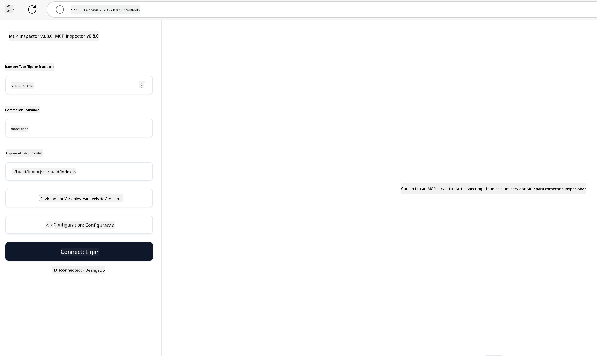

<!--
CO_OP_TRANSLATOR_METADATA:
{
  "original_hash": "4e34e34e84f013e73c7eaa6d09884756",
  "translation_date": "2025-07-13T21:59:43+00:00",
  "source_file": "03-GettingStarted/08-testing/README.md",
  "language_code": "pt"
}
-->
## Testes e Depuração

Antes de começar a testar o seu servidor MCP, é importante compreender as ferramentas disponíveis e as melhores práticas para depuração. Testar de forma eficaz garante que o seu servidor se comporta conforme esperado e ajuda a identificar e resolver problemas rapidamente. A secção seguinte descreve as abordagens recomendadas para validar a sua implementação MCP.

## Visão Geral

Esta lição aborda como escolher a abordagem de teste adequada e a ferramenta de teste mais eficaz.

## Objetivos de Aprendizagem

No final desta lição, será capaz de:

- Descrever várias abordagens para testes.
- Utilizar diferentes ferramentas para testar o seu código de forma eficaz.

## Testar Servidores MCP

O MCP fornece ferramentas para ajudar a testar e depurar os seus servidores:

- **MCP Inspector**: Uma ferramenta de linha de comandos que pode ser usada tanto como CLI como numa interface visual.
- **Testes manuais**: Pode usar uma ferramenta como o curl para executar pedidos web, mas qualquer ferramenta capaz de executar HTTP serve.
- **Testes unitários**: É possível usar o seu framework de testes preferido para testar as funcionalidades tanto do servidor como do cliente.

### Usar o MCP Inspector

Já descrevemos a utilização desta ferramenta em lições anteriores, mas vamos falar um pouco sobre ela a um nível mais geral. É uma ferramenta construída em Node.js e pode usá-la chamando o executável `npx`, que irá descarregar e instalar temporariamente a ferramenta e limpar-se-á automaticamente após executar o seu pedido.

O [MCP Inspector](https://github.com/modelcontextprotocol/inspector) ajuda a:

- **Descobrir Capacidades do Servidor**: Detectar automaticamente recursos, ferramentas e prompts disponíveis
- **Testar a Execução de Ferramentas**: Experimentar diferentes parâmetros e ver as respostas em tempo real
- **Visualizar Metadados do Servidor**: Examinar informações do servidor, esquemas e configurações

Uma execução típica da ferramenta é assim:

```bash
npx @modelcontextprotocol/inspector node build/index.js
```

O comando acima inicia um MCP e a sua interface visual, lançando uma interface web local no seu navegador. Pode esperar ver um painel que mostra os seus servidores MCP registados, as ferramentas, recursos e prompts disponíveis. A interface permite testar interativamente a execução das ferramentas, inspecionar os metadados do servidor e ver respostas em tempo real, facilitando a validação e depuração das suas implementações MCP.

Aqui está um exemplo de como pode parecer: 

Também pode executar esta ferramenta em modo CLI, adicionando o atributo `--cli`. Aqui está um exemplo de execução da ferramenta em modo "CLI" que lista todas as ferramentas no servidor:

```sh
npx @modelcontextprotocol/inspector --cli node build/index.js --method tools/list
```

### Testes Manuais

Para além de usar a ferramenta inspector para testar as capacidades do servidor, outra abordagem semelhante é usar um cliente capaz de fazer pedidos HTTP, como por exemplo o curl.

Com o curl, pode testar servidores MCP diretamente usando pedidos HTTP:

```bash
# Example: Test server metadata
curl http://localhost:3000/v1/metadata

# Example: Execute a tool
curl -X POST http://localhost:3000/v1/tools/execute \
  -H "Content-Type: application/json" \
  -d '{"name": "calculator", "parameters": {"expression": "2+2"}}'
```

Como pode ver no exemplo acima com o curl, usa um pedido POST para invocar uma ferramenta usando um payload que consiste no nome da ferramenta e nos seus parâmetros. Use a abordagem que melhor se adequar a si. Ferramentas CLI tendem a ser mais rápidas de usar e permitem ser automatizadas, o que pode ser útil num ambiente CI/CD.

### Testes Unitários

Crie testes unitários para as suas ferramentas e recursos para garantir que funcionam conforme esperado. Aqui está um exemplo de código de teste.

```python
import pytest

from mcp.server.fastmcp import FastMCP
from mcp.shared.memory import (
    create_connected_server_and_client_session as create_session,
)

# Mark the whole module for async tests
pytestmark = pytest.mark.anyio


async def test_list_tools_cursor_parameter():
    """Test that the cursor parameter is accepted for list_tools.

    Note: FastMCP doesn't currently implement pagination, so this test
    only verifies that the cursor parameter is accepted by the client.
    """

 server = FastMCP("test")

    # Create a couple of test tools
    @server.tool(name="test_tool_1")
    async def test_tool_1() -> str:
        """First test tool"""
        return "Result 1"

    @server.tool(name="test_tool_2")
    async def test_tool_2() -> str:
        """Second test tool"""
        return "Result 2"

    async with create_session(server._mcp_server) as client_session:
        # Test without cursor parameter (omitted)
        result1 = await client_session.list_tools()
        assert len(result1.tools) == 2

        # Test with cursor=None
        result2 = await client_session.list_tools(cursor=None)
        assert len(result2.tools) == 2

        # Test with cursor as string
        result3 = await client_session.list_tools(cursor="some_cursor_value")
        assert len(result3.tools) == 2

        # Test with empty string cursor
        result4 = await client_session.list_tools(cursor="")
        assert len(result4.tools) == 2
    
```

O código acima faz o seguinte:

- Utiliza o framework pytest, que permite criar testes como funções e usar declarações assert.
- Cria um servidor MCP com duas ferramentas diferentes.
- Usa a declaração `assert` para verificar se certas condições são cumpridas.

Consulte o [ficheiro completo aqui](https://github.com/modelcontextprotocol/python-sdk/blob/main/tests/client/test_list_methods_cursor.py)

Com base no ficheiro acima, pode testar o seu próprio servidor para garantir que as capacidades são criadas conforme esperado.

Todos os principais SDKs têm secções de testes semelhantes, pelo que pode adaptar ao runtime que escolher.

## Exemplos

- [Java Calculator](../samples/java/calculator/README.md)
- [.Net Calculator](../../../../03-GettingStarted/samples/csharp)
- [JavaScript Calculator](../samples/javascript/README.md)
- [TypeScript Calculator](../samples/typescript/README.md)
- [Python Calculator](../../../../03-GettingStarted/samples/python)

## Recursos Adicionais

- [Python SDK](https://github.com/modelcontextprotocol/python-sdk)

## Próximos Passos

- Seguinte: [Deployment](../09-deployment/README.md)

**Aviso Legal**:  
Este documento foi traduzido utilizando o serviço de tradução automática [Co-op Translator](https://github.com/Azure/co-op-translator). Embora nos esforcemos pela precisão, por favor tenha em conta que traduções automáticas podem conter erros ou imprecisões. O documento original na sua língua nativa deve ser considerado a fonte autorizada. Para informações críticas, recomenda-se tradução profissional humana. Não nos responsabilizamos por quaisquer mal-entendidos ou interpretações erradas decorrentes da utilização desta tradução.