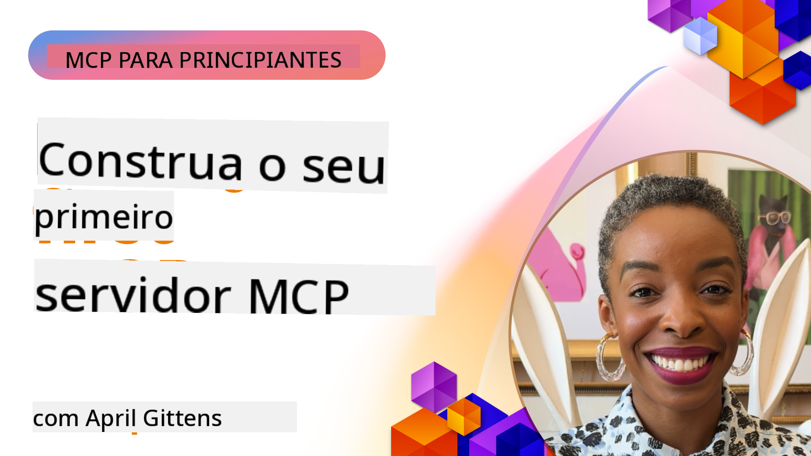

<!--
CO_OP_TRANSLATOR_METADATA:
{
  "original_hash": "1197b6dbde36773e04a5ae826557fdb9",
  "translation_date": "2025-08-26T17:36:26+00:00",
  "source_file": "03-GettingStarted/README.md",
  "language_code": "pt"
}
-->
## Introdução  

_(Clique na imagem acima para assistir ao vídeo desta lição)_

Esta secção consiste em várias lições:

- **1 O seu primeiro servidor**, nesta primeira lição, irá aprender a criar o seu primeiro servidor e inspecioná-lo com a ferramenta de inspeção, uma forma valiosa de testar e depurar o seu servidor, [para a lição](01-first-server/README.md)

- **2 Cliente**, nesta lição, irá aprender a escrever um cliente que pode conectar-se ao seu servidor, [para a lição](02-client/README.md)

- **3 Cliente com LLM**, uma forma ainda melhor de escrever um cliente é adicionando um LLM para que ele possa "negociar" com o seu servidor sobre o que fazer, [para a lição](03-llm-client/README.md)

- **4 Consumir um servidor no modo GitHub Copilot Agent no Visual Studio Code**. Aqui, exploramos como executar o nosso Servidor MCP dentro do Visual Studio Code, [para a lição](04-vscode/README.md)

- **5 Servidor com transporte stdio**. O transporte stdio é o padrão recomendado para comunicação entre servidor e cliente MCP na especificação atual, proporcionando comunicação segura baseada em subprocessos, [para a lição](05-stdio-server/README.md)

- **6 Streaming HTTP com MCP (HTTP Streamable)**. Aprenda sobre streaming HTTP moderno, notificações de progresso e como implementar servidores e clientes MCP escaláveis e em tempo real usando HTTP Streamable, [para a lição](06-http-streaming/README.md)

- **7 Utilizar o AI Toolkit para VSCode** para consumir e testar os seus Clientes e Servidores MCP, [para a lição](07-aitk/README.md)

- **8 Testes**. Aqui iremos focar especialmente em como podemos testar o nosso servidor e cliente de diferentes formas, [para a lição](08-testing/README.md)

- **9 Implementação**. Este capítulo irá explorar diferentes formas de implementar as suas soluções MCP, [para a lição](09-deployment/README.md)

O Model Context Protocol (MCP) é um protocolo aberto que padroniza como as aplicações fornecem contexto aos LLMs. Pense no MCP como uma porta USB-C para aplicações de IA - ele fornece uma forma padronizada de conectar modelos de IA a diferentes fontes de dados e ferramentas.

## Objetivos de Aprendizagem

Ao final desta lição, será capaz de:

- Configurar ambientes de desenvolvimento para MCP em C#, Java, Python, TypeScript e JavaScript
- Construir e implementar servidores MCP básicos com funcionalidades personalizadas (recursos, prompts e ferramentas)
- Criar aplicações anfitriãs que se conectam a servidores MCP
- Testar e depurar implementações MCP
- Compreender desafios comuns de configuração e suas soluções
- Conectar as suas implementações MCP a serviços populares de LLM

## Configurar o Seu Ambiente MCP

Antes de começar a trabalhar com MCP, é importante preparar o seu ambiente de desenvolvimento e compreender o fluxo de trabalho básico. Esta secção irá guiá-lo pelos passos iniciais de configuração para garantir um início tranquilo com MCP.

### Pré-requisitos

Antes de mergulhar no desenvolvimento MCP, certifique-se de que tem:

- **Ambiente de Desenvolvimento**: Para a linguagem escolhida (C#, Java, Python, TypeScript ou JavaScript)
- **IDE/Editor**: Visual Studio, Visual Studio Code, IntelliJ, Eclipse, PyCharm ou qualquer editor de código moderno
- **Gestores de Pacotes**: NuGet, Maven/Gradle, pip ou npm/yarn
- **Chaves de API**: Para quaisquer serviços de IA que planeia utilizar nas suas aplicações anfitriãs

### SDKs Oficiais

Nos capítulos seguintes, verá soluções construídas usando Python, TypeScript, Java e .NET. Aqui estão todos os SDKs oficialmente suportados.

O MCP fornece SDKs oficiais para várias linguagens:
- [C# SDK](https://github.com/modelcontextprotocol/csharp-sdk) - Mantido em colaboração com a Microsoft
- [Java SDK](https://github.com/modelcontextprotocol/java-sdk) - Mantido em colaboração com Spring AI
- [TypeScript SDK](https://github.com/modelcontextprotocol/typescript-sdk) - Implementação oficial em TypeScript
- [Python SDK](https://github.com/modelcontextprotocol/python-sdk) - Implementação oficial em Python
- [Kotlin SDK](https://github.com/modelcontextprotocol/kotlin-sdk) - Implementação oficial em Kotlin
- [Swift SDK](https://github.com/modelcontextprotocol/swift-sdk) - Mantido em colaboração com Loopwork AI
- [Rust SDK](https://github.com/modelcontextprotocol/rust-sdk) - Implementação oficial em Rust

## Pontos-Chave

- Configurar um ambiente de desenvolvimento MCP é simples com SDKs específicos para cada linguagem
- Construir servidores MCP envolve criar e registar ferramentas com esquemas claros
- Clientes MCP conectam-se a servidores e modelos para aproveitar capacidades ampliadas
- Testar e depurar são essenciais para implementações MCP confiáveis
- As opções de implementação variam desde desenvolvimento local até soluções baseadas na nuvem

## Prática

Temos um conjunto de exemplos que complementa os exercícios que verá em todos os capítulos desta secção. Além disso, cada capítulo também tem os seus próprios exercícios e tarefas.

- [Calculadora em Java](./samples/java/calculator/README.md)
- [Calculadora em .Net](../../../03-GettingStarted/samples/csharp)
- [Calculadora em JavaScript](./samples/javascript/README.md)
- [Calculadora em TypeScript](./samples/typescript/README.md)
- [Calculadora em Python](../../../03-GettingStarted/samples/python)

## Recursos Adicionais

- [Crie Agentes usando Model Context Protocol no Azure](https://learn.microsoft.com/azure/developer/ai/intro-agents-mcp)
- [MCP remoto com Azure Container Apps (Node.js/TypeScript/JavaScript)](https://learn.microsoft.com/samples/azure-samples/mcp-container-ts/mcp-container-ts/)
- [Agente MCP OpenAI em .NET](https://learn.microsoft.com/samples/azure-samples/openai-mcp-agent-dotnet/openai-mcp-agent-dotnet/)

## O que vem a seguir

Próximo: [Criar o seu primeiro Servidor MCP](01-first-server/README.md)

---

**Aviso Legal**:  
Este documento foi traduzido utilizando o serviço de tradução por IA [Co-op Translator](https://github.com/Azure/co-op-translator). Embora nos esforcemos para garantir a precisão, é importante ter em conta que traduções automáticas podem conter erros ou imprecisões. O documento original na sua língua nativa deve ser considerado a fonte autoritária. Para informações críticas, recomenda-se a tradução profissional realizada por humanos. Não nos responsabilizamos por quaisquer mal-entendidos ou interpretações incorretas decorrentes da utilização desta tradução.