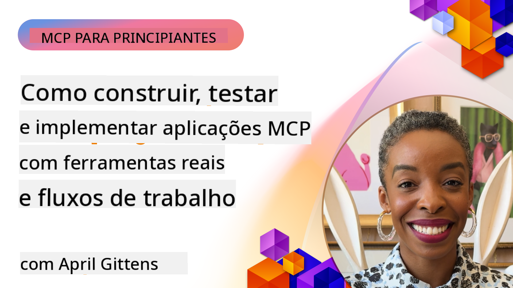

<!--
CO_OP_TRANSLATOR_METADATA:
{
  "original_hash": "8a20383b884e55ca6289bab35796448c",
  "translation_date": "2025-07-29T00:37:15+00:00",
  "source_file": "04-PracticalImplementation/README.md",
  "language_code": "pt"
}
-->
# Implementação Prática

[](https://youtu.be/vCN9-mKBDfQ)

_(Clique na imagem acima para assistir ao vídeo desta lição)_

A implementação prática é onde o poder do Model Context Protocol (MCP) se torna palpável. Embora compreender a teoria e a arquitetura por trás do MCP seja importante, o verdadeiro valor surge quando aplicamos esses conceitos para construir, testar e implementar soluções que resolvem problemas do mundo real. Este capítulo faz a ponte entre o conhecimento conceitual e o desenvolvimento prático, guiando-o no processo de dar vida a aplicações baseadas em MCP.

Seja a desenvolver assistentes inteligentes, integrar IA em fluxos de trabalho empresariais ou criar ferramentas personalizadas para processamento de dados, o MCP oferece uma base flexível. O seu design independente de linguagem e os SDKs oficiais para linguagens de programação populares tornam-no acessível a uma ampla gama de programadores. Ao aproveitar esses SDKs, pode prototipar rapidamente, iterar e escalar as suas soluções em diferentes plataformas e ambientes.

Nas seções seguintes, encontrará exemplos práticos, códigos de exemplo e estratégias de implementação que demonstram como aplicar o MCP em C#, Java, TypeScript, JavaScript e Python. Também aprenderá a depurar e testar servidores MCP, gerir APIs e implementar soluções na cloud usando o Azure. Esses recursos práticos foram projetados para acelerar o seu aprendizado e ajudá-lo a construir aplicações MCP robustas e prontas para produção com confiança.

## Visão Geral

Esta lição foca-se nos aspetos práticos da implementação do MCP em várias linguagens de programação. Exploraremos como usar os SDKs do MCP em C#, Java, TypeScript, JavaScript e Python para construir aplicações robustas, depurar e testar servidores MCP, e criar recursos, prompts e ferramentas reutilizáveis.

## Objetivos de Aprendizagem

Ao final desta lição, será capaz de:

- Implementar soluções MCP usando os SDKs oficiais em várias linguagens de programação
- Depurar e testar servidores MCP de forma sistemática
- Criar e utilizar funcionalidades de servidor (Recursos, Prompts e Ferramentas)
- Projetar fluxos de trabalho MCP eficazes para tarefas complexas
- Otimizar implementações MCP para desempenho e fiabilidade

## Recursos Oficiais dos SDKs

O Model Context Protocol oferece SDKs oficiais para várias linguagens:

- [C# SDK](https://github.com/modelcontextprotocol/csharp-sdk)
- [Java SDK](https://github.com/modelcontextprotocol/java-sdk) 
- [TypeScript SDK](https://github.com/modelcontextprotocol/typescript-sdk)
- [Python SDK](https://github.com/modelcontextprotocol/python-sdk)
- [Kotlin SDK](https://github.com/modelcontextprotocol/kotlin-sdk)

## Trabalhando com os SDKs do MCP

Esta seção fornece exemplos práticos de implementação do MCP em várias linguagens de programação. Pode encontrar códigos de exemplo no diretório `samples`, organizados por linguagem.

### Exemplos Disponíveis

O repositório inclui [implementações de exemplo](../../../04-PracticalImplementation/samples) nas seguintes linguagens:

- [C#](./samples/csharp/README.md)
- [Java](./samples/java/containerapp/README.md)
- [TypeScript](./samples/typescript/README.md)
- [JavaScript](./samples/javascript/README.md)
- [Python](./samples/python/README.md)

Cada exemplo demonstra conceitos-chave do MCP e padrões de implementação para a linguagem e ecossistema específicos.

## Funcionalidades Principais do Servidor

Os servidores MCP podem implementar qualquer combinação destas funcionalidades:

### Recursos

Os recursos fornecem contexto e dados para o utilizador ou modelo de IA utilizar:

- Repositórios de documentos
- Bases de conhecimento
- Fontes de dados estruturados
- Sistemas de ficheiros

### Prompts

Os prompts são mensagens e fluxos de trabalho modelados para os utilizadores:

- Modelos de conversação pré-definidos
- Padrões de interação guiada
- Estruturas de diálogo especializadas

### Ferramentas

As ferramentas são funções que o modelo de IA pode executar:

- Utilitários de processamento de dados
- Integrações com APIs externas
- Capacidades computacionais
- Funcionalidades de pesquisa

## Implementações de Exemplo: Implementação em C#

O repositório oficial do SDK C# contém várias implementações de exemplo que demonstram diferentes aspetos do MCP:

- **Cliente MCP Básico**: Exemplo simples que mostra como criar um cliente MCP e chamar ferramentas
- **Servidor MCP Básico**: Implementação mínima de servidor com registo básico de ferramentas
- **Servidor MCP Avançado**: Servidor completo com registo de ferramentas, autenticação e tratamento de erros
- **Integração com ASP.NET**: Exemplos que demonstram integração com ASP.NET Core
- **Padrões de Implementação de Ferramentas**: Vários padrões para implementar ferramentas com diferentes níveis de complexidade

O SDK C# do MCP está em pré-visualização e as APIs podem sofrer alterações. Atualizaremos continuamente este blog à medida que o SDK evoluir.

### Funcionalidades Principais

- [C# MCP Nuget ModelContextProtocol](https://www.nuget.org/packages/ModelContextProtocol)
- Construindo o seu [primeiro servidor MCP](https://devblogs.microsoft.com/dotnet/build-a-model-context-protocol-mcp-server-in-csharp/).

Para exemplos completos de implementação em C#, visite o [repositório oficial de exemplos do SDK C#](https://github.com/modelcontextprotocol/csharp-sdk).

## Implementação de Exemplo: Implementação em Java

O SDK Java oferece opções robustas de implementação do MCP com funcionalidades de nível empresarial.

### Funcionalidades Principais

- Integração com o Spring Framework
- Segurança de tipos forte
- Suporte a programação reativa
- Tratamento abrangente de erros

Para um exemplo completo de implementação em Java, consulte [exemplo em Java](samples/java/containerapp/README.md) no diretório de exemplos.

## Implementação de Exemplo: Implementação em JavaScript

O SDK JavaScript fornece uma abordagem leve e flexível para a implementação do MCP.

### Funcionalidades Principais

- Suporte para Node.js e navegador
- API baseada em Promises
- Integração fácil com Express e outros frameworks
- Suporte a WebSocket para streaming

Para um exemplo completo de implementação em JavaScript, consulte [exemplo em JavaScript](samples/javascript/README.md) no diretório de exemplos.

## Implementação de Exemplo: Implementação em Python

O SDK Python oferece uma abordagem Pythonic para a implementação do MCP com excelentes integrações a frameworks de ML.

### Funcionalidades Principais

- Suporte a Async/await com asyncio
- Integração com FastAPI
- Registo simples de ferramentas
- Integração nativa com bibliotecas populares de ML

Para um exemplo completo de implementação em Python, consulte [exemplo em Python](samples/python/README.md) no diretório de exemplos.

## Gestão de APIs

O Azure API Management é uma excelente solução para proteger servidores MCP. A ideia é colocar uma instância do Azure API Management à frente do seu servidor MCP e deixá-la gerir funcionalidades que provavelmente irá querer, como:

- Limitação de taxa
- Gestão de tokens
- Monitorização
- Balanceamento de carga
- Segurança

### Exemplo no Azure

Aqui está um exemplo no Azure que faz exatamente isso, ou seja, [criar um servidor MCP e protegê-lo com o Azure API Management](https://github.com/Azure-Samples/remote-mcp-apim-functions-python).

Veja como o fluxo de autorização ocorre na imagem abaixo:


Na imagem acima, ocorre o seguinte:

- A autenticação/autorização é realizada usando o Microsoft Entra.
- O Azure API Management atua como um gateway e utiliza políticas para direcionar e gerir o tráfego.
- O Azure Monitor regista todas as solicitações para análise posterior.

#### Fluxo de Autorização

Vamos analisar o fluxo de autorização em mais detalhe:


#### Especificação de Autorização do MCP

Saiba mais sobre a [especificação de autorização do MCP](https://modelcontextprotocol.io/specification/2025-03-26/basic/authorization#2-10-third-party-authorization-flow).

## Implementar Servidor MCP Remoto no Azure

Vamos ver se conseguimos implementar o exemplo mencionado anteriormente:

1. Clone o repositório

    ```bash
    git clone https://github.com/Azure-Samples/remote-mcp-apim-functions-python.git
    cd remote-mcp-apim-functions-python
    ```

1. Registe o fornecedor de recursos `Microsoft.App`.

   - Se estiver a usar o Azure CLI, execute `az provider register --namespace Microsoft.App --wait`.
   - Se estiver a usar o Azure PowerShell, execute `Register-AzResourceProvider -ProviderNamespace Microsoft.App`. Depois, execute `(Get-AzResourceProvider -ProviderNamespace Microsoft.App).RegistrationState` após algum tempo para verificar se o registo foi concluído.

1. Execute este comando [azd](https://aka.ms/azd) para provisionar o serviço de gestão de API, a função app (com código) e todos os outros recursos necessários no Azure:

    ```shell
    azd up
    ```

    Este comando deve implementar todos os recursos na cloud no Azure.

### Testar o seu servidor com o MCP Inspector

1. Numa **nova janela de terminal**, instale e execute o MCP Inspector:

    ```shell
    npx @modelcontextprotocol/inspector
    ```

    Deverá ver uma interface semelhante a:

    

1. CTRL clique para carregar a aplicação web do MCP Inspector a partir do URL exibido pela aplicação (por exemplo, [http://127.0.0.1:6274/#resources](http://127.0.0.1:6274/#resources)).
1. Defina o tipo de transporte como `SSE`.
1. Defina o URL para o seu endpoint SSE do API Management em execução exibido após `azd up` e **Conectar**:

    ```shell
    https://<apim-servicename-from-azd-output>.azure-api.net/mcp/sse
    ```

1. **Listar Ferramentas**. Clique numa ferramenta e **Executar Ferramenta**.

Se todos os passos tiverem funcionado, deverá agora estar conectado ao servidor MCP e ter conseguido chamar uma ferramenta.

## Servidores MCP para Azure

[Remote-mcp-functions](https://github.com/Azure-Samples/remote-mcp-functions-dotnet): Este conjunto de repositórios é um modelo de início rápido para construir e implementar servidores MCP remotos personalizados usando Azure Functions com Python, C# .NET ou Node/TypeScript.

Os exemplos fornecem uma solução completa que permite aos programadores:

- Construir e executar localmente: Desenvolver e depurar um servidor MCP numa máquina local
- Implementar no Azure: Implementar facilmente na cloud com um simples comando `azd up`
- Conectar a partir de clientes: Conectar ao servidor MCP a partir de vários clientes, incluindo o modo agente do Copilot no VS Code e a ferramenta MCP Inspector

### Funcionalidades Principais

- Segurança por design: O servidor MCP é protegido usando chaves e HTTPS
- Opções de autenticação: Suporta OAuth usando autenticação integrada e/ou Gestão de API
- Isolamento de rede: Permite isolamento de rede usando Redes Virtuais do Azure (VNET)
- Arquitetura serverless: Aproveita o Azure Functions para execução escalável e orientada por eventos
- Desenvolvimento local: Suporte abrangente para desenvolvimento e depuração local
- Implementação simples: Processo de implementação simplificado para o Azure

O repositório inclui todos os ficheiros de configuração necessários, código-fonte e definições de infraestrutura para começar rapidamente com uma implementação de servidor MCP pronta para produção.

- [Azure Remote MCP Functions Python](https://github.com/Azure-Samples/remote-mcp-functions-python) - Implementação de exemplo do MCP usando Azure Functions com Python

- [Azure Remote MCP Functions .NET](https://github.com/Azure-Samples/remote-mcp-functions-dotnet) - Implementação de exemplo do MCP usando Azure Functions com C# .NET

- [Azure Remote MCP Functions Node/Typescript](https://github.com/Azure-Samples/remote-mcp-functions-typescript) - Implementação de exemplo do MCP usando Azure Functions com Node/TypeScript.

## Principais Conclusões

- Os SDKs do MCP fornecem ferramentas específicas para implementar soluções MCP robustas
- O processo de depuração e teste é crítico para aplicações MCP fiáveis
- Modelos de prompts reutilizáveis permitem interações consistentes com IA
- Fluxos de trabalho bem projetados podem orquestrar tarefas complexas usando várias ferramentas
- Implementar soluções MCP requer consideração de segurança, desempenho e tratamento de erros

## Exercício

Projete um fluxo de trabalho MCP prático que resolva um problema real na sua área:

1. Identifique 3-4 ferramentas que seriam úteis para resolver este problema.
2. Crie um diagrama de fluxo mostrando como essas ferramentas interagem.
3. Implemente uma versão básica de uma das ferramentas usando a sua linguagem preferida.
4. Crie um modelo de prompt que ajude o modelo a usar eficazmente a sua ferramenta.

## Recursos Adicionais

---

Próximo: [Tópicos Avançados](../05-AdvancedTopics/README.md)

**Aviso Legal**:  
Este documento foi traduzido utilizando o serviço de tradução por IA [Co-op Translator](https://github.com/Azure/co-op-translator). Embora nos esforcemos para garantir a precisão, esteja ciente de que traduções automáticas podem conter erros ou imprecisões. O documento original na sua língua nativa deve ser considerado a fonte autoritária. Para informações críticas, recomenda-se a tradução profissional realizada por humanos. Não nos responsabilizamos por quaisquer mal-entendidos ou interpretações incorretas decorrentes do uso desta tradução.