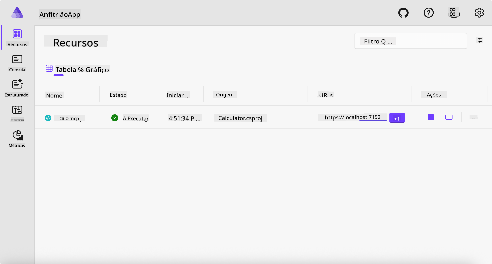
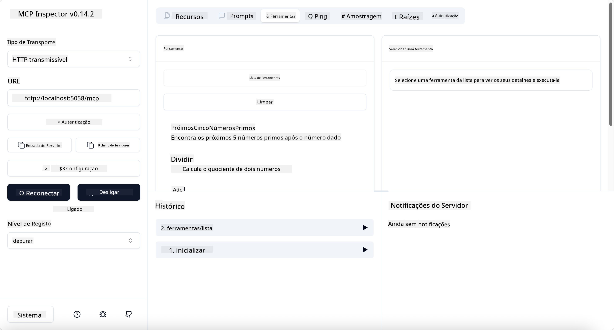
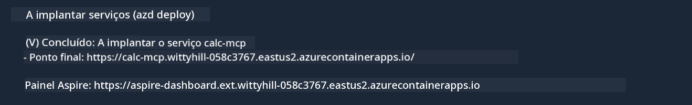

<!--
CO_OP_TRANSLATOR_METADATA:
{
  "original_hash": "0bc7bd48f55f1565f1d95ccb2c16f728",
  "translation_date": "2025-07-13T23:06:11+00:00",
  "source_file": "04-PracticalImplementation/samples/csharp/README.md",
  "language_code": "pt"
}
-->
# Exemplo

O exemplo anterior mostra como usar um projeto local .NET com o tipo `stdio`. E como executar o servidor localmente num contentor. Esta é uma boa solução em muitas situações. No entanto, pode ser útil ter o servidor a correr remotamente, como num ambiente cloud. É aqui que o tipo `http` entra em jogo.

Ao olhar para a solução na pasta `04-PracticalImplementation`, pode parecer muito mais complexa do que a anterior. Mas, na realidade, não é. Se olhar com atenção para o projeto `src/Calculator`, verá que é praticamente o mesmo código do exemplo anterior. A única diferença é que estamos a usar uma biblioteca diferente, `ModelContextProtocol.AspNetCore`, para tratar os pedidos HTTP. E alterámos o método `IsPrime` para o tornar privado, só para mostrar que pode ter métodos privados no seu código. O resto do código é igual ao anterior.

Os outros projetos são do [.NET Aspire](https://learn.microsoft.com/dotnet/aspire/get-started/aspire-overview). Ter o .NET Aspire na solução melhora a experiência do programador durante o desenvolvimento e testes, além de ajudar na observabilidade. Não é obrigatório para correr o servidor, mas é uma boa prática tê-lo na sua solução.

## Iniciar o servidor localmente

1. No VS Code (com a extensão C# DevKit), navegue até ao diretório `04-PracticalImplementation/samples/csharp`.
1. Execute o seguinte comando para iniciar o servidor:

   ```bash
    dotnet watch run --project ./src/AppHost
   ```

1. Quando um navegador abrir o dashboard do .NET Aspire, note a URL `http`. Deve ser algo como `http://localhost:5058/`.

   

## Testar Streamable HTTP com o MCP Inspector

Se tiver o Node.js 22.7.5 ou superior, pode usar o MCP Inspector para testar o seu servidor.

Inicie o servidor e execute o seguinte comando num terminal:

```bash
npx @modelcontextprotocol/inspector http://localhost:5058
```



- Selecione `Streamable HTTP` como tipo de Transporte.
- No campo Url, insira a URL do servidor anotada anteriormente, acrescentando `/mcp`. Deve ser `http` (não `https`), algo como `http://localhost:5058/mcp`.
- selecione o botão Connect.

Uma vantagem do Inspector é que oferece uma boa visibilidade do que está a acontecer.

- Experimente listar as ferramentas disponíveis
- Experimente algumas delas, deve funcionar como antes.

## Testar o MCP Server com GitHub Copilot Chat no VS Code

Para usar o transporte Streamable HTTP com o GitHub Copilot Chat, altere a configuração do servidor `calc-mcp` criado anteriormente para ficar assim:

```jsonc
// .vscode/mcp.json
{
  "servers": {
    "calc-mcp": {
      "type": "http",
      "url": "http://localhost:5058/mcp"
    }
  }
}
```

Faça alguns testes:

- Peça "3 números primos depois de 6780". Note como o Copilot vai usar as novas ferramentas `NextFivePrimeNumbers` e só devolver os primeiros 3 números primos.
- Peça "7 números primos depois de 111", para ver o que acontece.
- Peça "O John tem 24 rebuçados e quer distribuí-los pelos seus 3 filhos. Quantos rebuçados tem cada filho?", para ver o que acontece.

## Fazer deploy do servidor para o Azure

Vamos fazer deploy do servidor para o Azure para que mais pessoas possam usá-lo.

Num terminal, navegue até à pasta `04-PracticalImplementation/samples/csharp` e execute o seguinte comando:

```bash
azd up
```

Quando o deploy terminar, deverá ver uma mensagem como esta:



Copie a URL e use-a no MCP Inspector e no GitHub Copilot Chat.

```jsonc
// .vscode/mcp.json
{
  "servers": {
    "calc-mcp": {
      "type": "http",
      "url": "https://calc-mcp.gentleriver-3977fbcf.australiaeast.azurecontainerapps.io/mcp"
    }
  }
}
```

## E agora?

Experimentámos diferentes tipos de transporte e ferramentas de teste. Também fizemos deploy do seu servidor MCP para o Azure. Mas e se o nosso servidor precisar de aceder a recursos privados? Por exemplo, uma base de dados ou uma API privada? No próximo capítulo, veremos como podemos melhorar a segurança do nosso servidor.

**Aviso Legal**:  
Este documento foi traduzido utilizando o serviço de tradução automática [Co-op Translator](https://github.com/Azure/co-op-translator). Embora nos esforcemos pela precisão, por favor tenha em conta que traduções automáticas podem conter erros ou imprecisões. O documento original na sua língua nativa deve ser considerado a fonte autorizada. Para informações críticas, recomenda-se tradução profissional humana. Não nos responsabilizamos por quaisquer mal-entendidos ou interpretações erradas decorrentes da utilização desta tradução.