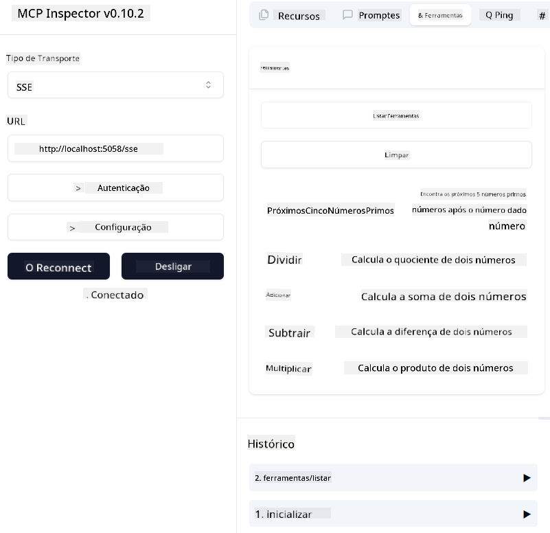
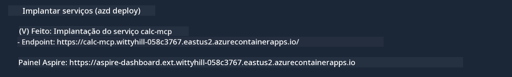

<!--
CO_OP_TRANSLATOR_METADATA:
{
  "original_hash": "5020a3e1a1c7f30c00f9e37f1fa208e3",
  "translation_date": "2025-05-17T14:07:47+00:00",
  "source_file": "04-PracticalImplementation/samples/csharp/README.md",
  "language_code": "pt"
}
-->
# Exemplo

O exemplo anterior mostra como usar um projeto local .NET com o tipo `sdio`. E como executar o servidor localmente em um contêiner. Esta é uma boa solução em muitas situações. No entanto, pode ser útil ter o servidor rodando remotamente, como em um ambiente de nuvem. É aí que entra o tipo `http`.

Observando a solução na pasta `04-PracticalImplementation`, pode parecer muito mais complexa do que a anterior. Mas, na realidade, não é. Se você olhar atentamente para o projeto `src/mcpserver/mcpserver.csproj`, verá que é basicamente o mesmo código do exemplo anterior. A única diferença é que estamos usando uma biblioteca diferente `ModelContextProtocol.AspNetCore` para lidar com as requisições HTTP. E mudamos o método `IsPrime` para torná-lo privado, apenas para mostrar que você pode ter métodos privados no seu código. O restante do código é o mesmo de antes.

Os outros projetos são do [.NET Aspire](https://learn.microsoft.com/dotnet/aspire/get-started/aspire-overview). Ter o .NET Aspire na solução melhorará a experiência do desenvolvedor durante o desenvolvimento e testes e ajudará com a observabilidade. Não é necessário para executar o servidor, mas é uma boa prática tê-lo na sua solução.

## Iniciar o servidor localmente

1. No VS Code (com a extensão C# DevKit), abra a solução `04-PracticalImplementation\samples\csharp\src\Calculator-chap4.sln`.
2. Pressione `F5` para iniciar o servidor. Deve abrir um navegador com o painel do .NET Aspire.

ou

1. A partir de um terminal, navegue até a pasta `04-PracticalImplementation\samples\csharp\src`
2. Execute o seguinte comando para iniciar o servidor:
   ```bash
    dotnet run --project .\AppHost
   ```

3. No Dashboard, observe a URL `http`. Deve ser algo como `http://localhost:5058/`.

## Test `SSE` com o ModelContext Protocol Inspector

Se você tiver Node.js 22.7.5 ou superior, pode usar o ModelContext Protocol Inspector para testar seu servidor.

Inicie o servidor e execute o seguinte comando em um terminal:

```bash
npx @modelcontextprotocol/inspector@latest
```



- Selecione o `SSE` as the Transport type. SSE stand for Server-Sent Events. 
- In the Url field, enter the URL of the server noted earlier,and append `/sse`. Deve ser `http` (não `https`) something like `http://localhost:5058/sse`.
- select the Connect button.

A nice thing about the Inspector is that it provide a nice visibility on what is happening.

- Try listing the availables tools
- Try some of them, it should works just like before.


## Test `SSE` with Github Copilot Chat in VS Code

To use the `SSE` transport with Github Copilot Chat, change the configuration of the `mcp-calc` servidor criado anteriormente para parecer assim:

```json
"mcp-calc": {
    "type": "sse",
    "url": "http://localhost:5058/sse"
}
```

Faça alguns testes:
- Peça os 3 números primos após 6780. Note como o Copilot usará as novas ferramentas `NextFivePrimeNumbers` e retornará apenas os primeiros 3 números primos.
- Peça os 7 números primos após 111, para ver o que acontece.

# Implantar o servidor no Azure

Vamos implantar o servidor no Azure para que mais pessoas possam usá-lo.

A partir de um terminal, navegue até a pasta `04-PracticalImplementation\samples\csharp\src` e execute o seguinte comando:

```bash
azd init
```

Isso criará alguns arquivos localmente para salvar a configuração dos recursos do Azure e sua Infraestrutura como código (IaC).

Em seguida, execute o seguinte comando para implantar o servidor no Azure:

```bash
azd up
```

Uma vez que a implantação esteja concluída, você deve ver uma mensagem como esta:



Navegue até o painel Aspire e observe a URL `HTTP` para usá-la no MCP Inspector e no Github Copilot Chat.

## O que vem a seguir?

Experimentamos diferentes tipos de transporte, ferramentas de teste e também implantamos nosso servidor MCP no Azure. Mas e se nosso servidor precisar acessar recursos privados? Por exemplo, um banco de dados ou uma API privada? No próximo capítulo, veremos como podemos melhorar a segurança do nosso servidor.

**Aviso Legal**:  
Este documento foi traduzido usando o serviço de tradução por IA [Co-op Translator](https://github.com/Azure/co-op-translator). Embora nos esforcemos para garantir a precisão, esteja ciente de que traduções automatizadas podem conter erros ou imprecisões. O documento original em seu idioma nativo deve ser considerado a fonte autoritária. Para informações críticas, recomenda-se a tradução profissional humana. Não nos responsabilizamos por quaisquer mal-entendidos ou interpretações incorretas decorrentes do uso desta tradução.