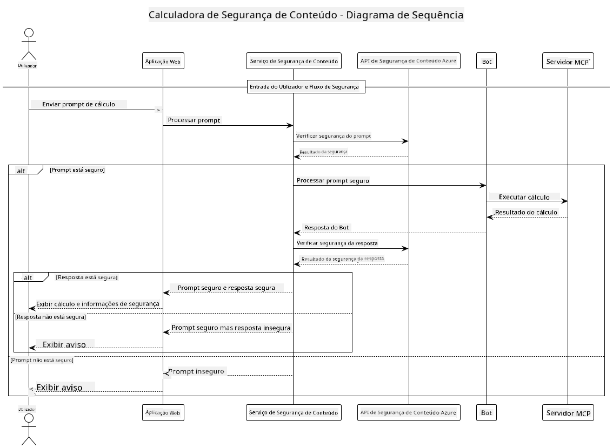

<!--
CO_OP_TRANSLATOR_METADATA:
{
  "original_hash": "e5ea5e7582f70008ea9bec3b3820f20a",
  "translation_date": "2025-07-13T23:15:17+00:00",
  "source_file": "04-PracticalImplementation/samples/java/containerapp/README.md",
  "language_code": "pt"
}
-->
## Arquitetura do Sistema

Este projeto demonstra uma aplicação web que utiliza verificação de segurança de conteúdo antes de enviar os prompts dos utilizadores para um serviço de calculadora via Model Context Protocol (MCP).



### Como Funciona

1. **Entrada do Utilizador**: O utilizador insere um prompt de cálculo na interface web  
2. **Triagem de Segurança de Conteúdo (Entrada)**: O prompt é analisado pela Azure Content Safety API  
3. **Decisão de Segurança (Entrada)**:  
   - Se o conteúdo for seguro (gravidade < 2 em todas as categorias), prossegue para a calculadora  
   - Se o conteúdo for sinalizado como potencialmente prejudicial, o processo é interrompido e é devolvido um aviso  
4. **Integração com a Calculadora**: O conteúdo seguro é processado pelo LangChain4j, que comunica com o servidor da calculadora MCP  
5. **Triagem de Segurança de Conteúdo (Saída)**: A resposta do bot é analisada pela Azure Content Safety API  
6. **Decisão de Segurança (Saída)**:  
   - Se a resposta do bot for segura, é mostrada ao utilizador  
   - Se a resposta do bot for sinalizada como potencialmente prejudicial, é substituída por um aviso  
7. **Resposta**: Os resultados (se seguros) são apresentados ao utilizador juntamente com ambas as análises de segurança

## Utilização do Model Context Protocol (MCP) com Serviços de Calculadora

Este projeto demonstra como usar o Model Context Protocol (MCP) para chamar serviços de calculadora MCP a partir do LangChain4j. A implementação utiliza um servidor MCP local a correr na porta 8080 para fornecer operações de calculadora.

### Configuração do Serviço Azure Content Safety

Antes de usar as funcionalidades de segurança de conteúdo, é necessário criar um recurso do serviço Azure Content Safety:

1. Inicie sessão no [Azure Portal](https://portal.azure.com)  
2. Clique em "Create a resource" e pesquise por "Content Safety"  
3. Selecione "Content Safety" e clique em "Create"  
4. Insira um nome único para o seu recurso  
5. Selecione a sua subscrição e grupo de recursos (ou crie um novo)  
6. Escolha uma região suportada (verifique [Disponibilidade por Região](https://azure.microsoft.com/en-us/global-infrastructure/services/?products=cognitive-services) para detalhes)  
7. Selecione um nível de preços adequado  
8. Clique em "Create" para implementar o recurso  
9. Após a implementação, clique em "Go to resource"  
10. No painel esquerdo, em "Resource Management", selecione "Keys and Endpoint"  
11. Copie uma das chaves e a URL do endpoint para usar no passo seguinte

### Configuração das Variáveis de Ambiente

Defina a variável de ambiente `GITHUB_TOKEN` para autenticação dos modelos GitHub:  
```sh
export GITHUB_TOKEN=<your_github_token>
```

Para as funcionalidades de segurança de conteúdo, defina:  
```sh
export CONTENT_SAFETY_ENDPOINT=<your_content_safety_endpoint>
export CONTENT_SAFETY_KEY=<your_content_safety_key>
```

Estas variáveis de ambiente são usadas pela aplicação para autenticar-se no serviço Azure Content Safety. Se estas variáveis não estiverem definidas, a aplicação usará valores de substituição para fins de demonstração, mas as funcionalidades de segurança de conteúdo não funcionarão corretamente.

### Iniciar o Servidor MCP da Calculadora

Antes de executar o cliente, é necessário iniciar o servidor MCP da calculadora em modo SSE no localhost:8080.

## Descrição do Projeto

Este projeto demonstra a integração do Model Context Protocol (MCP) com LangChain4j para chamar serviços de calculadora. As principais funcionalidades incluem:

- Utilização do MCP para ligar a um serviço de calculadora para operações matemáticas básicas  
- Verificação de segurança de conteúdo em duas camadas, tanto nos prompts do utilizador como nas respostas do bot  
- Integração com o modelo gpt-4.1-nano do GitHub via LangChain4j  
- Utilização de Server-Sent Events (SSE) para transporte MCP

## Integração de Segurança de Conteúdo

O projeto inclui funcionalidades abrangentes de segurança de conteúdo para garantir que tanto as entradas dos utilizadores como as respostas do sistema estão livres de conteúdo prejudicial:

1. **Triagem de Entrada**: Todos os prompts dos utilizadores são analisados para categorias de conteúdo prejudicial, como discurso de ódio, violência, auto-mutilação e conteúdo sexual antes do processamento.

2. **Triagem de Saída**: Mesmo quando se utilizam modelos potencialmente sem censura, o sistema verifica todas as respostas geradas através dos mesmos filtros de segurança de conteúdo antes de as mostrar ao utilizador.

Esta abordagem em duas camadas assegura que o sistema permanece seguro independentemente do modelo de IA utilizado, protegendo os utilizadores tanto de entradas prejudiciais como de respostas geradas pela IA que possam ser problemáticas.

## Cliente Web

A aplicação inclui uma interface web fácil de usar que permite aos utilizadores interagir com o sistema Content Safety Calculator:

### Funcionalidades da Interface Web

- Formulário simples e intuitivo para inserir prompts de cálculo  
- Validação de segurança de conteúdo em duas camadas (entrada e saída)  
- Feedback em tempo real sobre a segurança do prompt e da resposta  
- Indicadores de segurança codificados por cores para fácil interpretação  
- Design limpo e responsivo que funciona em vários dispositivos  
- Exemplos de prompts seguros para orientar os utilizadores

### Utilização do Cliente Web

1. Inicie a aplicação:  
   ```sh
   mvn spring-boot:run
   ```

2. Abra o seu navegador e aceda a `http://localhost:8087`

3. Insira um prompt de cálculo na área de texto fornecida (ex.: "Calculate the sum of 24.5 and 17.3")

4. Clique em "Submit" para processar o seu pedido

5. Veja os resultados, que incluirão:  
   - Análise de segurança de conteúdo do seu prompt  
   - O resultado calculado (se o prompt for seguro)  
   - Análise de segurança de conteúdo da resposta do bot  
   - Quaisquer avisos de segurança caso a entrada ou saída tenham sido sinalizadas

O cliente web trata automaticamente de ambos os processos de verificação de segurança de conteúdo, garantindo que todas as interações são seguras e apropriadas independentemente do modelo de IA utilizado.

**Aviso Legal**:  
Este documento foi traduzido utilizando o serviço de tradução automática [Co-op Translator](https://github.com/Azure/co-op-translator). Embora nos esforcemos pela precisão, por favor tenha em conta que traduções automáticas podem conter erros ou imprecisões. O documento original na sua língua nativa deve ser considerado a fonte autorizada. Para informações críticas, recomenda-se tradução profissional humana. Não nos responsabilizamos por quaisquer mal-entendidos ou interpretações erradas decorrentes da utilização desta tradução.