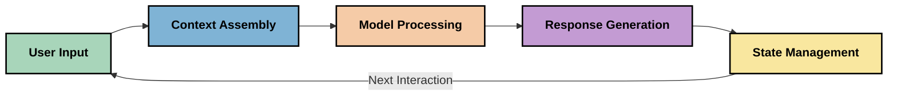
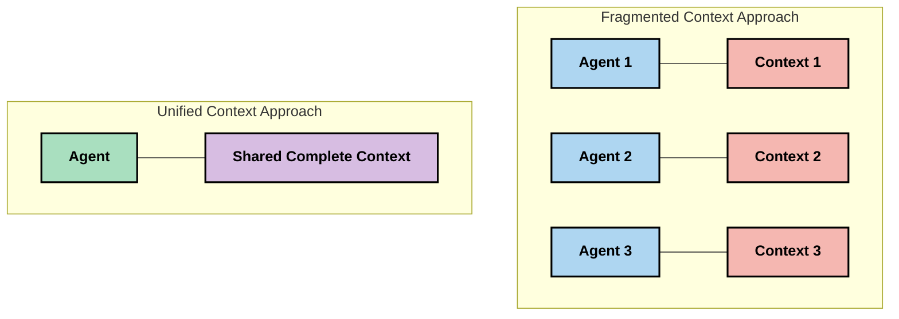
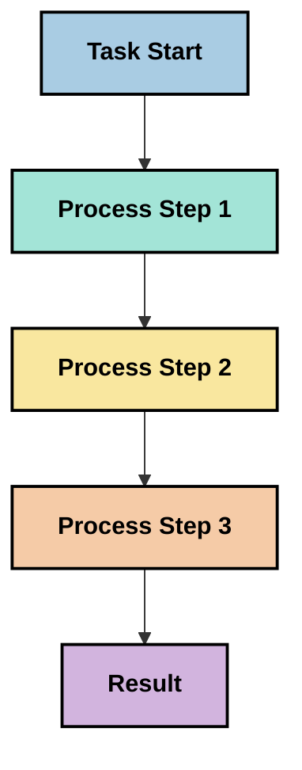
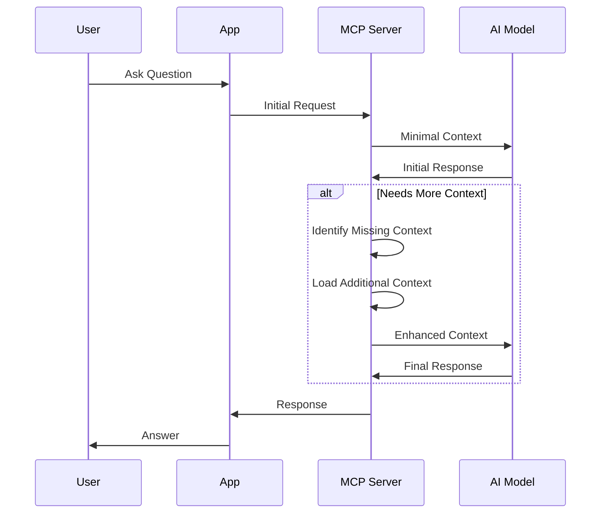
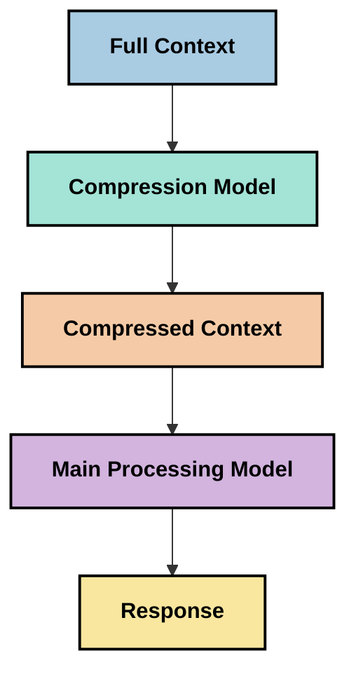
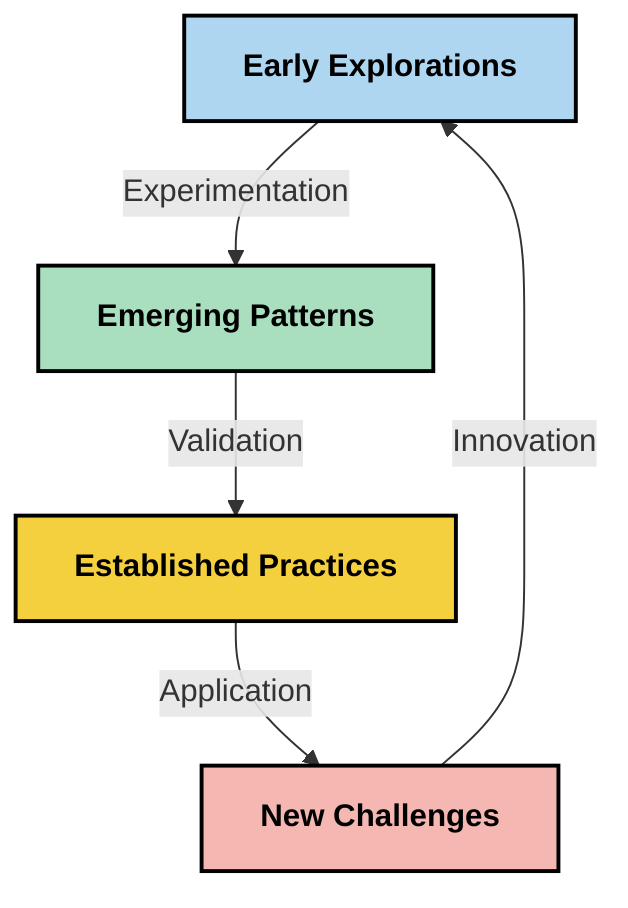

<!--
CO_OP_TRANSLATOR_METADATA:
{
  "original_hash": "5762e8e74dd99d8b7dbb31e69a82561e",
  "translation_date": "2025-07-16T22:59:53+00:00",
  "source_file": "05-AdvancedTopics/mcp-contextengineering/README.md",
  "language_code": "pt"
}
-->
# Engenharia de Contexto: Um Conceito Emergente no Ecossistema MCP

## Visão Geral

A engenharia de contexto é um conceito emergente no espaço da IA que explora como a informação é estruturada, entregue e mantida ao longo das interações entre clientes e serviços de IA. À medida que o ecossistema do Model Context Protocol (MCP) evolui, compreender como gerir eficazmente o contexto torna-se cada vez mais importante. Este módulo introduz o conceito de engenharia de contexto e explora as suas potenciais aplicações em implementações MCP.

## Objetivos de Aprendizagem

No final deste módulo, será capaz de:

- Compreender o conceito emergente de engenharia de contexto e o seu papel potencial em aplicações MCP
- Identificar os principais desafios na gestão de contexto que o design do protocolo MCP aborda
- Explorar técnicas para melhorar o desempenho do modelo através de uma melhor gestão do contexto
- Considerar abordagens para medir e avaliar a eficácia do contexto
- Aplicar estes conceitos emergentes para melhorar as experiências de IA através do framework MCP

## Introdução à Engenharia de Contexto

A engenharia de contexto é um conceito emergente focado no design deliberado e na gestão do fluxo de informação entre utilizadores, aplicações e modelos de IA. Ao contrário de áreas já estabelecidas como a engenharia de prompts, a engenharia de contexto ainda está a ser definida pelos praticantes enquanto trabalham para resolver os desafios únicos de fornecer aos modelos de IA a informação certa no momento certo.

À medida que os grandes modelos de linguagem (LLMs) evoluíram, a importância do contexto tornou-se cada vez mais evidente. A qualidade, relevância e estrutura do contexto que fornecemos impactam diretamente os resultados do modelo. A engenharia de contexto explora esta relação e procura desenvolver princípios para uma gestão eficaz do contexto.

> "Em 2025, os modelos existentes são extremamente inteligentes. Mas mesmo o humano mais inteligente não conseguirá fazer o seu trabalho eficazmente sem o contexto do que lhe está a ser pedido... 'Engenharia de contexto' é o próximo nível da engenharia de prompts. Trata-se de fazer isto automaticamente num sistema dinâmico." — Walden Yan, Cognition AI

A engenharia de contexto pode abranger:

1. **Seleção de Contexto**: Determinar que informação é relevante para uma dada tarefa
2. **Estruturação de Contexto**: Organizar a informação para maximizar a compreensão do modelo
3. **Entrega de Contexto**: Otimizar como e quando a informação é enviada aos modelos
4. **Manutenção de Contexto**: Gerir o estado e a evolução do contexto ao longo do tempo
5. **Avaliação de Contexto**: Medir e melhorar a eficácia do contexto

Estas áreas de foco são particularmente relevantes para o ecossistema MCP, que fornece uma forma padronizada para as aplicações fornecerem contexto aos LLMs.

## A Perspetiva da Jornada do Contexto

Uma forma de visualizar a engenharia de contexto é traçar a jornada que a informação percorre através de um sistema MCP:



### Etapas-Chave na Jornada do Contexto:

1. **Entrada do Utilizador**: Informação bruta do utilizador (texto, imagens, documentos)
2. **Montagem do Contexto**: Combinar a entrada do utilizador com o contexto do sistema, histórico da conversa e outra informação recuperada
3. **Processamento pelo Modelo**: O modelo de IA processa o contexto montado
4. **Geração de Resposta**: O modelo produz saídas com base no contexto fornecido
5. **Gestão do Estado**: O sistema atualiza o seu estado interno com base na interação

Esta perspetiva destaca a natureza dinâmica do contexto em sistemas de IA e levanta questões importantes sobre como gerir melhor a informação em cada etapa.

## Princípios Emergentes na Engenharia de Contexto

À medida que o campo da engenharia de contexto se vai definindo, alguns princípios iniciais começam a emergir entre os praticantes. Estes princípios podem ajudar a informar as escolhas de implementação MCP:

### Princípio 1: Partilhar o Contexto na Totalidade

O contexto deve ser partilhado na totalidade entre todos os componentes de um sistema, em vez de estar fragmentado por múltiplos agentes ou processos. Quando o contexto está distribuído, as decisões tomadas numa parte do sistema podem entrar em conflito com as feitas noutra.



Nas aplicações MCP, isto sugere desenhar sistemas onde o contexto flui de forma contínua por toda a cadeia, em vez de estar compartimentado.

### Princípio 2: Reconhecer que as Ações Transportam Decisões Implícitas

Cada ação que um modelo executa incorpora decisões implícitas sobre como interpretar o contexto. Quando múltiplos componentes atuam sobre contextos diferentes, estas decisões implícitas podem entrar em conflito, levando a resultados inconsistentes.

Este princípio tem implicações importantes para aplicações MCP:
- Preferir o processamento linear de tarefas complexas em vez da execução paralela com contexto fragmentado
- Garantir que todos os pontos de decisão têm acesso à mesma informação contextual
- Desenhar sistemas onde etapas posteriores possam ver o contexto completo das decisões anteriores

### Princípio 3: Equilibrar a Profundidade do Contexto com as Limitações da Janela

À medida que as conversas e processos se prolongam, as janelas de contexto acabam por transbordar. A engenharia de contexto eficaz explora abordagens para gerir esta tensão entre contexto abrangente e limitações técnicas.

As abordagens potenciais em exploração incluem:
- Compressão de contexto que mantém a informação essencial enquanto reduz o uso de tokens
- Carregamento progressivo do contexto com base na relevância para as necessidades atuais
- Resumo das interações anteriores preservando decisões e factos-chave

## Desafios do Contexto e Design do Protocolo MCP

O Model Context Protocol (MCP) foi desenhado com consciência dos desafios únicos da gestão de contexto. Compreender estes desafios ajuda a explicar aspetos-chave do design do protocolo MCP:

### Desafio 1: Limitações da Janela de Contexto  
A maioria dos modelos de IA tem tamanhos fixos de janela de contexto, limitando a quantidade de informação que podem processar de uma vez.

**Resposta do Design MCP:**  
- O protocolo suporta contexto estruturado baseado em recursos que pode ser referenciado de forma eficiente  
- Os recursos podem ser paginados e carregados progressivamente

### Desafio 2: Determinação da Relevância  
Determinar qual a informação mais relevante para incluir no contexto é difícil.

**Resposta do Design MCP:**  
- Ferramentas flexíveis permitem a recuperação dinâmica de informação conforme a necessidade  
- Prompts estruturados permitem uma organização consistente do contexto

### Desafio 3: Persistência do Contexto  
Gerir o estado ao longo das interações requer um acompanhamento cuidadoso do contexto.

**Resposta do Design MCP:**  
- Gestão de sessões padronizada  
- Padrões de interação claramente definidos para a evolução do contexto

### Desafio 4: Contexto Multi-Modal  
Diferentes tipos de dados (texto, imagens, dados estruturados) requerem tratamentos distintos.

**Resposta do Design MCP:**  
- O design do protocolo acomoda vários tipos de conteúdo  
- Representação padronizada da informação multi-modal

### Desafio 5: Segurança e Privacidade  
O contexto frequentemente contém informação sensível que deve ser protegida.

**Resposta do Design MCP:**  
- Limites claros entre responsabilidades do cliente e do servidor  
- Opções de processamento local para minimizar a exposição de dados

Compreender estes desafios e como o MCP os aborda fornece uma base para explorar técnicas mais avançadas de engenharia de contexto.

## Abordagens Emergentes na Engenharia de Contexto

À medida que o campo da engenharia de contexto se desenvolve, várias abordagens promissoras estão a emergir. Estas representam o pensamento atual e não práticas consolidadas, e provavelmente evoluirão à medida que ganharmos mais experiência com implementações MCP.

### 1. Processamento Linear em Thread Única

Em contraste com arquiteturas multi-agente que distribuem o contexto, alguns praticantes estão a descobrir que o processamento linear em thread única produz resultados mais consistentes. Isto está alinhado com o princípio de manter um contexto unificado.



Embora esta abordagem possa parecer menos eficiente do que o processamento paralelo, frequentemente produz resultados mais coerentes e fiáveis porque cada passo se baseia numa compreensão completa das decisões anteriores.

### 2. Fragmentação e Priorização do Contexto

Dividir contextos grandes em pedaços geríveis e priorizar o que é mais importante.

```python
# Conceptual Example: Context Chunking and Prioritization
def process_with_chunked_context(documents, query):
    # 1. Break documents into smaller chunks
    chunks = chunk_documents(documents)
    
    # 2. Calculate relevance scores for each chunk
    scored_chunks = [(chunk, calculate_relevance(chunk, query)) for chunk in chunks]
    
    # 3. Sort chunks by relevance score
    sorted_chunks = sorted(scored_chunks, key=lambda x: x[1], reverse=True)
    
    # 4. Use the most relevant chunks as context
    context = create_context_from_chunks([chunk for chunk, score in sorted_chunks[:5]])
    
    # 5. Process with the prioritized context
    return generate_response(context, query)
```

O conceito acima ilustra como podemos dividir documentos grandes em partes geríveis e selecionar apenas as partes mais relevantes para o contexto. Esta abordagem pode ajudar a trabalhar dentro das limitações da janela de contexto, aproveitando bases de conhecimento extensas.

### 3. Carregamento Progressivo do Contexto

Carregar o contexto progressivamente conforme necessário, em vez de tudo de uma vez.



O carregamento progressivo do contexto começa com um contexto mínimo e expande-se apenas quando necessário. Isto pode reduzir significativamente o uso de tokens para consultas simples, mantendo a capacidade de lidar com questões complexas.

### 4. Compressão e Resumo do Contexto

Reduzir o tamanho do contexto preservando a informação essencial.



A compressão de contexto foca-se em:  
- Remover informação redundante  
- Resumir conteúdos extensos  
- Extrair factos e detalhes chave  
- Preservar elementos críticos do contexto  
- Otimizar para eficiência de tokens

Esta abordagem pode ser particularmente valiosa para manter conversas longas dentro das janelas de contexto ou para processar documentos grandes de forma eficiente. Alguns praticantes usam modelos especializados especificamente para compressão e resumo do histórico de conversação.

## Considerações Explorativas na Engenharia de Contexto

Ao explorar o campo emergente da engenharia de contexto, várias considerações são importantes ao trabalhar com implementações MCP. Estas não são práticas prescritas, mas áreas de exploração que podem trazer melhorias no seu caso de uso específico.

### Considere os Seus Objetivos de Contexto

Antes de implementar soluções complexas de gestão de contexto, articule claramente o que pretende alcançar:  
- Que informação específica o modelo precisa para ser bem-sucedido?  
- Que informação é essencial versus suplementar?  
- Quais são as suas restrições de desempenho (latência, limites de tokens, custos)?

### Explore Abordagens de Contexto em Camadas

Alguns praticantes têm sucesso com o contexto organizado em camadas conceptuais:  
- **Camada Central**: Informação essencial que o modelo precisa sempre  
- **Camada Situacional**: Contexto específico da interação atual  
- **Camada de Apoio**: Informação adicional que pode ser útil  
- **Camada de Reserva**: Informação acessada apenas quando necessário

### Investigue Estratégias de Recuperação

A eficácia do seu contexto depende muitas vezes de como recupera a informação:  
- Pesquisa semântica e embeddings para encontrar informação conceptualmente relevante  
- Pesquisa por palavras-chave para detalhes factuais específicos  
- Abordagens híbridas que combinam múltiplos métodos de recuperação  
- Filtragem por metadados para restringir o âmbito com base em categorias, datas ou fontes

### Experimente com a Coerência do Contexto

A estrutura e o fluxo do seu contexto podem afetar a compreensão do modelo:  
- Agrupar informação relacionada  
- Usar formatação e organização consistentes  
- Manter uma ordem lógica ou cronológica quando apropriado  
- Evitar informação contraditória

### Pese as Vantagens e Desvantagens das Arquiteturas Multi-Agente

Embora as arquiteturas multi-agente sejam populares em muitos frameworks de IA, apresentam desafios significativos para a gestão de contexto:  
- A fragmentação do contexto pode levar a decisões inconsistentes entre agentes  
- O processamento paralelo pode introduzir conflitos difíceis de resolver  
- A sobrecarga de comunicação entre agentes pode anular ganhos de desempenho  
- É necessária uma gestão complexa do estado para manter a coerência

Em muitos casos, uma abordagem de agente único com gestão abrangente do contexto pode produzir resultados mais fiáveis do que múltiplos agentes especializados com contexto fragmentado.

### Desenvolva Métodos de Avaliação

Para melhorar a engenharia de contexto ao longo do tempo, considere como irá medir o sucesso:  
- Testes A/B com diferentes estruturas de contexto  
- Monitorização do uso de tokens e tempos de resposta  
- Acompanhamento da satisfação do utilizador e taxas de conclusão de tarefas  
- Análise dos momentos e razões em que as estratégias de contexto falham

Estas considerações representam áreas ativas de exploração no espaço da engenharia de contexto. À medida que o campo amadurece, padrões e práticas mais definitivos provavelmente emergirão.

## Medir a Eficácia do Contexto: Um Quadro em Evolução

À medida que a engenharia de contexto emerge como conceito, os praticantes começam a explorar como medir a sua eficácia. Ainda não existe um quadro estabelecido, mas várias métricas estão a ser consideradas para orientar trabalhos futuros.

### Dimensões Potenciais de Medição

#### 1. Considerações de Eficiência de Entrada

- **Rácio Contexto-Resposta**: Quanta informação de contexto é necessária em relação ao tamanho da resposta?  
- **Utilização de Tokens**: Que percentagem dos tokens do contexto fornecido influencia a resposta?  
- **Redução do Contexto**: Quão eficazmente podemos comprimir a informação bruta?

#### 2. Considerações de Desempenho

- **Impacto na Latência**: Como a gestão do contexto afeta o tempo de resposta?  
- **Economia de Tokens**: Estamos a otimizar eficazmente o uso de tokens?  
- **Precisão da Recuperação**: Quão relevante é a informação recuperada?  
- **Utilização de Recursos**: Que recursos computacionais são necessários?

#### 3. Considerações de Qualidade

- **Relevância da Resposta**: Quão bem a resposta aborda a questão?  
- **Precisão Factual**: A gestão do contexto melhora a correção factual?  
- **Consistência**: As respostas são consistentes em consultas semelhantes?  
- **Taxa de Alucinações**: Um melhor contexto reduz as alucinações do modelo?

#### 4. Considerações de Experiência do Utilizador

- **Taxa de Seguimento**: Com que frequência os utilizadores precisam de esclarecimentos?  
- **Conclusão de Tarefas**: Os utilizadores conseguem atingir os seus objetivos?  
- **Indicadores de Satisfação**: Como os utilizadores avaliam a sua experiência?

### Abordagens Explorativas para Medição

Ao experimentar a engenharia de contexto em implementações MCP, considere estas abordagens explorativas:

1. **Comparações de Base**: Estabeleça uma base com abordagens simples de contexto antes de testar métodos mais sofisticados  
2. **Mudanças Incrementais**: Altere um aspeto da gestão de contexto de cada vez para isolar os seus efeitos  
3. **Avaliação Centrada no Utilizador**: Combine métricas quantitativas com feedback qualitativo dos utilizadores  
4. **Análise de Falhas**: Examine casos onde as estratégias de contexto falham para entender possíveis melhorias  
5. **Avaliação Multidimensional**: Considere os trade-offs entre eficiência, qualidade e experiência do utilizador

Esta abordagem experimental e multifacetada à medição está alinhada com a natureza emergente da engenharia de contexto.

## Reflexões Finais

A engenharia de contexto é uma área emergente de exploração que pode vir a ser central para aplicações MCP eficazes. Ao considerar cuidadosamente como a informação flui através do seu sistema, pode criar experiências de IA mais eficientes, precisas e valiosas para os utilizadores.

As técnicas e abordagens descritas neste módulo representam o pensamento inicial nesta área, não práticas consolidadas. A engenharia de contexto poderá desenvolver-se numa disciplina mais definida à medida que as capacidades da IA evoluem e a nossa compreensão se aprofunda. Por agora, a experimentação combinada com uma medição cuidadosa parece ser a abordagem mais produtiva.

## Potenciais Direções Futuras

O campo da engenharia de contexto ainda está nos seus estágios iniciais, mas várias direções promissoras estão a emergir:

- Os princípios da engenharia de contexto podem impactar significativamente o desempenho do modelo, eficiência, experiência do utilizador e fiabilidade  
- Abordagens em thread única com gestão abrangente do contexto podem superar arquiteturas multi-agente em muitos casos de uso  
- Modelos especializados em compressão de contexto podem tornar-se componentes padrão em pipelines de IA  
- A tensão entre a completude do contexto e as limitações de tokens provavelmente impulsionará a inovação na gestão do contexto  
- À medida que os modelos se tornam mais capazes de comunicação eficiente e semelhante à humana, a colaboração multi-agente verdadeira poderá tornar-se mais viável  
- As implementações MCP poderão evoluir para padronizar padrões de gestão de contexto que emergem da experimentação atual



## Recursos

### Recursos Oficiais MCP
- [Model Context Protocol Website](https://modelcontextprotocol.io/)
- [Model Context Protocol Specification](https://github.com/modelcontextprotocol/modelcontextprotocol)
- [MCP Documentation](https://modelcontextprotocol.io/docs)
- [MCP C# SDK](https://github.com/modelcontextprotocol/csharp-sdk)
- [MCP Python SDK](https://github.com/modelcontextprotocol/python-sdk)
- [MCP TypeScript SDK](https://github.com/modelcontextprotocol/typescript-sdk)
- [MCP Inspector](https://github.com/modelcontextprotocol/inspector) - Ferramenta de teste visual para servidores MCP

### Artigos sobre Engenharia de Contexto
- [Não Construa Multi-Agentes: Princípios da Engenharia de Contexto](https://cognition.ai/blog/dont-build-multi-agents) - Perspetivas de Walden Yan sobre os princípios da engenharia de contexto
- [Um Guia Prático para Construir Agentes](https://cdn.openai.com/business-guides-and-resources/a-practical-guide-to-building-agents.pdf) - Guia da OpenAI sobre design eficaz de agentes
- [Construir Agentes Eficazes](https://www.anthropic.com/engineering/building-effective-agents) - Abordagem da Anthropic para o desenvolvimento de agentes

### Investigação Relacionada
- [Aumento Dinâmico de Recuperação para Grandes Modelos de Linguagem](https://arxiv.org/abs/2310.01487) - Investigação sobre abordagens dinâmicas de recuperação
- [Perdidos no Meio: Como os Modelos de Linguagem Usam Contextos Longos](https://arxiv.org/abs/2307.03172) - Investigação importante sobre padrões de processamento de contexto
- [Geração Hierárquica de Imagens Condicionada por Texto com Latentes CLIP](https://arxiv.org/abs/2204.06125) - Artigo do DALL-E 2 com insights sobre estruturação de contexto
- [Explorando o Papel do Contexto nas Arquiteturas de Grandes Modelos de Linguagem](https://aclanthology.org/2023.findings-emnlp.124/) - Investigação recente sobre gestão de contexto
- [Colaboração Multi-Agente: Uma Revisão](https://arxiv.org/abs/2304.03442) - Investigação sobre sistemas multi-agente e os seus desafios

### Recursos Adicionais
- [Técnicas de Otimização da Janela de Contexto](https://learn.microsoft.com/en-us/azure/ai-services/openai/concepts/context-window)
- [Técnicas Avançadas de RAG](https://www.microsoft.com/en-us/research/blog/retrieval-augmented-generation-rag-and-frontier-models/)
- [Documentação do Semantic Kernel](https://github.com/microsoft/semantic-kernel)
- [Kit de Ferramentas de IA para Gestão de Contexto](https://github.com/microsoft/aitoolkit)

## O que vem a seguir
- [6. Contribuições da Comunidade](../../06-CommunityContributions/README.md)

**Aviso Legal**:  
Este documento foi traduzido utilizando o serviço de tradução automática [Co-op Translator](https://github.com/Azure/co-op-translator). Embora nos esforcemos pela precisão, por favor tenha em conta que traduções automáticas podem conter erros ou imprecisões. O documento original na sua língua nativa deve ser considerado a fonte autorizada. Para informações críticas, recomenda-se tradução profissional humana. Não nos responsabilizamos por quaisquer mal-entendidos ou interpretações erradas decorrentes da utilização desta tradução.