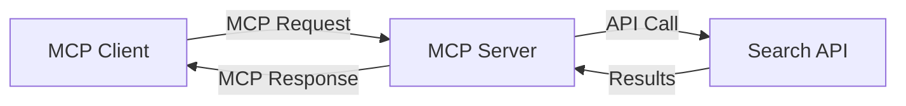
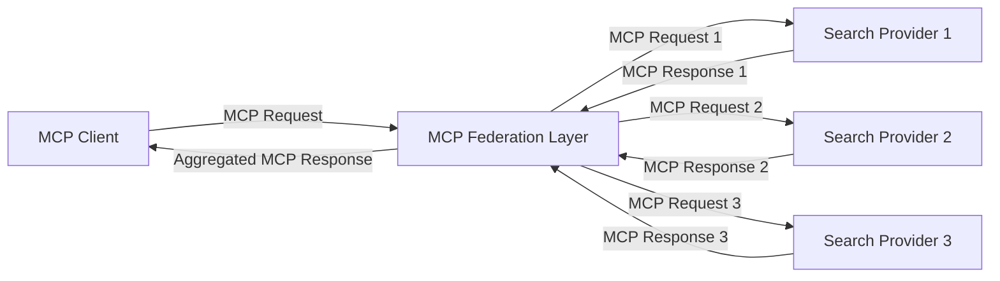
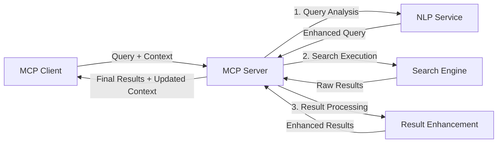

<!--
CO_OP_TRANSLATOR_METADATA:
{
  "original_hash": "333a03e51f90bdf3e6f1ba1694c73f36",
  "translation_date": "2025-07-16T21:57:38+00:00",
  "source_file": "05-AdvancedTopics/mcp-realtimesearch/README.md",
  "language_code": "pt"
}
-->
## Aviso sobre Exemplos de Código

> **Nota Importante**: Os exemplos de código abaixo demonstram a integração do Model Context Protocol (MCP) com funcionalidades de pesquisa na web. Embora sigam os padrões e estruturas dos SDKs oficiais do MCP, foram simplificados para fins educativos.
> 
> Estes exemplos mostram:
> 
> 1. **Implementação em Python**: Uma implementação de servidor FastMCP que fornece uma ferramenta de pesquisa na web e se conecta a uma API externa de pesquisa. Este exemplo demonstra a gestão adequada do ciclo de vida, manipulação de contexto e implementação da ferramenta seguindo os padrões do [SDK oficial MCP para Python](https://github.com/modelcontextprotocol/python-sdk). O servidor utiliza o transporte HTTP Streamable recomendado, que substituiu o transporte SSE mais antigo para implementações em produção.
> 
> 2. **Implementação em JavaScript**: Uma implementação em TypeScript/JavaScript usando o padrão FastMCP do [SDK oficial MCP para TypeScript](https://github.com/modelcontextprotocol/typescript-sdk) para criar um servidor de pesquisa com definições corretas de ferramentas e conexões de clientes. Segue os padrões mais recentes recomendados para gestão de sessões e preservação de contexto.
> 
> Estes exemplos requerem tratamento adicional de erros, autenticação e código específico de integração de API para uso em produção. Os endpoints da API de pesquisa mostrados (`https://api.search-service.example/search`) são exemplos e devem ser substituídos por endpoints reais de serviços de pesquisa.
> 
> Para detalhes completos de implementação e as abordagens mais atualizadas, consulte a [especificação oficial do MCP](https://spec.modelcontextprotocol.io/) e a documentação dos SDKs.

## Conceitos Fundamentais

### O Framework Model Context Protocol (MCP)

Na sua base, o Model Context Protocol fornece uma forma padronizada para que modelos de IA, aplicações e serviços troquem contexto. Na pesquisa web em tempo real, este framework é essencial para criar experiências de pesquisa coerentes e com múltiplas interações. Os componentes chave incluem:

1. **Arquitetura Cliente-Servidor**: O MCP estabelece uma separação clara entre clientes de pesquisa (solicitantes) e servidores de pesquisa (fornecedores), permitindo modelos de implementação flexíveis.

2. **Comunicação JSON-RPC**: O protocolo usa JSON-RPC para troca de mensagens, tornando-o compatível com tecnologias web e fácil de implementar em diferentes plataformas.

3. **Gestão de Contexto**: O MCP define métodos estruturados para manter, atualizar e aproveitar o contexto de pesquisa ao longo de múltiplas interações.

4. **Definições de Ferramentas**: As capacidades de pesquisa são expostas como ferramentas padronizadas com parâmetros e valores de retorno bem definidos.

5. **Suporte a Streaming**: O protocolo suporta resultados em streaming, essencial para pesquisa em tempo real onde os resultados podem chegar progressivamente.

### Padrões de Integração para Pesquisa Web

Ao integrar o MCP com pesquisa web, surgem vários padrões:

#### 1. Integração Direta com Provedor de Pesquisa

Neste padrão, o servidor MCP comunica-se diretamente com uma ou mais APIs de pesquisa, traduzindo pedidos MCP em chamadas específicas da API e formatando os resultados como respostas MCP.

#### 2. Pesquisa Federada com Preservação de Contexto

Este padrão distribui consultas de pesquisa por vários provedores compatíveis com MCP, cada um potencialmente especializado em diferentes tipos de conteúdo ou capacidades de pesquisa, mantendo um contexto unificado.

#### 3. Cadeia de Pesquisa com Contexto Aprimorado

Neste padrão, o processo de pesquisa é dividido em múltiplas etapas, com o contexto sendo enriquecido a cada passo, resultando em resultados progressivamente mais relevantes.

### Componentes do Contexto de Pesquisa

Na pesquisa web baseada em MCP, o contexto normalmente inclui:

- **Histórico de Consultas**: Consultas de pesquisa anteriores na sessão
- **Preferências do Utilizador**: Idioma, região, definições de pesquisa segura
- **Histórico de Interações**: Resultados clicados, tempo despendido nos resultados
- **Parâmetros de Pesquisa**: Filtros, ordens de classificação e outros modificadores de pesquisa
- **Conhecimento de Domínio**: Contexto específico do assunto relevante para a pesquisa
- **Contexto Temporal**: Fatores de relevância baseados no tempo
- **Preferências de Fonte**: Fontes de informação confiáveis ou preferidas

## Casos de Uso e Aplicações

### Investigação e Recolha de Informação

O MCP melhora os fluxos de trabalho de investigação ao:

- Preservar o contexto de investigação ao longo das sessões de pesquisa
- Permitir consultas mais sofisticadas e contextualmente relevantes
- Suportar federação de pesquisa multi-fonte
- Facilitar a extração de conhecimento a partir dos resultados de pesquisa

### Monitorização de Notícias e Tendências em Tempo Real

A pesquisa potenciada por MCP oferece vantagens para monitorização de notícias:

- Descoberta quase em tempo real de notícias emergentes
- Filtragem contextual de informação relevante
- Acompanhamento de tópicos e entidades em múltiplas fontes
- Alertas de notícias personalizados com base no contexto do utilizador

### Navegação e Investigação Aumentadas por IA

O MCP cria novas possibilidades para navegação aumentada por IA:

- Sugestões de pesquisa contextuais baseadas na atividade atual do navegador
- Integração fluida da pesquisa web com assistentes potenciados por LLM
- Refinamento de pesquisa em múltiplas interações com contexto mantido
- Verificação de factos e validação de informação aprimoradas

## Tendências Futuras e Inovações

### Evolução do MCP na Pesquisa Web

Olhando para o futuro, prevê-se que o MCP evolua para abordar:

- **Pesquisa Multimodal**: Integração de pesquisa de texto, imagem, áudio e vídeo com contexto preservado
- **Pesquisa Descentralizada**: Suporte a ecossistemas de pesquisa distribuída e federada
- **Privacidade na Pesquisa**: Mecanismos de pesquisa que preservam a privacidade e são conscientes do contexto  
- **Compreensão da Consulta**: Análise semântica profunda de consultas de pesquisa em linguagem natural

### Potenciais Avanços na Tecnologia

Tecnologias emergentes que irão moldar o futuro da pesquisa MCP:

1. **Arquiteturas de Pesquisa Neural**: Sistemas de pesquisa baseados em embeddings otimizados para MCP  
2. **Contexto de Pesquisa Personalizado**: Aprendizagem dos padrões de pesquisa individuais dos utilizadores ao longo do tempo  
3. **Integração de Grafos de Conhecimento**: Pesquisa contextual aprimorada por grafos de conhecimento específicos de domínio  
4. **Contexto Cross-Modal**: Manutenção do contexto através de diferentes modalidades de pesquisa

## Exercícios Práticos

### Exercício 1: Configurar um Pipeline Básico de Pesquisa MCP

Neste exercício, vais aprender a:  
- Configurar um ambiente básico de pesquisa MCP  
- Implementar manipuladores de contexto para pesquisa na web  
- Testar e validar a preservação do contexto ao longo das iterações de pesquisa

### Exercício 2: Construir um Assistente de Investigação com Pesquisa MCP

Cria uma aplicação completa que:  
- Processa perguntas de investigação em linguagem natural  
- Realiza pesquisas na web conscientes do contexto  
- Sintetiza informação de múltiplas fontes  
- Apresenta os resultados da investigação de forma organizada

### Exercício 3: Implementar Federação de Pesquisa Multi-Fonte com MCP

Exercício avançado que abrange:  
- Encaminhamento de consultas conscientes do contexto para múltiplos motores de pesquisa  
- Classificação e agregação de resultados  
- Deduplificação contextual dos resultados de pesquisa  
- Gestão de metadados específicos das fontes

## Recursos Adicionais

- [Model Context Protocol Specification](https://spec.modelcontextprotocol.io/) - Especificação oficial do MCP e documentação detalhada do protocolo  
- [Model Context Protocol Documentation](https://modelcontextprotocol.io/) - Tutoriais detalhados e guias de implementação  
- [MCP Python SDK](https://github.com/modelcontextprotocol/python-sdk) - Implementação oficial em Python do protocolo MCP  
- [MCP TypeScript SDK](https://github.com/modelcontextprotocol/typescript-sdk) - Implementação oficial em TypeScript do protocolo MCP  
- [MCP Reference Servers](https://github.com/modelcontextprotocol/servers) - Implementações de referência de servidores MCP  
- [Bing Web Search API Documentation](https://learn.microsoft.com/en-us/bing/search-apis/bing-web-search/overview) - API de pesquisa web da Microsoft  
- [Google Custom Search JSON API](https://developers.google.com/custom-search/v1/overview) - Motor de pesquisa programável da Google  
- [SerpAPI Documentation](https://serpapi.com/search-api) - API para páginas de resultados de motores de pesquisa  
- [Meilisearch Documentation](https://www.meilisearch.com/docs) - Motor de pesquisa open-source  
- [Elasticsearch Documentation](https://www.elastic.co/guide/index.html) - Motor distribuído de pesquisa e análise  
- [LangChain Documentation](https://python.langchain.com/docs/get_started/introduction) - Construção de aplicações com LLMs

## Resultados de Aprendizagem

Ao concluir este módulo, serás capaz de:

- Compreender os fundamentos da pesquisa web em tempo real e os seus desafios  
- Explicar como o Model Context Protocol (MCP) melhora as capacidades de pesquisa web em tempo real  
- Implementar soluções de pesquisa baseadas em MCP usando frameworks e APIs populares  
- Projetar e implementar arquiteturas de pesquisa escaláveis e de alto desempenho com MCP  
- Aplicar conceitos MCP a vários casos de uso, incluindo pesquisa semântica, assistência à investigação e navegação aumentada por IA  
- Avaliar tendências emergentes e inovações futuras em tecnologias de pesquisa baseadas em MCP

### Considerações de Confiança e Segurança

Ao implementar soluções de pesquisa web baseadas em MCP, lembra-te destes princípios importantes da especificação MCP:

1. **Consentimento e Controlo do Utilizador**: Os utilizadores devem consentir explicitamente e compreender todas as operações e acessos a dados. Isto é especialmente importante em implementações de pesquisa web que possam aceder a fontes de dados externas.

2. **Privacidade dos Dados**: Garante o tratamento adequado das consultas e resultados de pesquisa, especialmente quando possam conter informação sensível. Implementa controlos de acesso apropriados para proteger os dados dos utilizadores.

3. **Segurança das Ferramentas**: Implementa autorização e validação adequadas para as ferramentas de pesquisa, pois representam riscos de segurança devido à execução arbitrária de código. As descrições do comportamento das ferramentas devem ser consideradas não confiáveis, a menos que obtidas de um servidor confiável.

4. **Documentação Clara**: Fornece documentação clara sobre as capacidades, limitações e considerações de segurança da tua implementação de pesquisa baseada em MCP, seguindo as diretrizes da especificação MCP.

5. **Fluxos Robustos de Consentimento**: Constrói fluxos robustos de consentimento e autorização que expliquem claramente o que cada ferramenta faz antes de autorizar o seu uso, especialmente para ferramentas que interagem com recursos web externos.

Para detalhes completos sobre segurança e considerações de confiança no MCP, consulta a [documentação oficial](https://modelcontextprotocol.io/specification/2025-03-26#security-and-trust-%26-safety).

## O que vem a seguir

- [5.12 Autenticação Entra ID para Servidores Model Context Protocol](../mcp-security-entra/README.md)

**Aviso Legal**:  
Este documento foi traduzido utilizando o serviço de tradução automática [Co-op Translator](https://github.com/Azure/co-op-translator). Embora nos esforcemos pela precisão, por favor tenha em conta que traduções automáticas podem conter erros ou imprecisões. O documento original na sua língua nativa deve ser considerado a fonte autorizada. Para informações críticas, recomenda-se tradução profissional humana. Não nos responsabilizamos por quaisquer mal-entendidos ou interpretações incorretas decorrentes da utilização desta tradução.