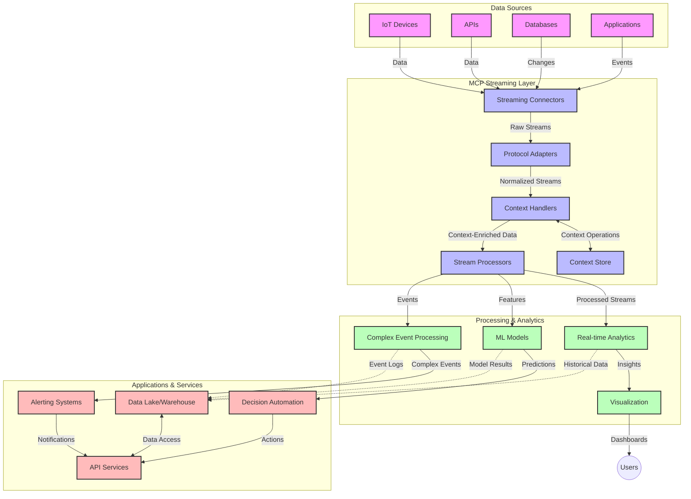

<!--
CO_OP_TRANSLATOR_METADATA:
{
  "original_hash": "68c518dbff8a3b127ed2aa934054c56c",
  "translation_date": "2025-06-11T17:10:21+00:00",
  "source_file": "05-AdvancedTopics/mcp-realtimestreaming/README.md",
  "language_code": "pt"
}
-->
# Protocolo de Contexto de Modelo para Streaming de Dados em Tempo Real

## Visão Geral

O streaming de dados em tempo real tornou-se essencial no mundo orientado a dados de hoje, onde empresas e aplicações precisam de acesso imediato à informação para tomar decisões rápidas. O Protocolo de Contexto de Modelo (MCP) representa um avanço significativo na otimização desses processos de streaming em tempo real, melhorando a eficiência do processamento de dados, mantendo a integridade do contexto e aprimorando o desempenho geral do sistema.

Este módulo explora como o MCP transforma o streaming de dados em tempo real ao fornecer uma abordagem padronizada para o gerenciamento de contexto entre modelos de IA, plataformas de streaming e aplicações.

## Introdução ao Streaming de Dados em Tempo Real

O streaming de dados em tempo real é um paradigma tecnológico que permite a transferência, processamento e análise contínuos de dados conforme são gerados, possibilitando que os sistemas reajam imediatamente a novas informações. Diferentemente do processamento em lote tradicional, que opera sobre conjuntos estáticos de dados, o streaming processa dados em movimento, entregando insights e ações com latência mínima.

### Conceitos Fundamentais do Streaming de Dados em Tempo Real:

- **Fluxo Contínuo de Dados**: Os dados são processados como um fluxo contínuo e ininterrupto de eventos ou registros.
- **Processamento de Baixa Latência**: Os sistemas são projetados para minimizar o tempo entre a geração e o processamento dos dados.
- **Escalabilidade**: As arquiteturas de streaming precisam lidar com volumes e velocidades de dados variáveis.
- **Tolerância a Falhas**: Os sistemas devem ser resilientes a falhas para garantir o fluxo contínuo de dados.
- **Processamento Stateful**: Manter o contexto entre eventos é crucial para análises significativas.

### O Protocolo de Contexto de Modelo e o Streaming em Tempo Real

O Protocolo de Contexto de Modelo (MCP) aborda diversos desafios críticos em ambientes de streaming em tempo real:

1. **Continuidade Contextual**: O MCP padroniza como o contexto é mantido entre componentes distribuídos de streaming, garantindo que modelos de IA e nós de processamento tenham acesso ao contexto histórico e ambiental relevante.

2. **Gerenciamento Eficiente de Estado**: Ao fornecer mecanismos estruturados para transmissão de contexto, o MCP reduz a sobrecarga do gerenciamento de estado em pipelines de streaming.

3. **Interoperabilidade**: O MCP cria uma linguagem comum para o compartilhamento de contexto entre tecnologias de streaming diversas e modelos de IA, permitindo arquiteturas mais flexíveis e extensíveis.

4. **Contexto Otimizado para Streaming**: Implementações do MCP podem priorizar quais elementos de contexto são mais relevantes para a tomada de decisão em tempo real, otimizando desempenho e precisão.

5. **Processamento Adaptativo**: Com o gerenciamento adequado de contexto via MCP, sistemas de streaming podem ajustar dinamicamente o processamento com base em condições e padrões que evoluem nos dados.

Em aplicações modernas, que vão desde redes de sensores IoT até plataformas financeiras de negociação, a integração do MCP com tecnologias de streaming permite um processamento mais inteligente e consciente do contexto, capaz de responder adequadamente a situações complexas e dinâmicas em tempo real.

## Objetivos de Aprendizagem

Ao final desta lição, você será capaz de:

- Compreender os fundamentos do streaming de dados em tempo real e seus desafios
- Explicar como o Protocolo de Contexto de Modelo (MCP) aprimora o streaming de dados em tempo real
- Implementar soluções de streaming baseadas em MCP usando frameworks populares como Kafka e Pulsar
- Projetar e implantar arquiteturas de streaming tolerantes a falhas e de alto desempenho com MCP
- Aplicar conceitos do MCP em casos de uso de IoT, trading financeiro e análises orientadas por IA
- Avaliar tendências emergentes e inovações futuras em tecnologias de streaming baseadas em MCP

### Definição e Importância

O streaming de dados em tempo real envolve a geração, processamento e entrega contínuos de dados com latência mínima. Diferente do processamento em lote, onde os dados são coletados e processados em grupos, o streaming processa os dados incrementalmente conforme chegam, possibilitando insights e ações imediatas.

Características principais do streaming de dados em tempo real incluem:

- **Baixa Latência**: Processar e analisar dados em milissegundos a segundos
- **Fluxo Contínuo**: Streams ininterruptos de dados de várias fontes
- **Processamento Imediato**: Analisar dados assim que chegam, não em lotes
- **Arquitetura Orientada a Eventos**: Reagir a eventos conforme ocorrem

### Desafios no Streaming Tradicional de Dados

Abordagens tradicionais de streaming enfrentam várias limitações:

1. **Perda de Contexto**: Dificuldade em manter o contexto em sistemas distribuídos
2. **Problemas de Escalabilidade**: Desafios para lidar com grandes volumes e alta velocidade de dados
3. **Complexidade de Integração**: Dificuldades na interoperabilidade entre sistemas diferentes
4. **Gerenciamento de Latência**: Equilibrar throughput com tempo de processamento
5. **Consistência dos Dados**: Garantir precisão e completude dos dados ao longo do fluxo

## Entendendo o Protocolo de Contexto de Modelo (MCP)

### O que é MCP?

O Protocolo de Contexto de Modelo (MCP) é um protocolo de comunicação padronizado projetado para facilitar a interação eficiente entre modelos de IA e aplicações. No contexto do streaming de dados em tempo real, o MCP oferece um framework para:

- Preservar o contexto ao longo da pipeline de dados
- Padronizar formatos de troca de dados
- Otimizar a transmissão de grandes conjuntos de dados
- Melhorar a comunicação entre modelos e entre modelos e aplicações

### Componentes e Arquitetura Principais

A arquitetura do MCP para streaming em tempo real consiste em vários componentes-chave:

1. **Context Handlers**: Gerenciam e mantêm as informações contextuais ao longo da pipeline de streaming
2. **Stream Processors**: Processam fluxos de dados recebidos usando técnicas conscientes de contexto
3. **Protocol Adapters**: Convertem entre diferentes protocolos de streaming preservando o contexto
4. **Context Store**: Armazenam e recuperam informações contextuais de forma eficiente
5. **Streaming Connectors**: Conectam a diversas plataformas de streaming (Kafka, Pulsar, Kinesis, etc.)



### Como o MCP Melhora o Tratamento de Dados em Tempo Real

O MCP resolve desafios tradicionais do streaming por meio de:

- **Integridade Contextual**: Mantém as relações entre pontos de dados em toda a pipeline
- **Transmissão Otimizada**: Reduz redundâncias na troca de dados por meio de gerenciamento inteligente de contexto
- **Interfaces Padronizadas**: Fornece APIs consistentes para componentes de streaming
- **Redução de Latência**: Minimiza a sobrecarga de processamento com um manejo eficiente do contexto
- **Escalabilidade Aprimorada**: Suporta escalonamento horizontal preservando o contexto

## Integração e Implementação

Sistemas de streaming em tempo real exigem um design arquitetural cuidadoso para manter tanto o desempenho quanto a integridade do contexto. O Protocolo de Contexto de Modelo oferece uma abordagem padronizada para integrar modelos de IA e tecnologias de streaming, permitindo pipelines de processamento mais sofisticados e conscientes do contexto.

### Visão Geral da Integração do MCP em Arquiteturas de Streaming

Implementar o MCP em ambientes de streaming em tempo real envolve várias considerações importantes:

1. **Serialização e Transporte de Contexto**: O MCP oferece mecanismos eficientes para codificar informações contextuais dentro dos pacotes de dados de streaming, garantindo que o contexto essencial acompanhe os dados durante toda a pipeline de processamento. Isso inclui formatos de serialização padronizados otimizados para transporte em streaming.

2. **Processamento Stateful de Streams**: O MCP possibilita um processamento stateful mais inteligente ao manter uma representação consistente do contexto entre os nós de processamento. Isso é especialmente valioso em arquiteturas distribuídas de streaming, onde o gerenciamento de estado é tradicionalmente complexo.

3. **Tempo do Evento vs. Tempo de Processamento**: Implementações do MCP em sistemas de streaming precisam lidar com o desafio comum de diferenciar quando os eventos ocorreram e quando são processados. O protocolo pode incorporar contexto temporal que preserva a semântica do tempo do evento.

4. **Gerenciamento de Backpressure**: Ao padronizar o manejo de contexto, o MCP ajuda a gerenciar o backpressure em sistemas de streaming, permitindo que os componentes comuniquem suas capacidades de processamento e ajustem o fluxo conforme necessário.

5. **Janela de Contexto e Agregação**: O MCP facilita operações mais sofisticadas de janelamento ao fornecer representações estruturadas de contextos temporais e relacionais, permitindo agregações mais significativas em fluxos de eventos.

6. **Processamento Exactly-Once**: Em sistemas de streaming que requerem semânticas exactly-once, o MCP pode incorporar metadados de processamento para ajudar a rastrear e verificar o status do processamento entre componentes distribuídos.

A implementação do MCP em várias tecnologias de streaming cria uma abordagem unificada para o gerenciamento de contexto, reduzindo a necessidade de código de integração customizado e aumentando a capacidade do sistema de manter um contexto significativo conforme os dados fluem pela pipeline.

### MCP em Diversos Frameworks de Streaming de Dados

O MCP pode ser integrado a frameworks populares de streaming, incluindo:

#### Integração com Apache Kafka

```python
from mcp_streaming import MCPKafkaConnector

# Initialize MCP Kafka connector
connector = MCPKafkaConnector(
    bootstrap_servers='localhost:9092',
    context_preservation=True
)

# Create a context-aware consumer
consumer = connector.create_consumer('input-topic')

# Process streaming data with context
for message in consumer:
    context = message.get_context()
    data = message.get_value()
    
    # Process with context awareness
    result = process_with_context(data, context)
    
    # Produce output with preserved context
    connector.produce('output-topic', result, context=context)
```

#### Implementação com Apache Pulsar

```python
from mcp_streaming import MCPPulsarClient

# Initialize MCP Pulsar client
client = MCPPulsarClient('pulsar://localhost:6650')

# Subscribe with context awareness
consumer = client.subscribe('input-topic', 'subscription-name', 
                           context_enabled=True)

# Process messages with context preservation
while True:
    message = consumer.receive()
    context = message.get_context()
    
    # Process with context
    result = process_with_context(message.data(), context)
    
    # Acknowledge the message
    consumer.acknowledge(message)
    
    # Send result with preserved context
    producer = client.create_producer('output-topic')
    producer.send(result, context=context)
```

### Melhores Práticas para Implantação

Ao implementar MCP para streaming em tempo real:

1. **Projete para Tolerância a Falhas**:
   - Implemente tratamento adequado de erros
   - Utilize filas dead-letter para mensagens com falha
   - Projete processadores idempotentes

2. **Otimize para Desempenho**:
   - Configure tamanhos de buffer apropriados
   - Use batching quando adequado
   - Implemente mecanismos de backpressure

3. **Monitore e Observe**:
   - Acompanhe métricas de processamento de streams
   - Monitore a propagação do contexto
   - Configure alertas para anomalias

4. **Garanta a Segurança dos Seus Streams**:
   - Implemente criptografia para dados sensíveis
   - Use autenticação e autorização
   - Aplique controles de acesso adequados

### MCP em IoT e Computação de Borda

O MCP aprimora o streaming em IoT ao:

- Preservar o contexto dos dispositivos ao longo da pipeline de processamento
- Permitir streaming eficiente de dados da borda para a nuvem
- Suportar análises em tempo real em fluxos de dados IoT
- Facilitar a comunicação entre dispositivos com contexto

Exemplo: Redes de Sensores em Cidades Inteligentes  
```
Sensors → Edge Gateways → MCP Stream Processors → Real-time Analytics → Automated Responses
```

### Papel em Transações Financeiras e Trading de Alta Frequência

O MCP oferece vantagens significativas para streaming de dados financeiros:

- Processamento ultrabaixa latência para decisões de trading
- Manutenção do contexto das transações durante o processamento
- Suporte a processamento complexo de eventos com consciência contextual
- Garantia de consistência dos dados em sistemas de trading distribuídos

### Aprimorando Análises de Dados Orientadas por IA

O MCP cria novas possibilidades para análises em streaming:

- Treinamento e inferência de modelos em tempo real
- Aprendizado contínuo a partir de dados em streaming
- Extração de características consciente do contexto
- Pipelines de inferência multi-modelo com contexto preservado

## Tendências Futuras e Inovações

### Evolução do MCP em Ambientes em Tempo Real

Olhando para o futuro, esperamos que o MCP evolua para abordar:

- **Integração com Computação Quântica**: Preparação para sistemas de streaming baseados em computação quântica
- **Processamento Nativo na Borda**: Transferir mais processamento consciente do contexto para dispositivos de borda
- **Gerenciamento Autônomo de Streams**: Pipelines de streaming auto-otimizáveis
- **Streaming Federado**: Processamento distribuído preservando a privacidade

### Avanços Potenciais em Tecnologia

Tecnologias emergentes que moldarão o futuro do streaming com MCP:

1. **Protocolos de Streaming Otimizados para IA**: Protocolos customizados projetados especificamente para cargas de trabalho de IA
2. **Integração com Computação Neuromórfica**: Computação inspirada no cérebro para processamento de streams
3. **Streaming Serverless**: Streaming escalável e orientado a eventos sem gerenciamento de infraestrutura
4. **Armazenamentos de Contexto Distribuídos**: Gerenciamento de contexto globalmente distribuído e altamente consistente

## Exercícios Práticos

### Exercício 1: Configurando um Pipeline Básico de Streaming com MCP

Neste exercício, você aprenderá a:
- Configurar um ambiente básico de streaming MCP
- Implementar handlers de contexto para processamento de streams
- Testar e validar a preservação do contexto

### Exercício 2: Construindo um Dashboard de Análises em Tempo Real

Crie uma aplicação completa que:
- Ingesta dados de streaming usando MCP
- Processa o stream mantendo o contexto
- Visualiza resultados em tempo real

### Exercício 3: Implementando Processamento Complexo de Eventos com MCP

Exercício avançado cobrindo:
- Detecção de padrões em streams
- Correlação contextual entre múltiplos streams
- Geração de eventos complexos com contexto preservado

## Recursos Adicionais

- [Model Context Protocol Specification](https://github.com/microsoft/model-context-protocol) - Especificação oficial e documentação do MCP
- [Apache Kafka Documentation](https://kafka.apache.org/documentation/) - Aprenda sobre Kafka para processamento de streams
- [Apache Pulsar](https://pulsar.apache.org/) - Plataforma unificada de mensagens e streaming
- [Streaming Systems: The What, Where, When, and How of Large-Scale Data Processing](https://www.oreilly.com/library/view/streaming-systems/9781491983867/) - Livro abrangente sobre arquiteturas de streaming
- [Microsoft Azure Event Hubs](https://learn.microsoft.com/en-us/azure/event-hubs/event-hubs-about) - Serviço gerenciado de streaming de eventos
- [MLflow Documentation](https://mlflow.org/docs/latest/index.html) - Para rastreamento e implantação de modelos de ML
- [Real-Time Analytics with Apache Storm](https://storm.apache.org/releases/current/index.html) - Framework para computação em tempo real
- [Flink ML](https://nightlies.apache.org/flink/flink-ml-docs-master/) - Biblioteca de machine learning para Apache Flink
- [LangChain Documentation](https://python.langchain.com/docs/get_started/introduction) - Construindo aplicações com LLMs

## Resultados de Aprendizagem

Ao concluir este módulo, você será capaz de:

- Compreender os fundamentos do streaming de dados em tempo real e seus desafios
- Explicar como o Protocolo de Contexto de Modelo (MCP) aprimora o streaming de dados em tempo real
- Implementar soluções de streaming baseadas em MCP usando frameworks populares como Kafka e Pulsar
- Projetar e implantar arquiteturas de streaming tolerantes a falhas e de alto desempenho com MCP
- Aplicar conceitos do MCP em casos de uso de IoT, trading financeiro e análises orientadas por IA
- Avaliar tendências emergentes e inovações futuras em tecnologias de streaming baseadas em MCP

## Próximos Passos

- [6. Contribuições da Comunidade](../../06-CommunityContributions/README.md)

**Aviso Legal**:  
Este documento foi traduzido utilizando o serviço de tradução automática [Co-op Translator](https://github.com/Azure/co-op-translator). Embora nos esforcemos para garantir a precisão, esteja ciente de que traduções automáticas podem conter erros ou imprecisões. O documento original em seu idioma nativo deve ser considerado a fonte autorizada. Para informações críticas, recomenda-se a tradução profissional feita por humanos. Não nos responsabilizamos por quaisquer mal-entendidos ou interpretações incorretas decorrentes do uso desta tradução.